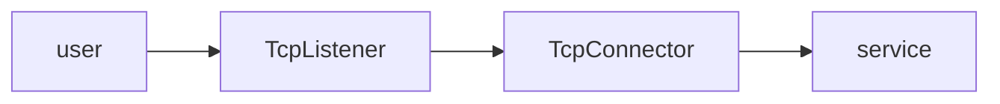
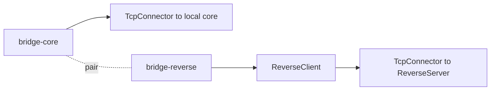
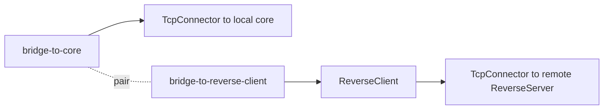
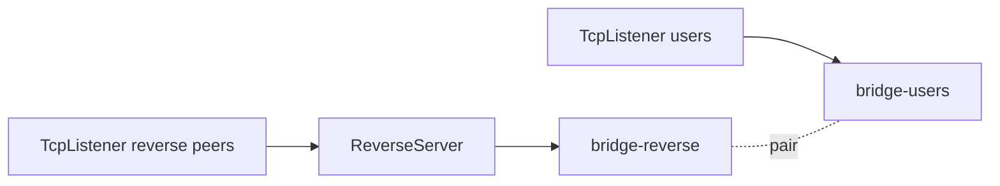

<!--
Documentation version: 152
Sync note: Any change to this file must also be applied to WaterWall/tunnels/Bridge/description.md and WaterWall-Docs/i18n/fa/docusaurus-plugin-content-docs/current/02-noderefs/Bridge.mdx, and all files must keep the same documentation version.
-->

# Bridge

`Bridge` connects two separately declared places inside the same WaterWall
configuration. A pair of `Bridge` nodes forwards lifecycle callbacks and payload
between each other, but with the direction flipped.

This node was created mainly for reverse-tunnel layouts. It lets WaterWall keep
the normal single-`next` chain model while still attaching the "back side" of a
node such as `ReverseClient` or `ReverseServer` to another chain segment.

`Bridge` does not add a protocol. It does not open sockets, parse payload,
buffer data, prepend headers, or create a transport. It only relays WaterWall
line events between two named bridge nodes.

## Why Bridge Exists

Most layer-4 WaterWall chains are easy to read from left to right:



`ReverseClient` breaks that simple shape. On the client-side machine, it must
use its normal `next` path to create outbound reverse connections toward the
remote `ReverseServer`. At the same time, it also needs to connect to a local
destination such as an xray-core inbound, a local proxy, or another local
service path.

One rejected design was to give `ReverseClient` two custom next fields:

```json
{
  "name": "reverse-client",
  "type": "ReverseClient",
  "settings": {
    "next-core": "local-core-path",
    "next-peer": "remote-peer-path"
  }
}
```

That would make `ReverseClient` special and would bypass WaterWall's ordinary
chain composition model. `Bridge` solves the same problem without adding a
second `next` concept. One bridge sits near the reverse node, the other sits
near the local service path, and the pair mirrors callbacks into the opposite
direction.



The same idea is used on the `ReverseServer` side when one path receives
reverse links from `ReverseClient` and another path receives real user traffic:


In short: `Bridge` makes two branches behave as if they touch each other, while
preserving WaterWall's usual one-`next` node configuration.

## What It Does

- Resolves another `Bridge` node by name through `settings.pair`.
- Stores a pointer to the paired tunnel during chain wiring.
- Sends upstream events on this bridge to the paired bridge's downstream side.
- Sends downstream events on this bridge to the paired bridge's upstream side.
- Relays `Init`, `Est`, `Payload`, `Finish`, `Pause`, and `Resume`.
- Reuses the same `line_t *` and payload buffer; it does not allocate a new
  protocol frame.
- Requires no extra left padding.

`Bridge` should be configured as a pair. Both bridge nodes should point at each
other.

## Configuration Example

Two paired bridge nodes:

```json
{
  "name": "bridge-a",
  "type": "Bridge",
  "settings": {
    "pair": "bridge-b"
  },
  "next": "path-a-next-node"
}
```

```json
{
  "name": "bridge-b",
  "type": "Bridge",
  "settings": {
    "pair": "bridge-a"
  },
  "next": "path-b-next-node"
}
```

`next` is optional at the JSON level, because a bridge is often placed at either
the beginning or the end of a declared branch. Whether a specific bridge needs a
`next` depends on which direction will leave through that bridge in your layout.

## Required Fields

Top-level fields:

| Field | Type | Description |
| --- | --- | --- |
| `name` | string | User-chosen node name. Must be unique inside the config file. |
| `type` | string | Must be exactly `"Bridge"`. |
| `settings` | object | Must contain `pair`. |

Required `settings` fields:

| Field | Type | Description |
| --- | --- | --- |
| `pair` | string | Name of the other bridge node in the same loaded configuration. |

There are no optional `settings` fields.

Startup fails if `pair` is missing or if the named node cannot be found. For a
useful and predictable topology, configure the pair symmetrically:

```text
bridge-a.settings.pair = bridge-b
bridge-b.settings.pair = bridge-a
```

## Direction Flip

The important behavior is not payload transformation. It is callback direction
translation:

| Event reaches this bridge as | Bridge calls on the paired bridge | Leaves paired bridge through |
| --- | --- | --- |
| upstream `Init` / `Est` / `Payload` / `Finish` / `Pause` / `Resume` | `tunnelPrevDownStream*` | paired bridge's previous side |
| downstream `Init` / `Est` / `Payload` / `Finish` / `Pause` / `Resume` | `tunnelNextUpStream*` | paired bridge's next side |

That is why Bridge feels like a mirror: data that enters one bridge exits the
other bridge in the opposite WaterWall direction.

## ReverseClient Layout

In a common `ReverseClient` setup, the `ReverseClient` keeps its ordinary `next`
path for outbound reverse links to the peer. The local core path is attached
through the paired bridge:



Example TCP-only skeleton:

```json
{
  "name": "outbound_to_core",
  "type": "TcpConnector",
  "settings": {
    "nodelay": true,
    "address": "127.0.0.1",
    "port": 443
  }
}
```

```json
{
  "name": "bridge_core",
  "type": "Bridge",
  "settings": {
    "pair": "bridge_reverse_client"
  },
  "next": "outbound_to_core"
}
```

```json
{
  "name": "bridge_reverse_client",
  "type": "Bridge",
  "settings": {
    "pair": "bridge_core"
  },
  "next": "reverse_client"
}
```

```json
{
  "name": "reverse_client",
  "type": "ReverseClient",
  "settings": {
    "minimum-unused": 4
  },
  "next": "outbound_to_peer"
}
```

```json
{
  "name": "outbound_to_peer",
  "type": "TcpConnector",
  "settings": {
    "nodelay": true,
    "address": "1.1.1.1",
    "port": 443
  }
}
```

In this shape:

- `reverse_client.next` is the peer path.
- `bridge_core.next` is the local service path.
- `bridge_core` and `bridge_reverse_client` connect those two declared branches.

## ReverseServer Layout

On the `ReverseServer` side, one listener usually accepts reverse links from
the remote `ReverseClient`, while another listener accepts real user traffic.
The bridge pair connects those two halves:



Example TCP-only skeleton:

```json
{
  "name": "users_inbound",
  "type": "TcpListener",
  "settings": {
    "address": "0.0.0.0",
    "port": 443,
    "nodelay": true
  },
  "next": "bridge_users"
}
```

```json
{
  "name": "bridge_users",
  "type": "Bridge",
  "settings": {
    "pair": "bridge_reverse"
  }
}
```

```json
{
  "name": "bridge_reverse",
  "type": "Bridge",
  "settings": {
    "pair": "bridge_users"
  }
}
```

```json
{
  "name": "reverse_server",
  "type": "ReverseServer",
  "settings": {},
  "next": "bridge_reverse"
}
```

```json
{
  "name": "peers_inbound",
  "type": "TcpListener",
  "settings": {
    "address": "0.0.0.0",
    "port": 8443,
    "nodelay": true,
    "whitelist": ["1.1.1.1/32"]
  },
  "next": "reverse_server"
}
```

The peer listener should normally be restricted to the expected remote side with
`whitelist` or an equivalent routing/security layer. Production deployments
usually add TLS, mux, routing, or other transport layers around this minimal
TCP-only example.

## Lifecycle and Line Behavior

`Bridge` does not create or destroy `line_t` objects. It forwards the same line
pointer through the paired bridge. Its per-line state is effectively unused.

Payload handling is direct relay:

| Direction into current bridge | Forwarded as |
| --- | --- |
| upstream payload | downstream payload from the paired bridge toward its previous node |
| downstream payload | upstream payload from the paired bridge toward its next node |

Because Bridge does not prepend or frame bytes, `required_padding_left = 0`.

## Notes and Caveats

- `Bridge` is not a network adapter and does not connect to an address or port.
- It is not an Ethernet bridge and does not inspect IP, TCP, UDP, or routing
  metadata.
- It is not a packet/stream converter. It simply relays whatever callbacks the
  surrounding chain sends.
- The paired bridge must exist in the same config file loaded by the same node
  manager configuration.
- Do not use a bridge without a meaningful pair and neighboring branch layout;
  an isolated bridge has no useful behavior.
- `Bridge` advertises `kNodeLayerAnything` and registers logical layer equivalence relations between paired instances (`Bridge A prev == Bridge B prev` and `Bridge A next == Bridge B next`). Startup fails if paired bridge nodes are connected to incompatible network layers.

## Node Metadata

Source-backed metadata:

| Property | Value |
| --- | --- |
| node flags | `kNodeFlagChainHead` &#124; `kNodeFlagChainEnd` |
| `can_have_prev` | `true` |
| `can_have_next` | `true` |
| `layer_group` | `kNodeLayerAnything` |
| `layer_group_prev_node` | `kNodeLayerAnything` |
| `layer_group_next_node` | `kNodeLayerAnything` |
| `required_padding_left` | `0` bytes |
