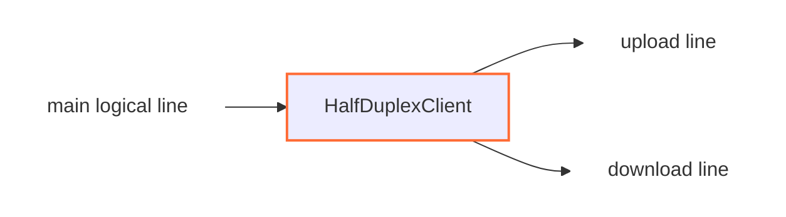

<!--
Documentation version: 159
Sync note: Any change to this file must also be applied to WaterWall/tunnels/HalfDuplexClient/description.md and WaterWall-Docs/i18n/fa/docusaurus-plugin-content-docs/current/02-noderefs/HalfDuplexClient.mdx, and all files must keep the same documentation version.
-->

# HalfDuplexClient

`HalfDuplexClient` takes one normal full-duplex WaterWall line from the previous
node and splits it into two outbound transport lines toward the same `next`
node:

- an upload line for client-to-server payload
- a download line for server-to-client payload

It is designed to be paired with `HalfDuplexServer`, which receives those two
transport lines and reconstructs one normal logical line on the remote side.

## Typical Placement

Direct in-process pair:

```text
TesterClient -> HalfDuplexClient -> HalfDuplexServer -> TesterServer
```

Across a TCP transport:

```text
client side: TcpListener -> HalfDuplexClient -> TcpConnector
server side: TcpListener -> HalfDuplexServer -> TcpConnector
```

Any stream tunnels between the client and server must preserve the bytes sent by
the two half-connections. For example, placing `TlsClient` after
`HalfDuplexClient` makes both the upload and download transport lines perform
their own TLS handshakes.

## What It Does

- Accepts one upstream line from the previous node.
- Creates two new outbound lines through `next`.
- Sends a small internal intro on the first upstream payload so
  `HalfDuplexServer` can pair the two transport lines.
- Sends all later client-to-server payload on the upload line.
- Receives server-to-client payload from the download line and forwards it to
  the previous node.
- Closes both transport-side lines when the original logical line closes.



`HalfDuplexClient` is a middle stream tunnel. It does not create sockets itself,
and it does not create packet lines.

## Configuration Example

```json
{
  "name": "halfduplex-client",
  "type": "HalfDuplexClient",
  "settings": {},
  "next": "outbound-transport"
}
```

## Required Fields

| Field | Type | Description |
| --- | --- | --- |
| `name` | string | User-chosen node name. Must be unique inside the config file. |
| `type` | string | Must be exactly `"HalfDuplexClient"`. |
| `next` | string | Required. The next stream node receives both generated half-connections. |

`HalfDuplexClient` must also have a previous node in the chain. It is not a
chain head or chain end.

## Settings

There are no required or optional tunnel-specific settings in the current
implementation.

Both generated half-connections go to the single node named by `next`. The
current implementation does not have separate `upload-next` and `download-next`
fields.

## Pairing Intro

The first upstream payload is special. On that payload, `HalfDuplexClient`
generates a fresh 128-bit identifier from the fast CSPRNG and sends a 17-byte
intro in two forms. Byte 0 is the exact role command and bytes 1 through 16 are
the pair identifier:

| Line | Intro behavior |
| --- | --- |
| upload line | The 17-byte upload intro is prefixed to the user's first real payload. |
| download line | The 17-byte download intro is sent by itself, with no user payload. |

After this first payload:

- all further upstream payload goes only through the upload line
- downstream payload is expected to come back through the download line

The intro is an internal protocol detail shared with `HalfDuplexServer`. It is
not a user-configurable value and should not be treated as a stable public wire
format. The pair ID is routing metadata, not authentication or transport
protection; configure security nodes when those properties are required.

## Direction Behavior

| Direction | Behavior |
| --- | --- |
| upstream payload from previous node | Send through the upload line after the first-payload intro handling. |
| downstream payload from next node | Forward to the original main line toward the previous node. |
| upstream pause/resume | Forward to the download line. |
| downstream pause/resume | Forward to the original main line if it still exists. |

The upload line is the normal client-to-server data path. The download line is
the dedicated return path for server-to-client data.

## Lifecycle Behavior

On upstream `Init`, the client initializes line state for the original main line
and creates two new lines on the same worker:

1. upload line
2. download line

Both lines are initialized through `next`.

Transport Est from either child is forwarded to the main application exactly once,
using this node's notification latch. A synchronous Est inside the first child's
Init waits only until both adjacent child Init calls have admitted their identities;
there is no pairing-handshake gate. Valid payload after that Init can proceed before
Est. An Est callback can safely submit the first payload or close the pair.

Only temporary Init/intro ordering input is retained, with a 2 MiB / 1,024-buffer
inclusive bound. First-intro publication precedes callbacks, and input nested during
the download intro follows the older upload intro with the same pair ID. An admitted
input can finish through Pause. A later release of Init backlog respects aggregate
child pressure; one child Resume cannot clear another child's outstanding Pause.
Application read Pause received before the download child exists is applied after
its Init. Ready payload otherwise forwards directly without a transport queue.

Before any outward Finish, all pair links and local state are detached. The client
synchronously closes both owned children, retaining exact lines across callbacks;
received Finish is never reflected toward its sender. The borrowed main line is
finished through its owner. No detached child waits on a cancelable close task.

`UpStreamEst` and `DownStreamInit` are disabled callbacks for this node.

## Limits and Padding

| Value | Size |
| --- | --- |
| internal intro | `17 bytes` (one role byte plus a fresh 128-bit pair ID) |
| `required_padding_left` | `17 bytes` |

The node reserves 17 bytes of left padding for the first upload intro. An ordinary
first payload with enough headroom is reused; splice input or insufficient
headroom uses a new ordinary buffer with full onward padding. The download intro
is sent in its own ordinary buffer with full onward padding.

## Notes and Caveats

- Use it with a matching `HalfDuplexServer`.
- One incoming logical connection creates two outbound transport connections.
- Closing any member of the group closes the paired logical connection path.
- The tunnel waits for the first upstream payload before sending the pairing
  intro.
- There are no separate upload/download next-node settings today; both halves
  use the same `next`.

## Node Metadata

Source-backed metadata:

| Property | Value |
| --- | --- |
| node flags | `kNodeFlagSupportsSplice` |
| `can_have_prev` | `true` |
| `can_have_next` | `true` |
| `layer_group` | `kNodeLayer4` |
| `layer_group_prev_node` | `kNodeLayer4` |
| `layer_group_next_node` | `kNodeLayer4` |
| `required_padding_left` | `17` bytes |

## Splice and setup storage

The first upstream delivery, including an empty delivery, triggers both 17-byte
intros with the same 128-bit pair ID. The upload intro and the entire first body
are combined into one ordinary buffer. Ordinary input with enough advertised
headroom is reused in place; insufficient headroom uses a new buffer. Splice
input is fully materialized, preserving its resident prefix and private-pipe
body in order. The download intro is ordinary too. Later upstream and
downstream deliveries preserve their original ordinary or splice representation.
The temporary Init/intro FIFO can retain splice wrappers without materializing
them; its inclusive 2 MiB and 1,024-buffer limits are unchanged and do not cap
every ready delivery. Allocated outputs retain onward padding.

Both nodes advertise `kNodeFlagSupportsSplice`. The client requires 17 bytes of
left padding for its upload intro; the server requires zero.
Actual splice reads require platform/build support, `misc.splice` enabled, and
support from every node in the expanded chain, including the server's PipeTunnel
wrapper and all neighbors. Ordinary buffers remain valid in every state. No new
settings, wire fields, or read-preference requests are introduced.
