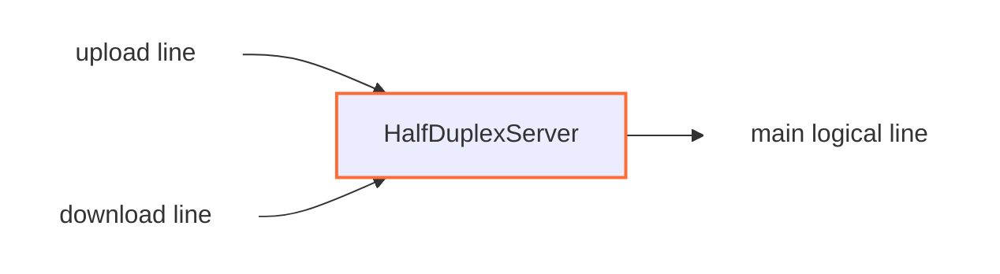

<!--
Documentation version: 152
Sync note: Any change to this file must also be applied to WaterWall/tunnels/HalfDuplexServer/description.md and WaterWall-Docs/i18n/fa/docusaurus-plugin-content-docs/current/02-noderefs/HalfDuplexServer.mdx, and all files must keep the same documentation version.
-->

# HalfDuplexServer

`HalfDuplexServer` is the server-side peer for `HalfDuplexClient`. It receives
two inbound half-connections, matches them by the internal intro sent by the
client, and reconstructs one normal logical line toward the next node.

Use it when the remote side has split one full-duplex stream into separate
upload and download transport connections.

## Typical Placement

Direct in-process pair:

```text
TesterClient -> HalfDuplexClient -> HalfDuplexServer -> TesterServer
```

Across a TCP transport:

```text
client side: TcpListener -> HalfDuplexClient -> TcpConnector
server side: TcpListener -> HalfDuplexServer -> TcpConnector
```

`HalfDuplexServer` should sit on the opposite side of the transport path from
`HalfDuplexClient`.

## What It Does

- Accepts inbound half-connections from the previous node.
- Reads the first 8 bytes to identify each connection as upload or download.
- Matches upload and download lines that belong to the same logical connection.
- Creates one main line toward `next` after both halves are available.
- Forwards upload-side payload to the next node.
- Sends replies from the next node back through the download line.
- Uses an internal pipe wrapper so a later half-connection can move to the
  worker that already owns its partner.



`HalfDuplexServer` is a middle stream tunnel. It does not create sockets itself,
and it does not create packet lines.

## Configuration Example

```json
{
  "name": "halfduplex-server",
  "type": "HalfDuplexServer",
  "settings": {},
  "next": "service-node"
}
```

## Required Fields

| Field | Type | Description |
| --- | --- | --- |
| `name` | string | User-chosen node name. Must be unique inside the config file. |
| `type` | string | Must be exactly `"HalfDuplexServer"`. |
| `next` | string | Required. The next stream node receives the reconstructed logical line. |

`HalfDuplexServer` must also have a previous node in the chain. It is not a
chain head or chain end.

## Settings

There are no required or optional tunnel-specific settings in the current
implementation.

## Matching Model

Every incoming transport line starts in an unknown state. The server buffers
until at least 8 bytes are available, then consumes the intro sent by
`HalfDuplexClient`.

The intro tells the server:

- which logical connection this half belongs to
- whether this half is the upload side or download side

The server keeps two internal maps:

| Map | Purpose |
| --- | --- |
| upload-line map | Stores upload halves that arrived before their download partner. |
| download-line map | Stores download halves that arrived before their upload partner. |

If the matching partner is already waiting, the two halves are paired
immediately. If not, the current half is stored until the peer half arrives.

## Main Line Creation

When both halves are available, `HalfDuplexServer`:

1. creates one new main line on the upload line's worker
2. links the main line with both transport-side half-lines
3. initializes the next node with the main line
4. strips the 8-byte upload intro from the first upload payload
5. forwards any remaining upload payload to `next`

After this point, downstream nodes see a normal single WaterWall connection.
They do not need to know that the transport side used two connections.

The download intro carries no user payload and is consumed only for matching.

## Worker Handoff

The server is created through WaterWall's pipe-tunnel wrapper. If the two halves
arrive on different workers, the later half is piped to the worker that already
owns the earlier half, and pairing continues there.

This makes the pair robust when upload and download TCP connections are accepted
by different workers.

## Direction Behavior

| Direction | Behavior |
| --- | --- |
| upstream payload on upload line | Forward to the reconstructed main line after matching. |
| upstream payload on download line | Consumed or recycled; download is not the client-to-server payload path. |
| downstream payload from next node | Forward to the previous side through the download line. |
| upstream pause/resume on download line | Forward to the main line toward `next`. |
| downstream pause/resume from next node | Forward to the upload line toward the previous side. |

This mirrors the traffic ownership of the split:

- upload line carries client-originated payload into the service side
- download line carries service replies back to the client side

## Temporary Buffering

If an upload half arrives before its matching download half, the server buffers
the upload data until the pair is complete.

| Value | Size |
| --- | --- |
| maximum waiting upload buffer | `65535 * 2` bytes (`131070` bytes) |
| internal intro | `8 bytes` |
| `required_padding_left` | `0 bytes` |

If the waiting upload buffer reaches the limit before the matching download half
arrives, the upload half is removed from the map and closed.

Download halves are not buffered the same way. They are mainly stored as waiting
map entries until the upload side arrives.

## Lifecycle Behavior

On upstream `Init` for an inbound half-line, the server initializes local line
state and immediately reports `Est` back toward the previous node for that
transport half. The reconstructed main line is not created until both halves are
matched.

If either half-line closes before pairing, the server removes it from the
waiting map and cleans its line state. If a waiting upload had buffered data,
that buffer is recycled.

If either half-line closes after pairing, the server finishes and destroys the
main line and schedules the other half-line to close toward the previous side.

If the downstream side closes the reconstructed main line, the server finishes
the download line immediately and schedules the upload line to close.

`UpStreamEst` and `DownStreamInit` are disabled callbacks for this node.

## Notes and Caveats

- Use it with a matching `HalfDuplexClient`.
- The tunnel depends on the internal 8-byte intro generated by
  `HalfDuplexClient`.
- Duplicate waiting upload or download hashes are rejected and the duplicate
  half-line is closed.
- Waiting upload halves can consume memory until they are paired or reach the
  buffer limit.
- This node has no separate settings for pairing timeout or buffer size today.

## Node Metadata

Source-backed metadata:

| Property | Value |
| --- | --- |
| node flags | `kNodeFlagNone` |
| `can_have_prev` | `true` |
| `can_have_next` | `true` |
| `layer_group` | `kNodeLayer4` |
| `layer_group_prev_node` | `kNodeLayer4` |
| `layer_group_next_node` | `kNodeLayer4` |
| `required_padding_left` | `0` bytes |
