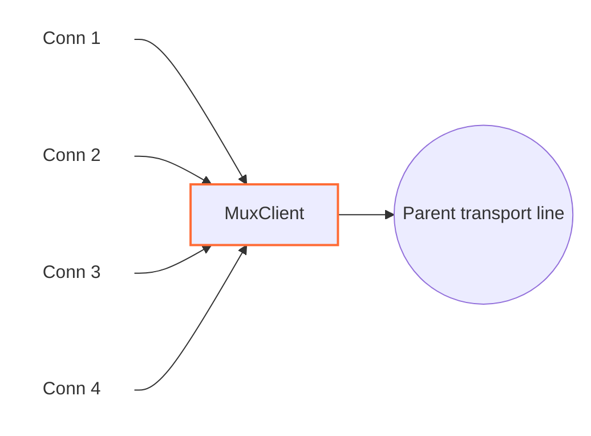

<!--
Documentation version: 106
Sync note: Any change to this file must also be applied to WaterWall/tunnels/MuxClient/description.md, and both files must keep the same documentation version.
-->

# MuxClient

`MuxClient` multiplexes many logical WaterWall lines onto a smaller number of
shared parent transport lines.

Instead of opening one full transport connection for every incoming child line,
`MuxClient` creates or reuses a parent line toward `next`, attaches child lines
to that parent, and sends each child's events as internal MUX frames. The remote
side must use `MuxServer` to recreate independent child lines.



`MuxClient` is not a listener or connector. The previous node creates the child
lines, and the next node carries the shared parent transport.

## Typical Placement

Simple TCP transport:

```text
client side: TcpListener -> MuxClient -> TcpConnector
server side: TcpListener -> MuxServer -> TcpConnector
```

With an outer protocol stack:

```text
client side: TcpListener -> MuxClient -> HttpClient -> TlsClient -> TcpConnector
server side: TcpListener -> TlsServer -> HttpServer -> MuxServer -> TcpConnector
```

Use MUX when many short or medium-lived logical connections should share fewer
outer transport connections.

## What It Does

- Accepts normal child lines from the previous node.
- Creates parent transport lines toward `next`.
- Reuses parent lines according to the selected concurrency mode.
- Assigns each child a 32-bit connection id, or `cid`.
- Encodes child payload, pause, resume, and finish events into MUX frames.
- Decodes reply frames from `MuxServer` and routes them back to the matching
  child.
- Queues parent-delivered data when the local child write side is paused.
- Reflects per-child backpressure with `FlowPause` and `FlowResume` frames.
- Closes exhausted idle parent lines when their last child finishes.

`MuxClient` creates parent `line_t` objects internally and is responsible for
destroying those parent lines. It does not destroy child lines created by the
previous node.

## Configuration Examples

Timer mode:

```json
{
  "name": "mux-client",
  "type": "MuxClient",
  "settings": {
    "mode": "timer",
    "connection-duration-ms": 30000
  },
  "next": "outbound-transport"
}
```

Counter mode:

```json
{
  "name": "mux-client",
  "type": "MuxClient",
  "settings": {
    "mode": "counter",
    "connection-capacity": 128
  },
  "next": "outbound-transport"
}
```

Fixed parent pool mode:

```json
{
  "name": "mux-client",
  "type": "MuxClient",
  "settings": {
    "mode": "fixed-connections-count",
    "per-worker-connections-count": 2
  },
  "next": "outbound-transport"
}
```

## Required Fields

Top-level fields:

| Field | Type | Description |
| --- | --- | --- |
| `name` | string | User-chosen node name. Must be unique inside the config file. |
| `type` | string | Must be exactly `"MuxClient"`. |
| `settings` | object | Required. Must contain `mode` and the mode-specific required setting. |
| `next` | string | Required. The next node carries parent transport lines. |

Required `settings` fields:

| Setting | Required When | Description |
| --- | --- | --- |
| `mode` | always | One of `timer`, `counter`, or `fixed-connections-count`. |
| `connection-duration-ms` | `mode: "timer"` | Milliseconds during which a parent line may accept new child lines. Must be greater than `60`. |
| `connection-capacity` | `mode: "counter"` | Maximum child cids opened on one parent line. Must be greater than `0`. |
| `per-worker-connections-count` | `mode: "fixed-connections-count"` | Number of parent lines maintained per worker. Must be greater than `0`. |

## Optional Settings

| Setting | Type | Default | Description |
| --- | --- | --- | --- |
| `child-buffer-limit` | integer | `8388608` | Maximum queued bytes for one paused child. Must be greater than `0`. If reached, the child is closed with a MUX `Close` frame. |
| `child-buffer-pause-tolerance` | integer | `524288` | Queue threshold where the child sends `FlowPause` and may pause parent reads. Must be `0` or greater. Values above `child-buffer-limit` are capped to the limit. |
| `log-main-line-stats` | boolean | `false` | When enabled, parent lines log stats every `5000` ms. |

Stats include worker id, parent read/write pause state, child count, child
read-pause count, and child write-pause count.

## Parent And Child Model

`MuxClient` has two line roles:

| Role | Meaning |
| --- | --- |
| child line | A logical WaterWall connection received from the previous node. |
| parent line | A shared transport connection created by `MuxClient` toward `next`. |

Each child receives a `cid`. The `cid` is local to one parent line and is used
inside MUX frames so `MuxServer` can map payloads and control events back to the
correct logical stream.

In timer and counter modes, each worker has one current reusable parent, called
the unsatisfied line in the implementation. New children join it until it is
exhausted.

In fixed parent pool mode, the first child on a worker causes `MuxClient` to
create `per-worker-connections-count` parent lines for that worker. New children
are assigned to the least-loaded parent in that worker's pool, with a
round-robin tie break. No extra parent lines are created while the pool slots
are alive.

## Mode Behavior

| Mode | Parent Stops Accepting New Children When | Useful When |
| --- | --- | --- |
| `timer` | parent age is greater than `connection-duration-ms` | You want parent transport lines to rotate over time. |
| `counter` | parent `cid` reaches `connection-capacity` | You want a simple cap on logical streams per parent. |
| `fixed-connections-count` | not exhausted by age or child count | You want a stable per-worker outer connection count. |

An exhausted parent is not closed immediately. It stops accepting new children,
but existing children continue until they finish. If an exhausted parent has no
children, `MuxClient` closes and destroys it.

There is also an absolute cid hard limit: when a parent reaches `4294967295`,
it is exhausted.

## Stream Opening Behavior

Current code attaches a child during upstream `Init`:

1. Select or create a parent line on the same worker.
2. Initialize the child MUX line state.
3. Link the child to the parent.
4. Assign the next `cid`.
5. Report downstream `Est` to the previous node for the child.

The `Open` frame is not sent during `Init`. It is emitted with the first
upstream payload as an `Open` frame followed by a `Data` frame in the same
buffer. If the child finishes before sending any payload, `MuxClient` sends
`Open` followed by `Close` so the peer observes a complete open/close sequence.

## Frame Format

`MuxClient` and `MuxServer` share an 8-byte packed frame header:

| Field | Size | Description |
| --- | ---: | --- |
| `length` | `uint16` | Payload length after the header, stored big-endian. |
| `flags` | `uint8` | Frame kind. |
| `_pad1` | `uint8` | Internal padding byte. |
| `cid` | `uint32` | Child stream id, stored big-endian. |

Frame flags:

| Flag | Meaning |
| ---: | --- |
| `0` | `Open` |
| `1` | `Close` |
| `2` | `FlowPause` |
| `3` | `FlowResume` |
| `4` | `Data` |

The implementation rejects payloads larger than `0xFFFF - 8`, so one MUX data
frame can carry at most `65527` payload bytes. `MuxClient` does not split a
large child payload into multiple MUX frames; payloads reaching this node should
already fit that limit.

## Direction Behavior

| Incoming callback | Behavior |
| --- | --- |
| child upstream `Init` | Selects/creates a parent, links the child, assigns a `cid`, and reports `Est` to the previous node. |
| child upstream `Payload` | Prepends `Open + Data` for the first payload, otherwise prepends `Data`, then sends to the parent toward `next`. |
| child upstream `Pause` / `Resume` | Sends `FlowPause` / flushes queued data and possibly sends `FlowResume`. |
| child upstream `Finish` | Sends `Close`, or `Open + Close` if no payload opened the stream yet; closes idle exhausted parent if needed. |
| parent downstream `Payload` | Parses MUX frames from `MuxServer`, routes `Data`, `Close`, `FlowPause`, and `FlowResume` to the matching child. |
| parent downstream `Pause` / `Resume` | Reflects parent write pressure to the most recent writer child, or to all children if no recent writer is known. |
| parent downstream `Finish` | Marks the parent finishing, flushes/finishes all children toward the previous node, destroys parent state, and destroys the owned parent line. |
| upstream `Est` | Disabled; reaching this callback is fatal. |
| downstream `Init` | Disabled; reaching this callback is fatal. |

Unknown frames, frames for missing cids, and unexpected `Open` frames arriving
from the server side are dropped.

## Backpressure And Queues

MUX keeps backpressure per child:

- If a local child pauses, `MuxClient` sends `FlowPause` for that `cid`.
- If peer `FlowPause` arrives, reads from the local child are paused.
- If parent-delivered data arrives for a paused child, data is queued on that
  child.
- Once one child's queue reaches `child-buffer-pause-tolerance`, the child sends
  `FlowPause` and parent input may be paused.
- The same tolerance is also applied to aggregate queued child data on the
  parent line.
- Once queued data drops below `min(512 KiB, child-buffer-limit)`, `FlowResume`
  and parent read resume can be sent.
- If one child's queue reaches `child-buffer-limit`, the child is closed.

This lets one slow child stop its own stream without forcing every other child
on the same parent to stop immediately.

## Buffer And Padding Notes

`MuxClient` prepends MUX headers to outgoing parent payloads. Node metadata
advertises:

```text
required_padding_left = 16
layer_group = kNodeLayerAnything
```

The 16 bytes are needed because the first child payload can prepend two headers:
one `Open` header and one `Data` header. Later data and control frames use one
8-byte header.

Parent incoming bytes are accumulated in a read stream until a full MUX frame is
available. If the parent read stream grows above `1 MiB`, the parent and all
attached children are closed.

## Practical Notes

- `MuxClient` must be paired with `MuxServer`.
- `mode` is mandatory in the current implementation.
- `connection-duration-ms` only applies to timer mode.
- `connection-capacity` only applies to counter mode.
- `per-worker-connections-count` only applies to fixed parent pool mode.
- With multiple workers, fixed parent pool mode scales by worker count. For
  example, `per-worker-connections-count: 2` with 4 workers can create up to 8
  parent transport lines.
- `MuxClient` is a middle tunnel, not a generic endpoint.
