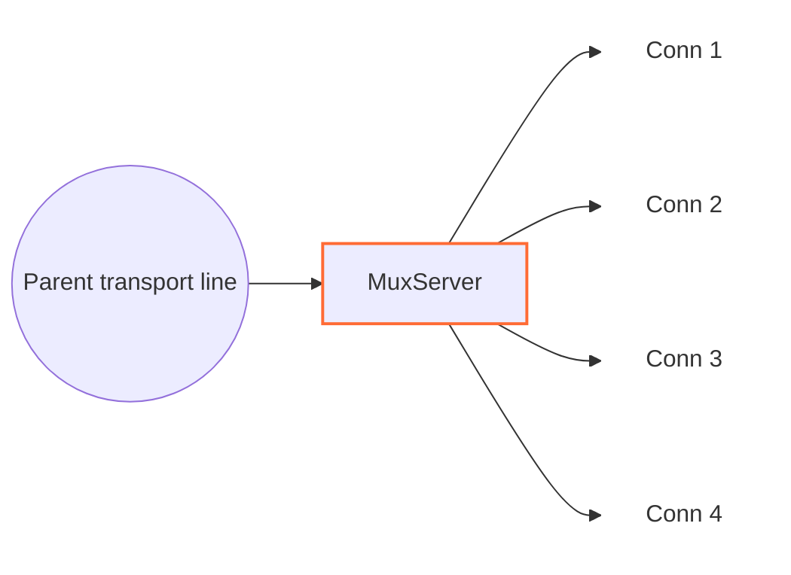

<!--
Documentation version: 161
Sync note: Any change to this file must also be applied to WaterWall/tunnels/MuxServer/description.md and WaterWall-Docs/i18n/fa/docusaurus-plugin-content-docs/current/02-noderefs/MuxServer.mdx, and all files must keep the same documentation version.
-->

# MuxServer

`MuxServer` is the server-side peer for `MuxClient`. It receives framed MUX
traffic on one parent transport line, creates child lines when `Open` frames
arrive, and forwards each child to `next` as a normal independent WaterWall
line.



The previous side must provide the transport line that carries `MuxClient`
frames. The next side receives the recreated logical child lines.

## Typical Placement

Simple TCP transport:

```text
client side: TcpListener -> MuxClient -> TcpConnector
server side: TcpListener -> MuxServer -> TcpConnector
```

With an outer protocol stack:

```text
client side: TcpListener -> MuxClient -> HttpClient -> TlsClient -> TcpConnector
server side: TcpListener -> TlsServer -> HttpServer -> MuxServer -> TcpConnector
```

From the next node's point of view, each child created by `MuxServer` behaves
like a separate WaterWall connection.

## What It Does

- Initializes a parent line when upstream `Init` arrives from the transport.
- Reads MUX frames from the parent line.
- Creates one child line per valid `Open` frame.
- Initializes each child line toward `next`.
- Routes `Data`, `Close`, `FlowPause`, and `FlowResume` by `cid`.
- Wraps downstream child payloads back into MUX `Data` frames.
- Sends child finish events back to `MuxClient` as `Close` frames.
- Queues parent-delivered data when a child's write side is paused.
- Detaches accepted child queues when the parent transport finishes and drains them under child backpressure.

`MuxServer` creates the child `line_t` objects behind the parent and is
responsible for destroying them. It does not create the parent transport line.

## Configuration Example

```json
{
  "name": "mux-server",
  "type": "MuxServer",
  "settings": {
    "child-buffer-limit": 25165824,
    "child-buffer-resume-threshold": 262144,
    "parent-buffer-limit": 134217728,
    "max-children": 10000,
    "max-live-children": 262144,
    "initial-child-idle-timeout-ms": 10000,
    "active-child-idle-timeout-ms": 300000,
    "memory-high-watermark-percent": 85,
    "memory-low-watermark-percent": 75,
    "memory-reserve": 268435456,
    "memory-fallback-max-live-children": 60000,
    "detached-buffer-limit": 268435456,
    "detached-child-limit": 12000,
    "log-main-line-stats": false
  },
  "next": "service-side-node"
}
```

## Required Fields

Top-level fields:

| Field | Type | Description |
| --- | --- | --- |
| `name` | string | User-chosen node name. Must be unique inside the config file. |
| `type` | string | Must be exactly `"MuxServer"`. |
| `settings` | object | Optional. Defaults are used when omitted. |
| `next` | string | Required. The next node receives recreated child lines. |

`MuxServer` should have a previous transport-facing node and should be reached
by a matching `MuxClient`.

### Parent write buffering

Each parent has a lazy FIFO of encoded outgoing buffers, shared by its children.
The following optional settings measure **queue-capacity charge in bytes**:
`sizeof(sbuf_t) + sbufGetTotalCapacity(buf) + kSbufAllocationAlignment`.
Ordinary capacity is resident allocation; splice capacity is logical geometry.
Padding is included once. Kernel pipe capacity and control storage are not added;
this is not a physical memory, descriptor, or RSS limit.

| Setting | Default | Meaning |
| --- | --- | --- |
| `parent-write-buffer-pause-threshold` | `16777216` (16 MiB) | Pause attached child producers when retained charge reaches this value. |
| `parent-write-buffer-resume-threshold` | `12582912` (12 MiB) | Release parent pressure at or below this charge while transport is writable. Omitted values derive from pause × 3/4, rounded down. |
| `parent-write-buffer-limit` | `134217728` (128 MiB) | Maximum retained charge for each parent; equality is allowed. |

Pause and hard limits must be integers in `[1, INT_MAX]`; resume accepts
`[0, INT_MAX]`. The effective tuple must satisfy `0 <= resume < pause < hard`.
Omitted pause and hard settings use their defaults; omitted resume derives as
`floor(pause * 3 / 4)` with a wide intermediate. Explicit zero requests
empty-queue release, still subject to transport writability. Booleans, strings,
null, fractions, negatives and out-of-range values reject startup. Invalid
combinations report all three effective values without clamping. For example,
inside `settings` (derives a 1.5 MiB resume threshold):

```json
{
  "parent-write-buffer-pause-threshold": 2097152,
  "parent-write-buffer-limit": 4194304
}
```

The gate uses retained queue charge (`sbufGetQueueCharge`), including header,
capacity, padding and alignment, rather than wire length. Resume runs before the
next FIFO pop, after the prior delivery returns. Synchronous resumed output
appends behind existing frames and complete splice batches. A new pause stops
an interrupted Resume pass; the FIFO of locally held children preserves later
release opportunities. Init/Est completion reconciles deferred producer permission.
Peer FlowPause and terminal close remain independent reasons to stop a source.

The 4 MiB hysteresis gap avoids waiting for the entire queue to drain, but does
not promise continuous sender throughput or a faster carrier. The 128 MiB limit
is per parent, allocated on demand, and is not an RSS, socket-buffer or FD bound.
Already-admitted Data can still reach a peer-paused child; the default 24 MiB
child and 128 MiB parent receive budgets can shed children or close that parent.

With `log-main-line-stats`, five-second samples include
`parent-output-queued-bytes`, `parent-output-queue-charge`,
`parent-output-queue-items`, `parent-transport-paused`,
`parent-sources-throttled`, `children-parent-write-paused`,
`children-peer-flow-paused`, `parent-output-throttle-ms`, and
`parent-output-last-throttle-ms`, plus the three effective settings.
`children-parent-write-paused` counts individual writer and aggregate holds.
It can be nonzero while `parent-sources-throttled` is false. That boolean and
its current/last throttle durations describe only the aggregate pause-all latch.
Throttle durations use the owner's 64-bit monotonic clock; current duration is
zero outside a throttle episode. `parent-child-queue-charge` and
`parent-input-queue-charge` describe incoming storage. Logging remains optional
and has no role in flow-control progress.

These settings apply independently to every parent of this node. They are separate
from `parent-buffer-limit`, which bounds incoming assembly plus attached child queues.

## Optional Settings

| Setting | Type | Default | Description |
| --- | --- | --- | --- |
| `child-buffer-limit` | integer | `25165824` | Maximum queue-capacity charge for one paused child. Ordinary allocation is charged; splice uses logical sbuf capacity plus sbuf/alignment overhead. Must be greater than `0`; reaching it closes the child with a MUX `Close` frame. |
| `child-buffer-resume-threshold` | integer | `262144` | Logical queued-payload low-water mark for sending `FlowResume` after the local child becomes writable. Must be greater than `0`. Its numeric value is capped to `child-buffer-limit`. Raising it resumes the peer earlier but weakens hysteresis and may increase pause/resume cycling. |
| `parent-buffer-limit` | integer | `134217728` | Per-parent queue-capacity budget for incoming assembly plus attached child queues. Beneficial compaction precedes largest-child/oldest-tie shedding; unrelieved pressure closes this parent. Set to `0` to disable the aggregate budget. |
| `max-children` | integer | `10000` | Hard maximum attached live children on one parent. Must be positive and no greater than `max-live-children`; historical destroyed CIDs do not count. |
| `max-live-children` | integer | `262144` | Hard maximum reserved or initialized children across this MuxServer instance, all parents, and all workers. Draining and detached children count until their MuxServer state is destroyed. |
| `initial-child-idle-timeout-ms` | integer | `10000` | Idle timeout after `Open` and before the first nonempty Data payload. Must be positive. |
| `active-child-idle-timeout-ms` | integer | `300000` | Refreshing idle timeout after nonempty payload activity begins. Must be positive and at least the initial timeout. |
| `memory-high-watermark-percent` | integer | `85` | Close memory admission at or above this host or finite-cgroup usage. Must be in `[1, 99]`. |
| `memory-low-watermark-percent` | integer | `75` | Reopen only when every applicable usage is at or below this value and reserve headroom recovered. Must be in `[1, 99]` and lower than the high watermark. |
| `memory-reserve` | integer | By `ram-profile` | Close admission when effective available bytes reach this reserve. Must be in `[0, INT_MAX]`; `0` disables only this byte reserve. |
| `memory-fallback-max-live-children` | integer | By `ram-profile` | Conservative aggregate ceiling while memory sampling is unsupported, unavailable, or older than one second. Must be positive and no greater than `max-live-children`. |
| `detached-buffer-limit` | integer | By `ram-profile` | Per-worker queue-capacity-charge limit for blocked child queues kept after parent loss. Reaching it aborts only the newly detached blocked child. Set to `0` to disable this bound. |
| `detached-child-limit` | integer | By `ram-profile` | Per-worker count limit for blocked children retained after parent loss. Reaching it aborts only the newly detached blocked child. Set to `0` to disable this bound. |
| `log-main-line-stats` | boolean | `false` | When enabled, parent lines log best-effort stats every `5000` ms. Parent logical death suppresses normal execution and settles the task as `LineDead` when its queued/timed runner is reached. Worker quiescence actively cancels pending work. Neither path rearms it. |

The two detached limits use these defaults when their node settings are omitted:

| RAM profile | Default detached charge | Default detached children |
| --- | ---: | ---: |
| S1 (`minimal` / `ultralow`) | `33554432` (`32 MiB`) | `4096` |
| S2 | `80740352` (`77 MiB`) | `5677` |
| M1 (`client`) | `127926272` (`122 MiB`) | `7258` |
| M2 (`client-larger`) | `174063616` (`166 MiB`) | `8838` |
| L1 | `221249536` (`211 MiB`) | `10419` |
| L2 (`server`, the global default) | `268435456` (`256 MiB`) | `12000` |

Defaults are linearly interpolated over the six ordered RAM-profile tiers, with the charge limit rounded to the
nearest whole MiB. An explicit setting overrides the profile-derived value independently for that limit.

The memory admission reserve uses the byte values above. The independent
`memory-fallback-max-live-children` defaults apply across all parents and workers
of one MuxServer instance:

| RAM profile | Default fallback live children |
| --- | ---: |
| S1 (`minimal` / `ultralow`) | `20480` |
| S2 | `28385` |
| M1 (`client`) | `36290` |
| M2 (`client-larger`) | `44190` |
| L1 | `52095` |
| L2 (`server`, the global default) | `60000` |

Pause tolerance and resume threshold intentionally continue to measure logical
application payload bytes. Allocation charge is specialized to the three
memory-sensitive hard byte budgets.

Stats include worker id, parent write-pause state, aggregate retained queue charge, child
count, children waiting for ordered Close completion, child read-pause count,
and child write-pause count. The legacy `parent-line-read-paused` field remains
present as `no` for compatibility. `parent-child-queue-charge` and
`parent-input-queue-charge` report separate attached-child and incoming capacity
charges; their sum is limited by `parent-buffer-limit`.

Mode settings such as `timer`, `counter`, and `fixed-connections-count` belong
only to `MuxClient`. `MuxServer` follows the frames it receives and does not
care which client-side mode created them.

## Parent And Child Model

`MuxServer` has two line roles:

| Role | Meaning |
| --- | --- |
| parent line | The shared transport line received from the previous node. |
| child line | A normal line created by `MuxServer` for one `cid` from the parent. |

When an `Open` frame arrives:

1. `MuxServer` checks whether the `cid` already exists.
2. If the `cid` is new, it creates a child line on the same worker.
3. It initializes MUX line state for that child.
4. It links the child to the parent.
5. It sends upstream `Init` to `next` on the child line.

Parent-to-child dispatch uses a hash index, so lookup and duplicate detection
remain average O(1). A duplicate `Open` for any indexed child, including a
peer-close drain, is a protocol violation and closes that parent.

Before allocation, a fresh Open must pass the per-parent hard limit, the
per-instance atomic reservation limit, and cached memory admission. Resource
rejection sends `Close(cid)` without creating a child and preserves the parent
and siblings. A parent has a 1024-rejection burst bucket refilled at 64 tokens
per second; sustained rejected-Open abuse closes only that parent.

The global sampler publishes memory every `500` ms and snapshots expire after
one second. On Linux, cgroup pressure is the maximum used percentage and the
minimum remaining allowance across every visible finite cgroup v2/v1 level;
`MemAvailable` still bounds effective headroom. Ambiguous or hidden cgroup
constraints use the conservative fallback. Windows uses available physical
memory. Workers consume only the cached atomic tuple, and the high/low
watermarks provide hysteresis. Stale or unsupported data uses the profile
fallback ceiling and cannot reopen a gate previously closed by fresh pressure.
Memory admission affects new Opens only.

## Frame Format

`MuxServer` expects the same eight-byte wire header used by `MuxClient`:

| Offset | Size | Meaning |
| --- | --- | --- |
| 0 | 3 bytes | Unsigned payload length, big-endian. |
| 3 | 1 byte | Frame type/flags. |
| 4 | 4 bytes | Unsigned connection ID, big-endian. |

The inclusive payload maximum is **1 MiB (1,048,576 bytes)** for every frame
type, independent of RAM profile, buffer sizes and requested or granted pipe
capacity. A maximum frame occupies 1,048,584 wire bytes; a preceding Open adds
another eight bytes (1,048,592 total). Decoding rejects a larger declaration as
soon as all eight header bytes arrive, even for unknown CIDs or types, and closes
only that parent through normal parent-loss cleanup. Permitted frames wait for
the complete body; unknown frames consume their declared body and empty Data
still produces one delivery. Complete frames drain before the incomplete
remainder is checked against **1,048,584 bytes**, including its cached header.

Frame flags:

| Flag | Meaning |
| ---: | --- |
| `0` | `Open` |
| `1` | `Close` |
| `2` | `FlowPause` |
| `3` | `FlowResume` |
| `4` | `Data` |

One MUX `Data` frame carries at most `1,048,576` payload bytes. The shared encoder
splits a larger downstream child payload into consecutive `Data` frames in byte
order. The complete encoding, including all headers, must fit in `uint32_t`;
an unrepresentable encoding recycles the input and closes only that child.
The receiver does not restore the original callback boundary after this split.

## Direction Behavior

| Incoming callback | Behavior |
| --- | --- |
| parent upstream `Init` | Initializes parent state, optionally schedules stats logging, and reports downstream `Est` to the previous node. |
| parent upstream `Payload` | Parses MUX frames from `MuxClient`; creates children for `Open`; routes `Data`, `Close`, `FlowPause`, and `FlowResume` by `cid`. |
| parent upstream `Pause` / `Resume` | Stops all parent output immediately / drains its FIFO. Blocked writers receive local holds; the retained-charge threshold additionally pauses all children. |
| parent upstream `Finish` | Destroys parent state immediately, transfers accepted child queues to child-only drains, and finishes each child after its queue becomes empty and writable. |
| child downstream `Payload` | Prepends a MUX `Data` header and sends the frame back on the parent toward the previous node. |
| child downstream `Pause` / `Resume` | Sends `FlowPause` / flushes queued data and possibly sends `FlowResume`. |
| child downstream `Finish` | Detaches and destroys the owned child, then submits its encoded `Close` to ordered parent output. |
| upstream `Est` | Disabled; reaching this callback is fatal. |
| downstream `Init` | Disabled; reaching this callback is fatal. |

Frames for unknown cids and unknown frame kinds are dropped.

## Child Idle Reclamation

Every admitted child starts with `initial-child-idle-timeout-ms`. The first
nonempty incoming Data payload or nonempty payload produced by `next` promotes
it to `active-child-idle-timeout-ms`; every later nonempty payload refreshes the
active deadline. Open, Close, flow control, Init/Est, and zero-length Data do not
count as activity. A zero-length Data frame retained for a paused child still
has a positive allocation charge and advances the hard queue budgets.

Expiry closes only that child, emits `Close(cid)` while its parent is available,
and preserves the parent and siblings. Detached expiry uses the detached-abort
path. Explicit close removes the timer item immediately, so timer memory follows
live children rather than historical churn.

These limits and timers do not change MUX wire bytes. A parent stays reusable
for its full transport lifetime, and destroying a child makes its count capacity
available again on that same parent and MuxServer instance.

## Backpressure And Queues

Parent transport `Pause` immediately stops every parent-bound Payload callback,
including controls and Close replies. A child submitting Data while transport is
blocked acquires an individual local producer hold after its complete payload or
splice batch is admitted. A direct submission that leaves transport paused also
holds its writer before returning. A transient Pause followed by Resume uses the
final state. Empty Data follows the same policy; control frames alone do not make
the referenced child a writer. Idle siblings below the aggregate threshold remain
unpaused until they write.

At charge greater than or equal to `parent-write-buffer-pause-threshold`, the
aggregate pause-all latch still holds every attached open child. Local writer
holds do not activate that latch themselves. Both causes share one local reason
per child and one parent-local FIFO of held children; duplicate causes preserve
the child's place. A resumed writer that becomes held again joins the tail.

The pump releases local holds whenever the parent is alive, not finishing, not
quiescing, writable, and at or below `parent-write-buffer-resume-threshold`, even
if the aggregate latch never activated. It clears that latch under the same
condition. Before each release and the next FIFO pop it checks the state left by
the previous callback. A transport Pause, charge above low water, renewed
aggregate gate, parent loss, or quiescence interrupts release. Writable output
continues draining and reconsiders waiting children without requiring an extra
transport event. Peer FlowPause and terminal-close reasons remain independent.

Release snapshots reference every locally held line before the first callback;
callbacks may destroy siblings or the parent. Only surviving, attached, open,
non-starting children are notified. Init/Est records reasons separately from
already-emitted producer permission, then reconciles once safe. Unlink, terminal
transition and shutdown remove registry membership before state destruction and
never emit Resume just to clear the registry. The registry holds no persistent
line references. Reentrant output follows existing Data, controls and admitted
splice-batch remainders. Incoming parent reads and unrelated parents remain active.

A candidate that would exceed `parent-write-buffer-limit`, or a queue reservation
failure, closes only the affected parent through normal local teardown. The
candidate and undeliverable output are recycled; the process is not terminated.
An unblocked direct write needs no FIFO allocation and is not constrained by the
retention limit. Small control frames use a fitting small pooled allocation with
chain padding. Parent loss immediately discards outgoing backlog, while existing
incoming child queues retain their separate detached-drain behavior.

MuxServer borrows its parent lines: local overflow destroys its parent state and
notifies the parent owner, while MuxServer itself closes its owned children.
Rejected-Open Close replies use the same FIFO as Data and other controls.

MUX keeps backpressure per child:

- If the service-side child pauses, `MuxServer` sends `FlowPause` for that
  `cid`.
- If peer `FlowPause` arrives from the parent transport, reads from the
  service-side child are paused.
- If parent-delivered data arrives for a paused child, data is queued on that
  child.
- `FlowPause` is sent by the child pause callback immediately, without waiting
  for queued payload to reach a threshold.
- Once logical queued payload drops below `child-buffer-resume-threshold`, `FlowResume` can
  be sent. The configured value is capped to `child-buffer-limit`.
- Queue pressure never pauses reads on the shared parent transport, so one
  blocked destination cannot stop unrelated child frames from being demultiplexed.
- If one child's retained queue charge reaches `child-buffer-limit`, the child is closed.
- Reaching `parent-buffer-limit` counts incoming assembly plus attached child queues. Beneficial
  incoming compaction runs first, then largest-child/oldest-tie shedding. Several victims may be
  needed; unrelieved pressure closes the affected parent.
- Setting `parent-buffer-limit` to `0` disables only the aggregate budget; the
  per-child limit still applies.

Logical queue length remains the content-byte measure used for FIFO and flow
control. The queue-capacity charge is a policy budget rather than
whole-process RSS: allocator caches, queue-ring storage, and fixed pool baseline
memory are outside an individual queue's charge.

This isolates a slow child and bounds retained queue capacity without creating parent-wide
head-of-line blocking.

## Finish And Close Handling

If `MuxServer` receives a `Close` frame for a child, the Close remains ordered
after every earlier queued `Data` byte. A paused child remains addressable by
`cid`; later frames for that closed `cid` are discarded, Resume continues the
FIFO drain, and Finish plus owned-line destruction happen only at the
empty-and-writable barrier.

During normal operation, if the service-facing side closes a child, `MuxServer`
encodes its `Close`, detaches and destroys the child state and owned line, then
submits the buffer to ordered parent output. A paused parent retains that Close
behind earlier output without retaining the child.

If the parent transport closes, `MuxServer` destroys the borrowed parent's MUX
state immediately and transfers each accepted child queue into a worker-local
owned registry. Writable queues finish immediately; paused queues drain on
later Resume without retaining or dereferencing the dead parent. New outbound
child data is rejected. `detached-buffer-limit` bounds residual retained resource
charge and `detached-child-limit` bounds residual child count per worker.

## Buffer And Padding Notes

`MuxServer` prepends MUX headers to downstream child payloads. Node metadata
advertises:

```text
required_padding_left = 8
layer_group = kNodeLayer4
layer_group_next_node = kNodeLayer4
layer_group_prev_node = kNodeLayer4
```

Incoming parent bytes are accumulated in a read stream until a full MUX frame is
available. After draining complete frames, if the incomplete parent read stream
grows above `1,048,584 bytes`, `MuxServer` discards
the incomplete remainder, finishes the parent toward the previous node, and
uses the same detached drain for already parsed child queues.

## Practical Notes

- Pair this node with `MuxClient`; it is not useful by itself.
- `MuxServer` has no client-side concurrency mode settings.
- A `TcpConnector` after `MuxServer` creates one service connection per child.
- `MuxServer` is a middle tunnel, not a generic endpoint.
- A service-side Finish or orderly worker shutdown may discard residual
  detached data. Worker shutdown forwards no queued Payload, even for a writable
  child, before closing every remaining owned child.
- No MUX wire change or peer capability is introduced.

## Worker shutdown

During worker quiescence, `MuxServer` detaches its idle timer and switches terminal cleanup to discard retained
MUX queues without sending payload, Close frames, or flow-control work. Its worker-local child idle table
inventories every owned child, attached or detached. Worker stop drains the complete table, releases each child’s
queue charge and live reservation exactly once, finishes toward the child destination, and destroys the child.
A borrowed parent can remain alive with valid MUX state and outgoing backlog until its actual owner sends Finish later. The idle
table is destroyed on its worker after drain; aggregate live-child checks run after all workers have stopped.
Ordinary connection loss, idle expiry, and ordered peer Close keep their normal runtime behavior.

## Frame boundaries and UDP

The parent receive accumulator uses a dedicated fixed-header splice stream.
It physically caches only the eight-byte header and extracts exactly the declared
body after it is complete. Bodies may split one source pipe or combine several
pipes while preserving FIFO order and independent ownership. The next header is
cached only after the current body is consumed. Child callbacks receive only the
body; paused-child queues preserve one entry and callback per Data frame.

Zero-length child payloads are valid: the encoder emits a `Data` frame with an
eight-byte header and no body. The decoder delivers an empty payload; this is
neither EOF nor `Close`. Empty frames remain separate through paused-child
queues even when their total logical byte count is zero. They still incur the
existing queue-capacity charge and do not count as nonempty idle activity.

MUX preserves its wire-frame boundaries, not every original callback or UDP
datagram boundary. Both encoders put a payload of at most `1,048,576` bytes in one
`Data` frame and split larger payloads into several frames. The receiver does
not reassemble the original callback boundary. A transform on the child side
can also change payload boundaries before framing or after decoding.

For UDP traffic, use explicit `UdpOverTcpClient`/`UdpOverTcpServer` framing
around the byte-stream portion of the chain rather than relying on an unusual
direct UDP/MUX arrangement:

```text
client: UdpListener -> UdpOverTcpClient -> MuxClient -> TcpConnector
server: TcpListener -> MuxServer -> UdpOverTcpServer -> UdpConnector
```

Direct UDP adapters next to MUX can retain datagrams that arrive intact and fit
one `Data` frame, but this is not general boundary protection across arbitrary
chains. The UDP framing pair has its own limits: currently it requires nonempty
datagrams. Its restriction does not change MUX's support for empty `Data`.

### Splice retention and large batches

See the developer guide for the [limits table](../05-devguides/part3-buffers-and-padding.mdx#queue-capacity-budgets),
[allocation and data-flow walkthrough](../05-devguides/part3-buffers-and-padding.mdx#mux-allocation-and-data-flow),
and [edge-case reference](../05-devguides/part3-buffers-and-padding.mdx#mux-buffer-edge-cases).

Mux uses one **queue-capacity charge** for every owned buffer:

```text
sizeof(sbuf_t) + sbufGetTotalCapacity(buf) + kSbufAllocationAlignment
```

Capacity includes reserved left padding. Ordinary entries therefore retain their
allocation-based charge; splice entries charge logical sbuf capacity, without
adding wrapper control storage or kernel pipe capacity. Unknown cached pipe
capacity does not force a valid retained source into ordinary storage.

`parent-buffer-limit` (128 MiB by default) covers incoming frame assembly plus
all attached child queues. The stream counter remains separate from the child
aggregate, and their sum is checked at stable return boundaries. Complete frames
in a coalesced delivery drain first, even if its temporary charge exceeds the
limit. Cached header bytes count toward the independent 1,048,584-byte incomplete
frame bound, but the header cache and stream/queue metadata carry no sbuf charge.
Active splice-head body consumption reduces logical capacity and its charge;
prefix consumption and ordinary cursor movement do not reduce capacity.

Reaching a finite receive limit first attempts to combine incoming fragments
into one ordinary best-fit buffer, only if its predicted total charge is strictly
lower. Compaction preserves the cached header and exact byte order. It does not
run on every Push or rewrite child/output queues. Remaining pressure sheds the
largest queued child, preferring the oldest on ties, and rechecks after every
callback. Several victims may be needed. No victim or no progress closes only
that parent through normal parent-loss cleanup. A zero parent limit disables
this combined finite bound; it introduces no other aggregate cap.

`child-buffer-limit` remains 24 MiB by default and rejects equality. Outgoing
parent queues remain separate: their pause/resume thresholds are 16/12 MiB, hard limit is
128 MiB, and hard-limit equality is permitted. Detached queues retain their
per-worker settings and zero/unlimited meanings. The FlowResume threshold counts
logical payload bytes; FlowPause follows the local child pause state. Ordinary
child candidates may still compact to a cheaper pooled tier; valid splice
candidates are not individually materialized for queue pressure.

There is no worker-wide pipe-count or pipe-capacity quota. Other parents cannot
force fallback through shared pipe reservations. These charges are not physical
memory, FD, kernel page-reference, socket-queue or RSS bounds, nor a strict
instantaneous memory ceiling. More retained splice data can use more descriptors
and nominal kernel capacity under the same logical budget. Pools may cache empty
pipes after recycling; lower charge does not prove those resources were closed.

Inputs through 1 MiB use the fitting single-buffer path, including one Data header
for empty input. Larger ordinary input uses one encoded aggregate; larger splice
input uses a complete ordered batch, with Open once before the first client Data.
A real 1 MiB pipe body plus a resident prefix can require splitting. Batch staging
uses completed logical capacity for pipe estimates and reserves ordinary fallback
costs for the remaining frames. All fallible admission precedes publication and
callbacks. Refusal discards the local batch and closes only the affected parent.
A fitting writable-parent direct write still needs no FIFO admission.

Actual pipe creation, capacity and slot pressure remain transfer constraints.
Short progress/EINTR and complete ordinary fallback preserve every byte, even
after partial transfer. Nominal 1 MiB capacity does not prove available slots.
Best-fit fallback preserves headroom and may exceed a low-profile large tier.
Pool sizes, pipe targets, protocol limits and JSON defaults remain unchanged.

Pause stops the output pump; Resume preserves FIFO. Nested output and child Close
follow admitted Data. Child death does not release parent-owned output. Parent
loss discards incoming/output ownership and transfers eligible blocked child
queues to detached accounting. Pop, transfer and discard settle scalar charges
before callbacks; final owner cleanup settles every queue. HTTP and ordinary
BufferStream remain ordinary-only.

## Node Metadata

Source-backed metadata:

| Property | Value |
| --- | --- |
| node flags | `kNodeFlagSupportsSplice` |
| `can_have_prev` | `true` |
| `can_have_next` | `true` |
| `layer_group` | `kNodeLayer4` |
| `layer_group_prev_node` | `kNodeLayer4` |
| `layer_group_next_node` | `kNodeLayer4` |
| `required_padding_left` | `8` bytes |
