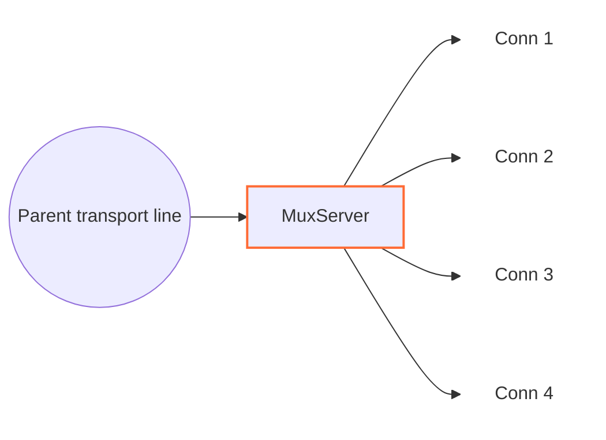

<!--
Documentation version: 106
Sync note: Any change to this file must also be applied to WaterWall/tunnels/MuxServer/description.md, and both files must keep the same documentation version.
-->

# MuxServer

`MuxServer` is the server-side peer for `MuxClient`. It receives framed MUX
traffic on one parent transport line, creates child lines when `Open` frames
arrive, and forwards each child to `next` as a normal independent WaterWall
line.



The previous side must provide the transport line that carries `MuxClient`
frames. The next side receives the recreated logical child lines.

## Typical Placement

Simple TCP transport:

```text
client side: TcpListener -> MuxClient -> TcpConnector
server side: TcpListener -> MuxServer -> TcpConnector
```

With an outer protocol stack:

```text
client side: TcpListener -> MuxClient -> HttpClient -> TlsClient -> TcpConnector
server side: TcpListener -> TlsServer -> HttpServer -> MuxServer -> TcpConnector
```

From the next node's point of view, each child created by `MuxServer` behaves
like a separate WaterWall connection.

## What It Does

- Initializes a parent line when upstream `Init` arrives from the transport.
- Reads MUX frames from the parent line.
- Creates one child line per valid `Open` frame.
- Initializes each child line toward `next`.
- Routes `Data`, `Close`, `FlowPause`, and `FlowResume` by `cid`.
- Wraps downstream child payloads back into MUX `Data` frames.
- Sends child finish events back to `MuxClient` as `Close` frames.
- Queues parent-delivered data when a child's write side is paused.
- Closes all child lines when the parent transport finishes.

`MuxServer` creates the child `line_t` objects behind the parent and is
responsible for destroying them. It does not create the parent transport line.

## Configuration Example

```json
{
  "name": "mux-server",
  "type": "MuxServer",
  "settings": {
    "child-buffer-limit": 8388608,
    "child-buffer-pause-tolerance": 524288,
    "log-main-line-stats": false
  },
  "next": "service-side-node"
}
```

## Required Fields

Top-level fields:

| Field | Type | Description |
| --- | --- | --- |
| `name` | string | User-chosen node name. Must be unique inside the config file. |
| `type` | string | Must be exactly `"MuxServer"`. |
| `settings` | object | Optional. Defaults are used when omitted. |
| `next` | string | Required. The next node receives recreated child lines. |

`MuxServer` should have a previous transport-facing node and should be reached
by a matching `MuxClient`.

## Optional Settings

| Setting | Type | Default | Description |
| --- | --- | --- | --- |
| `child-buffer-limit` | integer | `8388608` | Maximum queued bytes for one paused child. Must be greater than `0`. If reached, the child is closed with a MUX `Close` frame. |
| `child-buffer-pause-tolerance` | integer | `524288` | Queue threshold where the child sends `FlowPause` and may pause parent reads. Must be `0` or greater. Values above `child-buffer-limit` are capped to the limit. |
| `log-main-line-stats` | boolean | `false` | When enabled, parent lines log stats every `5000` ms. |

Stats include worker id, parent read/write pause state, child count, child
read-pause count, and child write-pause count.

Mode settings such as `timer`, `counter`, and `fixed-connections-count` belong
only to `MuxClient`. `MuxServer` follows the frames it receives and does not
care which client-side mode created them.

## Parent And Child Model

`MuxServer` has two line roles:

| Role | Meaning |
| --- | --- |
| parent line | The shared transport line received from the previous node. |
| child line | A normal line created by `MuxServer` for one `cid` from the parent. |

When an `Open` frame arrives:

1. `MuxServer` checks whether the `cid` already exists.
2. If the `cid` is new, it creates a child line on the same worker.
3. It initializes MUX line state for that child.
4. It links the child to the parent.
5. It sends upstream `Init` to `next` on the child line.

Duplicate `Open` frames for an existing `cid` are ignored.

## Frame Format

`MuxServer` expects the same 8-byte packed frame header used by `MuxClient`:

| Field | Size | Description |
| --- | ---: | --- |
| `length` | `uint16` | Payload length after the header, stored big-endian. |
| `flags` | `uint8` | Frame kind. |
| `_pad1` | `uint8` | Internal padding byte. |
| `cid` | `uint32` | Child stream id, stored big-endian. |

Frame flags:

| Flag | Meaning |
| ---: | --- |
| `0` | `Open` |
| `1` | `Close` |
| `2` | `FlowPause` |
| `3` | `FlowResume` |
| `4` | `Data` |

The implementation rejects payloads larger than `0xFFFF - 8`, so one MUX data
frame can carry at most `65527` payload bytes. `MuxServer` does not split a
large downstream child payload into multiple MUX frames; payloads reaching this
node should already fit that limit.

## Direction Behavior

| Incoming callback | Behavior |
| --- | --- |
| parent upstream `Init` | Initializes parent state, optionally schedules stats logging, and reports downstream `Est` to the previous node. |
| parent upstream `Payload` | Parses MUX frames from `MuxClient`; creates children for `Open`; routes `Data`, `Close`, `FlowPause`, and `FlowResume` by `cid`. |
| parent upstream `Pause` / `Resume` | Reflects parent write pressure to the most recent writer child, or to all children if no recent writer is known. |
| parent upstream `Finish` | Marks the parent finishing, flushes/finishes all children toward `next`, and destroys parent state. |
| child downstream `Payload` | Prepends a MUX `Data` header and sends the frame back on the parent toward the previous node. |
| child downstream `Pause` / `Resume` | Sends `FlowPause` / flushes queued data and possibly sends `FlowResume`. |
| child downstream `Finish` | Sends a MUX `Close` frame, destroys the owned child line state, and destroys the owned child line. |
| upstream `Est` | Disabled; reaching this callback is fatal. |
| downstream `Init` | Disabled; reaching this callback is fatal. |

Frames for unknown cids and unknown frame kinds are dropped.

## Backpressure And Queues

MUX keeps backpressure per child:

- If the service-side child pauses, `MuxServer` sends `FlowPause` for that
  `cid`.
- If peer `FlowPause` arrives from the parent transport, reads from the
  service-side child are paused.
- If parent-delivered data arrives for a paused child, data is queued on that
  child.
- Once one child's queue reaches `child-buffer-pause-tolerance`, the child sends
  `FlowPause` and parent input may be paused.
- The same tolerance is also applied to aggregate queued child data on the
  parent line.
- Once queued data drops below `min(512 KiB, child-buffer-limit)`, `FlowResume`
  and parent read resume can be sent.
- If one child's queue reaches `child-buffer-limit`, the child is closed.

This lets one slow child stop its own stream without forcing every other child
on the same parent to stop immediately.

## Finish And Close Handling

If `MuxServer` receives a `Close` frame for a child, it detaches the child from
the parent, releases any parent-read pause held by that child, destroys the
child's MUX state, sends upstream `Finish` to `next`, and destroys the child
line if it is still alive.

If the service-facing side closes a child, `MuxServer` sends a `Close` frame
back to `MuxClient`, destroys local child state, and destroys the owned child
line.

If the parent transport closes, `MuxServer` finishes every attached child and
then destroys the parent MUX state.

## Buffer And Padding Notes

`MuxServer` prepends MUX headers to downstream child payloads. Node metadata
advertises:

```text
required_padding_left = 8
layer_group = kNodeLayerAnything
```

Incoming parent bytes are accumulated in a read stream until a full MUX frame is
available. If the parent read stream grows above `1 MiB`, `MuxServer` closes all
attached children and finishes the parent toward the previous node.

## Practical Notes

- Pair this node with `MuxClient`; it is not useful by itself.
- `MuxServer` has no client-side concurrency mode settings.
- A `TcpConnector` after `MuxServer` creates one service connection per child.
- `MuxServer` is a middle tunnel, not a generic endpoint.
