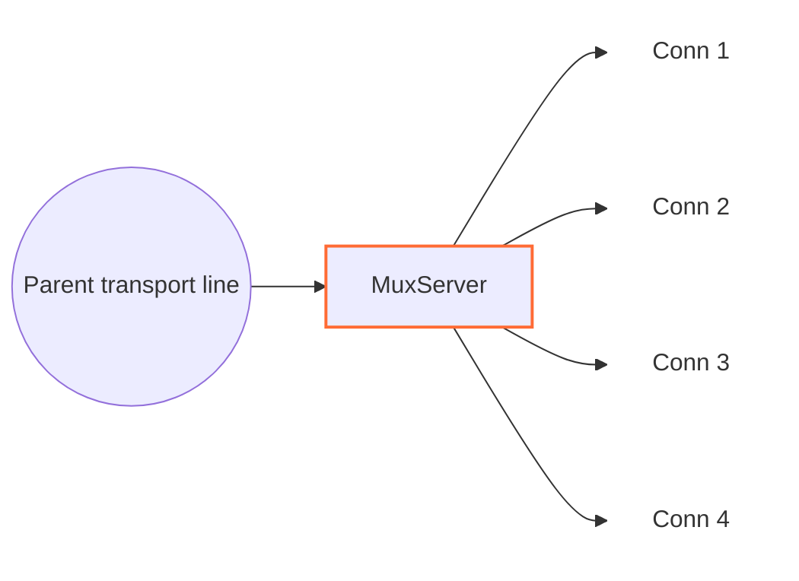

<!--
Documentation version: 156
Sync note: Any change to this file must also be applied to WaterWall/tunnels/MuxServer/description.md and WaterWall-Docs/i18n/fa/docusaurus-plugin-content-docs/current/02-noderefs/MuxServer.mdx, and all files must keep the same documentation version.
-->

# MuxServer

`MuxServer` is the server-side peer for `MuxClient`. It receives framed MUX
traffic on one parent transport line, creates child lines when `Open` frames
arrive, and forwards each child to `next` as a normal independent WaterWall
line.



The previous side must provide the transport line that carries `MuxClient`
frames. The next side receives the recreated logical child lines.

## Typical Placement

Simple TCP transport:

```text
client side: TcpListener -> MuxClient -> TcpConnector
server side: TcpListener -> MuxServer -> TcpConnector
```

With an outer protocol stack:

```text
client side: TcpListener -> MuxClient -> HttpClient -> TlsClient -> TcpConnector
server side: TcpListener -> TlsServer -> HttpServer -> MuxServer -> TcpConnector
```

From the next node's point of view, each child created by `MuxServer` behaves
like a separate WaterWall connection.

## What It Does

- Initializes a parent line when upstream `Init` arrives from the transport.
- Reads MUX frames from the parent line.
- Creates one child line per valid `Open` frame.
- Initializes each child line toward `next`.
- Routes `Data`, `Close`, `FlowPause`, and `FlowResume` by `cid`.
- Wraps downstream child payloads back into MUX `Data` frames.
- Sends child finish events back to `MuxClient` as `Close` frames.
- Queues parent-delivered data when a child's write side is paused.
- Detaches accepted child queues when the parent transport finishes and drains them under child backpressure.

`MuxServer` creates the child `line_t` objects behind the parent and is
responsible for destroying them. It does not create the parent transport line.

## Configuration Example

```json
{
  "name": "mux-server",
  "type": "MuxServer",
  "settings": {
    "child-buffer-limit": 25165824,
    "child-buffer-pause-tolerance": 524288,
    "child-buffer-resume-threshold": 262144,
    "parent-buffer-limit": 33554432,
    "max-children": 10000,
    "max-live-children": 262144,
    "initial-child-idle-timeout-ms": 10000,
    "active-child-idle-timeout-ms": 300000,
    "memory-high-watermark-percent": 85,
    "memory-low-watermark-percent": 75,
    "memory-reserve": 268435456,
    "memory-fallback-max-live-children": 12000,
    "detached-buffer-limit": 268435456,
    "detached-child-limit": 12000,
    "log-main-line-stats": false
  },
  "next": "service-side-node"
}
```

## Required Fields

Top-level fields:

| Field | Type | Description |
| --- | --- | --- |
| `name` | string | User-chosen node name. Must be unique inside the config file. |
| `type` | string | Must be exactly `"MuxServer"`. |
| `settings` | object | Optional. Defaults are used when omitted. |
| `next` | string | Required. The next node receives recreated child lines. |

`MuxServer` should have a previous transport-facing node and should be reached
by a matching `MuxClient`.

## Optional Settings

| Setting | Type | Default | Description |
| --- | --- | --- | --- |
| `child-buffer-limit` | integer | `25165824` | Maximum retained `sbuf_t` allocation charge for one paused child. Actual capacity (including left padding), the buffer header, and aligned-allocation overhead are charged. Must be greater than `0`; reaching it closes the child with a MUX `Close` frame. |
| `child-buffer-pause-tolerance` | integer | `524288` | Logical queued-payload threshold for sending fallback `FlowPause` when the normal child pause callback has not already sent it. Must be `0` or greater. Its numeric value is capped to `child-buffer-limit`. |
| `child-buffer-resume-threshold` | integer | `262144` | Logical queued-payload low-water mark for sending `FlowResume` after the local child becomes writable. Must be greater than `0`. Its numeric value is capped to `child-buffer-limit`. Raising it resumes the peer earlier but weakens hysteresis and may increase pause/resume cycling. |
| `parent-buffer-limit` | integer | `33554432` | Per-parent retained-allocation-charge budget for child queues. When reached, the child with the largest retained charge is closed; equal-size ties prefer the oldest attached child. Set to `0` to disable the aggregate budget. |
| `max-children` | integer | `10000` | Hard maximum attached live children on one parent. Must be positive and no greater than `max-live-children`; historical destroyed CIDs do not count. |
| `max-live-children` | integer | `262144` | Hard maximum reserved or initialized children across this MuxServer instance, all parents, and all workers. Draining and detached children count until their MuxServer state is destroyed. |
| `initial-child-idle-timeout-ms` | integer | `10000` | Idle timeout after `Open` and before the first nonempty Data payload. Must be positive. |
| `active-child-idle-timeout-ms` | integer | `300000` | Refreshing idle timeout after nonempty payload activity begins. Must be positive and at least the initial timeout. |
| `memory-high-watermark-percent` | integer | `85` | Close memory admission at or above this host or finite-cgroup usage. Must be in `[1, 99]`. |
| `memory-low-watermark-percent` | integer | `75` | Reopen only when every applicable usage is at or below this value and reserve headroom recovered. Must be in `[1, 99]` and lower than the high watermark. |
| `memory-reserve` | integer | By `ram-profile` | Close admission when effective available bytes reach this reserve. Must be in `[0, INT_MAX]`; `0` disables only this byte reserve. |
| `memory-fallback-max-live-children` | integer | By `ram-profile` | Conservative aggregate ceiling while memory sampling is unsupported, unavailable, or older than one second. Must be positive and no greater than `max-live-children`. |
| `detached-buffer-limit` | integer | By `ram-profile` | Per-worker retained-allocation-charge limit for blocked child queues kept after parent loss. Reaching it aborts only the newly detached blocked child. Set to `0` to disable this bound. |
| `detached-child-limit` | integer | By `ram-profile` | Per-worker count limit for blocked children retained after parent loss. Reaching it aborts only the newly detached blocked child. Set to `0` to disable this bound. |
| `log-main-line-stats` | boolean | `false` | When enabled, parent lines log best-effort stats every `5000` ms. Parent logical death suppresses normal execution and settles the task as `LineDead` when its queued/timed runner is reached. Worker quiescence actively cancels pending work. Neither path rearms it. |

The two detached limits use these defaults when their node settings are omitted:

| RAM profile | Default detached charge | Default detached children |
| --- | ---: | ---: |
| S1 (`minimal` / `ultralow`) | `33554432` (`32 MiB`) | `4096` |
| S2 | `80740352` (`77 MiB`) | `5677` |
| M1 (`client`) | `127926272` (`122 MiB`) | `7258` |
| M2 (`client-larger`) | `174063616` (`166 MiB`) | `8838` |
| L1 | `221249536` (`211 MiB`) | `10419` |
| L2 (`server`, the global default) | `268435456` (`256 MiB`) | `12000` |

Defaults are linearly interpolated over the six ordered RAM-profile tiers, with the charge limit rounded to the
nearest whole MiB. An explicit setting overrides the profile-derived value independently for that limit.

The admission reserve and fallback ceiling use the same initial six-tier
values shown above: detached bytes become the memory reserve and detached
children become the fallback live-child ceiling. Admission and detached-drain
defaults are separate policies even though their current values match.

Pause tolerance and resume threshold intentionally continue to measure logical
application payload bytes. Allocation charge is specialized to the three
memory-sensitive hard byte budgets.

Stats include worker id, parent write-pause state, aggregate retained queue charge, child
count, children waiting for ordered Close completion, child read-pause count,
and child write-pause count. The legacy `parent-line-read-paused` field remains
present as `no` for compatibility, and `parent-queued-bytes` reports the hard-budget
charge rather than logical payload length.

Mode settings such as `timer`, `counter`, and `fixed-connections-count` belong
only to `MuxClient`. `MuxServer` follows the frames it receives and does not
care which client-side mode created them.

## Parent And Child Model

`MuxServer` has two line roles:

| Role | Meaning |
| --- | --- |
| parent line | The shared transport line received from the previous node. |
| child line | A normal line created by `MuxServer` for one `cid` from the parent. |

When an `Open` frame arrives:

1. `MuxServer` checks whether the `cid` already exists.
2. If the `cid` is new, it creates a child line on the same worker.
3. It initializes MUX line state for that child.
4. It links the child to the parent.
5. It sends upstream `Init` to `next` on the child line.

Parent-to-child dispatch uses a hash index, so lookup and duplicate detection
remain average O(1). A duplicate `Open` for any indexed child, including a
peer-close drain, is a protocol violation and closes that parent.

Before allocation, a fresh Open must pass the per-parent hard limit, the
per-instance atomic reservation limit, and cached memory admission. Resource
rejection sends `Close(cid)` without creating a child and preserves the parent
and siblings. A parent has a 1024-rejection burst bucket refilled at 64 tokens
per second; sustained rejected-Open abuse closes only that parent.

The global sampler publishes memory every `500` ms and snapshots expire after
one second. On Linux, cgroup pressure is the maximum used percentage and the
minimum remaining allowance across every visible finite cgroup v2/v1 level;
`MemAvailable` still bounds effective headroom. Ambiguous or hidden cgroup
constraints use the conservative fallback. Windows uses available physical
memory. Workers consume only the cached atomic tuple, and the high/low
watermarks provide hysteresis. Stale or unsupported data uses the profile
fallback ceiling and cannot reopen a gate previously closed by fresh pressure.
Memory admission affects new Opens only.

## Frame Format

`MuxServer` expects the same 8-byte packed frame header used by `MuxClient`:

| Field | Size | Description |
| --- | ---: | --- |
| `length` | `uint16` | Payload length after the header, stored big-endian. |
| `flags` | `uint8` | Frame kind. |
| `_pad1` | `uint8` | Internal padding byte. |
| `cid` | `uint32` | Child stream id, stored big-endian. |

Frame flags:

| Flag | Meaning |
| ---: | --- |
| `0` | `Open` |
| `1` | `Close` |
| `2` | `FlowPause` |
| `3` | `FlowResume` |
| `4` | `Data` |

The implementation rejects payloads larger than `0xFFFF - 8`, so one MUX data
frame can carry at most `65527` payload bytes. `MuxServer` does not split a
large downstream child payload into multiple MUX frames; payloads reaching this
node should already fit that limit.

## Direction Behavior

| Incoming callback | Behavior |
| --- | --- |
| parent upstream `Init` | Initializes parent state, optionally schedules stats logging, and reports downstream `Est` to the previous node. |
| parent upstream `Payload` | Parses MUX frames from `MuxClient`; creates children for `Open`; routes `Data`, `Close`, `FlowPause`, and `FlowResume` by `cid`. |
| parent upstream `Pause` / `Resume` | Reflects parent write pressure to the most recent writer child, or to all children if no recent writer is known. |
| parent upstream `Finish` | Destroys parent state immediately, transfers accepted child queues to child-only drains, and finishes each child after its queue becomes empty and writable. |
| child downstream `Payload` | Prepends a MUX `Data` header and sends the frame back on the parent toward the previous node. |
| child downstream `Pause` / `Resume` | Sends `FlowPause` / flushes queued data and possibly sends `FlowResume`. |
| child downstream `Finish` | Sends a MUX `Close` frame, destroys the owned child line state, and destroys the owned child line. |
| upstream `Est` | Disabled; reaching this callback is fatal. |
| downstream `Init` | Disabled; reaching this callback is fatal. |

Frames for unknown cids and unknown frame kinds are dropped.

## Child Idle Reclamation

Every admitted child starts with `initial-child-idle-timeout-ms`. The first
nonempty incoming Data payload or nonempty payload produced by `next` promotes
it to `active-child-idle-timeout-ms`; every later nonempty payload refreshes the
active deadline. Open, Close, flow control, Init/Est, and zero-length Data do not
count as activity. A zero-length Data frame retained for a paused child still
has a positive allocation charge and advances the hard queue budgets.

Expiry closes only that child, emits `Close(cid)` while its parent is available,
and preserves the parent and siblings. Detached expiry uses the detached-abort
path. Explicit close removes the timer item immediately, so timer memory follows
live children rather than historical churn.

These limits and timers do not change MUX wire bytes. A parent stays reusable
for its full transport lifetime, and destroying a child makes its count capacity
available again on that same parent and MuxServer instance.

## Backpressure And Queues

MUX keeps backpressure per child:

- If the service-side child pauses, `MuxServer` sends `FlowPause` for that
  `cid`.
- If peer `FlowPause` arrives from the parent transport, reads from the
  service-side child are paused.
- If parent-delivered data arrives for a paused child, data is queued on that
  child.
- `FlowPause` is normally sent by the child pause callback before data is queued;
  `child-buffer-pause-tolerance` is a fallback for an ordering edge where it was
  not sent yet.
- Once logical queued payload drops below `child-buffer-resume-threshold`, `FlowResume` can
  be sent. The configured value is capped to `child-buffer-limit`.
- Queue pressure never pauses reads on the shared parent transport, so one
  blocked destination cannot stop unrelated child frames from being demultiplexed.
- If one child's retained queue charge reaches `child-buffer-limit`, the child is closed.
- If total retained queue charge reaches `parent-buffer-limit`, the child with the
  actual largest retained charge is closed. Equal-size ties prefer the oldest attached
  child.
- Setting `parent-buffer-limit` to `0` disables only the aggregate budget; the
  per-child limit still applies.

Logical queue length remains the content-byte measure used for FIFO and flow
control. The charge approximates live Mux queue allocations rather than
whole-process RSS: allocator caches, queue-ring storage, and fixed pool baseline
memory are outside an individual queue's charge.

This isolates a slow child and bounds queue memory without creating parent-wide
head-of-line blocking.

## Finish And Close Handling

If `MuxServer` receives a `Close` frame for a child, the Close remains ordered
after every earlier queued `Data` byte. A paused child remains addressable by
`cid`; later frames for that closed `cid` are discarded, Resume continues the
FIFO drain, and Finish plus owned-line destruction happen only at the
empty-and-writable barrier.

During normal operation, if the service-facing side closes a child, `MuxServer` sends a `Close` frame
back to `MuxClient`, destroys local child state, and destroys the owned child
line.

If the parent transport closes, `MuxServer` destroys the borrowed parent's MUX
state immediately and transfers each accepted child queue into a worker-local
owned registry. Writable queues finish immediately; paused queues drain on
later Resume without retaining or dereferencing the dead parent. New outbound
child data is rejected. `detached-buffer-limit` bounds residual retained allocation
charge and `detached-child-limit` bounds residual child count per worker.

## Buffer And Padding Notes

`MuxServer` prepends MUX headers to downstream child payloads. Node metadata
advertises:

```text
required_padding_left = 8
layer_group = kNodeLayer4
layer_group_next_node = kNodeLayer4
layer_group_prev_node = kNodeLayer4
```

Incoming parent bytes are accumulated in a read stream until a full MUX frame is
available. If the parent read stream grows above `1 MiB`, `MuxServer` discards
the incomplete remainder, finishes the parent toward the previous node, and
uses the same detached drain for already parsed child queues.

## Practical Notes

- Pair this node with `MuxClient`; it is not useful by itself.
- `MuxServer` has no client-side concurrency mode settings.
- A `TcpConnector` after `MuxServer` creates one service connection per child.
- `MuxServer` is a middle tunnel, not a generic endpoint.
- A service-side Finish or orderly worker shutdown may discard residual
  detached data. Worker shutdown forwards no queued Payload, even for a writable
  child, before closing every remaining owned child.
- No MUX wire change or peer capability is introduced.

## Node Metadata

Source-backed metadata:

| Property | Value |
| --- | --- |
| node flags | `kNodeFlagNone` |
| `can_have_prev` | `true` |
| `can_have_next` | `true` |
| `layer_group` | `kNodeLayer4` |
| `layer_group_prev_node` | `kNodeLayer4` |
| `layer_group_next_node` | `kNodeLayer4` |
| `required_padding_left` | `8` bytes |
