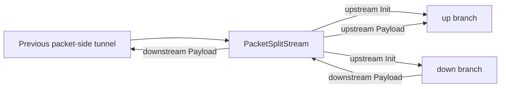

<!--
Documentation version: 106
Sync note: Any change to this file must also be applied to WaterWall/tunnels/PacketSplitStream/description.md, and both files must keep the same documentation version.
-->

# PacketSplitStream

`PacketSplitStream` is a packet-line anchored split bridge. It is used when one
packet-side line needs two named branch entries:

- `up`: the branch that receives upstream packet payloads
- `down`: the branch that is initialized as the return/download side

This node is not a general router and it does not frame packets into a stream by
itself. It is a branch-composition helper for special packet/stream layouts.

:::info
`PacketSplitStream` is different from `HalfDuplexClient`. It does not perform a
pairing handshake, does not restore a paired connection, and does not create a
normal per-connection lifecycle around the packet line.
:::

## Typical Placement

The visible chain points into `PacketSplitStream`, while the split branches are
named in `settings`:

```text
packet-side-node -> PacketSplitStream
                    settings.up   -> upload-branch-head
                    settings.down -> download-branch-head
```

`PacketSplitStream` intentionally does not use a top-level `next` field.

## Configuration Example

```json
{
  "name": "packet-split",
  "type": "PacketSplitStream",
  "settings": {
    "up": "upload-branch-head",
    "down": "download-branch-head"
  }
}
```

The referenced branch nodes must be defined elsewhere in the same WaterWall
configuration.

## Flow Model



Current implementation behavior:

| Callback received by `PacketSplitStream` | Behavior |
| --- | --- |
| upstream `Init` | Calls upstream `Init` on both the `up` and `down` branch entries. |
| upstream `Payload` | Sends the payload to the `up` branch. |
| downstream `Payload` | Sends the payload back to the previous tunnel. |
| upstream `Est`, `Pause`, `Resume` | No-op. |
| downstream `Init`, `Est`, `Pause`, `Resume` | No-op. |
| upstream or downstream `Finish` | Treated as unexpected and terminates the program. |

Because `Finish` is not a supported runtime path, use this node with
packet-line style flows where the worker packet line stays alive for the chain
lifetime.

## Required Fields

Top-level fields:

| Field | Type | Description |
| --- | --- | --- |
| `name` | string | User-chosen node name. Must be unique inside the config file. |
| `type` | string | Must be exactly `"PacketSplitStream"`. |
| `settings` | object | Required. Contains the named split branch entries. |

Required `settings` fields:

| Setting | Type | Description |
| --- | --- | --- |
| `up` | string | Node name used as the upstream entry tunnel for sent packets. |
| `down` | string | Node name chained as the normal downstream/return branch. |

## Validation Rules

The current source enforces these rules:

- top-level `next` must not be set
- `settings.up` is required
- `settings.down` is required
- both referenced nodes must exist
- `up` and `down` must point to different nodes
- neither branch may point back to the `PacketSplitStream` node itself
- referenced branch entries must not already be bound to another previous tunnel

During chain construction, WaterWall resolves the actual branch entry after each
referenced node has chained itself. This matters for nodes that insert internal
tunnels in front of themselves.

## Node Metadata

Source-backed metadata:

| Property | Value |
| --- | --- |
| node flag | `kNodeFlagChainEnd` |
| `can_have_prev` | `true` |
| `can_have_next` | `false` |
| `layer_group` | `kNodeLayerAnything` |
| `layer_group_prev_node` | `kNodeLayerAnything` |
| `layer_group_next_node` | `kNodeLayerAnything` |
| `required_padding_left` | `0` |

`PacketSplitStream` does not prepend, rewrite, or consume payload buffers. On
payload callbacks it transfers the existing buffer to the selected next
callback path.

## Packet-Line Notes

This node is designed around WaterWall packet-line behavior. A worker packet
line is shared across packets on that worker and is not the same thing as a
normal TCP-style connection line.

Practical consequences:

- Do not use this node as if it owns ordinary per-connection lines.
- Do not expect per-flow close or reconnect behavior from it.
- Do not place it in a path where normal `Finish` propagation is expected.
- Use `PacketsToStream` / `StreamToPackets` when the goal is simple
  packet-to-stream length framing.

## When To Use It

Use `PacketSplitStream` when a packet-side pipeline must feed one upload branch
while also preparing a separate branch whose downstream payloads return to the
packet side.

Avoid it when you need policy routing, multi-branch selection by rule, or normal
connection lifecycle management. For those cases, use a router-style node or one
of the packet/stream boundary tunnels that directly matches the desired flow.
