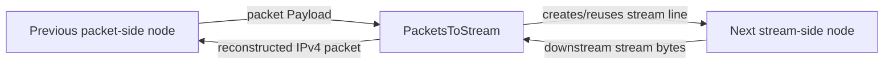

<!--
Documentation version: 106
Sync note: Any change to this file must also be applied to WaterWall/tunnels/PacketsToStream/description.md, and both files must keep the same documentation version.
-->

# PacketsToStream

`PacketsToStream` adapts a packet-oriented side of a chain to a
stream-oriented side. It receives packet payloads from the previous side,
creates a worker-local stream-facing line toward the next node, and writes each
IPv4 packet to that stream line as raw bytes.

The current implementation is IPv4-only and headerless:

```text
IPv4 packet bytes + IPv4 packet bytes + IPv4 packet bytes + ...
```

There is no 2-byte length prefix. Packet boundaries are recovered from each
packet's IPv4 total-length field. Old documentation may call this node
`PacketAsData`, but the current node type is `PacketsToStream`.

## What It Does

- Accepts packet payload from the previous side.
- Creates one stream-facing WaterWall line per worker when needed.
- Reuses that stream-facing line for later packets on the same worker.
- Recalculates IPv4 checksums before forwarding if the packet line requests it.
- Drops packets that are not self-consistent IPv4 packets.
- Writes valid IPv4 packets to the stream side without adding a framing header.
- Buffers return stream bytes and reconstructs IPv4 packets from the total
  length field.
- Sends reconstructed return packets back to the previous packet side.
- Recreates the stream-facing line if it finishes or sensitive-mode heartbeat
  fails.

This is a packet-to-stream adapter based on IPv4 parsing, not a generic byte
framing protocol.

## Typical Placement

Packet input to a stream transport:

```text
TunDevice -> PacketsToStream -> TcpConnector
```

Paired with `StreamToPackets` on another server:

```text
server1: TunDevice -> PacketsToStream -> TcpConnector
server2: TcpListener -> StreamToPackets -> TunDevice
```

This works because `PacketsToStream` and `StreamToPackets` use the same raw
IPv4 concatenation format.

## Configuration Example

```json
{
  "name": "packet-to-stream",
  "type": "PacketsToStream",
  "settings": {
    "sensitive-mode": true,
    "interval-ms": 50,
    "tolerance-ms": 150,
    "packet-validation-level": "hard"
  },
  "next": "stream-node"
}
```

## Settings

Top-level fields:

| Field | Type | Required | Description |
| --- | --- | --- | --- |
| `name` | string | yes | User-chosen node name. Must be unique inside the config file. |
| `type` | string | yes | Must be exactly `"PacketsToStream"`. |
| `settings` | object | no | Optional settings object. |
| `next` | string | yes | Stream-oriented node that receives the worker-local data line. |

Optional `settings` fields:

| Setting | Type | Default | Description |
| --- | --- | --- | --- |
| `sensitive-mode` | boolean | `false` | Enables stream-side heartbeat on each worker-local output line. |
| `interval-ms` | integer | `50` | Heartbeat send interval in milliseconds. Must be at least `1`. Used only when `sensitive-mode` is enabled. |
| `tolerance-ms` | integer | `150` | Maximum time to wait for heartbeat pong before recreating the stream line. Must be at least `1`. |
| `packet-validation-level` | string | `"none"` | Validation mode for packets decoded from downstream return stream data. Values: `"none"`, `"loose"`, `"hard"`. |

There are no required tunnel-specific settings.

## Wire Format

The stream-side wire format is a raw concatenation of complete IPv4 packets:

```text
packet A: N bytes, where IPv4 total-length = N
packet B: M bytes, where IPv4 total-length = M
packet C: K bytes, where IPv4 total-length = K
```

`PacketsToStream` does not prepend a length field, message type, or metadata.
The peer must recover packet boundaries by reading the IPv4 header.

Forwarded packets must satisfy:

- length is at least a minimum IPv4 header
- length is not greater than `kMaxAllowedPacketLength`
- IP version is `4`
- IPv4 total length equals the buffer length

IPv6, non-IPv4 payloads, malformed IPv4 packets, and IPv4 packets with trailing
bytes beyond the total-length field are dropped because they would desynchronize
the stream parser on the peer.

## Flow Model



Direction summary:

| Direction | Behavior |
| --- | --- |
| packet side to stream side | Valid IPv4 packet is sent raw on the worker-local stream line. |
| stream side back to packet side | Stream bytes are buffered, decoded into IPv4 packets, optionally validated, then emitted downstream to the packet side. |

## Worker-Local Stream Line

`PacketsToStream` anchors its state on the persistent worker packet line. For
each worker, it creates a normal stream-facing line toward the next tunnel when
traffic first needs it.

The stream-facing line is:

- created on upstream packet `Init` or first upstream packet `Payload`
- initialized toward the next tunnel with upstream `Init`
- reused for later packets on the same worker
- recreated if it finishes or sensitive-mode timeout triggers

The packet line itself is persistent worker state. It is not destroyed when the
stream-facing line is recreated.

## Packet Decoding On Return Path

Return traffic from the stream side is buffered in a read stream. The decoder:

1. waits for at least a minimum IPv4 header
2. checks whether the stream head looks like a plausible IPv4 packet
3. reads the IPv4 total-length field
4. waits until that many bytes are buffered
5. extracts exactly that many bytes as one packet
6. optionally validates the decoded packet
7. sends it back to the previous packet-side node

The parser is resilient to garbage. If the stream head cannot be a valid IPv4
start, the decoder scans a bounded resync window and discards bytes until the
next plausible IPv4 header. It always makes forward progress and does not read
out of bounds.

Current read-stream overflow limit:

```text
65536 * 2 bytes
```

If the buffer grows beyond that limit, the read stream is emptied.

## Packet Validation

`packet-validation-level` applies to packets decoded from downstream stream data
before those packets are emitted back to the packet side.

It does not replace the unconditional forwardability checks used before writing
packet-side input to the stream. Packet-side input still must be self-consistent
IPv4 so the peer can parse it.

| Level | Behavior |
| --- | --- |
| `"none"` | Default. No configurable validation after extraction. The extractor still performs light structural checks so it can find packet boundaries. |
| `"loose"` | Drops non-IPv4 and malformed IPv4 packets. Checks minimum header, version, IPv4 header length, and total length matching packet length. |
| `"hard"` | Applies `loose`, verifies IPv4 header checksum, and verifies TCP, UDP, and ICMP checksums for non-fragmented packets. IPv4 UDP checksum `0` is accepted. |

For fragmented IPv4 packets in `"hard"` mode, only the IPv4 header checksum is
verified. Transport checksums are skipped because they require reassembly.

When validation drops a decoded packet, the tunnel writes a warning log with the
validation level and reason.

## Sensitive Mode

Sensitive mode is a stream-line health check. It is implemented using valid
IPv4 heartbeat packets because the wire format has no separate control frame.

When enabled:

- each worker gets a heartbeat timer
- every `interval-ms`, `PacketsToStream` sends one heartbeat ping on the active
  stream-facing line
- the ping is a minimal IPv4 packet with protocol `0xFD` and a 5-byte payload
  filled with `0xFF`
- the peer's `StreamToPackets` treats that packet as a ping and sends back a
  matching heartbeat pong
- the pong is a minimal IPv4 packet with protocol `0xFD` and a 5-byte payload
  filled with `0xDD`
- pings and pongs are not emitted to the packet side
- if no pong arrives before `tolerance-ms`, the current stream-facing line is
  finished locally and recreated

Only one ping is in flight per worker. A late pong beyond the tolerance also
causes the line to reset.

## Pause, Resume, And Finish

Callback behavior:

| Callback received by `PacketsToStream` | Behavior |
| --- | --- |
| upstream `Init` | Ensures the worker-local stream-facing line exists. |
| upstream `Payload` | Recalculates checksum if requested, checks IPv4 forwardability, sends raw packet to stream line. |
| upstream `Est` | Warning log; not expected. |
| upstream `Pause` / `Resume` | Warning log; not expected from packet side. |
| upstream `Finish` | Fatal guard; packet-side finish is not expected. |
| downstream `Payload` | Decodes stream bytes into IPv4 packets and sends them back to the previous side. |
| downstream `Est` | Propagates `Est` back to the previous packet side if it belongs to the active stream line. |
| downstream `Pause` | Marks packet side paused and propagates downstream `Pause` to the previous packet side. |
| downstream `Resume` | Clears paused state and propagates downstream `Resume` to the previous packet side. |
| downstream `Finish` | Destroys/recreates the active stream-facing line; packet line remains alive. |
| downstream `Init` | Fatal guard; not a valid callback path. |

If the stream line is paused and the previous packet-side node ignores
backpressure, incoming packet payload is dropped instead of queued.

## Checksum Recalculation

If `line->recalculate_checksum` is set on the packet line and the payload is
IPv4, `PacketsToStream` recalculates the full IPv4 packet checksum before
writing it to the stream side, then clears the flag.

This is important after packet-manipulation nodes that intentionally mark
packets for checksum repair.

## Node Metadata

Source-backed metadata:

| Property | Value |
| --- | --- |
| node flags | `kNodeFlagNone` |
| `can_have_prev` | `true` |
| `can_have_next` | `true` |
| `layer_group` | Layer 3 and layer 4 (`kNodeLayer3`, `kNodeLayer4`) |
| `layer_group_prev_node` | `kNodeLayerAnything` |
| `layer_group_next_node` | `kNodeLayerAnything` |
| `required_padding_left` | `0` |

The tunnel does not prepend bytes, so it has no extra left-padding requirement.

## Practical Notes

- Pair it with `StreamToPackets` on the other side.
- Do not pair it with older 2-byte-prefix packet framing unless that peer has
  been updated to the current IPv4-total-length format.
- Use `PacketsToConnection` instead when you want lwIP to reconstruct TCP/UDP
  flows as normal WaterWall connection lines.
- Use `packet-validation-level: "hard"` when you want stronger corruption
  detection on the return stream, at the cost of checksum work.
- The stream parser can recover from garbage, but a hostile stream may still
  produce garbage packets that look structurally valid until realignment occurs.
