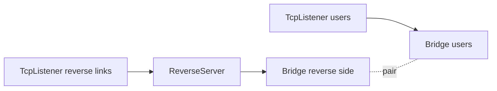
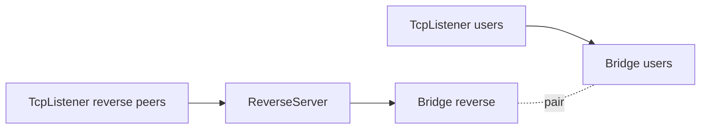

<!--
Documentation version: 106
Sync note: Any change to this file must also be applied to WaterWall/tunnels/ReverseServer/description.md, and both files must keep the same documentation version.
-->

# ReverseServer

`ReverseServer` is the server-side peer for `ReverseClient`. It receives
pre-opened reverse links from one side, receives real local/user traffic from
the other side, and pairs one half from each side so traffic can flow through
the reverse tunnel.

This node is usually placed on the reachable machine: the side that can accept
connections from the remote `ReverseClient` and from the real users or local
entrypoint you want to bridge.

## Why Bridge Is Usually Needed

`ReverseServer` has to join two different connection sources:

- reverse-link connections created by `ReverseClient`
- real user/local connections that should consume those reverse links

In practical WaterWall configs those two sources are usually attached with a
`Bridge` pair:



The peer listener feeds reverse links into `ReverseServer`. The user listener
feeds real traffic into the paired Bridge. `ReverseServer` then pairs one
reverse-link half with one local/user half and forwards between them.

This Bridge-oriented explanation is important: without the Bridge pair it is
easy to place `ReverseServer` as if it were a simple left-to-right tunnel, but
the node is really a dynamic matcher between two connection sources.

## What It Does

- Accepts reverse-link halves coming from `ReverseClient`.
- Validates the internal reverse-link handshake.
- Accepts local/user halves from the other side of the topology.
- Buffers data temporarily while one half waits for its peer.
- Pairs one waiting reverse half with one waiting local half.
- Forwards payload, finish, pause, and resume between paired halves.
- Drops invalid reverse-link handshakes.
- Drops waiting halves that buffer too much data.
- Can move a waiting reverse-link half to another worker to complete a pair.

`ReverseServer` is not a pure adapter and not a simple protocol wrapper. It is a
middle tunnel that keeps per-line state while each half waits for a match.

## Typical Placement

Server-side shape:

```text
peer listener -> ReverseServer -> Bridge(reverse side)
user listener -> Bridge(user side)
```

Example topology:



The peer listener is often restricted with a whitelist so only the expected
`ReverseClient` machine can open reverse links.

## Configuration Example

```json
{
  "name": "reverse-server",
  "type": "ReverseServer",
  "settings": {
    "reverse-secret-length": 640,
    "reverse-secret": "shared-secret"
  },
  "next": "bridge_reverse"
}
```

Minimal Bridge-oriented server example:

```json
{
  "name": "users_inbound",
  "type": "TcpListener",
  "settings": {
    "address": "0.0.0.0",
    "port": 443,
    "nodelay": true
  },
  "next": "bridge_users"
}
```

```json
{
  "name": "bridge_users",
  "type": "Bridge",
  "settings": {
    "pair": "bridge_reverse"
  }
}
```

```json
{
  "name": "bridge_reverse",
  "type": "Bridge",
  "settings": {
    "pair": "bridge_users"
  }
}
```

```json
{
  "name": "reverse_server",
  "type": "ReverseServer",
  "settings": {},
  "next": "bridge_reverse"
}
```

```json
{
  "name": "reverse_peer_inbound",
  "type": "TcpListener",
  "settings": {
    "address": "0.0.0.0",
    "port": 8443,
    "nodelay": true,
    "whitelist": [
      "203.0.113.10/32"
    ]
  },
  "next": "reverse_server"
}
```

In real deployments, the peer path can include TLS, HTTP, Mux, Reality, or
other transport/security nodes before reaching `ReverseServer`.

## Required Fields

Top-level fields:

| Field | Type | Description |
| --- | --- | --- |
| `name` | string | User-chosen node name. Must be unique inside the config file. |
| `type` | string | Must be exactly `"ReverseServer"`. |
| `next` | string | Required in practical Bridge layouts. This is usually the Bridge side that leads to local/user traffic. |

`settings` may be omitted or empty. If present, it must be an object.

## Optional Settings

| Setting | Type | Default | Description |
| --- | --- | --- | --- |
| `reverse-secret-length` | integer | `640` | Length of the reverse-link handshake. Must be in `1..1024`. |
| `reverse-secret` | ASCII string | unset | XORs the default expected handshake bytes with this secret, repeated over the handshake length. Must be non-empty ASCII when set. |

`ReverseServer`, `ReverseClient`, and any `SniffRouter` reverse detector in
front of them must use the same `reverse-secret-length` and `reverse-secret`.

## Reverse-Link Handshake

The reverse-link side is recognized by an internal handshake from
`ReverseClient`.

Default expected handshake:

```text
640 bytes of 0xFF
```

When `reverse-secret` is configured, the same XOR transformation used by
`ReverseClient` is applied before comparison.

`ReverseServer` buffers incoming reverse-link bytes until enough data exists to
validate the full handshake:

- if the handshake matches, the handshake bytes are stripped
- any payload after the handshake is kept as buffered data
- if the handshake is wrong, that reverse-link half is dropped

## Two-Sided Matching Model

`ReverseServer` keeps two waiting lists per worker:

| Waiting half | Meaning |
| --- | --- |
| reverse-link half | A connection from `ReverseClient` that passed the reverse handshake. |
| local/user half | A connection from the other side of the topology that needs a reverse link. |

When payload arrives on an unpaired reverse-link half:

1. buffered bytes are merged with the new payload if needed
2. the reverse handshake is validated
3. the half is added to the reverse waiting list
4. if a local/user half is waiting, the two halves are paired

When payload arrives on an unpaired local/user half:

1. buffered bytes are merged with the new payload if needed
2. the half is added to the local/user waiting list
3. if a reverse-link half is waiting, the two halves are paired

After pairing:

| Incoming side | Forwarding behavior |
| --- | --- |
| reverse-link payload | forwarded toward the local/user side with upstream payload |
| local/user payload | forwarded toward the reverse-link side with downstream payload |
| finish from one side | closes the peer half |
| pause/resume | reflected to the paired peer half |

## Direction Model

Source-backed callback behavior:

| Callback | Behavior |
| --- | --- |
| upstream `Init` | Initializes a reverse-link half and immediately reports downstream establishment to the previous side. |
| upstream `Payload` | Processes the `ReverseClient` handshake before pairing; after pairing forwards to the local/user side with `tunnelNextUpStreamPayload()`. |
| downstream `Init` | Initializes a local/user half and immediately reports upstream establishment to the next side. |
| downstream `Payload` | Waits for or pairs with a reverse-link half; after pairing forwards to the reverse side with `tunnelPrevDownStreamPayload()`. |
| `Pause` / `Resume` | Forwarded only after a pair exists. |
| `Finish` | Removes unpaired waiting halves or finishes the paired peer half. |

The immediate establishment callback means the half has been accepted by
`ReverseServer`; it does not mean the reverse tunnel is already paired and
forwarding useful payload.

## Cross-Worker Pairing

Waiting lists are per worker. If a reverse-link half arrives on one worker and a
local/user half is waiting on another worker, `ReverseServer` can move the
reverse-link half through an internal pipe tunnel layer and then complete the
pair on the target worker.

This is why a reverse setup can work even when the two halves are not accepted
by the same worker thread.

## Buffering Limits

Each unpaired half may buffer data while waiting for its peer.

Current limit:

```text
65535 bytes per waiting half
```

If a waiting half exceeds that limit, it is dropped and its peer-side finish is
propagated as appropriate.

## Node Metadata

Source-backed metadata:

| Property | Value |
| --- | --- |
| node flags | `kNodeFlagNone` |
| `can_have_prev` | `true` |
| `can_have_next` | `true` |
| `layer_group` | `kNodeLayer4` |
| `layer_group_prev_node` | `kNodeLayer4` |
| `layer_group_next_node` | `kNodeLayer4` |
| `required_padding_left` | `0` bytes |

`ReverseServer` does not prepend protocol bytes after handshake handling and
does not need left padding.

## Practical Notes

- Keep reverse secret settings identical on both peers.
- Put access control, such as `TcpListener.whitelist`, on the listener that
  accepts reverse links from the `ReverseClient` machine.
- Use `Bridge` to connect the user/local traffic side cleanly.
- Invalid reverse-link handshakes are dropped.
- Large unpaired payloads are dropped once the buffering limit is exceeded.
- `ReverseServer` is tightly coupled to `ReverseClient`; do not pair it with a
  generic client that does not send the expected reverse handshake.
