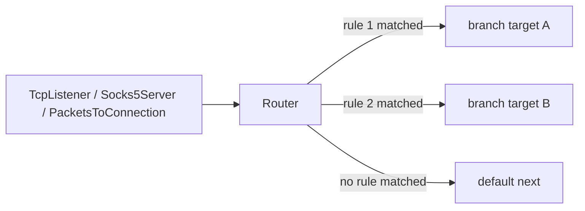

<!--
Documentation version: 110
Sync note: Any change to this file must also be applied to WaterWall/tunnels/Router/description.md and WaterWall-Docs/i18n/fa/docusaurus-plugin-content-docs/current/02-noderefs/Router.mdx, and all files must keep the same documentation version.
-->

# Router

`Router` is WaterWall's rule-based branch selector for connection-oriented
traffic. It sits in the middle of a chain, waits for the first upstream payload
of a line, evaluates ordered rules, and sends that whole connection to one
selected branch.

Use it when one inbound path should split into several outbound paths by source
IP, inbound port, destination IP, destination domain, network type, detected
protocol, HTTP upgrade flag, or authenticated username/password.



## Mental Model

Think of `Router` as a deferred branch selector:

- It does not choose a branch during `Init`.
- It waits for the first upstream payload so it can inspect visible bytes when a
  rule needs protocol detection, HTTP Host/:authority, TLS/QUIC SNI, or HTTP
  `Upgrade`.
- It buffers those first bytes while deciding.
- After a rule wins, it initializes the selected branch and replays the buffered
  bytes to that branch.
- The decision is made once per connection. Later payloads go directly through
  the same selected branch.
- Downstream traffic from the selected branch returns through `Router` to the
  previous node.

If no rule matches, the connection uses the node's top-level `next`. That `next`
is the default route.

:::warning
`Router` needs the client side to send first. Protocols where the server speaks
first cannot be classified until upstream payload arrives, because no branch is
initialized before that first payload.
:::

## Typical Placement

Route a normal TCP listener:

```text
TcpListener -> Router
                 |-- target: tls_path
                 |-- target: ssh_path
                 `-- next: default_path
```

Route after a proxy server that already parsed destination metadata:

```text
Socks5Server -> Router -> TcpConnector
```

Route connection lines created from packet traffic:

```text
TunDevice -> PacketsToConnection -> Router -> TcpConnector
```

`Router` is a layer-4 tunnel. It routes WaterWall lines, not raw packets by
itself. For raw packet chains, first use a packet/connection bridge such as
`PacketsToConnection` when you need connection-style routing.

## Complete Example

This example uses one inbound listener and sends:

- authenticated user `alice` to a premium path
- TLS traffic for `*.example.org` to a domain-specific path
- SSH traffic to an SSH path
- everything else to the default direct path

```json
{
  "name": "inbound",
  "type": "TcpListener",
  "settings": {
    "address": "0.0.0.0",
    "port": 443,
    "nodelay": true
  },
  "next": "router"
}
```

```json
{
  "name": "router",
  "type": "Router",
  "settings": {
    "sniffing": [
      "http1",
      "tls"
    ],
    "rules": [
      {
        "username": "alice",
        "target": "premium_path"
      },
      {
        "destination-domain": [
          "*.example.org"
        ],
        "protocol": "tls",
        "target": "example_tls_path"
      },
      {
        "destination-port": 22,
        "target": "ssh_path"
      }
    ]
  },
  "next": "direct_path"
}
```

```json
{
  "name": "direct_path",
  "type": "TcpConnector",
  "settings": {
    "address": "203.0.113.10",
    "port": 443
  }
}
```

Rule targets such as `premium_path`, `example_tls_path`, and `ssh_path` must be
real node names in the same config. Each target is a branch entry. It can point
to a connector, a protocol tunnel, a `Bridge`, or another valid chain segment.

## Required Fields

Top-level fields:

| Field | Type | Description |
| --- | --- | --- |
| `name` | string | User-chosen node name. Must be unique inside the config file. |
| `type` | string | Must be exactly `"Router"`. |
| `next` | string | Required. This is the default route used when no rule matches. |

`settings` may be omitted or empty. A `Router` with no rules sends every
connection to `next`; if `sniffing` is enabled and domain sniffing is allowed for
the line, it may still sniff the first payload to populate `dest_ctx.domain`
before forwarding.

## Settings

| Setting | Type | Default | Description |
| --- | --- | --- | --- |
| `rules` | array | unset | Ordered list of routing rules. Missing means all traffic uses `next`. An empty array is invalid. |
| `sniffing` | array | unset | Domain-sniffing modes. Supported values: `"http1"`, `"http2"`, `"http"`, `"tls"`, `"quic"`, `"http3"`. |
| `sniff-even-if-domain-is-already-provided` | boolean | `false` | When `false`, Router skips Host/:authority/SNI domain sniffing for destinations that already have `dest_ctx.domain`. If `true`, sniffing may replace an existing destination domain. Use carefully. |
| `resolve-domains` | boolean | `false` | Inserts an internal `DomainResolver` before Router so unresolved domain destinations are resolved before rule classification. |
| `geoip-db-path` | string | unset | Required only if a rule uses `geoip:<cc>` in `source-ips` or `destination-ip`. |
| `geosite-db-path` | string | unset | Required only if a rule uses `geosite:<list>` in `destination-domain`. |

`"http"` is an alias for HTTP/1 Host plus cleartext HTTP/2 authority sniffing.
It does not include HTTP/3; use `"http3"` as well when you want QUIC/HTTP/3 SNI.

## Rule Basics

A rule is a `target` plus at least one condition.

```json
{
  "destination-port": [
    80,
    443
  ],
  "network": "tcp",
  "target": "web_path"
}
```

Matching rules:

| Scope | Logic |
| --- | --- |
| Values inside one condition | OR. `destination-port: [80, 443]` matches either port. |
| Conditions inside one rule | AND. Every configured condition must match. |
| Rules inside `rules` | First match wins, in JSON order. Later rules are skipped. |
| No matching rule | The connection goes to top-level `next`. |

Unknown fields inside a rule are ignored with a warning. A rule with only
`target` and no conditions is invalid.

## Condition Reference

| Condition | Accepts | Matches |
| --- | --- | --- |
| `source-ips` | string or array | Client/source IP. Supports IP, CIDR, and `geoip:<cc>`. |
| `source-port` | integer or array | Inbound/local listener port stored in `src_ctx.port`. |
| `source-port-range` | two-integer array | Inclusive inbound/local listener port range. |
| `destination-ip` | string or array | Destination IP. Supports IP, CIDR, and `geoip:<cc>`. Domain-only destinations do not match. |
| `destination-port` | integer or array | Destination port stored in `dest_ctx.port`. |
| `destination-port-range` | two-integer array | Inclusive destination port range. |
| `destination-domain` | string or array | Destination domain, including sniffed HTTP Host/:authority or TLS/QUIC SNI when root `sniffing` is enabled and domain sniffing is allowed for the line. Supports exact, wildcard, `*`, and `geosite:<list>`. |
| `network` | string or array | Destination transport flags: `tcp`, `udp`, `icmp`, `packet`. Comma-combined strings like `"tcp,udp"` are accepted. |
| `protocol` | string or array | Protocol detected from first payload: `http1`, `tls`, `bittorrent`. |
| `attributes` | non-empty array | Sniffed boolean attributes. Currently supports `http_upgrade_present`. |
| `username` | string or array | Exact case-sensitive match against authenticated credential markers on the line. |
| `password` | string or array | Exact case-sensitive match against authenticated credential markers on the line. |

Port values must be integers in `0..65535`. A port range must contain exactly
two integers and the first value must be less than or equal to the second.

## Source Conditions

### `source-ips`

`source-ips` matches the line source address:

```json
{
  "source-ips": [
    "10.0.0.0/8",
    "192.0.2.10",
    "geoip:ir"
  ],
  "target": "local_or_iran_path"
}
```

Supported values:

- IPv4 or IPv6 address
- IPv4 or IPv6 CIDR
- `geoip:<ISO-3166-alpha-2>`, such as `geoip:ir` or `geoip:us`

Bare IPs are treated as host routes: `/32` for IPv4 and `/128` for IPv6.

### `source-port` and `source-port-range`

In current listener behavior, `source-port` is the local/inbound port the peer
connected to, not the peer's random ephemeral port.

This is useful with multiport listeners:

```json
{
  "source-port": [
    80,
    443
  ],
  "target": "web_path"
}
```

Exact ports and a range can be combined in one rule. They are OR-combined:

```json
{
  "source-port": 443,
  "source-port-range": [
    10000,
    10100
  ],
  "target": "selected_inbound_ports"
}
```

## Destination Conditions

### `destination-ip`

`destination-ip` matches `dest_ctx` when the destination is already an IP:

```json
{
  "destination-ip": [
    "198.51.100.0/24",
    "geoip:us"
  ],
  "target": "us_path"
}
```

If the destination is still domain-only, this condition does not match because
there is no IP to compare. Use `resolve-domains: true` if you need domain
destinations resolved before IP/GeoIP routing.

### `destination-port` and `destination-port-range`

`destination-port` matches the target service port:

```json
{
  "destination-port": [
    80,
    443
  ],
  "target": "web_path"
}
```

Ranges are inclusive:

```json
{
  "destination-port-range": [
    1000,
    2000
  ],
  "target": "range_path"
}
```

### `destination-domain`

`destination-domain` matches `dest_ctx.domain`.

```json
{
  "destination-domain": [
    "example.com",
    "*.example.org",
    "geosite:cn"
  ],
  "target": "domain_path"
}
```

Supported patterns:

| Pattern | Meaning |
| --- | --- |
| `example.com` | Exact match, case-insensitive. |
| `*.example.com` | Matches subdomains like `www.example.com`, but not `example.com` itself. |
| `*` | Matches any non-empty domain. |
| `geosite:cn` | Matches a named GeoSite list loaded from `geosite-db-path`. |

For IP-only destinations, enable root `sniffing` so Router can read HTTP
Host/:authority or TLS/QUIC SNI and store the observed value in `dest_ctx.domain`
for `destination-domain` matching while preserving the IP endpoint.

## Network And Protocol Conditions

### `network`

`network` matches destination transport flags:

```json
{
  "network": "tcp,udp",
  "target": "tcp_or_udp_path"
}
```

Supported values:

- `tcp`
- `udp`
- `icmp`
- `packet`

You can use one string, an array of strings, or comma-combined strings. Values
inside the field are OR-combined.

### `protocol`

`protocol` matches application protocol detected from the first upstream
payload:

```json
{
  "protocol": [
    "tls",
    "bittorrent"
  ],
  "target": "special_protocol_path"
}
```

Supported values:

| Value | Detection |
| --- | --- |
| `http1` | HTTP/1 request method prefix such as `GET `, `POST `, or `CONNECT `. |
| `tls` | TLS ClientHello record. |
| `bittorrent` | BitTorrent handshake prefix. |

`protocol` does not require root `sniffing`. If any rule uses `protocol`, Router
automatically runs the requested protocol detectors before classification.

Unknown values are fatal configuration errors. `http`, `http2`, `quic`, and
`http3` are root `settings.sniffing` modes/aliases only; they are not
`protocol` values.

## Attributes

`attributes` matches boolean facts sniffed from the first payload.

Currently supported:

| Attribute | Meaning |
| --- | --- |
| `http_upgrade_present` | The first HTTP/1 request contains an `Upgrade:` header. |

Example:

```json
{
  "attributes": [
    "http_upgrade_present"
  ],
  "target": "websocket_path"
}
```

This attribute requires root `sniffing` to include `"http1"`:

```json
{
  "sniffing": [
    "http1"
  ],
  "rules": [
    {
      "attributes": [
        "http_upgrade_present"
      ],
      "target": "websocket_path"
    }
  ]
}
```

If `http1` sniffing is not enabled, the rule will never match and Router logs a
warning at startup. Unknown attribute names are fatal configuration errors.

## Authenticated Identity

`username` and `password` match credential markers already attached to the line
by upstream authentication-capable tunnels.

```json
{
  "username": [
    "alice",
    "bob"
  ],
  "target": "premium_path"
}
```

```json
{
  "password": "customer-secret",
  "target": "customer_path"
}
```

Matching is exact and case-sensitive. If the line has no authenticated username
or password, the corresponding condition does not match. When one rule contains
both `username` and `password`, they must match the same credential marker;
stacked authentication layers do not mix a username from one layer with a
password from another.

Examples of tunnels that can populate authenticated credentials include
`Socks5Server`, `TrojanServer`, and `VlessServer`. The exact meaning of
username/password depends on the protocol that authenticated the line.

## Domain Sniffing

Root-level `sniffing` lets Router extract a domain from the first payload:

Some upstream tunnels may already provide `dest_ctx.domain` before Router sees
the line, for example:

```text
... -> Socks5Server -> Router -> ...
... -> TrojanServer / VlessServer -> Router -> ...
```

That depends on what the client requested. A SOCKS, Trojan, or VLESS client may
send a domain name, but it may also send a literal IP address. The client might
already know the IP, have resolved the name locally, use DoH/DoT or another DNS
path before connecting, or be forwarding traffic that was IP-only from the
start. In those cases Router may see no destination domain in `dest_ctx.domain`,
and `sniffing` can be useful to determine the destination domain from Host/:authority/SNI.

```json
{
  "sniffing": [
    "http",
    "tls",
    "http3"
  ]
}
```

Supported modes:

| Value | Reads |
| --- | --- |
| `http1` | HTTP/1 `Host` header. |
| `http2` | Cleartext HTTP/2 prior-knowledge `:authority`, falling back to `host`. |
| `http` | Alias for `http1` plus `http2`. |
| `tls` | TLS ClientHello SNI. |
| `quic` | QUIC Initial TLS ClientHello SNI. |
| `http3` | Alias for `quic`. |

Values are parsed case-insensitively. Missing or empty `sniffing` disables
domain sniffing.

`http` intentionally does not include HTTP/3. Use both values when you want all
HTTP versions:

```json
{
  "sniffing": [
    "http",
    "http3"
  ]
}
```

HTTP/2 sniffing is domain sniffing only: Router detects cleartext HTTP/2
prior-knowledge requests on TCP destination contexts and reads `:authority`
from the first request HEADERS. h2c upgrade requests are still handled through
HTTP/1 Host sniffing.

HTTP/2 sniffing is available when WaterWall is built with
`router_enable_http2_sniffing=ON` (default `ON`). QUIC/HTTP3 sniffing is
available when built with `router_enable_quic_sniffing=ON` (default `ON`).
Because `http` expands to `http1` plus `http2`, it also requires the HTTP/2
build option. The `http`, `http2`, `quic`, and `http3` names apply only to root
`settings.sniffing`; they do not change `rules[].protocol`.

This is mainly for transparent or IP-backed flows where the original destination
is an IP, but you still want domain routing:

```json
{
  "sniffing": [
    "tls"
  ],
  "rules": [
    {
      "destination-domain": "*.example.org",
      "target": "example_path"
    }
  ]
}
```

By default, Router does not even run Host/:authority/SNI domain sniffing for a
line that already has `dest_ctx.domain`. That default protects destinations
chosen by a previous tunnel or by the config from being replaced by
client-supplied Host/:authority/SNI. Protocol detection and attribute sniffing
are separate and may still run because they do not replace `dest_ctx.domain`.

Set `sniff-even-if-domain-is-already-provided: true` only when you deliberately
trust the application-layer Host/:authority/SNI more than the existing
destination domain.

When Host/:authority/SNI is found and Router is allowed to store it, Router writes
it to `dest_ctx.domain` through the observed-domain path. The IP address, port,
transport flags, optional protocol flags, and address type are preserved.

| Destination shape | Result |
| --- | --- |
| Concrete IP with no existing domain | Domain stored, `domain_resolved = true`; upstream connectors keep using the original IP and do **not** resolve the sniffed name. |
| Wildcard/any IP (`0.0.0.0`, `::`) with no existing domain | Domain stored, but not treated as resolved because there is no concrete endpoint IP. |
| Existing domain, default setting | Host/:authority/SNI domain sniffing is skipped; `dest_ctx.domain` is not overwritten. |
| Domain-only, with `sniff-even-if-domain-is-already-provided: true` | Sniffed domain replaces `dest_ctx.domain`, `domain_resolved = false`; an upstream connector will DNS-resolve and connect to the **new** name. |

## First-Payload Buffering

Router buffers the first upstream bytes until classification is possible.

Detectors can ask for more bytes when the payload is a partial HTTP request,
HTTP/2 preface/HEADERS sequence, TLS ClientHello, or BitTorrent handshake. The
sniff window is bounded by the shared protocol-sniff limit:

```text
8192 bytes
```

If the needed information is not found by then, the detector treats it as
missing and Router continues classification with the facts it has.

Practical consequences:

- Rules that use `protocol`, `destination-domain` with `sniffing`, or
  `http_upgrade_present` can delay branch selection until enough bytes arrive.
- Non-matching protocols usually decide quickly because their first bytes do not
  look like the requested protocol.
- After a route is selected, later payloads are not reclassified.

## GeoIP

`geoip:<cc>` works in `source-ips` and `destination-ip`.

```json
{
  "settings": {
    "geoip-db-path": "/var/lib/waterwall/GeoLite2-Country.mmdb",
    "rules": [
      {
        "source-ips": "geoip:ir",
        "target": "iran_path"
      },
      {
        "destination-ip": [
          "geoip:us",
          "geoip:de"
        ],
        "target": "western_path"
      }
    ]
  },
  "next": "default_path"
}
```

Notes:

- `geoip-db-path` is required only when at least one parsed rule uses
  `geoip:<cc>`.
- The database must be a MaxMind country database.
- Country codes are two-letter ISO-3166 codes and are parsed case-insensitively.
- If an IP is not found in the database, the GeoIP condition does not match.
- A domain-only destination must be resolved before `destination-ip: geoip:...`
  can match.

## GeoSite

`geosite:<list>` works in `destination-domain`.

```json
{
  "settings": {
    "geosite-db-path": "/var/lib/waterwall/geosite_generated.json",
    "sniffing": [
      "http",
      "tls",
      "http3"
    ],
    "rules": [
      {
        "destination-domain": [
          "geosite:cn",
          "geosite:category-ads-all"
        ],
        "target": "special_domain_path"
      }
    ]
  },
  "next": "default_path"
}
```

`geosite-db-path` is required only when a parsed rule uses a `geosite:` token.
Router loads and validates the JSON database at startup.

Supported GeoSite entry types:

| GeoSite type | Match behavior |
| --- | --- |
| `full` | Exact domain. |
| `domain` / `root_domain` | Root domain and subdomains. |
| `plain` / `keyword` | Case-insensitive substring. |
| `regex` / `regexp` | STC `cregex` pattern, matched case-insensitively. |

The generator for WaterWall-style GeoSite JSON lives in:

```text
tunnels/Router/geosite_ww_style_generator/do_the_job.py
```

Router compiles only the lists referenced by your rules, then releases the raw
JSON representation.

## `resolve-domains`

When `resolve-domains` is `true`, Router creates an internal `DomainResolver`
before itself.

```json
{
  "settings": {
    "resolve-domains": true,
    "geoip-db-path": "/var/lib/waterwall/GeoLite2-Country.mmdb",
    "rules": [
      {
        "destination-ip": "geoip:us",
        "target": "us_path"
      }
    ]
  },
  "next": "default_path"
}
```

Use this when an earlier node provides a domain destination and you want Router
to make IP or GeoIP decisions after DNS resolution.

Important details:

- The internal resolver runs before Router's own first-payload classification.
- It only resolves destinations that are unresolved domain destinations.
- It does not re-resolve Host/:authority/SNI domains sniffed later by Router.
- IP destinations pass through the resolver unchanged.

## Target Branches

Each rule `target` is a node name in the same config.

At chain construction time, Router folds target nodes into its own chain so that:

- target nodes get per-line state slots
- downstream traffic from target branches returns through Router
- lifecycle callbacks remain composable

Target rules:

- A target must exist.
- A target cannot be the Router itself.
- A target branch must not already be bound to an incompatible previous node.
- Several rules may reference the same target.

Use a `Bridge` target when the branch you want to reach lives in a separate
part of the config:

```text
TcpListener -> Router
               |-- target: bridge_to_special_path
               `-- next: direct_path
```

## Direction And Lifecycle Behavior

Source-backed behavior:

| Callback | Behavior |
| --- | --- |
| upstream `Init` | Initializes Router line state and clears old destination optional flags. Does not initialize any branch yet. |
| first upstream `Payload` | Buffers payload, sniffs as needed, evaluates rules, initializes selected branch, replays buffered bytes. |
| later upstream `Payload` | Goes directly to the selected target or default `next`. |
| upstream `Pause` / `Resume` | Forwarded only after a route has been selected. |
| upstream `Finish` | Destroys Router line state and finishes the selected target/default branch if one exists. |
| downstream `Payload` / `Pause` / `Resume` / `Est` | Forwarded back to the previous node. |
| downstream `Finish` | Destroys Router line state before forwarding finish to the previous node. |

Router deliberately clears `dest_ctx.optional_flags` on upstream `Init` so that
protocol bits detected by one Router do not leak into a later Router on the same
line.

## Recipes

### Route By Domain With A Default Fallback

```json
{
  "name": "router",
  "type": "Router",
  "settings": {
    "sniffing": [
      "http",
      "tls",
      "http3"
    ],
    "rules": [
      {
        "destination-domain": [
          "*.example.com",
          "api.vendor.test"
        ],
        "target": "domain_path"
      }
    ]
  },
  "next": "default_path"
}
```

### Route GeoIP Clients

```json
{
  "name": "router",
  "type": "Router",
  "settings": {
    "geoip-db-path": "/var/lib/waterwall/GeoLite2-Country.mmdb",
    "rules": [
      {
        "source-ips": [
          "geoip:ir",
          "10.0.0.0/8"
        ],
        "target": "regional_path"
      }
    ]
  },
  "next": "default_path"
}
```

### Split WebSocket Upgrades

```json
{
  "name": "router",
  "type": "Router",
  "settings": {
    "sniffing": [
      "http1"
    ],
    "rules": [
      {
        "attributes": [
          "http_upgrade_present"
        ],
        "target": "websocket_path"
      }
    ]
  },
  "next": "plain_http_path"
}
```

### Match Several Conditions Together

```json
{
  "name": "router",
  "type": "Router",
  "settings": {
    "rules": [
      {
        "network": "tcp",
        "destination-port": 443,
        "protocol": "tls",
        "target": "tls_443_path"
      }
    ]
  },
  "next": "default_path"
}
```

This rule matches only when the line is TCP, the destination port is `443`, and
the first payload is detected as TLS. If any condition fails, Router tries the
next rule.

### Route Authenticated Users

```json
{
  "name": "router",
  "type": "Router",
  "settings": {
    "rules": [
      {
        "username": [
          "alice",
          "bob"
        ],
        "target": "premium_path"
      },
      {
        "username": "guest",
        "target": "limited_path"
      }
    ]
  },
  "next": "anonymous_path"
}
```

Place Router after the tunnel that authenticates and stores credentials on the
line.

## Common Mistakes

### Expecting rule order to be priority-free

Rules are not all evaluated and scored. The first fully matching rule wins.
Put the most specific rules first and broad catch-all rules later.

### Using a match-all rule

A rule with only `target` is invalid. Use top-level `next` as the default route.
If you want an explicit broad rule before the default, use a real condition such
as `"destination-domain": "*"` for domain-only routing.

### Expecting `destination-domain` to work on IP-only traffic without sniffing

For IP-only flows, `dest_ctx.domain` is empty unless a previous node provided it
or Router sniffed it from HTTP Host/:authority or TLS/QUIC SNI. Enable root
`sniffing` for this case.

### Expecting `protocol` to need root `sniffing`

`protocol` detection is separate from Host/:authority/SNI domain sniffing. If a rule uses
`protocol`, Router runs the needed protocol detectors automatically.

### Confusing `source-port` with the client's ephemeral port

For common listeners, `source-port` is the local/inbound port the peer connected
to. Use it for multiport listener routing.

### Routing server-first protocols

Router classifies on first upstream payload. If the server must speak before the
client sends anything, Router cannot initialize a branch until client data
arrives.

## Node Metadata

Source-backed metadata:

| Property | Value |
| --- | --- |
| node flags | `kNodeFlagNone` |
| `can_have_prev` | `true` |
| `can_have_next` | `true` |
| `layer_group` | `kNodeLayer4` |
| `layer_group_prev_node` | `kNodeLayer4` |
| `layer_group_next_node` | `kNodeLayer4` |
| `required_padding_left` | `0` bytes |

Router does not prepend protocol headers and does not need left padding.
