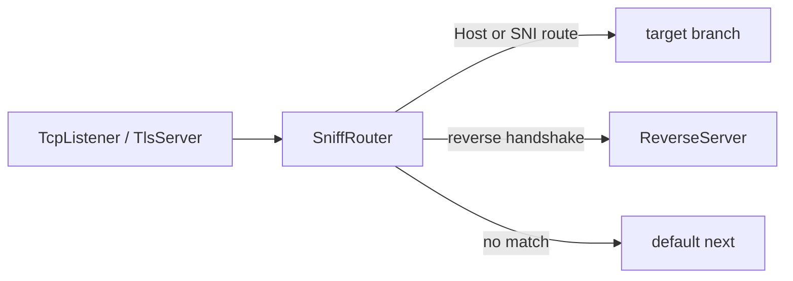

<!--
Documentation version: 106
Sync note: Any change to this file must also be applied to WaterWall/tunnels/SniffRouter/description.md, and both files must keep the same documentation version.
-->

# SniffRouter

`SniffRouter` is a layer-4 content router. It waits for the first upstream
payload of a connection, sniffs visible bytes, and sends that whole connection
to the first matching route.

It is simpler and more specialized than `Router`: use `SniffRouter` when the
decision can be made from HTTP/1 Host, TLS ClientHello SNI, or the
`ReverseClient`/`ReverseServer` reverse-link handshake. Use `Router` when you
need source IP, port, GeoIP, GeoSite, authenticated user, network type, or mixed
rule conditions.

## Mental Model

`SniffRouter` is a deferred branch selector:

- It does not forward upstream `Init` immediately.
- It waits for the first upstream payload.
- It buffers the first bytes while sniffing.
- It checks routes in JSON order.
- The first matching route wins.
- If no route matches, the connection uses top-level `next`.
- The selected branch is initialized and the buffered bytes are replayed to it.
- Later payloads keep using the same selected branch.



:::warning
`SniffRouter` needs client-side bytes before it can choose a route. Protocols
where the server must speak first cannot be routed until upstream payload
arrives.
:::

## Typical Placement

Route by decrypted HTTP/1 Host after TLS termination:

```text
TcpListener -> TlsServer -> SniffRouter
                              |-- host a.example.com -> backend_a
                              |-- host b.example.com -> backend_b
                              `-- default next       -> camouflage_site
```

Route by TLS SNI before TLS termination:

```text
TcpListener -> SniffRouter
                 |-- SNI a.example.com -> tls_site_a
                 |-- SNI b.example.com -> tls_site_b
                 `-- default next      -> default_tls_site
```

Split reverse tunnel traffic from a camouflage site after the stream is
decrypted:

```text
TcpListener -> TlsServer -> SniffRouter
                              |-- reverse handshake -> ReverseServer
                              `-- default next      -> TcpConnector nginx
```

Reverse detection must see the decrypted reverse handshake. If the route sits
before TLS termination, the handshake is encrypted and cannot match.

## Configuration Example

HTTP Host routing:

```json
{
  "name": "sniff-router",
  "type": "SniffRouter",
  "settings": {
    "routes": [
      {
        "domains": [
          "a.example.com",
          "b.example.com"
        ],
        "next": "example_backend"
      },
      {
        "domains": [
          "*.static.example.com"
        ],
        "next": "static_backend"
      }
    ]
  },
  "next": "default_backend"
}
```

TLS SNI routing:

```json
{
  "name": "sniff-router",
  "type": "SniffRouter",
  "settings": {
    "routes": [
      {
        "detection": "tls",
        "domains": [
          "site-a.example.com"
        ],
        "next": "tls_site_a"
      },
      {
        "detection": "tls",
        "domains": [
          "site-b.example.com"
        ],
        "next": "tls_site_b"
      }
    ]
  },
  "next": "default_tls_site"
}
```

## Required Fields

Top-level fields:

| Field | Type | Description |
| --- | --- | --- |
| `name` | string | User-chosen node name. Must be unique inside the config file. |
| `type` | string | Must be exactly `"SniffRouter"`. |
| `next` | string | Required. This is the fallback route when no configured route matches. |

`settings` may be omitted or empty. With no routes, all connections use
top-level `next`.

## Settings

| Setting | Type | Default | Description |
| --- | --- | --- | --- |
| `routes` | array | unset | Ordered list of sniff routes. If present, it must be a non-empty array. |
| `reverse-secret-length` | integer | `640` | Reverse handshake length for reverse detection. Must be in `1..1024`. |
| `reverse-secret` | ASCII string | unset | XOR secret used to derive the reverse handshake signature. Must match the Reverse nodes when used. |

Reverse handshake settings are parsed even when no reverse route exists, but
they matter only for routes whose `detection` includes `reverse`.

## Route Object

Each route object accepts:

| Field | Type | Required | Description |
| --- | --- | --- | --- |
| `domains` | string or array | Required for `http1` and `tls` detection. Optional for reverse-only routes. |
| `domain` | string | Alias for a single `domains` entry. Cannot be used together with `domains`. |
| `detection` | string or array | Optional. Default is `"http1"`. |
| `next` | string | Required. Target node name for matching connections. |
| `target` | string | Alias for route `next`. |

Detection values:

| Value | Meaning |
| --- | --- |
| `http1` | Sniff HTTP/1 request Host. This is the default. |
| `tls` | Sniff TLS ClientHello SNI. |
| `reverse` | Detect the `ReverseClient`/`ReverseServer` reverse-link handshake. |
| `reverse-tls` | Alias for `reverse`. |
| `reverse-handshake` | Alias for `reverse`. |

Removed values:

| Old value | Use instead |
| --- | --- |
| `http` | `http1` |
| `client-hello` | `tls` |
| `tls-client-hello` | `tls` |

If a route has both `reverse` and a domain-based detection mode, reverse
detection ignores `domains`, while HTTP/SNI detection still requires and uses
`domains`.

## Route Order

Routes are checked in JSON order. The first matching route wins.

```json
{
  "routes": [
    {
      "domain": "api.example.com",
      "next": "api_backend"
    },
    {
      "domain": "*.example.com",
      "next": "wildcard_backend"
    }
  ]
}
```

In this example, `api.example.com` reaches `api_backend` because the exact route
appears before the wildcard route. If the wildcard route came first, it would
catch `api.example.com` only if the wildcard pattern matched it; note that
`*.example.com` matches subdomains but not `example.com` itself.

## Domain Matching

Domain matching is case-insensitive. Configured domain patterns are normalized
to lowercase and trailing dots are removed.

Supported patterns:

| Pattern | Meaning |
| --- | --- |
| `example.com` | Exact match. |
| `*.example.com` | Matches subdomains such as `www.example.com`; does not match `example.com`. |
| `*` | Matches any non-empty Host/SNI value. |

Invalid domain patterns:

- empty strings
- `*.` without a suffix
- wildcard forms other than `*.example.com`
- URLs such as `https://example.com`
- host:port values such as `example.com:443`
- values containing `/` or `\`

HTTP Host values may include a port on the wire. The sniffer strips the port
before matching, so `Host: example.com:443` matches configured `example.com`.

## HTTP Host Detection

The default route detection is `http1`.

```json
{
  "domains": [
    "app.example.com"
  ],
  "next": "app_backend"
}
```

With `http1`, `SniffRouter` expects the first visible payload to be an HTTP/1
request and reads the `Host` header. It then matches that host against the route
domain patterns.

Use this after TLS termination if the inbound wire traffic is HTTPS:

```text
TcpListener -> TlsServer -> SniffRouter
```

HTTP/2 cleartext prefaces do not carry an HTTP/1 Host header, so they fall back
to `next` unless some other route detection matches.

## TLS SNI Detection

Use `detection: "tls"` to match the TLS ClientHello SNI:

```json
{
  "detection": "tls",
  "domains": [
    "*.example.com"
  ],
  "next": "tls_branch"
}
```

This mode is useful before TLS termination:

```text
TcpListener -> SniffRouter -> TlsServer
```

The TLS ClientHello must arrive within the bounded sniff window. If no SNI is
found, or the SNI does not match any route, the connection uses top-level
`next`.

## Reverse Detection

`reverse` detection recognizes the reverse-link handshake sent by
`ReverseClient` before a connection is handed to `ReverseServer`.

```json
{
  "name": "sniff-router",
  "type": "SniffRouter",
  "settings": {
    "routes": [
      {
        "detection": "reverse",
        "next": "reverse_server"
      }
    ]
  },
  "next": "tcp_to_nginx"
}
```

Use this when one TLS entry point carries both reverse tunnel traffic and a
camouflage website with the same SNI. Host/SNI routing cannot separate those
flows, but the reverse link has a recognizable content signature after TLS is
terminated.

Default reverse signature:

```text
640 bytes of 0xFF
```

If `reverse-secret-length` or `reverse-secret` is configured, SniffRouter derives
the expected handshake exactly like `ReverseClient` and `ReverseServer`: default
handshake bytes are repeated as needed and XORed with the ASCII bytes of
`reverse-secret`.

These settings must match the Reverse nodes:

```json
{
  "settings": {
    "reverse-secret-length": 640,
    "reverse-secret": "shared-secret",
    "routes": [
      {
        "detection": "reverse",
        "next": "reverse_server"
      }
    ]
  },
  "next": "camouflage_site"
}
```

Important reverse details:

- The handshake must be at the very start of the decrypted stream.
- SniffRouter only peeks; it replays the buffered bytes intact to
  `ReverseServer`.
- `ReverseServer` re-validates and strips the handshake.
- A reverse route ignores `domains`.
- If the first payload contains only a prefix of the reverse handshake,
  SniffRouter logs a warning and immediately uses the default `next` route.
- If a fronting proxy prepends a PROXY-protocol header, strip that header before
  SniffRouter. Otherwise the stream no longer starts with the reverse handshake.

## First-Payload Buffering

SniffRouter buffers initial upstream bytes until it can classify the connection.

HTTP Host and TLS SNI sniffing can ask for more bytes while the first request or
ClientHello is incomplete. The shared sniff window is bounded:

```text
8192 bytes
```

Reverse detection is stricter: a partial reverse-handshake prefix in the first
payload does not wait for more bytes. It falls back to top-level `next`.

After a route is selected, later payloads are forwarded directly to the selected
target or to the default `next`. The connection is not reclassified.

## Target Branches

Each route `next` or `target` is the name of a real node in the same config.

At chain construction time, SniffRouter folds route targets into its own chain
so that:

- target nodes get per-line state slots
- downstream traffic from target branches returns through SniffRouter
- lifecycle callbacks remain composable

Target rules:

- the target node must exist
- the target cannot be the SniffRouter itself
- the target branch must not already be bound to an incompatible previous node
- the target may be the same node as top-level `next`

Use a `Bridge` target when the branch lives elsewhere in the config.

## Lifecycle Behavior

Source-backed behavior:

| Callback | Behavior |
| --- | --- |
| upstream `Init` | Initializes SniffRouter line state only. It does not initialize a branch yet. |
| first upstream `Payload` | Buffers bytes, classifies routes, initializes selected target or default `next`, replays buffered bytes. |
| later upstream `Payload` | Goes directly to the selected target or default `next`. |
| upstream `Pause` / `Resume` | Forwarded only after a route has been selected. |
| upstream `Est` | Forwarded only to the default branch. Route targets are often adapter/server nodes where upstream `Est` is not valid. |
| upstream `Finish` | Destroys local line state and finishes the selected target/default branch if one exists. |
| downstream `Payload` / `Pause` / `Resume` / `Est` | Forwarded back to the previous node. |
| downstream `Finish` | Destroys local line state before forwarding finish to the previous node. |

## SniffRouter vs Router

Use `SniffRouter` when:

- you only need HTTP Host routing
- you only need TLS SNI routing
- you need reverse-handshake detection for a reverse tunnel sharing one TLS
  entrypoint with a camouflage site
- you want a small, content-only branch selector

Use `Router` when:

- you need source or destination IP/port conditions
- you need GeoIP or GeoSite
- you need username/password routing
- you need `protocol` or `attributes` combined with other conditions
- you need multiple conditions combined with AND

## Node Metadata

Source-backed metadata:

| Property | Value |
| --- | --- |
| node flags | `kNodeFlagChainHead | kNodeFlagChainEnd` |
| `can_have_prev` | `true` |
| `can_have_next` | `true` |
| `layer_group` | `kNodeLayer4` |
| `layer_group_prev_node` | `kNodeLayerAnything` |
| `layer_group_next_node` | `kNodeLayerAnything` |
| `required_padding_left` | `0` bytes |

SniffRouter does not prepend protocol headers and does not need left padding.
