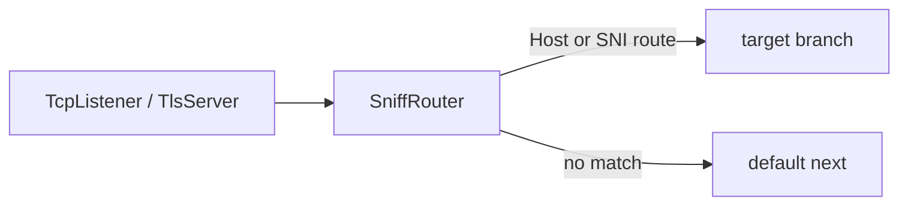

<!--
Documentation version: 154
Sync note: Any change to this file must also be applied to WaterWall/tunnels/SniffRouter/description.md and WaterWall-Docs/i18n/fa/docusaurus-plugin-content-docs/current/02-noderefs/SniffRouter.mdx, and all files must keep the same documentation version.
-->

# SniffRouter

`SniffRouter` is primarily a simple, convenient layer-4 routing node for common
domain-sniffing setups. It waits for the first upstream payload of a connection,
sniffs visible bytes, and sends that whole connection to the first matching
route.

Most HTTP/1 Host and TLS ClientHello SNI configurations can also be expressed
with the more flexible [`Router`](./Router.mdx) node. Use `SniffRouter` when you
want a short domain-to-destination configuration. Use `Router` for HTTP/2 or
HTTP/3 sniffing, source or destination IP/port matching, GeoIP/GeoSite,
authenticated identity, combined conditions, or other advanced routing needs.

## Mental Model

`SniffRouter` is a deferred branch selector:

- It does not forward upstream `Init` immediately.
- It waits for the first upstream payload.
- It buffers the first bytes while sniffing.
- It checks routes in JSON order.
- The first matching route wins.
- If no route matches, the connection uses top-level `next`.
- The selected branch is initialized and the buffered bytes are replayed to it.
- Later payloads keep using the same selected branch.



:::warning
`SniffRouter` needs client-side bytes before it can choose a route. Protocols
where the server must speak first cannot be routed until upstream payload
arrives.
:::

## Typical Placement

Route by decrypted HTTP/1 Host after TLS termination:

```text
TcpListener -> TlsServer -> SniffRouter
                              |-- host a.example.com -> backend_a
                              |-- host b.example.com -> backend_b
                              `-- default next       -> camouflage_site
```

Route by TLS SNI before TLS termination:

```text
TcpListener -> SniffRouter
                 |-- SNI a.example.com -> tls_site_a
                 |-- SNI b.example.com -> tls_site_b
                 `-- default next      -> default_tls_site
```

## Configuration Example

HTTP Host routing:

```json
{
  "name": "sniff-router",
  "type": "SniffRouter",
  "settings": {
    "routes": [
      {
        "domains": [
          "a.example.com",
          "b.example.com"
        ],
        "next": "example_backend"
      },
      {
        "domains": [
          "*.static.example.com"
        ],
        "next": "static_backend"
      }
    ]
  },
  "next": "default_backend"
}
```

TLS SNI routing:

```json
{
  "name": "sniff-router",
  "type": "SniffRouter",
  "settings": {
    "routes": [
      {
        "domains": [
          "site-a.example.com"
        ],
        "next": "tls_site_a"
      },
      {
        "domains": [
          "site-b.example.com"
        ],
        "next": "tls_site_b"
      }
    ]
  },
  "next": "default_tls_site"
}
```

Omitting `detection` enables both HTTP/1 Host and TLS ClientHello SNI sniffing
for that route. Set it explicitly to `"http1"` or `"tls"` only when the route
must use one of those methods exclusively.

## Required Fields

Top-level fields:

| Field | Type | Description |
| --- | --- | --- |
| `name` | string | User-chosen node name. Must be unique inside the config file. |
| `type` | string | Must be exactly `"SniffRouter"`. |
| `next` | string | Required. This is the fallback route when no configured route matches. |

`settings` may be omitted or empty. With no routes, all connections use
top-level `next`.

## Settings

| Setting | Type | Default | Description |
| --- | --- | --- | --- |
| `routes` | array | unset | Ordered list of sniff routes. If present, it must be a non-empty array. |

## Route Object

Each route object accepts:

| Field | Type | Required | Description |
| --- | --- | --- | --- |
| `domains` | string or array | Required. Domain patterns used by HTTP/1 Host and TLS SNI detection. |
| `domain` | string | Alias for a single `domains` entry. Cannot be used together with `domains`. |
| `detection` | string or array | Optional. Omitted means both `["http1", "tls"]`. |
| `next` | string | Required. Target node name for matching connections. |
| `target` | string | Alias for route `next`. |

Detection values:

| Value | Meaning |
| --- | --- |
| `http1` | Sniff HTTP/1 request Host. Enabled by default. |
| `tls` | Sniff TLS ClientHello SNI. Enabled by default. |

Removed values:

| Old value | Use instead |
| --- | --- |
| `http` | `http1` |
| `client-hello` | `tls` |
| `tls-client-hello` | `tls` |

## Route Order

Routes are checked in JSON order. The first matching route wins.

```json
{
  "routes": [
    {
      "domain": "api.example.com",
      "next": "api_backend"
    },
    {
      "domain": "*.example.com",
      "next": "wildcard_backend"
    }
  ]
}
```

In this example, `api.example.com` reaches `api_backend` because the exact route
appears before the wildcard route. If the wildcard route came first, it would
catch `api.example.com` only if the wildcard pattern matched it; note that
`*.example.com` matches subdomains but not `example.com` itself.

## Domain Matching

Domain matching is case-insensitive. Configured domain patterns are normalized
to lowercase and trailing dots are removed.

Supported patterns:

| Pattern | Meaning |
| --- | --- |
| `example.com` | Exact match. |
| `*.example.com` | Matches subdomains such as `www.example.com`; does not match `example.com`. |
| `*` | Matches any non-empty Host/SNI value. |

Invalid domain patterns:

- empty strings
- `*.` without a suffix
- wildcard forms other than `*.example.com`
- URLs such as `https://example.com`
- host:port values such as `example.com:443`
- values containing `/` or `\`

HTTP Host values may include a port on the wire. The sniffer strips the port
before matching, so `Host: example.com:443` matches configured `example.com`.

## HTTP Host Detection

HTTP/1 Host detection is enabled by default for every route whose `detection`
field is omitted.

```json
{
  "domains": [
    "app.example.com"
  ],
  "next": "app_backend"
}
```

With `http1`, `SniffRouter` expects the first visible payload to be an HTTP/1
request and reads the `Host` header. It then matches that host against the route
domain patterns.

Use this after TLS termination if the inbound wire traffic is HTTPS:

```text
TcpListener -> TlsServer -> SniffRouter
```

HTTP/2 cleartext prefaces do not carry an HTTP/1 Host header, so they fall back
to `next` unless some other route detection matches.

## TLS SNI Detection

TLS ClientHello SNI detection is also enabled by default when `detection` is
omitted:

```json
{
  "domains": [
    "*.example.com"
  ],
  "next": "tls_branch"
}
```

Use `"detection": "tls"` when this route should inspect only TLS and should
not also accept an HTTP/1 Host match.

This mode is useful before TLS termination:

```text
TcpListener -> SniffRouter -> TlsServer
```

The TLS ClientHello must arrive within the bounded sniff window. If no SNI is
found, or the SNI does not match any route, the connection uses top-level
`next`.

## First-Payload Buffering

SniffRouter buffers initial upstream bytes until it can classify the connection.

HTTP Host and TLS SNI sniffing can ask for more bytes while the first request or
ClientHello is incomplete. The shared sniff window is bounded:

```text
8192 bytes
```

Exact classification and buffering rules:
- Complete ClientHellos are parsed and classified first, even if larger than 8192 bytes.
- If an input is incomplete and the accumulated prefix reaches 8192 bytes, SniffRouter stops waiting and selects the default `next` branch.
- Incomplete ClientHellos below 8192 bytes remain unassigned; SniffRouter has no classification timer, so listener idle timeouts (e.g. `TcpListener`) govern the unassigned timeout.
- Initial bytes buffered during sniffing are replayed intact to the selected branch in FIFO stream order (callback and TCP packet segmentation are not preserved).

After a route is selected, later payloads are forwarded directly to the selected
target or to the default `next`. The connection is not reclassified.

## TLS SNI Routing and Nginx Camouflage

`SniffRouter` can be placed **before** `TlsServer` to inspect the TLS ClientHello SNI and route matching domains to a protected TLS termination pipeline, while falling back all other connections to a real cover service (such as an nginx HTTPS server).

```text
TcpListener :443 -> SniffRouter
                      |-- route (expected SNI) -> TlsServer -> VlessServer -> ...
                      `-- default (unmatched)  -> TcpConnector -> real nginx :443
```

Configuration example:

```json
{
  "name": "sniff-router",
  "type": "SniffRouter",
  "settings": {
    "routes": [
      {
        "domain": "vpn.example.com",
        "detection": "tls",
        "next": "protected-tls-server"
      }
    ]
  },
  "next": "nginx-fallback-connector"
}
```

### Key Deployment Aspects

- **Matching SNI**: Connections presenting a valid TLS ClientHello with an SNI matching the configured domain route to `protected-tls-server`.
- **Default Fallback**: Connections with mismatched SNI, absent SNI, unparseable input, or plaintext HTTP on the TLS port route to top-level `next` (`nginx-fallback-connector`).
- **Why a Real Nginx TLS Fallback**: Routing default traffic to a real nginx HTTPS listener ensures unknown SNI handshakes, no-SNI handshakes, and plaintext HTTP receive authentic nginx responses and error pages (such as HTTP 400 "The plain HTTP request was sent to HTTPS port"), avoiding synthetic handshake rejection fingerprints.
- See `tests/examples/vless_tls_sni_camouflage_server.json` for a complete server example.

## Target Branches

Each route `next` or `target` is the name of a real node in the same config.

At chain construction time, SniffRouter folds route targets into its own chain
so that:

- target nodes get per-line state slots
- downstream traffic from target branches returns through SniffRouter
- lifecycle callbacks remain composable

Target rules:

- the target node must exist
- the target cannot be the SniffRouter itself
- the target branch must not already be bound to an incompatible previous node
- the target may be the same node as top-level `next`

Use a `Bridge` target when the branch lives elsewhere in the config.

## Lifecycle Behavior

Source-backed behavior:

| Callback | Behavior |
| --- | --- |
| upstream `Init` | Initializes SniffRouter line state only. It does not initialize a branch yet. |
| first upstream `Payload` | Buffers bytes, classifies routes, initializes selected target or default `next`, replays buffered bytes. |
| later upstream `Payload` | Goes directly to the selected target or default `next`. |
| upstream `Pause` / `Resume` | Forwarded only after a route has been selected. |
| upstream `Est` | Forwarded only to the default branch. Route targets are often adapter/server nodes where upstream `Est` is not valid. |
| upstream `Finish` | Destroys local line state and finishes the selected target/default branch if one exists. |
| downstream `Payload` / `Pause` / `Resume` / `Est` | Forwarded back to the previous node. |
| downstream `Finish` | Destroys local line state before forwarding finish to the previous node. |

## SniffRouter vs Router

For basic HTTP/1 domain sniffing on a line where no earlier node supplied a
destination domain, the configurations are conceptually very similar. This
`SniffRouter` sends three domains to three separate destinations:

```json
{
  "name": "sniff-router",
  "type": "SniffRouter",
  "settings": {
    "routes": [
      { "domain": "one.example.com", "next": "destination_one" },
      { "domain": "two.example.com", "next": "destination_two" },
      { "domain": "three.example.com", "next": "destination_three" }
    ]
  },
  "next": "default_destination"
}
```

The equivalent `Router` configuration is:

```json
{
  "name": "router",
  "type": "Router",
  "settings": {
    "sniffing": ["http1"],
    "rules": [
      { "destination-domain": "one.example.com", "target": "destination_one" },
      { "destination-domain": "two.example.com", "target": "destination_two" },
      { "destination-domain": "three.example.com", "target": "destination_three" }
    ]
  },
  "next": "default_destination"
}
```

Both check entries in order and use top-level `next` as the fallback.
`SniffRouter` uses `domain`/`domains` plus route `next`; `Router` uses
`destination-domain` plus rule `target` and can add other conditions to the
same rule.

Use `SniffRouter` when:

- you only need HTTP Host routing
- you only need TLS SNI routing
- you want the shorter configuration for a straightforward domain split

Read the [`Router` documentation](./Router.mdx) when:

- you need HTTP/2 or QUIC/HTTP/3 domain sniffing
- you need source or destination IP/port conditions
- you need GeoIP or GeoSite
- you need username/password routing
- you need `protocol` or `attributes` combined with other conditions
- you need multiple conditions combined with AND or more flexible routing rules

## Node Metadata

SniffRouter does not prepend protocol headers and does not need left padding.

Source-backed metadata:

| Property | Value |
| --- | --- |
| node flags | `kNodeFlagNone` |
| `can_have_prev` | `true` |
| `can_have_next` | `true` |
| `layer_group` | `kNodeLayer4` |
| `layer_group_prev_node` | `kNodeLayer4` |
| `layer_group_next_node` | `kNodeLayer4` |
| `required_padding_left` | `0` bytes |

## Advanced: Reverse-Tunnel Handshake Routing

This feature is only for a reverse-tunneling topology that actually contains
`ReverseClient` and `ReverseServer`. It is not a general “send traffic backward”
mode and it does not reverse WaterWall callback directions. In a reverse tunnel,
`ReverseClient` opens spare outbound links and supplies a private handshake at
the start of each link; `ReverseServer` consumes those links on the remote side.
Ordinary chains without those nodes do not supply this handshake and should not
configure this detector.

Use this detector when one decrypted TLS entry point carries both those spare
links and an ordinary camouflage website with the same SNI. Host/SNI routing
cannot separate the two flows after decryption, but the private link handshake
can:

```text
TcpListener -> TlsServer -> SniffRouter
                              |-- private link handshake -> ReverseServer
                              `-- default next           -> TcpConnector nginx
```

The relevant settings are intentionally documented only in this advanced
section:

| Setting | Type | Default | Description |
| --- | --- | --- | --- |
| `reverse-secret-length` | integer | `640` | Private handshake length. Must be in `1..1024`. |
| `reverse-secret` | ASCII string | unset | XOR secret used to derive the private handshake signature. Must match both peer nodes. |

The route uses `"detection": "reverse"`. The values `"reverse-tls"` and
`"reverse-handshake"` are aliases. A route using only this detector does not
need `domain` or `domains`; any supplied domain patterns are ignored. If the
same route combines this detector with `http1` or `tls`, domain patterns remain
required for those domain-based methods.

```json
{
  "name": "sniff-router",
  "type": "SniffRouter",
  "settings": {
    "reverse-secret-length": 640,
    "reverse-secret": "shared-secret",
    "routes": [
      {
        "detection": "reverse",
        "next": "reverse_server"
      }
    ]
  },
  "next": "camouflage_site"
}
```

The default signature is 640 bytes of `0xFF`. When the length or secret is set,
SniffRouter derives the expected bytes exactly as `ReverseClient` and
`ReverseServer` do: it repeats the default bytes as needed and XORs them with
the ASCII secret. All three nodes must use identical values. These settings are
parsed even without a matching route, but affect only a route that enables this
detector.

Placement and buffering rules:

- Put SniffRouter after TLS termination so it sees the decrypted handshake.
- The handshake must start at byte zero of the decrypted stream.
- SniffRouter only peeks and replays the bytes intact; `ReverseServer`
  re-validates and removes them.
- The complete handshake must be present in the first payload. A partial prefix
  logs a warning and immediately selects top-level `next`.
- Strip any fronting proxy's PROXY-protocol header before SniffRouter.
- `Router` does not currently have this detector; this is a current capability
  difference, not a reason to use this setting in ordinary routing chains.
