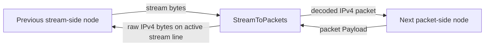

<!--
Documentation version: 106
Sync note: Any change to this file must also be applied to WaterWall/tunnels/StreamToPackets/description.md, and both files must keep the same documentation version.
-->

# StreamToPackets

`StreamToPackets` is the inverse adapter of `PacketsToStream`. It accepts a
normal stream line from the previous side, treats the stream as a raw
concatenation of IPv4 packets, reconstructs packet boundaries from the IPv4
total-length field, and forwards each packet to the next packet-oriented node.

The current implementation is IPv4-only and headerless:

```text
IPv4 packet bytes + IPv4 packet bytes + IPv4 packet bytes + ...
```

There is no 2-byte length prefix. Old documentation may call this node
`DataAsPacket`, but the current node type is `StreamToPackets`.

## What It Does

- Accepts a stream-oriented WaterWall line from the previous side.
- Stores one active stream line per worker for packet-side return writes.
- Buffers upstream stream bytes until a full IPv4 packet is available.
- Extracts packets using each IPv4 packet's total-length field.
- Optionally validates decoded packets before forwarding them to the packet side.
- Sends decoded packets upstream to the next packet-oriented node.
- Sends return packet payloads from the packet side back to the active stream
  line as raw IPv4 packets.
- Drops IPv6, non-IPv4 payloads, malformed IPv4 packets, and packet-side output
  when there is no active stream line.

This node rebuilds packet boundaries from a stream. It is not a TCP/UDP flow
reconstruction node; use `PacketsToConnection` for that.

## Typical Placement

Stream input to packet output:

```text
TcpListener -> StreamToPackets -> TunDevice
```

Paired with `PacketsToStream` on another server:

```text
server1: TunDevice -> PacketsToStream -> TcpConnector
server2: TcpListener -> StreamToPackets -> TunDevice
```

`StreamToPackets` expects the stream produced by `PacketsToStream` or another
peer that uses the same raw IPv4 concatenation format.

## Configuration Example

```json
{
  "name": "stream-to-packet",
  "type": "StreamToPackets",
  "settings": {
    "sensitive-mode": true,
    "packet-validation-level": "hard"
  },
  "next": "packet-node"
}
```

## Settings

Top-level fields:

| Field | Type | Required | Description |
| --- | --- | --- | --- |
| `name` | string | yes | User-chosen node name. Must be unique inside the config file. |
| `type` | string | yes | Must be exactly `"StreamToPackets"`. |
| `settings` | object | no | Optional settings object. |
| `next` | string | yes | Packet-oriented node that receives reconstructed packets. |

Optional `settings` fields:

| Setting | Type | Default | Description |
| --- | --- | --- | --- |
| `sensitive-mode` | boolean | `false` | Enables heartbeat handling for tagged IPv4 ping packets from `PacketsToStream`. |
| `packet-validation-level` | string | `"none"` | Validation mode for packets decoded from upstream stream data. Values: `"none"`, `"loose"`, `"hard"`. |

There are no `interval-ms` or `tolerance-ms` settings on `StreamToPackets`.
Those timers belong to `PacketsToStream`, which initiates the heartbeat.

## Wire Format

The stream contains complete IPv4 packets back-to-back:

```text
packet A: N bytes, where IPv4 total-length = N
packet B: M bytes, where IPv4 total-length = M
packet C: K bytes, where IPv4 total-length = K
```

`StreamToPackets` does not read a length prefix. It reads the IPv4 header,
trusts the total-length field only enough to know how many bytes make one
packet, and waits until the full packet is buffered.

Return packets from the packet side are written back to the active stream line
using the same raw IPv4 packet format.

## Flow Model



Direction summary:

| Direction | Behavior |
| --- | --- |
| stream side to packet side | Buffers bytes, extracts IPv4 packets, optionally validates them, then sends packets to the next node. |
| packet side back to stream side | Sends valid IPv4 packet payload back to the active stream line as raw bytes. |

## Active Stream Line And Packet-Line Bootstrap

`StreamToPackets` bridges between normal stream lines and persistent worker
packet lines.

At startup, it queues packet-line upstream `Init` on every worker so the next
packet-side tunnel sees the worker packet line after node-manager startup.

When an upstream stream line is initialized:

- `StreamToPackets` stores that line as the active stream line for the worker
- it initializes parser state for that stream line
- it clears the packet-line paused flag
- it sends downstream `Est` back to the previous stream side

If a later stream line replaces the active one on the same worker, return
packet payloads go to the newest active line.

## Packet Extraction

Incoming upstream stream data is appended to a per-stream read buffer. The
decoder:

1. waits for at least a minimum IPv4 header
2. checks whether the stream head looks like a plausible IPv4 packet
3. reads the IPv4 total-length field
4. waits until that many bytes are buffered
5. extracts exactly that many bytes as one packet
6. handles sensitive-mode ping packets if enabled
7. optionally validates the decoded packet
8. sends the packet to the next packet-oriented node

If the stream head cannot be a valid IPv4 packet start, the decoder scans a
bounded resync window and discards bytes until the next plausible IPv4 header.
Forward progress is guaranteed, so malformed input cannot stall the parser.

Current read-stream overflow limit:

```text
65536 * 2 bytes
```

If buffered data exceeds that size, the read stream is emptied.

## Packet Validation

`packet-validation-level` applies to packets decoded from upstream stream data
before they are emitted to the packet side.

| Level | Behavior |
| --- | --- |
| `"none"` | Default. No configurable validation after extraction. The extractor still performs light structural checks so it can find packet boundaries. |
| `"loose"` | Drops non-IPv4 and malformed IPv4 packets. Checks minimum header, version, IPv4 header length, and total length matching packet length. |
| `"hard"` | Applies `loose`, verifies IPv4 header checksum, and verifies TCP, UDP, and ICMP checksums for non-fragmented packets. IPv4 UDP checksum `0` is accepted. |

For fragmented IPv4 packets in `"hard"` mode, only the IPv4 header checksum is
verified. Transport checksums are skipped because they require reassembly.

When validation drops a decoded packet, the tunnel writes a warning log with the
validation level and reason.

Packet-side return payloads are not processed by this configurable validation
stage, but they still must be self-consistent IPv4 packets before being written
to the stream line.

## Return Path To Stream

When packet payload arrives from the next side:

- the tunnel finds the active stream line for the worker packet line
- if no active stream line exists, the packet is dropped
- if the active stream line is paused or dead, the packet is dropped
- if the payload is larger than `kMaxAllowedPacketLength`, it is dropped
- if checksum recalculation is requested on the packet line, the full IPv4
  packet checksum is recalculated
- if the payload is not a self-consistent IPv4 packet, it is dropped
- otherwise the raw IPv4 bytes are sent downstream to the previous stream line

This preserves the same headerless stream format used by `PacketsToStream`.

## Sensitive Mode

`StreamToPackets` is the responder side for sensitive-mode heartbeat.

When enabled:

- if a decoded upstream packet is a minimal IPv4 packet with protocol `0xFD`
  and a 5-byte payload filled with `0xFF`, it is treated as a heartbeat ping
- the ping is not forwarded to the packet side
- `StreamToPackets` sends a matching heartbeat pong back on the same stream line
- the pong is a minimal IPv4 packet with protocol `0xFD` and a 5-byte payload
  filled with `0xDD`
- the pong is not forwarded to the packet side

`StreamToPackets` does not own heartbeat timers. Timeout and stream-line
recreation are handled by `PacketsToStream`.

## Pause, Resume, And Finish

Callback behavior:

| Callback received by `StreamToPackets` | Behavior |
| --- | --- |
| upstream `Init` | Stores the incoming stream line as the active line for that worker and sends downstream `Est` back to the previous side. |
| upstream `Payload` | Buffers stream bytes, extracts IPv4 packets, handles heartbeat ping, validates, and forwards packets to the next node. |
| upstream `Pause` | Marks the active stream line paused for packet-side return writes. |
| upstream `Resume` | Clears the paused flag for the active stream line. |
| upstream `Finish` | Clears the active stream line if it matches and destroys parser state for that stream line. |
| upstream `Est` | Warning log; not expected. |
| downstream `Payload` | Sends valid IPv4 packet payload back to the active stream line. |
| downstream `Est` | No-op. Packet tunnels usually do not send `Est`. |
| downstream `Init` | Fatal guard; invalid direction. |
| downstream `Finish` | Fatal guard; invalid direction. |
| downstream `Pause` / `Resume` | Warning log; not expected from packet side. |

When the active stream line is paused, return packet output toward the stream is
dropped rather than queued.

## Checksum Recalculation

If `line->recalculate_checksum` is set on the packet line and the payload is
IPv4, `StreamToPackets` recalculates the full IPv4 packet checksum before
writing it back to the active stream line, then clears the flag.

## Node Metadata

Source-backed metadata:

| Property | Value |
| --- | --- |
| node flags | `kNodeFlagNone` |
| `can_have_prev` | `true` |
| `can_have_next` | `true` |
| `layer_group` | Layer 3 and layer 4 (`kNodeLayer3`, `kNodeLayer4`) |
| `layer_group_prev_node` | `kNodeLayerAnything` |
| `layer_group_next_node` | `kNodeLayerAnything` |
| `required_padding_left` | `0` |

The tunnel does not prepend bytes, so it has no extra left-padding requirement.

## Practical Notes

- Pair it with `PacketsToStream` on the opposite side.
- Do not feed it an older 2-byte-prefix packet stream; current parsing uses the
  IPv4 total-length field.
- Use `packet-validation-level: "hard"` when you want stronger validation of
  packets decoded from the stream.
- Return packet output is lossy while the active stream line is paused or absent.
- Use `PacketsToConnection` instead when the goal is TCP/UDP flow
  reconstruction rather than packet boundary restoration.
