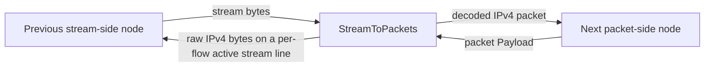

<!--
Documentation version: 152
Sync note: Any change to this file must also be applied to WaterWall/tunnels/StreamToPackets/description.md and WaterWall-Docs/i18n/fa/docusaurus-plugin-content-docs/current/02-noderefs/StreamToPackets.mdx, and all files must keep the same documentation version.
-->

# StreamToPackets

`StreamToPackets` is the inverse adapter of `PacketsToStream`. It accepts a
normal stream line from the previous side, treats the stream as a raw
concatenation of IPv4 packets, reconstructs packet boundaries from the IPv4
total-length field, and forwards each packet to the next packet-oriented node.

The current implementation is IPv4-only and headerless:

```text
IPv4 packet bytes + IPv4 packet bytes + IPv4 packet bytes + ...
```

There is no 2-byte length prefix. Old documentation may call this node
`DataAsPacket`, but the current node type is `StreamToPackets`.

## What It Does

- Accepts a stream-oriented WaterWall line from the previous side.
- Tracks one active source IP for the whole node; several validated stream lines
  from that IP carry traffic together.
- Buffers upstream stream bytes until a full IPv4 packet is available.
- Extracts packets using each IPv4 packet's total-length field.
- Optionally validates decoded packets before forwarding them to the packet side.
- Restores inner-flow worker affinity before handing a decoded packet to the
  packet chain.
- Sends decoded packets upstream to the next packet-oriented node.
- Sends return packet payloads from the packet side back to one active stream
  line chosen per inner flow, as raw IPv4 packets.
- Drops IPv6, non-IPv4 payloads, malformed IPv4 packets, and packet-side output
  when no active, unpaused stream line exists.

This node rebuilds packet boundaries from a stream. It is not a TCP/UDP flow
reconstruction node; use `PacketsToConnection` for that.

## Typical Placement

Stream input to packet output:

```text
TcpListener -> StreamToPackets -> TunDevice
```

Paired with `PacketsToStream` on another server:

```text
server1: TunDevice -> PacketsToStream -> TcpConnector
server2: TcpListener -> StreamToPackets -> TunDevice
```

`StreamToPackets` expects the stream produced by `PacketsToStream` or another
peer that uses the same raw IPv4 concatenation format.

## Configuration Example

```json
{
  "name": "stream-to-packet",
  "type": "StreamToPackets",
  "settings": {
    "sensitive-mode": true,
    "packet-validation-level": "hard"
  },
  "next": "packet-node"
}
```

## Settings

Top-level fields:

| Field | Type | Required | Description |
| --- | --- | --- | --- |
| `name` | string | yes | User-chosen node name. Must be unique inside the config file. |
| `type` | string | yes | Must be exactly `"StreamToPackets"`. |
| `settings` | object | no | Optional settings object. |
| `next` | string | yes | Packet-oriented node that receives reconstructed packets. |

Optional `settings` fields:

| Setting | Type | Default | Description |
| --- | --- | --- | --- |
| `sensitive-mode` | boolean | `false` | Enables heartbeat handling for tagged IPv4 ping packets from `PacketsToStream`. |
| `packet-validation-level` | string | `"none"` | Validation mode for packets decoded from upstream stream data. Values: `"none"`, `"loose"`, `"hard"`. |

There are no `interval-ms` or `tolerance-ms` settings on `StreamToPackets`.
Those timers belong to `PacketsToStream`, which initiates the heartbeat.

## Wire Format

The stream contains complete IPv4 packets back-to-back:

```text
packet A: N bytes, where IPv4 total-length = N
packet B: M bytes, where IPv4 total-length = M
packet C: K bytes, where IPv4 total-length = K
```

`StreamToPackets` does not read a length prefix. It reads the IPv4 header,
trusts the total-length field only enough to know how many bytes make one
packet, and waits until the full packet is buffered.

Return packets from the packet side are written back to one of the active source's
stream lines using the same raw IPv4 packet format.

## Flow Model



Direction summary:

| Direction | Behavior |
| --- | --- |
| stream side to packet side | Buffers bytes, extracts IPv4 packets, optionally validates them, then sends packets to the next node. |
| packet side back to stream side | Selects one active, unpaused stream line per inner flow and sends the valid IPv4 packet payload back on it as raw bytes. |

## Active Source, Line Pool, And Packet-Line Bootstrap

`StreamToPackets` bridges between normal stream lines and persistent worker
packet lines.

At startup, it queues packet-line upstream `Init` on every worker so the next
packet-side tunnel sees the worker packet line after node-manager startup.

### Source identity

Ownership is global to the node, not per worker: at most one concrete source IP
is active at a time. The identity is the source IP alone. The port is excluded
deliberately, because `TcpListener` stores the local listener port there and
reconnects use fresh ephemeral ports. Lines without a concrete source IP - a
directly composed in-process `PacketsToStream -> StreamToPackets` pair, for
example - share one explicit anonymous identity, so those compositions keep
working; two anonymous peers cannot be told apart.

### Candidates and activation

When an upstream stream line is initialized:

- `StreamToPackets` initializes parser state for that line
- it registers the line as a **candidate**
- it sends downstream `Est` back to the previous stream side

A candidate is tracked but never selectable. It is activated by its first valid
decoded IPv4 packet, or by a valid sensitive-mode heartbeat. Malformed bytes,
overflow, and failed validation are never protocol proof, so they can neither
activate a candidate nor change the active source.

### Ownership transitions

| Situation | Result |
| --- | --- |
| No active source | The validated candidate becomes the active source and opens a new source generation. |
| Same source as the active one | The line joins the existing generation. All validated lines from that IP stay usable together. |
| A different source | **Validated newest source wins.** A new generation is published, and every line of the previous source, including idle candidates, is closed on its own worker through the previous side. |
| The last active line finishes | The active source is cleared and return traffic is dropped until a new line is validated. |

A line evicted by a takeover can never reclaim ownership, even if one of its
payload callbacks was already running. A genuinely new connection from the old IP
can take over again after producing valid traffic, so put authentication or
allowlisting in front of this node on untrusted listeners.

Once the node manager begins stopping this instance, no line may be registered
and no candidate may be promoted. Lines that are already active keep draining, so
a shutdown never starts a new ownership epoch or queues eviction work onto
workers that are already going away.

An evicted line is closed by a task on its own worker. If that task cannot be
posted for a reason other than shutdown - an exhausted message pool, a loop that
refuses a wakeup - and the takeover is running on that line's own worker, it is
closed there instead. If it is not, there is no second channel to that worker and
no way to close the line, so the node fails closed: it requests an orderly
program shutdown, falling back to an immediate abort if worker 0 will not take
the handoff. An old-source connection is never left running.

## Inner-Flow Worker Affinity

The worker that owns an outer connection is chosen by the socket manager and says
nothing about which worker owns an inner IP flow, so `StreamToPackets` re-derives
affinity from the decoded packet itself:

1. compute the shared symmetric flow hash of the inner packet
2. take `packet_line[hash % workers]`
3. forward directly when that is the current worker, otherwise queue the packet to
   the target worker

Both directions of one flow produce the same hash, so forward and reverse traffic
stay on the same packet worker. A decoded packet whose flow cannot be hashed is
logged and dropped rather than round-robined, because its stateful worker
ownership cannot be established.

## Packet Extraction

Incoming upstream stream data is appended to a per-stream read buffer. The
decoder:

1. waits for at least a minimum IPv4 header
2. checks whether the stream head looks like a plausible IPv4 packet
3. reads the IPv4 total-length field
4. waits until that many bytes are buffered
5. extracts exactly that many bytes as one packet
6. handles sensitive-mode ping packets if enabled
7. optionally validates the decoded packet
8. sends the packet to the next packet-oriented node

If the stream head cannot be a valid IPv4 packet start, the decoder scans a
bounded resync window and discards bytes until the next plausible IPv4 header.
Forward progress is guaranteed, so malformed input cannot stall the parser.

Current read-stream overflow limit:

```text
65536 * 2 bytes
```

If buffered data exceeds that size, the read stream is emptied.

## Packet Validation

`packet-validation-level` applies to packets decoded from upstream stream data
before they are emitted to the packet side.

| Level | Behavior |
| --- | --- |
| `"none"` | Default. No configurable validation after extraction. The extractor still performs light structural checks so it can find packet boundaries. |
| `"loose"` | Drops non-IPv4 and malformed IPv4 packets. Checks minimum header, version, IPv4 header length, and total length matching packet length. |
| `"hard"` | Applies `loose`, verifies IPv4 header checksum, and verifies TCP, UDP, and ICMP checksums for non-fragmented packets. IPv4 UDP checksum `0` is accepted. |

For fragmented IPv4 packets in `"hard"` mode, only the IPv4 header checksum is
verified. Transport checksums are skipped because they require reassembly.

When validation drops a decoded packet, the tunnel writes a warning log with the
validation level and reason.

Packet-side return payloads are not processed by this configurable validation
stage, but they still must be self-consistent IPv4 packets before being written
to the stream line.

## Return Path To Stream

When packet payload arrives from the next side:

- if the payload is larger than `kMaxAllowedPacketLength`, it is dropped
- if checksum recalculation is requested on the packet line, the full IPv4
  packet checksum is recalculated
- if the payload is not a self-consistent IPv4 packet, it is dropped
- the symmetric flow hash of the packet selects one carrier by **rendezvous
  hashing** over the active, unpaused lines of the current source generation
- if no such line exists, the packet is dropped; candidates, paused lines, and
  lines from a superseded generation are never used as a fallback
- otherwise the raw IPv4 bytes are sent downstream on that line, on that line's
  own worker

While the eligible pool is unchanged, one flow always selects the same line, and
the reverse tuple selects the same line as the forward one. Different flows spread
across the pool, including flows that share a packet worker.

Adding, pausing, resuming or removing a line changes the eligible pool and can
move some flows to a different carrier, so a small amount of reordering is
possible around those transitions: a packet sent on the new carrier can overtake
one still in flight on the old one. This is a packet path, and the inner protocol
owns ordering exactly as it does over any network. A peer that needs strictly
ordered delivery of the packets it receives back must not depend on this node
while stream lines are joining or leaving. Per-packet round-robin is never used.

This preserves the same headerless stream format used by `PacketsToStream`.

## Sensitive Mode

`StreamToPackets` is the responder side for sensitive-mode heartbeat.

When enabled:

- if a decoded upstream packet is a minimal IPv4 packet with protocol `0xFD`
  and a 5-byte payload filled with `0xFF`, it is treated as a heartbeat ping
- the ping is not forwarded to the packet side
- `StreamToPackets` sends a matching heartbeat pong back on the same stream line
- the pong is a minimal IPv4 packet with protocol `0xFD` and a 5-byte payload
  filled with `0xDD`
- the pong is not forwarded to the packet side

`StreamToPackets` does not own heartbeat timers. Timeout and stream-line
recreation are handled by `PacketsToStream`.

## Pause, Resume, And Finish

Callback behavior:

| Callback received by `StreamToPackets` | Behavior |
| --- | --- |
| upstream `Init` | Registers the incoming stream line as a candidate and sends downstream `Est` back to the previous side. |
| upstream `Payload` | Buffers stream bytes, extracts IPv4 packets, handles heartbeat ping, validates, and forwards packets to the next node. |
| upstream `Pause` | Marks that one stream line paused, excluding it from new flow selection. Other active lines are unaffected. |
| upstream `Resume` | Clears that line's paused flag, making it selectable again. |
| upstream `Finish` | Removes that line from the registry and destroys its parser state, sending nothing back toward the sender. Clears the active source when it was the last active line. |
| upstream `Est` | Warning log; not expected. |
| downstream `Payload` | Selects one active stream line per inner flow and sends the valid IPv4 packet payload back on it. |
| downstream `Est` | No-op. Packet tunnels usually do not send `Est`. |
| downstream `Init` | Fatal guard; invalid direction. |
| downstream `Finish` | Fatal guard; invalid direction. |
| downstream `Pause` / `Resume` | Warning log; not expected from packet side. |

A paused line is skipped and its flows move to the rest of the pool. When every
active line is paused, return packet output is dropped rather than queued into an
unbounded global buffer.

Incoming stream lines are borrowed: `StreamToPackets` never destroys one, and it
never finishes or destroys a worker packet line. A takeover closes an old-source
line by running a task on that line's own worker and finishing it toward the
previous side, which is the owner that performs the destruction.

## Checksum Recalculation

If `line->recalculate_checksum` is set on the packet line and the payload is
IPv4, `StreamToPackets` recalculates the full IPv4 packet checksum before
writing it back to the selected stream line, then clears the flag.

## Practical Notes

- Pair it with `PacketsToStream` on the opposite side.
- Do not feed it an older 2-byte-prefix packet stream; current parsing uses the
  IPv4 total-length field.
- Use `packet-validation-level: "hard"` when you want stronger validation of
  packets decoded from the stream.
- Return packet output is lossy while every active line is paused, or while there
  is no active source at all.
- Return traffic may arrive on any line of the active source's pool, so the peer
  must accept a decoded packet on any of its lines. `PacketsToStream` does.
- Ownership is one source IP for the whole node. Put authentication or
  allowlisting in front of it on untrusted listeners.
- Use `PacketsToConnection` instead when the goal is TCP/UDP flow
  reconstruction rather than packet boundary restoration.

## Node Metadata

The tunnel does not prepend bytes, so it has no extra left-padding requirement.

Source-backed metadata:

| Property | Value |
| --- | --- |
| node flags | `kNodeFlagNone` |
| `can_have_prev` | `true` |
| `can_have_next` | `true` |
| `layer_group` | `kNodeLayer3` &#124; `kNodeLayer4` |
| `layer_group_prev_node` | `kNodeLayer4` |
| `layer_group_next_node` | `kNodeLayer3` |
| `required_padding_left` | `0` bytes |
