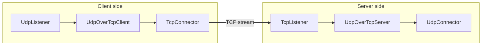

<!--
Documentation version: 107
Sync note: Any change to this file must also be applied to WaterWall/tunnels/UdpOverTcpClient/description.md, and both files must keep the same documentation version.
-->

# UdpOverTcpClient

`UdpOverTcpClient` carries UDP-style packet payloads over a TCP-style byte stream. It preserves packet boundaries by
prefixing each outbound payload with a 2-byte length field before sending it to the next stream-facing node.

It is normally paired with `UdpOverTcpServer` on the remote side.

## Why This Exists

UDP is message-oriented. TCP is stream-oriented. If a UDP packet is sent directly through a TCP stream, the receiver
cannot know where one original packet ends and the next begins.

`UdpOverTcpClient` solves that by framing each packet:

```text
2-byte length prefix + original packet payload
```

The remote `UdpOverTcpServer` reads the stream, reconstructs complete frames, removes the 2-byte prefix, and emits the
original packet payloads again.

## Typical Placement

Client side:

```text
UdpListener -> UdpOverTcpClient -> TcpConnector
UdpListener -> UdpOverTcpClient -> TlsClient -> TcpConnector
UdpListener -> UdpOverTcpClient -> EncryptionClient -> TcpConnector
TcpUdpListener -> UdpOverTcpClient -> TcpConnector
```

Server side:

```text
TcpListener -> UdpOverTcpServer -> UdpConnector
TcpListener -> TlsServer -> UdpOverTcpServer -> UdpConnector
TcpListener -> EncryptionServer -> UdpOverTcpServer -> UdpConnector
```

The node before `UdpOverTcpClient` is usually packet-facing, and the node after it must provide a reliable stream path.

## Flow Example



This is the common pattern for carrying UDP applications, such as DNS or WireGuard-like UDP traffic, across a TCP-only
path.

## Basic Example

```json
{
  "name": "udp-over-tcp-client",
  "type": "UdpOverTcpClient",
  "settings": {},
  "next": "stream-out"
}
```

Matching stream connector:

```json
{
  "name": "stream-out",
  "type": "TcpConnector",
  "settings": {
    "address": "198.51.100.10",
    "port": 443,
    "nodelay": true
  }
}
```

## Required Fields

Top-level fields:

| Field | Type | Description |
| --- | --- | --- |
| `name` | string | User-chosen node name. Must be unique inside the config file. |
| `type` | string | Must be exactly `"UdpOverTcpClient"`. |
| `next` | string | The stream-facing node that carries framed bytes. Required in normal use. |

`settings` can be `{}`. The current implementation does not read any tunnel-specific settings.

## Optional Settings

There are no tunnel-specific optional settings in the current implementation.

Socket, TLS, encryption, routing, or destination behavior belongs to the surrounding nodes, such as `TcpConnector`,
`TlsClient`, `EncryptionClient`, `UdpListener`, or `TcpUdpListener`.

## Framing Model

For each upstream payload from the previous node, `UdpOverTcpClient` prepends a 2-byte unsigned big-endian payload length
and forwards the result upstream to the next node.

```text
00 2a <42 bytes of packet payload>
```

On the downstream return path, bytes from the next stream node are accumulated in an internal read stream. When a full
length-prefixed frame is available, the 2-byte header is removed and the recovered payload is forwarded downstream to the
previous node.

The length prefix is transport framing. It is not part of the original UDP payload.

## Protocol Marker

The normal packet frame uses a non-zero length. Length `0` is reserved for an internal protocol marker:

```text
00 00 <protocol-byte>
```

During upstream `Init`, the client checks the line source protocol:

| Source protocol | Marker behavior |
| --- | --- |
| exact UDP | No marker is sent. The server will default the reconstructed destination protocol to UDP when it sees the first data frame. |
| exact TCP | Sends a marker with `IP_PROTO_TCP`. |
| other or ambiguous | Sends a marker with `IP_PROTO_UDP`. |

This marker lets `UdpOverTcpServer` set the destination protocol before it initializes the next node. It is especially
useful in mixed-protocol chains that end in `TcpUdpConnector`.

## Packet Size Limit

The maximum payload accepted by the current implementation is:

```text
65535 - 20 - 8 - 2 = 65505 bytes
```

The `2` is the `UdpOverTcp` length header. Packets larger than this limit are logged and dropped. Empty payloads are
treated as invalid in debug builds.

## Buffering And Overflow

Incoming stream bytes from the next node are buffered until at least one complete frame can be decoded.

The current read-stream overflow threshold is:

```text
2 * kMaxAllowedUDPPacketLength
```

If the buffered stream grows beyond that threshold, the implementation logs a warning and empties the read stream. It
does not close the line only because of this overflow.

## Lifecycle Behavior

On upstream `Init`, the client:

1. initializes its per-line read stream
2. forwards upstream `Init` to the next node
3. sends the optional protocol marker when needed

On upstream payload, it frames the previous node's packet and sends it to the next stream side.

On downstream payload, it decodes framed bytes from the stream side and forwards recovered packets back to the previous
node.

On `Finish` from either direction, it destroys its local line state and forwards `Finish` in the matching WaterWall
direction. It does not call `lineDestroy()`.

`UpStreamEst` and `DownStreamInit` are disabled in the current implementation.

## Padding

The node prepends the 2-byte frame header using `sbufShiftLeft()`, so it advertises:

```text
required_padding_left = 2
```

Do not remove this padding requirement from chain calculations; the framing path depends on it.

## Node Metadata

| Property | Value |
| --- | --- |
| Node flag | `kNodeFlagNone` |
| Previous node | Allowed, required in normal use |
| Next node | Allowed, required in normal use |
| Layer group | `kNodeLayer4` |
| `required_padding_left` | `2` |
| Line state | read stream buffer |

## Common Mistakes

- Do not use `UdpOverTcpClient` without `UdpOverTcpServer` on the remote side.
- Do not place a packet-only node after the client; the next side receives framed stream bytes.
- Do not expect this node to create a TCP connection by itself; use `TcpConnector` or another stream transport after it.
- Do not treat the 2-byte header as part of the original UDP payload.
- Do not send packets larger than `65505` bytes.
