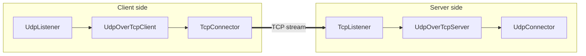

<!--
Documentation version: 152
Sync note: Any change to this file must also be applied to WaterWall/tunnels/UdpOverTcpClient/description.md and WaterWall-Docs/i18n/fa/docusaurus-plugin-content-docs/current/02-noderefs/UdpOverTcpClient.mdx, and all files must keep the same documentation version.
-->

# UdpOverTcpClient

`UdpOverTcpClient` carries UDP datagrams over a TCP byte stream. It preserves packet boundaries by
prefixing each outbound payload with a 2-byte length field before sending it to the next stream-facing node.

It is normally paired with `UdpOverTcpServer` on the remote side.

## Why This Exists

UDP is message-oriented. TCP is stream-oriented. If a UDP packet is sent directly through a TCP stream, the receiver
cannot know where one original packet ends and the next begins.

`UdpOverTcpClient` solves that by framing each packet:

```text
2-byte length prefix + original packet payload
```

The remote `UdpOverTcpServer` reads the stream, reconstructs complete frames, removes the 2-byte prefix, and emits the
original packet payloads again.

## Typical Placement

Client side:

```text
UdpListener -> UdpOverTcpClient -> TcpConnector
UdpListener -> UdpOverTcpClient -> TlsClient -> TcpConnector
UdpListener -> UdpOverTcpClient -> EncryptionClient -> TcpConnector
TcpUdpListener -> Router (UDP branch) -> UdpOverTcpClient -> TcpConnector
```

Server side:

```text
TcpListener -> UdpOverTcpServer -> UdpConnector
TcpListener -> TlsServer -> UdpOverTcpServer -> UdpConnector
TcpListener -> EncryptionServer -> UdpOverTcpServer -> UdpConnector
```

The node before `UdpOverTcpClient` is usually packet-facing, and the node after it must provide a reliable stream path.

## Flow Example


```mermaid
flowchart LR
    subgraph ClientSide["Client side"]
      direction LR
      UL[UdpListener] --> UOTC[UdpOverTcpClient] --> TC[TcpConnector]
    end

    subgraph ServerSide["Server side"]
      direction LR
      TL[TcpListener] --> UOTS[UdpOverTcpServer] --> UC[UdpConnector]
    end

    TC == "TCP stream" ==> TL
```

This is the common pattern for carrying UDP applications, such as DNS or WireGuard-like UDP traffic, across a TCP-only
path.

## Basic Example

```json
{
  "name": "udp-over-tcp-client",
  "type": "UdpOverTcpClient",
  "settings": {},
  "next": "stream-out"
}
```

Matching stream connector:

```json
{
  "name": "stream-out",
  "type": "TcpConnector",
  "settings": {
    "address": "198.51.100.10",
    "port": 443,
    "nodelay": true
  }
}
```

## Required Fields

Top-level fields:

| Field | Type | Description |
| --- | --- | --- |
| `name` | string | User-chosen node name. Must be unique inside the config file. |
| `type` | string | Must be exactly `"UdpOverTcpClient"`. |
| `next` | string | The stream-facing node that carries framed bytes. Required in normal use. |

`settings` can be `{}`. The current implementation does not read any tunnel-specific settings.

## Optional Settings

There are no tunnel-specific optional settings in the current implementation.

Socket, TLS, encryption, routing, or destination behavior belongs to the surrounding nodes, such as `TcpConnector`,
`TlsClient`, `EncryptionClient`, `UdpListener`, or `TcpUdpListener`.

## Framing Model

For each upstream payload from the previous node, `UdpOverTcpClient` prepends a 2-byte unsigned big-endian payload length
and forwards the result upstream to the next node.

```text
00 2a <42 bytes of packet payload>
```

On the downstream return path, bytes from the next stream node are accumulated in an internal read stream. When a full
length-prefixed frame is available, the 2-byte header is removed and the recovered payload is forwarded downstream to the
previous node.

The length prefix is transport framing. It is not part of the original UDP payload.

Each payload callback on the datagram-facing side represents one UDP datagram. These nodes always carry
UDP payloads; the source protocol metadata does not change their framing. Mixed listeners must route TCP
traffic through a separate path before the client.

## Packet Size Limit

The maximum outbound UDP datagram size is:

```text
65535 - 20 - 8 - 2 = 65505 bytes
```

Datagrams larger than this limit are dropped intact. Empty outbound payloads violate the existing Debug
invariant; Release drops them. An incoming zero-length frame is invalid and closes the carrier.

## Buffering And Overflow

Incoming stream bytes from the next node are buffered until complete frames can be decoded.

The incomplete read-stream overflow threshold is:

```text
2 * kMaxAllowedUDPPacketLength = 131010 bytes
```

Complete frames drain before the incomplete suffix is checked. Retained buffer charge is capped at 4 MiB,
with beneficial compaction attempted first. Malformed frames, allocation refusal or exhausted storage close
the carrier through its owner. Decoder reentry shares a 2 MiB byte limit and 4 MiB charge limit with its
retained stream. The parser never discards arbitrary stream bytes to continue.

## Lifecycle Behavior

On upstream `Init`, the client initializes its per-line framing state and immediately forwards upstream
`Init` to the next node. Transport Est, Pause and Resume are forwarded promptly.

On upstream payload, it frames the previous node's datagram and sends it to the next stream side.
On downstream payload, it decodes framed bytes and forwards recovered datagrams back to the previous node.

On `Finish` from either direction, it destroys its local line state and forwards `Finish` away from the
sender in the matching WaterWall direction. It does not call `lineDestroy()`.

`UpStreamEst` and `DownStreamInit` are disabled in the current implementation.

## Splice Support

Both nodes accept ordinary buffers and private-pipe bodies. Each outbound UDP datagram keeps its body,
gains a resident two-byte length prefix, and is forwarded in one callback. Oversized datagrams are dropped
intact. The decoder caches only the two-byte length header and extracts each complete datagram as one owned
buffer, with ordinary fallback when pipe resources are unavailable.

UDP datagram boundaries remain intact, and the TCP carrier remains eligible for splice. Any UDP socket
materialization fallback belongs to the UDP sender. Complete frames in an admitted stream input continue
after Pause; Finish or admission refusal stops processing.

## Padding

The node prepends the 2-byte frame header using `sbufShiftLeft()`, so it advertises:

```text
required_padding_left = 2
```

Do not remove this padding requirement from chain calculations; the framing path depends on it.

## Common Mistakes

- Do not use `UdpOverTcpClient` without `UdpOverTcpServer` on the remote side.
- Do not place a packet-only node after the client; the next side receives framed stream bytes.
- Do not expect this node to create a TCP connection by itself; use `TcpConnector` or another stream transport after it.
- Do not treat the 2-byte header as part of the original UDP payload.
- Do not send UDP datagrams larger than `65505` bytes.

## Node Metadata

Source-backed metadata:

| Property | Value |
| --- | --- |
| node flags | `kNodeFlagSupportsSplice` |
| `can_have_prev` | `true` |
| `can_have_next` | `true` |
| `layer_group` | `kNodeLayer4` |
| `layer_group_prev_node` | `kNodeLayer4` |
| `layer_group_next_node` | `kNodeLayer4` |
| `required_padding_left` | `2` bytes |
