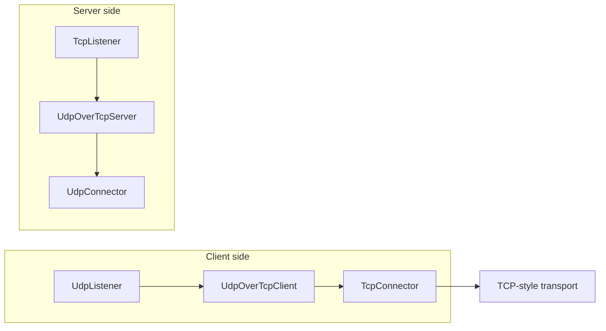

<!--
Documentation version: 106
Sync note: Any change to this file must also be applied to WaterWall/tunnels/UdpOverTcpServer/description.md, and both files must keep the same documentation version.
-->

# UdpOverTcpServer

`UdpOverTcpServer` is the remote peer for `UdpOverTcpClient`. It receives a length-prefixed byte stream from the previous
stream-facing node, reconstructs packet boundaries, and forwards recovered packet payloads to the next node.

Replies from the next node are framed with the same 2-byte length prefix and sent back downstream through the stream.

## Typical Placement

Server side:

```text
TcpListener -> UdpOverTcpServer -> UdpConnector
TcpListener -> TlsServer -> UdpOverTcpServer -> UdpConnector
TcpListener -> EncryptionServer -> UdpOverTcpServer -> UdpConnector
```

Matching client side:

```text
UdpListener -> UdpOverTcpClient -> TcpConnector
UdpListener -> UdpOverTcpClient -> TlsClient -> TcpConnector
TcpUdpListener -> UdpOverTcpClient -> TcpConnector
```

The previous side of `UdpOverTcpServer` must be a stream path. The next side receives reconstructed packet payloads.

## Flow Example



## Basic Example

```json
[
  {
    "name": "stream-in",
    "type": "TcpListener",
    "settings": {
      "address": "0.0.0.0",
      "port": 443,
      "nodelay": true
    },
    "next": "udp-over-tcp-server"
  },
  {
    "name": "udp-over-tcp-server",
    "type": "UdpOverTcpServer",
    "settings": {},
    "next": "udp-out"
  },
  {
    "name": "udp-out",
    "type": "UdpConnector",
    "settings": {
      "address": "127.0.0.1",
      "port": 51820
    }
  }
]
```

## Required Fields

Top-level fields:

| Field | Type | Description |
| --- | --- | --- |
| `name` | string | User-chosen node name. Must be unique inside the config file. |
| `type` | string | Must be exactly `"UdpOverTcpServer"`. |
| `next` | string | The node that receives reconstructed packet payloads. Required in normal use. |

`settings` can be `{}`. The current implementation does not read any tunnel-specific settings.

## Optional Settings

There are no tunnel-specific optional settings in the current implementation.

Transport, destination, socket, TLS, encryption, or routing behavior belongs to the neighboring nodes, such as
`TcpListener`, `TlsServer`, `EncryptionServer`, `UdpConnector`, or `TcpUdpConnector`.

## Framing Model

The server expects normal packet frames in this format:

```text
2-byte unsigned big-endian payload length + packet payload
```

Incoming bytes from the previous stream side are accumulated until a full frame is available. Then the 2-byte header is
removed and the recovered packet is forwarded upstream to the next node.

Replies from the next node are handled in the opposite direction: the server prepends the 2-byte length field and sends
the framed bytes downstream to the previous stream side.

## Delayed Next Init

`UdpOverTcpServer` initializes its own line state during upstream `Init`, but it does not immediately initialize the next
node. It waits until it can determine the destination protocol from the incoming stream.

There are two cases:

| First framed item | Server behavior |
| --- | --- |
| protocol marker, length `0` | Read the following protocol byte, set `line->routing_context.dest_ctx` to TCP or UDP, then initialize the next node. |
| normal data frame | Assume UDP, set destination protocol to UDP, initialize the next node, then forward the recovered packet. |

Until the next node has been initialized, upstream `Pause` and `Resume` callbacks are ignored, and upstream `Finish` does
not forward to `next`.

## Protocol Marker

The protocol marker is a reserved frame:

```text
00 00 <protocol-byte>
```

Only `IP_PROTO_TCP` and `IP_PROTO_UDP` are accepted. An invalid protocol marker is logged, the read stream is emptied, and
the line is not initialized upstream from that marker.

This marker is generated by `UdpOverTcpClient` when it needs the server to preserve protocol metadata for mixed-protocol
chains. In the common UDP-only case, the marker is omitted and the server defaults to UDP on the first normal frame.

## Packet Size Limit

The maximum payload accepted by the current implementation is:

```text
65535 - 20 - 8 - 2 = 65505 bytes
```

Packets larger than this limit are logged and dropped on the reply framing path. Empty payloads are treated as invalid in
debug builds.

## Buffering And Overflow

Incoming stream bytes are buffered until complete frames can be extracted. The current read-stream overflow threshold is:

```text
2 * kMaxAllowedUDPPacketLength
```

If the buffer grows beyond that threshold, the implementation logs a warning and empties the read stream. It does not
close the line only because of the overflow.

## Lifecycle Behavior

On upstream `Init`, the server initializes its read stream and waits for a protocol marker or first data frame.

On upstream payload, it:

1. appends bytes to the read stream
2. initializes the next node once protocol is known
3. decodes complete frames
4. forwards recovered packet payloads upstream to the next node

On downstream payload from the next node, it frames the packet with a 2-byte length prefix and forwards it downstream to
the previous stream side.

On downstream `Finish`, it destroys local line state and forwards downstream `Finish` to the previous side.

On upstream `Finish`, it destroys local line state. It forwards upstream `Finish` to the next node only if the next node
was already initialized.

`UpStreamEst` and `DownStreamInit` are disabled in the current implementation.

## Padding

The node prepends the 2-byte frame header on the reply path using `sbufShiftLeft()`, so it advertises:

```text
required_padding_left = 2
```

## Node Metadata

| Property | Value |
| --- | --- |
| Node flag | `kNodeFlagNone` |
| Previous node | Allowed, required in normal use |
| Next node | Allowed, required in normal use |
| Layer group | `kNodeLayerAnything` |
| `required_padding_left` | `2` |
| Line state | read stream buffer, upstream-initialized flag |

## Common Mistakes

- Do not use `UdpOverTcpServer` without `UdpOverTcpClient` on the other side.
- Do not place it directly after a packet-only node; the previous side must provide framed stream bytes.
- Do not expect it to listen for TCP by itself; use `TcpListener` or another stream-facing server adapter before it.
- Do not put a stream-only node after it unless you are intentionally using the protocol marker path and the next node
  can handle that metadata.
- Do not send packets larger than `65505` bytes.
