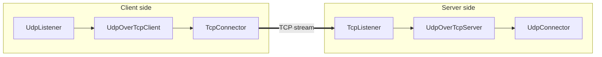

<!--
Documentation version: 152
Sync note: Any change to this file must also be applied to WaterWall/tunnels/UdpOverTcpServer/description.md and WaterWall-Docs/i18n/fa/docusaurus-plugin-content-docs/current/02-noderefs/UdpOverTcpServer.mdx, and all files must keep the same documentation version.
-->

# UdpOverTcpServer

`UdpOverTcpServer` is the remote peer for `UdpOverTcpClient`. It receives a length-prefixed byte stream from the previous
stream-facing node, reconstructs UDP datagram boundaries, and forwards recovered packet payloads to the next node.

Replies from the next node are framed with the same 2-byte length prefix and sent back downstream through the stream.

## Typical Placement

Server side:

```text
TcpListener -> UdpOverTcpServer -> UdpConnector
TcpListener -> TlsServer -> UdpOverTcpServer -> UdpConnector
TcpListener -> EncryptionServer -> UdpOverTcpServer -> UdpConnector
```

Matching client side:

```text
UdpListener -> UdpOverTcpClient -> TcpConnector
UdpListener -> UdpOverTcpClient -> TlsClient -> TcpConnector
TcpUdpListener -> Router (UDP branch) -> UdpOverTcpClient -> TcpConnector
```

The previous side of `UdpOverTcpServer` must be a stream path. The next side receives reconstructed packet payloads.

## Flow Example


```mermaid
flowchart LR
    subgraph ClientSide["Client side"]
      direction LR
      UL[UdpListener] --> UOTC[UdpOverTcpClient] --> TC[TcpConnector]
    end

    subgraph ServerSide["Server side"]
      direction LR
      TL[TcpListener] --> UOTS[UdpOverTcpServer] --> UC[UdpConnector]
    end

    TC == "TCP stream" ==> TL
```

## Basic Example

```json
[
  {
    "name": "stream-in",
    "type": "TcpListener",
    "settings": {
      "address": "0.0.0.0",
      "port": 443,
      "nodelay": true
    },
    "next": "udp-over-tcp-server"
  },
  {
    "name": "udp-over-tcp-server",
    "type": "UdpOverTcpServer",
    "settings": {},
    "next": "udp-out"
  },
  {
    "name": "udp-out",
    "type": "UdpConnector",
    "settings": {
      "address": "127.0.0.1",
      "port": 51820
    }
  }
]
```

## Required Fields

Top-level fields:

| Field | Type | Description |
| --- | --- | --- |
| `name` | string | User-chosen node name. Must be unique inside the config file. |
| `type` | string | Must be exactly `"UdpOverTcpServer"`. |
| `next` | string | The node that receives reconstructed packet payloads. Required in normal use. |

`settings` can be `{}`. The current implementation does not read any tunnel-specific settings.

## Optional Settings

There are no tunnel-specific optional settings in the current implementation.

Transport, destination, socket, TLS, encryption, or routing behavior belongs to the neighboring nodes, such as
`TcpListener`, `TlsServer`, `EncryptionServer`, `UdpConnector`, or `TcpUdpConnector`.

## Framing Model

The server expects normal packet frames in this format:

```text
2-byte unsigned big-endian payload length + packet payload
```

Incoming bytes from the previous stream side are accumulated until a full frame is available. Then the 2-byte header is
removed and the recovered packet is forwarded upstream to the next node.

Replies from the next node are handled in the opposite direction: the server prepends the 2-byte length field and sends
the framed bytes downstream to the previous stream side.

Each payload callback on the datagram-facing side represents one UDP datagram. These nodes always carry
UDP payloads; the source protocol metadata does not change their framing. Mixed listeners must route TCP
traffic through a separate path before the client.

## Packet Size Limit

The maximum outbound UDP datagram size is:

```text
65535 - 20 - 8 - 2 = 65505 bytes
```

Datagrams larger than this limit are dropped intact. Empty outbound payloads violate the existing Debug
invariant; Release drops them. An incoming zero-length frame is invalid and closes the carrier.

## Buffering And Overflow

Incoming stream bytes are buffered until complete frames can be extracted.

The incomplete read-stream overflow threshold is:

```text
2 * kMaxAllowedUDPPacketLength = 131010 bytes
```

Complete frames drain before the incomplete suffix is checked. Retained buffer charge is capped at 4 MiB,
with beneficial compaction attempted first. Malformed frames, allocation refusal or exhausted storage close
the carrier through its owner. Decoder reentry shares a 2 MiB byte limit and 4 MiB charge limit with its
retained stream. The parser never discards arbitrary stream bytes to continue.

## Lifecycle Behavior

On upstream `Init`, the server initializes its per-line framing state, sets the destination protocol to
UDP, and immediately initializes the next node. Transport Est, Pause and Resume are forwarded promptly.

On upstream payload, it appends incoming stream bytes, decodes complete frames, and forwards recovered
UDP datagrams to the next node. On downstream payload, it frames each reply datagram and sends it back
through the previous stream side.

On `Finish` from either direction, it destroys its local line state and forwards `Finish` away from the
sender in the matching WaterWall direction. It does not call `lineDestroy()`.

`UpStreamEst` and `DownStreamInit` are disabled in the current implementation.

## Splice Support

Both nodes accept ordinary buffers and private-pipe bodies. Each outbound UDP datagram keeps its body,
gains a resident two-byte length prefix, and is forwarded in one callback. Oversized datagrams are dropped
intact. The decoder caches only the two-byte length header and extracts each complete datagram as one owned
buffer, with ordinary fallback when pipe resources are unavailable.

UDP datagram boundaries remain intact, and the TCP carrier remains eligible for splice. Any UDP socket
materialization fallback belongs to the UDP sender. Complete frames in an admitted stream input continue
after Pause; Finish or admission refusal stops processing.

## Padding

The node prepends the 2-byte frame header on the reply path using `sbufShiftLeft()`, so it advertises:

```text
required_padding_left = 2
```

## Common Mistakes

- Do not use `UdpOverTcpServer` without `UdpOverTcpClient` on the other side.
- Do not place it directly after a packet-only node; the previous side must provide framed stream bytes.
- Do not expect it to listen for TCP by itself; use `TcpListener` or another stream-facing server adapter before it.
- The next side must preserve UDP datagram boundaries and use a UDP destination.
- Do not send UDP datagrams larger than `65505` bytes.

## Node Metadata

Source-backed metadata:

| Property | Value |
| --- | --- |
| node flags | `kNodeFlagSupportsSplice` |
| `can_have_prev` | `true` |
| `can_have_next` | `true` |
| `layer_group` | `kNodeLayer4` |
| `layer_group_prev_node` | `kNodeLayer4` |
| `layer_group_next_node` | `kNodeLayer4` |
| `required_padding_left` | `2` bytes |
