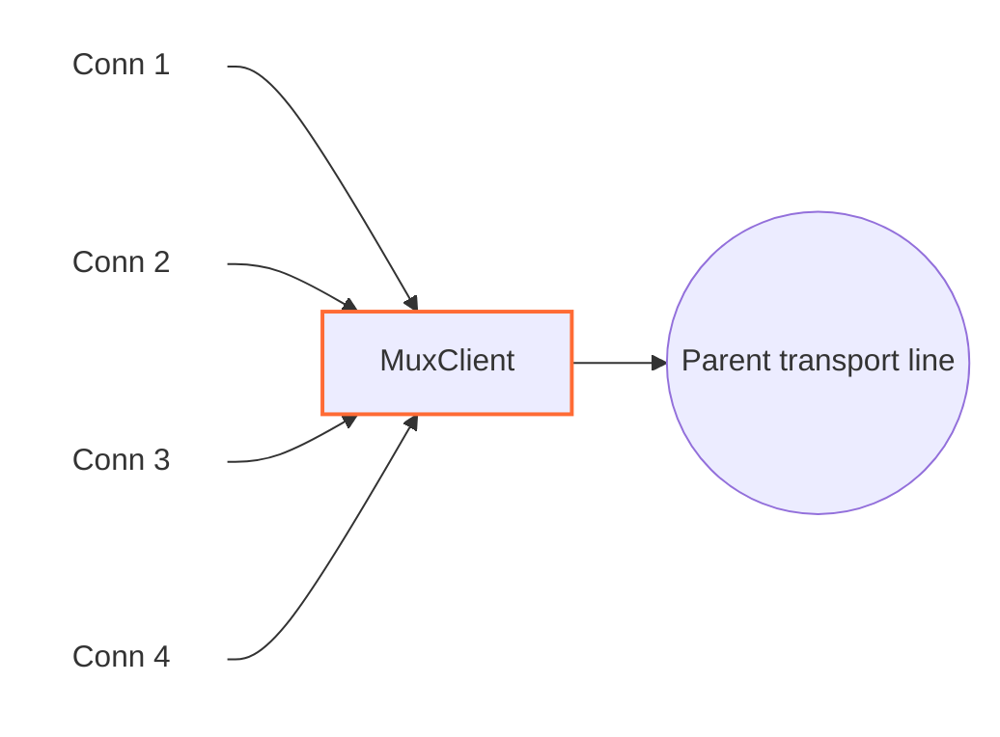

# MuxClient

`MuxClient` چندین اتصال منطقی WaterWall را روی تعداد کمتری اتصال transport مشترک حمل می‌کند. به جای اینکه برای هر line ورودی یک اتصال کامل تا سمت مقابل ساخته شود، `MuxClient` یک یا چند line والد به سمت `next` باز می‌کند و streamهای منطقی را داخل frameهای داخلی MUX روی همان والدها می‌فرستد.

در سمت مقابل باید `MuxServer` قرار بگیرد تا frameها را باز کند و دوباره lineهای مستقل بسازد.



## جایگاه رایج

```text
TcpListener -> MuxClient -> TcpConnector
TcpListener -> MuxClient -> HttpClient -> TlsClient -> TcpConnector
```

در سمت دیگر مسیر:

```text
TcpListener -> MuxServer -> TcpConnector
```

`MuxClient` خودش listener یا connector نیست. نود قبلی باید lineهای child را بسازد و نود بعدی باید transport واقعی والد را فراهم کند.

## نمونه تنظیم‌ها

### mode: timer

در این حالت هر parent line فقط تا مدت مشخصی child جدید قبول می‌کند. بعد از تمام شدن زمان، childهای جدید روی parent تازه می‌روند، اما childهای قبلی روی parent قدیمی تا پایان عمرشان ادامه می‌دهند.

```json
{
  "name": "mux-client",
  "type": "MuxClient",
  "settings": {
    "mode": "timer",
    "connection-duration-ms": 30000
  },
  "next": "outbound-transport"
}
```

### mode: counter

در این حالت هر parent line تا تعداد مشخصی child می‌گیرد. وقتی ظرفیت پر شد، parent جدید ساخته می‌شود.

```json
{
  "name": "mux-client",
  "type": "MuxClient",
  "settings": {
    "mode": "counter",
    "connection-capacity": 128
  },
  "next": "outbound-transport"
}
```

### mode: fixed-connections-count

این mode جدیدتر است و برای هر worker یک pool ثابت از parent lineها نگه می‌دارد. وقتی اولین child روی یک worker برسد، `MuxClient` به تعداد `per-worker-connections-count` parent line برای همان worker آماده می‌کند. childهای بعدی بین parentهای همان pool پخش می‌شوند و تا وقتی slotها زنده‌اند parent اضافی ساخته نمی‌شود.

```json
{
  "name": "mux-client",
  "type": "MuxClient",
  "settings": {
    "mode": "fixed-connections-count",
    "per-worker-connections-count": 2
  },
  "next": "outbound-transport"
}
```

## تنظیمات

| گزینه | اجباری | توضیح |
|---|---|---|
| `mode` | بله | یکی از `timer`، `counter` یا `fixed-connections-count` |
| `connection-duration-ms` | فقط در `timer` | مدت پذیرش child جدید روی هر parent، به میلی‌ثانیه. باید بزرگ‌تر از `60` باشد. |
| `connection-capacity` | فقط در `counter` | حداکثر تعداد childهایی که روی یک parent قرار می‌گیرند. باید بزرگ‌تر از `0` باشد. |
| `per-worker-connections-count` | فقط در `fixed-connections-count` | تعداد parent lineهای ثابت برای هر worker. باید بزرگ‌تر از `0` باشد. |
| `child-buffer-limit` | خیر | سقف صف داده برای هر child pause شده. پیش‌فرض `8388608` بایت، یعنی `8 MB`. |

## مدل parent و child

`MuxClient` دو نوع line دارد:

- `child line`: اتصال منطقی که از سمت نود قبلی آمده است.
- `parent line`: اتصال مشترکی که به سمت نود بعدی باز می‌شود و frameهای چند child را حمل می‌کند.

هر child یک شناسه ۳۲ بیتی به نام `cid` می‌گیرد. این شناسه داخل frameهای MUX قرار می‌گیرد تا `MuxServer` در سمت مقابل بداند هر payload، pause، resume یا close متعلق به کدام stream منطقی است.

## تفاوت modeها در عمل

| mode | parent جدید چه زمانی ساخته می‌شود؟ | مناسب برای |
|---|---|---|
| `timer` | وقتی parent فعلی از `connection-duration-ms` پیرتر شود | پخش اتصال‌ها در طول زمان و جلوگیری از خیلی بزرگ شدن parentهای قدیمی |
| `counter` | وقتی تعداد childهای parent به `connection-capacity` برسد | کنترل ساده و قابل پیش‌بینی روی تعداد stream در هر parent |
| `fixed-connections-count` | فقط برای پر کردن pool ثابت هر worker؛ parent اضافی ساخته نمی‌شود مگر slot بسته و بعدا دوباره نیاز شود | کنترل تعداد اتصال‌های بیرونی، رفتار پایدارتر، جلوگیری از رشد ناخواسته تعداد parentها |

در `timer` و `counter`، هر worker معمولا یک parent قابل استفاده فعلی دارد. در `fixed-connections-count`، هر worker چند parent ثابت دارد و child جدید به parent کم‌بارتر داده می‌شود؛ اگر چند parent هم‌بار باشند، tie-break به شکل round-robin انجام می‌شود.

## frame داخلی MUX

`MuxClient` و `MuxServer` از header ثابت ۸ بایتی استفاده می‌کنند:

| فیلد | اندازه | توضیح |
|---|---:|---|
| `length` | `uint16` | طول payload بعد از header |
| `flags` | `uint8` | نوع frame |
| `_pad1` | `uint8` | padding داخلی |
| `cid` | `uint32` | شناسه child stream |

نوع frameها:

| flag | معنی |
|---:|---|
| `0` | `Open`، ساخت child در سمت مقابل |
| `1` | `Close`، بستن child |
| `2` | `FlowPause` |
| `3` | `FlowResume` |
| `4` | `Data` |

این header توسط خود نودها مدیریت می‌شود و لازم نیست در config چیزی برای آن تنظیم کنید.

## جریان داده

- مسیر رفت: child از سمت قبلی وارد `MuxClient` می‌شود، header MUX می‌گیرد و روی parent به `next` می‌رود.
- مسیر برگشت: payload از parent برمی‌گردد، frame کامل خوانده می‌شود، header حذف می‌شود و payload به child درست تحویل داده می‌شود.

وقتی child جدید attach شد و frame `Open` با موفقیت ارسال شد، `MuxClient` برای child به سمت قبلی `Est` گزارش می‌کند.

## pause، resume و صف‌ها

MUX فقط payload را قاطی نمی‌کند؛ backpressure هر child را هم جدا نگه می‌دارد.

- اگر child از سمت قبلی pause شود، `MuxClient` برای همان `cid` یک `FlowPause` به سمت `MuxServer` می‌فرستد.
- وقتی child resume شود، `FlowResume` ارسال می‌شود.
- اگر داده برگشتی برای یک child برسد ولی همان child فعلا pause باشد، داده در صف همان child نگه داشته می‌شود.
- وقتی صف child به کمتر از حدود `512 KB` برسد، `FlowResume` زودتر فرستاده می‌شود تا سمت مقابل بتواند دوباره آرام‌آرام ارسال کند.
- اگر صف یک child به `child-buffer-limit` برسد، ورودی parent موقتا pause می‌شود تا حافظه بی‌رویه مصرف نشود.

## محدودیت‌ها و خطاها

- buffer خواندن frameهای parent سقف فعلی `1 MB` دارد. اگر داده ناقص/خراب باعث عبور از این حد شود، parent بسته می‌شود و childهای متصل به آن finish می‌شوند.
- وقتی parent در `timer` یا `counter` exhausted شد، فورا بسته نمی‌شود؛ فقط child جدید قبول نمی‌کند. بعد از بسته شدن آخرین child، parent هم بسته می‌شود.
- اگر `cid` به سقف `4294967295` برسد، parent دیگر child جدید نمی‌گیرد.
- `mode` در نسخه فعلی اجباری است؛ configهای قدیمی بدون mode معتبر نیستند.

## انتخاب مقدارهای عملی

- برای شروع ساده، `counter` با مقدارهایی مثل `64` یا `128` قابل فهم است.
- اگر می‌خواهید اتصال‌های بیرونی در طول زمان rotate شوند، `timer` انتخاب خوبی است.
- اگر می‌خواهید تعداد parent connectionها دقیق‌تر کنترل شود، مخصوصا وقتی transport بیرونی گران یا حساس است، `fixed-connections-count` بهتر است.
- اگر تعداد workerها در `core.json` بیشتر باشد، parentها به ازای هر worker ساخته می‌شوند. مثلا `per-worker-connections-count: 2` با ۴ worker می‌تواند تا ۸ parent فعال بسازد.
