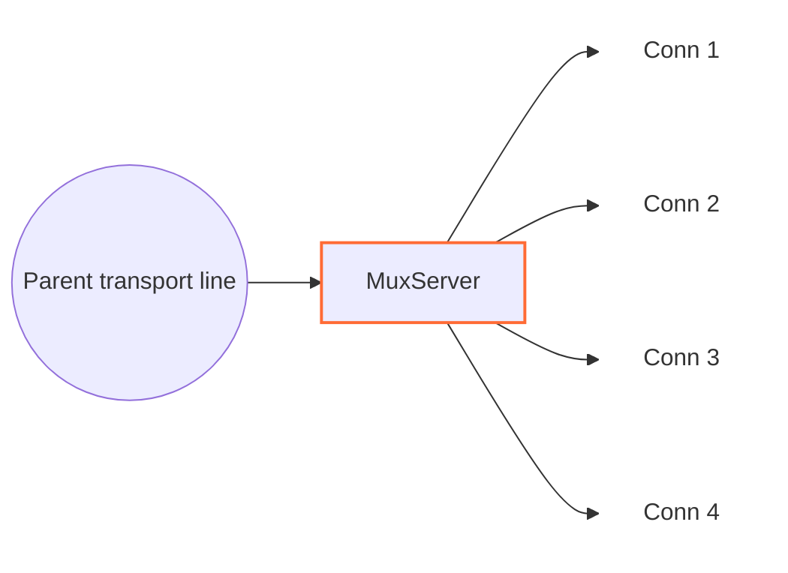

# MuxServer

`MuxServer` سمت مقابل `MuxClient` است. این نود یک parent transport line را که frameهای MUX داخل آن آمده می‌خواند، برای frameهای `Open` child line جدید می‌سازد و هر child را مثل یک اتصال مستقل به نود بعدی تحویل می‌دهد.



## جایگاه رایج

```text
TcpListener -> MuxServer -> TcpConnector
TcpListener -> TlsServer -> HttpServer -> MuxServer -> TcpConnector
```

قاعده اصلی این است که سمت قبلی باید همان transportی باشد که frameهای `MuxClient` را حمل می‌کند و سمت بعدی باید جایی باشد که هر اتصال منطقی جداگانه به آن برود.

## نمونه تنظیم

```json
{
  "name": "mux-server",
  "type": "MuxServer",
  "settings": {
    "child-buffer-limit": 8388608
  },
  "next": "service-side-node"
}
```

## تنظیمات

| گزینه | اجباری | پیش‌فرض | توضیح |
|---|---|---|---|
| `child-buffer-limit` | خیر | `8388608` | سقف صف داده برای هر child pause شده. باید بزرگ‌تر از `0` باشد. |

تنظیمات mode مثل `timer`، `counter` و `fixed-connections-count` فقط در `MuxClient` هستند. `MuxServer` براساس frameهایی که از parent می‌گیرد childها را می‌سازد و به mode client کاری ندارد.

## مدل parent و child

- `parent line`: اتصال مشترک ورودی از سمت `MuxClient`.
- `child line`: اتصال منطقی که `MuxServer` برای هر `cid` می‌سازد و به `next` می‌دهد.

وقتی frame `Open` برسد:

1. `MuxServer` یک line جدید روی همان worker می‌سازد.
2. state child را initialize می‌کند.
3. child را به parent وصل می‌کند.
4. برای child به نود بعدی upstream `Init` می‌فرستد.

بعد از آن frameهای `Data`، `FlowPause`، `FlowResume` و `Close` با همان `cid` به همان child مربوط می‌شوند.

## frame داخلی MUX

فرمت frame با `MuxClient` یکی است و header آن ۸ بایت است:

| فیلد | اندازه | توضیح |
|---|---:|---|
| `length` | `uint16` | طول payload بعد از header |
| `flags` | `uint8` | نوع frame |
| `_pad1` | `uint8` | padding داخلی |
| `cid` | `uint32` | شناسه child stream |

flagها:

| flag | معنی |
|---:|---|
| `0` | `Open` |
| `1` | `Close` |
| `2` | `FlowPause` |
| `3` | `FlowResume` |
| `4` | `Data` |

## جریان داده

- رفت از parent به سرویس: `MuxServer` header را حذف می‌کند و payload را به child درست می‌دهد.
- برگشت از سرویس به parent: payload child دوباره header می‌گیرد و به parent سمت قبلی برمی‌گردد.

از دید نود بعدی، هر child یک connection عادی WaterWall است. مثلا اگر بعد از `MuxServer` یک `TcpConnector` باشد، برای هر child یک اتصال جدا به مقصد ساخته می‌شود.

## finish و close

- اگر `Close` برای یک child برسد، child از parent جدا می‌شود، state خودش را پاک می‌کند، upstream finish به نود بعدی می‌فرستد و line داخلی child را destroy می‌کند.
- اگر نود بعدی child را ببندد، `MuxServer` یک frame `Close` روی parent به سمت `MuxClient` می‌فرستد.
- اگر خود parent transport بسته شود، همه childهای متصل به آن هم بسته می‌شوند.
- اگر `Open` تکراری برای `cid` موجود برسد، نادیده گرفته می‌شود.

## pause، resume و صف‌ها

`MuxServer` backpressure هر child را جدا نگه می‌دارد:

- `FlowPause` و `FlowResume` ورودی برای همان child به نود بعدی forward می‌شود.
- اگر child pause باشد و payload بیشتری برای آن برسد، payload در صف child نگه داشته می‌شود.
- وقتی صف child پایین‌تر از حدود `512 KB` آمد، `FlowResume` فرستاده می‌شود.
- اگر صف child به `child-buffer-limit` برسد، parent موقتا pause می‌شود و بعد از پایین آمدن صف‌ها resume می‌گیرد.

## محدودیت‌ها و نکته‌ها

- buffer خواندن parent سقف فعلی `1 MB` دارد. عبور از این حد parent و childهایش را می‌بندد.
- `MuxServer` را بدون `MuxClient` سمت مقابل استفاده نکنید؛ payload ورودی باید frame MUX معتبر باشد.
- `UpStreamEst` و `DownStreamInit` در پیاده‌سازی فعلی مسیر عادی این نود نیستند؛ این نود endpoint عمومی نیست.
