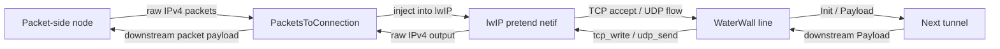

# PacketsToConnection

`PacketsToConnection` is a packet-to-transport bridge built on lwIP. It accepts
raw IPv4 packets from the packet side, injects them into an in-process lwIP
stack, and exposes the resulting TCP/UDP flows as normal WaterWall `line_t`
connections toward the next tunnel.

Use it when a packet-oriented chain needs to enter WaterWall's normal
connection-oriented world.

```text
packet side -> PacketsToConnection -> normal WaterWall service chain
normal service response -> PacketsToConnection -> raw IPv4 packet side
```

## What It Is

`PacketsToConnection` is closer to a small transport-stack bridge than to a
packet framing tunnel.

It is responsible for:

- accepting full IPv4 packets from the previous packet-side node
- feeding supported packets into lwIP
- turning accepted TCP connections into normal WaterWall lines
- turning UDP 4-tuples into normal WaterWall lines
- writing downstream service-chain responses back through lwIP
- emitting raw IPv4 packets back to the packet side

It is not responsible for:

- creating a TUN device
- configuring OS routes, firewall marks, or policy routing
- serializing packets over a byte stream
- replacing `TunDevice`
- handling IPv6 or ICMP

`TunDevice` owns the real packet adapter side. `PacketsToConnection` owns the
lwIP transport bridge side.

## Typical Placement

Direct packet-to-service flow:

```text
TunDevice -> PacketsToConnection -> TcpConnector
```

Packet input with a policy or proxy chain after flow reconstruction:

```text
TunDevice -> PacketsToConnection -> Router -> TcpConnector
```

Packet input transported by another packet tunnel:

```text
WireGuardDevice -> PacketsToConnection -> HttpClient -> TlsClient -> TcpConnector
```

The previous side should be packet-oriented. The next side is a normal
WaterWall connection chain and receives generated per-flow lines.

## Configuration Examples

Minimal bridge:

```json
{
  "name": "ptc",
  "type": "PacketsToConnection",
  "next": "service-chain-entry"
}
```

With UDP idle tuning and fake DNS:

```json
{
  "name": "ptc",
  "type": "PacketsToConnection",
  "settings": {
    "udp-idle-timeout-ms": 120000,
    "fake-dns": {
      "address": "198.18.0.2",
      "port": 53,
      "network": "100.64.0.0",
      "netmask": "255.192.0.0",
      "cache-size": 10000,
      "ttl": 1
    }
  },
  "next": "service-chain-entry"
}
```

## Supported Traffic

| Traffic | Status | Notes |
| --- | --- | --- |
| IPv4 | Supported | Input must be a complete IPv4 packet. |
| TCP over IPv4 | Supported | Accepted by lwIP and exposed as normal WaterWall lines. |
| UDP over IPv4 | Supported | Exposed as per-4-tuple WaterWall lines with idle timeout. |
| IPv6 | Not supported | The tunnel has IPv4 processing only; IPv6 packets are dropped. |
| ICMP | Not supported | Non-TCP/UDP IPv4 packets are dropped. |

Input packet checks are intentionally conservative:

- packet length must be at least an IPv4 header
- IP version must be `4`
- IPv4 header length must fit inside the buffer
- IP total length must be valid
- the `sbuf` length must equal the IPv4 total length
- protocol must be TCP or UDP, unless the packet is handled by fake DNS

Packets that do not satisfy these rules are recycled and not forwarded.

## Flow Model



The shared worker packet line is not the same as the TCP/UDP lines created by
this node:

| Line kind | Owner | Lifetime |
| --- | --- | --- |
| worker packet line | tunnel chain | Persistent worker helper line; not closed during normal runtime. |
| generated TCP line | `PacketsToConnection` | Normal WaterWall connection line; destroyed when the TCP flow closes. |
| generated UDP line | `PacketsToConnection` | Normal WaterWall connection line; destroyed on idle timeout or downstream close. |

## lwIP Route Contexts

For IPv4, the current source creates route contexts lazily per packet worker,
not per destination IP.

Each worker-local route context owns:

- one lwIP `netif`
- `NETIF_FLAG_PRETEND`
- one pretend wildcard TCP listener, created on first TCP packet
- one pretend wildcard UDP PCB, created on first UDP packet
- a UDP flow map keyed by the packet 4-tuple

The destination IP is preserved in the IPv4 packet and in the lwIP PCB tuple,
but it is not used as the key for allocating separate route contexts. The
WaterWall lwIP pretend patch lets wildcard PCBs accept traffic for arbitrary
destination addresses and ports on the pretend netif while preserving the
original local tuple on accepted flows.

When lwIP emits packets back out, `PacketsToConnection` sends them to the
worker packet line with `tunnelPrevDownStreamPayload()`. If lwIP output happens
on a different worker from the packet worker, the packet bytes are copied into a
worker message and emitted on the correct packet worker.

## TCP Behavior

When lwIP accepts a TCP flow:

1. `PacketsToConnection` creates a normal WaterWall line on the owning packet
   worker.
2. It initializes its per-line state as a TCP line.
3. It fills the source address context from the remote TCP peer.
4. It fills the destination address context from the original local destination
   IP and port, or from fake DNS mapping if one applies.
5. It sets `routing_context.local_listener_port` to the original local port.
6. It disables Nagle on the lwIP TCP PCB.
7. It schedules upstream `Init` toward the next tunnel.

Incoming TCP payload from lwIP is copied into a WaterWall buffer and delivered
upstream with `tunnelNextUpStreamPayload()` after upstream `Init` has been sent.

Downstream payload from the next tunnel is written into lwIP with `tcp_write()`.
The current implementation uses `TCP_WRITE_FLAG_COPY`, so lwIP gets its own copy
of bytes, while WaterWall keeps the original buffer until the corresponding
TCP send completion accounting is done.

### TCP Backpressure

TCP downstream writes are integrated with WaterWall pause/resume:

- if `tcp_sndbuf()` has no room, or only part of the buffer can be written, the
  remaining data is queued
- the next tunnel is paused with `tunnelNextUpStreamPause()`
- lwIP `tcp_sent` callbacks advance the acknowledgement queue
- queued bytes are flushed when send space becomes available
- the next tunnel is resumed with `tunnelNextUpStreamResume()` once the write
  queue is empty

Receive-side backpressure is also tracked:

- downstream `Pause` marks the generated line as read-paused
- while read-paused, TCP receive credit is deferred
- downstream `Resume` sends the accumulated `tcp_recved()` credit back to lwIP

This preserves TCP flow control without closing the packet line.

## UDP Behavior

UDP is represented as normal WaterWall lines, but the model is datagram-based
and less stateful than TCP.

The UDP flow key is:

| Field | Meaning |
| --- | --- |
| source IPv4 address | Original packet source address. |
| destination IPv4 address | Original packet destination address. |
| source port | Original UDP source port. |
| destination port | Original UDP destination port. |

On the first datagram for a new 4-tuple:

1. `PacketsToConnection` creates a normal WaterWall line on the owning packet
   worker.
2. It stores the UDP flow key and connected UDP PCB information.
3. It fills source and destination address contexts.
4. It applies fake DNS mapping to the destination context if the destination is
   a mapped fake IP.
5. It inserts the line into the route context UDP flow map.
6. It schedules upstream `Init` and delivers datagrams as upstream payloads.

UDP lines are kept alive by activity. The idle timer is updated on incoming UDP
datagrams and downstream UDP payloads. When the configured idle deadline passes,
the generated UDP line is closed and removed from the UDP flow map.

### UDP Backpressure Limitation

UDP does not have real stream backpressure.

Current behavior:

- downstream `Pause` marks the generated UDP line as read-paused
- inbound UDP datagrams received while read-paused are dropped
- downstream `Resume` clears the paused state
- downstream payload is sent through the connected UDP PCB and the WaterWall
  buffer is reused immediately

Treat this as a deliberate limitation of the UDP path. If lossless backpressure
matters, use a stream transport or a protocol layer that can provide its own
retransmission and flow control.

## Fake DNS

`fake-dns` is an optional in-tunnel IPv4 DNS responder. It is useful when packet
clients need to connect to domains, but the packet path initially contains only
IP packets.

The fake DNS path works like this:

1. A packet client sends a UDP DNS query to the configured fake DNS address and
   port.
2. `PacketsToConnection` intercepts that packet before injecting it into lwIP.
3. For each `A`/`IN` question, it assigns or reuses a fake IPv4 address from the
   configured fake network.
4. It sends a DNS response back to the packet side as a raw IPv4 UDP packet.
5. Later TCP or UDP packets whose destination IP matches a fake DNS entry get a
   domain destination context instead of an IP destination context.

This lets downstream nodes such as `TcpConnector`, proxy clients, or routers see
the original domain name instead of only the synthetic fake IP.

Important details:

- fake DNS is disabled by default
- boolean `true` enables it with defaults
- object form allows tuning the listen address, fake network, cache size, and TTL
- only IPv4 UDP DNS packets are handled
- only `A`/`IN` questions receive synthetic A answers
- up to 32 questions are parsed from one DNS query
- question names are lowercased before being stored
- the fake-IP map is LRU and process-local
- DNS TTL controls the DNS response TTL, not a hard expiry of the in-process map
- if a fake IP entry is evicted, future flows to that old fake IP may no longer
  resolve to the original domain

Do not use the configured fake DNS network for real destinations in the same
packet environment.

## Settings

Top-level fields:

| Field | Type | Required | Description |
| --- | --- | --- | --- |
| `name` | string | yes | User-chosen node name. Must be unique inside the config file. |
| `type` | string | yes | Must be exactly `"PacketsToConnection"`. |
| `settings` | object | no | Optional settings object. If present, it must be an object. |
| `next` | string | yes for useful runtime | Entry of the normal WaterWall service chain that receives generated lines. |

`settings` fields:

| Setting | Type | Default | Description |
| --- | --- | --- | --- |
| `udp-idle-timeout-ms` | integer | `300000` | Idle lifetime for generated UDP lines. Must be at least `1`. |
| `fake-dns` | boolean or object | `false` | Enables and configures the in-tunnel fake DNS responder. |
| `fake_dns` | boolean or object | unset | Alias for `fake-dns`. |
| `mapdns` | boolean or object | unset | Legacy alias for `fake-dns`. |

Fake DNS object fields:

| Field | Type | Default | Description |
| --- | --- | --- | --- |
| `enabled` | boolean | `true` | Allows object form to be present while disabling fake DNS. |
| `address` | IPv4 string | `198.18.0.2` | IPv4 address that the fake DNS responder listens on. |
| `port` | integer | `53` | UDP destination port for fake DNS queries. Must be `1..65535`. |
| `network` | IPv4 string | `100.64.0.0` | Base fake-IP network. It is masked by `netmask` before use. |
| `netmask` | IPv4 string | `255.192.0.0` | Fake-IP network mask. |
| `cache-size` | integer | `10000` | Number of domain-to-fake-IP records. Must be at least `1` and fit in the fake network. |
| `ttl` | integer | `1` | DNS answer TTL in seconds. Must be `0` or greater. |

If more than one fake DNS key is present, the source lookup order is
`fake-dns`, then `fake_dns`, then `mapdns`.

## Callback And Lifecycle Semantics

Packet-side callbacks:

| Callback received on the packet line | Behavior |
| --- | --- |
| upstream `Init` | No-op. Packet-line init is a startup/bootstrap event. |
| upstream `Payload` | Validates IPv4, optionally handles fake DNS, then injects TCP/UDP packets into lwIP. |
| upstream `Est` | Fatal guard; not expected on the packet line. |
| upstream `Pause` | Fatal guard; not expected on the packet line. |
| upstream `Resume` | Fatal guard; not expected on the packet line. |
| upstream `Finish` | Fatal guard; packet lines must not close during normal runtime. |

Generated connection-line callbacks from the next tunnel:

| Callback from next side | Behavior |
| --- | --- |
| downstream `Payload` | Writes bytes/datagrams into lwIP. |
| downstream `Pause` | Pauses reads for the generated TCP/UDP line. |
| downstream `Resume` | Resumes reads; TCP releases deferred receive credit. |
| downstream `Finish` | Closes the lwIP side, destroys this tunnel's line state, and destroys the generated line. |
| downstream `Init` | Fatal guard; not a valid callback for generated lines. |
| downstream `Est` | No-op. |

Network-side close behavior:

- TCP close/error and UDP idle close detach lwIP state first
- this tunnel destroys its own per-line state
- if upstream `Init` was already sent, upstream `Finish` is sent to the next
  tunnel
- `PacketsToConnection` then destroys the generated line it created

The shared packet line is never destroyed by those per-flow closes. It remains
alive until the tunnel chain is destroyed.

## Address Context Mapping

For generated TCP and UDP lines:

| Context | Value |
| --- | --- |
| source address context | Original packet peer address, peer port, and protocol. |
| destination address context | Original packet destination address and port, unless fake DNS maps the destination IP to a domain. |
| destination domain strategy | `prefer-ipv4` when fake DNS mapping is applied. |
| `routing_context.local_listener_port` | Original local destination port. |

This is why `PacketsToConnection` composes with normal destination-aware nodes.
For example, a downstream connector can connect to the original packet
destination, while a router can make decisions based on protocol, port, IP, or
fake-DNS-restored domain.

## Buffer And Padding Notes

Source-backed node metadata:

| Property | Value |
| --- | --- |
| node flags | `kNodeFlagNone` |
| `can_have_prev` | `true` |
| `can_have_next` | `true` |
| `layer_group` | `kNodeLayerAnything` |
| `layer_group_prev_node` | `kNodeLayerAnything` |
| `layer_group_next_node` | `kNodeLayerAnything` |
| `required_padding_left` | `0` |

The tunnel does not add a per-payload framing header and does not require left
padding. Packet input buffers are wrapped into lwIP pbufs where possible, and
output packets are allocated from the packet line's worker buffer pool or from a
fresh padded buffer when needed.

## Expert Notes And Limits

- `PacketsToConnection` is not a NAT policy engine. It reconstructs flows and
  exposes them as WaterWall lines; put routing or policy nodes after it if you
  need filtering or selection.
- IPv4 route contexts are currently keyed by packet worker id, not by
  destination IP.
- TCP and UDP listener PCBs are pretend wildcard PCBs on the worker-local netif,
  not one listener per destination port.
- UDP generated lines are per 4-tuple and close by idle timeout.
- UDP pause is lossy; paused inbound datagrams are dropped.
- Fake DNS is an in-process synthetic A-record mapper, not a recursive DNS
  resolver.
- The fake DNS map is local to this tunnel instance and is cleared when the
  tunnel is destroyed.
- Packet-line `Finish` during runtime is considered a contract violation.
- IPv6 and ICMP are currently dropped.
- Packets with trailing bytes beyond the IPv4 total length are dropped because
  the implementation requires `sbuf` length to match IP total length exactly.

## Difference From PacketsToStream

Use `PacketsToStream` with `StreamToPackets` when you only need to preserve raw
packet boundaries over a stream transport.

Use `PacketsToConnection` when you want lwIP to reconstruct TCP/UDP transport
flows and expose those flows as normal WaterWall connection lines.
