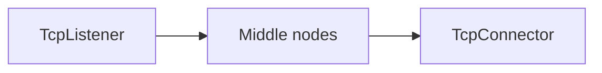
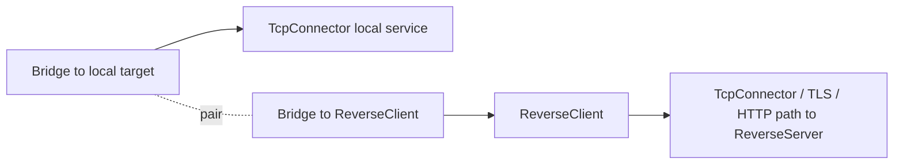
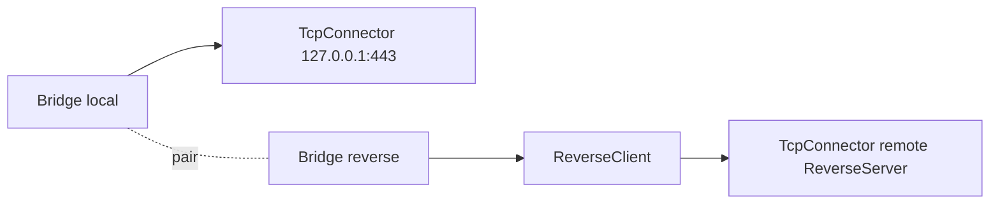

<!--
Documentation version: 106
Sync note: Any change to this file must also be applied to WaterWall/tunnels/ReverseClient/description.md, and both files must keep the same documentation version.
-->

# ReverseClient

`ReverseClient` keeps a pool of pre-opened outbound reverse connections toward a
remote `ReverseServer`. When the server side needs a real connection, one of
those waiting reverse links is consumed, paired with a local-facing line, and
used as a tunnel back through the client-side machine.

This is the client-side node for reverse tunnel layouts: it is usually placed on
the machine that can dial out but cannot accept direct inbound connections.

## Why Bridge Is Usually Needed

Most WaterWall chains read naturally from left to right:



`ReverseClient` has a different shape. It must create outbound idle links to
the remote `ReverseServer`, but once the remote side assigns one of those links,
the client still needs to expose the connection to a local target such as
xray-core, a local SOCKS service, or another local TCP endpoint.

WaterWall keeps a single `next` field per node. Instead of giving
`ReverseClient` special custom fields such as `next-peer` and `next-core`, the
common design uses a `Bridge` pair:



In this layout:

- `ReverseClient.next` is the peer path that eventually reaches
  `ReverseServer`
- the local target path is attached behind `ReverseClient` through the Bridge
  pair
- when a reverse link becomes active, `ReverseClient` initializes the local side
  toward the previous node

Read the `Bridge` page before designing a reverse topology. The Reverse nodes
depend on that direction reversal in many practical configs.

## What It Does

- Creates outbound reverse links through the next node.
- Sends a private reverse-link handshake on every spare connection.
- Keeps a minimum number of unused, established reverse links per worker.
- Tracks connecting links separately from established-but-unused links.
- Waits for the remote side to send real payload on a spare reverse link.
- When a spare link is consumed, initializes the paired local-facing line toward
  the previous node.
- Forwards payload, finish, pause, and resume across the paired lines.
- Replenishes the spare pool whenever a link is consumed or closed.
- Closes and replaces idle spare links that remain unused for too long.

`ReverseClient` is not a normal listener and not a normal connector. It creates
internal lines itself and uses the ordinary next/previous WaterWall callbacks to
join the reverse peer path to the local target path.

## Typical Placement

Client-side shape:

```text
Bridge(local target side) <-> Bridge(to ReverseClient) -> ReverseClient -> outbound peer path
```

A simplified full shape:



The outbound peer path can be plain TCP, or it can include TLS, HTTP, Reality,
Mux, or other transport nodes as long as it eventually reaches the matching
`ReverseServer`.

## Configuration Example

```json
{
  "name": "reverse-client",
  "type": "ReverseClient",
  "settings": {
    "minimum-unused": 16,
    "reverse-secret-length": 640,
    "reverse-secret": "shared-secret"
  },
  "next": "outbound-to-reverse-server"
}
```

Minimal Bridge-oriented example:

```json
{
  "name": "outbound_to_core",
  "type": "TcpConnector",
  "settings": {
    "address": "127.0.0.1",
    "port": 443,
    "nodelay": true
  }
}
```

```json
{
  "name": "bridge_local",
  "type": "Bridge",
  "settings": {
    "pair": "bridge_reverse"
  },
  "next": "outbound_to_core"
}
```

```json
{
  "name": "bridge_reverse",
  "type": "Bridge",
  "settings": {
    "pair": "bridge_local"
  },
  "next": "reverse_client"
}
```

```json
{
  "name": "reverse_client",
  "type": "ReverseClient",
  "settings": {
    "minimum-unused": 4
  },
  "next": "outbound_to_peer"
}
```

```json
{
  "name": "outbound_to_peer",
  "type": "TcpConnector",
  "settings": {
    "address": "203.0.113.10",
    "port": 443,
    "nodelay": true
  }
}
```

## Required Fields

Top-level fields:

| Field | Type | Description |
| --- | --- | --- |
| `name` | string | User-chosen node name. Must be unique inside the config file. |
| `type` | string | Must be exactly `"ReverseClient"`. |
| `next` | string | Required in practical configs. This is the outbound peer path toward `ReverseServer`. |

`settings` may be omitted or empty. If present, it must be an object.

## Optional Settings

| Setting | Type | Default | Description |
| --- | --- | --- | --- |
| `minimum-unused` | integer | `workers * 4` | Minimum spare reverse links to keep ready per tunnel. Must be greater than `0`. |
| `reverse-secret-length` | integer | `640` | Length of the reverse-link handshake. Must be in `1..1024`. |
| `reverse-secret` | ASCII string | unset | XORs the default handshake bytes with this secret, repeated over the handshake length. Must be non-empty ASCII when set. |

`ReverseClient`, `ReverseServer`, and any `SniffRouter` reverse detector in
front of them must use the same `reverse-secret-length` and `reverse-secret`.

Older documentation said changing the reverse handshake required editing the
source. That is no longer accurate: the current implementation exposes
`reverse-secret-length` and `reverse-secret` in node settings.

## Reverse-Link Handshake

Each spare reverse connection starts by sending an internal handshake.

Default handshake:

```text
640 bytes of 0xFF
```

When `reverse-secret` is configured, each default byte is XORed with the
corresponding byte of the ASCII secret, repeated until `reverse-secret-length`
bytes have been produced.

This handshake is not user payload. `ReverseServer` uses it to distinguish
pre-opened reverse links from the local/user side of the reverse topology.

## Startup And Pool Behavior

At startup, `ReverseClient` asks every worker to create outbound reverse links
until the spare target is met.

For each worker it tracks:

- connecting reverse links
- established but still unused reverse links

If the sum is below `minimum-unused`, the node schedules more outbound reverse
connections on that worker.

After the next side reports downstream establishment for a reverse link, that
link becomes part of the unused pool.

## Activation Flow

A spare reverse link is not exposed to the local target immediately. It becomes
active only when the remote side sends real downstream payload on that link.

When that first payload arrives:

1. The link is removed from the unused pool.
2. The idle timeout entry is removed.
3. The active reverse counter is incremented.
4. A replacement spare link is scheduled.
5. The paired local-facing line is initialized toward the previous node.
6. The first payload is forwarded to the local side.

After that, payload flows both ways:

| Direction | Flow |
| --- | --- |
| local side to remote side | previous node -> `ReverseClient` -> next node |
| remote side to local side | next node -> `ReverseClient` -> previous node |

Pause and resume signals are forwarded across the pair once the pair exists.

## Finish And Replacement Behavior

If an active paired link closes from either side:

- both internal line states are destroyed
- the peer side is finished
- the internal lines are destroyed by `ReverseClient`, because it created them
- the active counter is decremented
- a replacement spare link is scheduled

If an unused reverse link closes before pairing:

- connecting or unused counters are updated
- its idle-table entry is removed
- both internal lines are destroyed
- a replacement is scheduled

If a spare link remains unused for about `30 seconds`, the idle timeout closes
and replaces it.

## Direction And Lifecycle Notes

`ReverseClient` creates its own internal line pairs. Direct external upstream or
downstream init into this node is not part of its normal contract.

Source-backed callback behavior:

| Callback | Behavior |
| --- | --- |
| upstream `Init` | Disabled; treated as a fatal misuse. |
| downstream `Init` | Disabled; treated as a fatal misuse. |
| downstream `Est` from next side | Marks an outbound reverse link established and adds it to the unused pool. |
| downstream `Payload` from next side | Activates an unused reverse link or forwards to the paired previous-side line. |
| upstream `Payload` from previous side | Forwards local payload to the paired outbound reverse link. |
| `Finish` | Closes both internal lines for paired links; cleans counters and replaces capacity. |

## Node Metadata

Source-backed metadata:

| Property | Value |
| --- | --- |
| node flags | `kNodeFlagNone` |
| `can_have_prev` | `true` |
| `can_have_next` | `true` |
| `layer_group` | `kNodeLayerAnything` |
| `layer_group_prev_node` | `kNodeLayerAnything` |
| `layer_group_next_node` | `kNodeLayerAnything` |
| `required_padding_left` | `0` bytes |

`ReverseClient` does not frame payload itself after the handshake, so it does not
need left padding.

## Practical Notes

- `minimum-unused` is a latency/capacity tradeoff. Higher values keep more idle
  outbound connections ready.
- Idle pre-opened links are intentional. Do not treat them as leaked
  connections.
- Keep the reverse secret settings identical on both peers.
- Use `Bridge` to attach the local target side cleanly without inventing custom
  chain fields.
- The outbound peer path may include other transport/security nodes, but it must
  preserve byte-stream connectivity to the matching `ReverseServer`.
