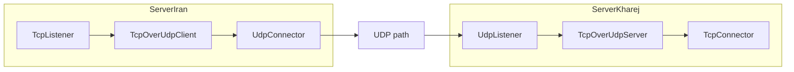

# TcpOverUdpClient

`TcpOverUdpClient` یک stream شبیه TCP را روی مسیر packet/datagram مثل UDP حمل می‌کند. این کار با KCP انجام می‌شود: payload عادی از نود قبلی گرفته می‌شود، به segmentهای KCP تبدیل می‌شود و به صورت datagram به نود بعدی می‌رود.

سمت مقابل باید `TcpOverUdpServer` باشد.

## کاربرد

وقتی مسیر transport شما packet-preserving است، مثل `UdpConnector` / `UdpListener`، اما ترافیک سمت برنامه stream است، این جفت نود کمک می‌کند stream روی UDP حمل شود.



## نمونه تنظیم بدون FEC

```json
{
  "name": "tcp-over-udp-client",
  "type": "TcpOverUdpClient",
  "settings": {},
  "next": "udp-path-node"
}
```

## نمونه تنظیم با FEC

```json
{
  "name": "tcp-over-udp-client",
  "type": "TcpOverUdpClient",
  "settings": {
    "fec": true,
    "fec-data-shards": 10,
    "fec-parity-shards": 3
  },
  "next": "udp-path-node"
}
```

## تنظیمات

| گزینه | پیش‌فرض | توضیح |
|---|---:|---|
| `fec` | `false` | فعال‌سازی Reed-Solomon Forward Error Correction روی datagramهای KCP |
| `fec-data-shards` | `10` | تعداد shardهای داده در هر block وقتی FEC فعال است |
| `fec-parity-shards` | `3` | تعداد shardهای parity در هر block وقتی FEC فعال است |

:::warning
اگر FEC را فعال می‌کنید، هر دو سمت یعنی `TcpOverUdpClient` و `TcpOverUdpServer` باید `fec=true` و shard settingهای یکسان داشته باشند. mismatch باعث decode نشدن packetها و افت شدید اتصال می‌شود.
:::

## FEC دقیقا چه اثری دارد؟

FEC یا Forward Error Correction یعنی قبل از اینکه packet loss رخ دهد، تعدادی packet parity اضافه ساخته می‌شود. سمت مقابل اگر بعضی datagramهای KCP را از دست بدهد، می‌تواند با استفاده از parityها بخشی از آنها را بازسازی کند؛ بدون اینکه منتظر retransmission معمول KCP بماند.

در تنظیم پیش‌فرض:

```text
fec-data-shards = 10
fec-parity-shards = 3
```

هر block شامل ۱۰ datagram داده و ۳ datagram parity می‌شود. یعنی در شرایط خوب شبکه، حدود ۳۰٪ packet اضافه روی مسیر بین دو نود TcpOverUdp تولید می‌شود. در عوض اگر چند packet داخل همان block از بین بروند، سمت مقابل شانس بازسازی آنها را دارد.

## چه زمانی FEC را روشن کنیم؟

FEC برای مسیرهایی مفید است که:

- packet loss پراکنده یا متوسط دارند.
- latency مهم است و نمی‌خواهید همیشه منتظر retransmission بمانید.
- هزینه پهنای‌باند اضافه برایتان قابل قبول است.
- مسیر UDP کامل مسدود نیست و datagram boundary حفظ می‌شود.

FEC برای این حالت‌ها معجزه نمی‌کند:

- packet loss خیلی شدید و bursty که بیشتر از parityهای هر block باشد.
- مسیرهایی که UDP را کامل drop یا throttle می‌کنند.
- مسیرهایی که datagramها را به stream تبدیل می‌کنند و boundary را از بین می‌برند.

## انتخاب shardها

| مثال | سربار تقریبی | توضیح |
|---|---:|---|
| `10 + 2` | ۲۰٪ | loss کم، سربار کمتر |
| `10 + 3` | ۳۰٪ | پیش‌فرض متعادل |
| `10 + 5` | ۵۰٪ | loss بیشتر، هزینه bandwidth بالاتر |
| `20 + 4` | ۲۰٪ | block بزرگ‌تر، overhead کمتر، اما recovery دیرتر و حساس‌تر به burst |

قاعده ساده:

- اگر loss کم است، parity کمتر بگذارید.
- اگر loss متوسط است، پیش‌فرض `10/3` نقطه شروع خوبی است.
- اگر loss bursty است، فقط زیاد کردن parity همیشه کافی نیست؛ اندازه block و کیفیت مسیر هم مهم است.

## مدل KCP

وقتی line ساخته می‌شود، `TcpOverUdpClient` یک session KCP می‌سازد، timer داخلی را شروع می‌کند و یک ping داخلی queue می‌کند.

payload ورودی از نود قبلی به chunkهایی تقسیم می‌شود که داخل MTU مؤثر KCP جا شوند. KCP سپس datagramهای لازم را به سمت نود بعدی می‌فرستد.

در مسیر برگشت، datagramها وارد KCP می‌شوند، payload کامل‌شده خوانده می‌شود، flag داخلی حذف می‌شود و stream بازسازی‌شده به نود قبلی تحویل داده می‌شود.

## flagهای داخلی

داخل payload KCP یک بایت flag وجود دارد:

| flag | معنی |
|---:|---|
| `0x00` | data |
| `0xF0` | ping داخلی |
| `0xFF` | close داخلی |

payload واقعی stream بعد از همین یک بایت می‌آید.

## تنظیمات KCP فعلی

این نسخه تنظیمات KCP را از JSON نمی‌گیرد. مقدارهای فعلی در کد hard-coded هستند:

| گزینه KCP | مقدار |
|---|---:|
| `nodelay` | `1` |
| `interval` | `10 ms` |
| `resend` | `2` |
| `flowctl` | `0` |
| send window | `2048` |
| receive window | `2048` |
| ping interval | `3000 ms` |
| no-receive timeout | `6000 ms` |

MTU از `GLOBAL_MTU_SIZE` گرفته می‌شود. اندازه payload مؤثر تقریبا این است:

```text
GLOBAL_MTU_SIZE - 20 - 8 - 24 - 1
```

وقتی FEC فعال باشد، overhead wire مربوط به FEC هم از بودجه packet کم می‌شود تا خروجی همچنان داخل envelope MTU بماند.

## close و timeout

- اگر سمت قبلی finish بدهد، `TcpOverUdpClient` یک close frame داخلی از طریق KCP می‌فرستد، KCP را flush می‌کند، state خودش را پاک می‌کند و سمت next را finish می‌کند.
- اگر close frame از سمت مقابل برسد، line بسته می‌شود و هر دو جهت finish می‌شوند.
- اگر حدود `3000 ms` receive activity نباشد، ping داخلی فرستاده می‌شود.
- اگر حدود `6000 ms` receive activity نباشد، line بسته می‌شود.

## backpressure

اگر queue ارسال KCP بیش از حد رشد کند، نود قبلی pause می‌شود تا حافظه بی‌رویه مصرف نشود. وقتی queue پایین آمد، resume ارسال می‌شود.

## نکته‌های مهم

- این نود باید با `TcpOverUdpServer` جفت شود.
- نود بعدی باید packet boundary را حفظ کند؛ معمولا مسیر UDP مناسب است.
- FEC فقط وقتی کار می‌کند که هر دو سمت با تنظیمات یکسان فعال باشند.
- FEC سربار پهنای‌باند ایجاد می‌کند، اما می‌تواند در loss متوسط latency و کیفیت را بهتر کند.
- این روش نسبت به TCP عادی سربار بیشتری دارد، چون هم KCP header و هم احتمالا FEC parity اضافه می‌شود.
