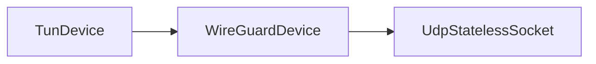

# UdpStatelessSocket

## 📖 معرفی کلی

| ویژگی              | مقدار                        | توضیح                                              |
|--------------------|------------------------------|----------------------------------------------------|
| نوع نود            | Adapter (دوجهته)             | سوکت UDP دوجهته                                   |
| لایه شبکه          | لایه ۳                    | کار با بسته‌های UDP به‌صورت stateless (بدون اتصال) |
| موقعیت در زنجیره    | ابتدا یا انتهای زنجیره        | فقط در ابتدا یا انتهای زنجیره قابل استفاده است    |
| وابستگی            | نود قبل/بعد                  | برای دریافت/ارسال داده ضروری است                  |

## عملکرد

این نود در اصل برای WireGuard طراحی شده، اما می‌تواند در سناریوهای دیگر هم به‌کار گرفته شود.

از نظر رفتاری شبیه `UdpListener` / `UdpConnector` است، با این تفاوت که:
- دوجهته است
- فقط با نودهای لایه ۳ سازگار است

روی یک IP و پورت مشخص گوش می‌دهد و از همان سوکت برای ارسال بسته‌های UDP به بیرون نیز استفاده می‌کند. بنابراین می‌تواند در ابتدای زنجیره یا در انتهای زنجیره قرار بگیرد.

و مثل نود TunDevice ؛ وقتی در انتهای زنیجر باشه پکت هایی که دریافت کنه رو به سمت چپ می فرسته و اگه ابتدای زنجیر باشه به سمت راست.

درمورد رفتار نود های اداپتر ۲ جهته در صفحه TunDevice کامل تر توضیح دادم با دیاگرام.

## ⚙️ راهنمای پیکربندی

```json
{
  "name": "node_name",
  "type": "UdpStatelessSocket",
  "settings": {
    "listen-address": "0.0.0.0",
    "listen-port": 1234
  },
  "next": "next_node_name"
}
```

### `listen-address`

آدرس IP که سوکت روی آن ساخته و گوش می‌کند.

### `listen-port`

پورتی که سوکت روی آن گوش می‌کند و از همان برای ارسال نیز استفاده می‌شود.

### تنظیمات اختیاری

| گزینه | توضیح |
|---|---|
| `interface` | محدود کردن UDP socket به interface محلی؛ در Linux معمولا با `SO_BINDTODEVICE` |
| `fwmark` | socket mark با `SO_MARK` در platformهای پشتیبانی‌شده |
| `source-ip` | override برای local bind address؛ چون همان socket هم ارسال می‌کند هم دریافت |

نمونه:

```json
{
  "name": "wg-udp-socket",
  "type": "UdpStatelessSocket",
  "settings": {
    "listen-address": "0.0.0.0",
    "listen-port": 51820,
    "interface": "eth0",
    "fwmark": 10,
    "source-ip": "192.0.2.10"
  }
}
```

---

این نود بسته‌ها را به مقصدی که در `dest-ctx` تعریف شده ارسال می‌کند؛ معمولاً این مقدار توسط نود WireGuard تنظیم می‌شود.


:::caution توجه

این نود یک نود لایه ۳ حساب میشه ؛ فقط با یه سوکت udp کار میکنه و اینطوری نیست که برای کانکشن های بیشتر سوکت جدید بسازه

کلا نباید کانکشن به سمت این نود ایجاد بشه یعنی دقیقا یک نود لایه ۳ هست که پکت هارو به سوکت udp رد و بدل می کنه.

پس یا توی زنجیر لایه ۴ قرار ندید این را یا اینکه از نود های تبادل گر به درستی استفاده کنید.

:::

---

## مثال عملی: WireGuard 🚀

اگر با WireGuard آشنا باشید، ساختاری شبیه OpenVPN دارد اما چند نقطه قوت باعث می‌شود در شرایط ایده‌آل (بدون فیلترینگ) یکی از بهترین‌ها باشد:

### 🔥 مزایای WireGuard
1. 📡 UDP: از UDP برای انتقال داده استفاده می‌کند؛ بسته‌ها یکپارچه منتقل می‌شوند (البته با MTU کمتر).
2. 🔐 رمزنگاری مدرن: بر پایهٔ الگوریتم‌های مینیمال و مدرن مانند `Curve25519` و `ChaCha20-Poly1305` است:
   - سبک و CPU-friendly
   - نیازمند هندشیک کمتر
   - امن

### 📊 ساختار WireGuard با واتروال

#### سمت کلاینت



#### سمت سرور VPN


### 🔍 چرا UdpStatelessSocket؟

علت استفاده نکردن از `UdpListener` / `UdpConnector` این است که در WireGuard از همان سوکت و پورت که با آن ارسال انجام می‌شود، دریافت هم صورت می‌گیرد.

- `UdpListener` فقط گوش‌دهنده است و نمی‌تواند آغازگر ارسال به یک همتا (peer) باشد.
- `UdpConnector` فقط ارسال‌کننده است و وقتی همتا قبل از آن بسته‌ای فرستاده، توان پردازش دریافت را ندارد.

✅ بنابراین نود جدیدی طراحی شد که از یک پورت هم ارسال کند و هم گوش دهد: `UdpStatelessSocket`.
