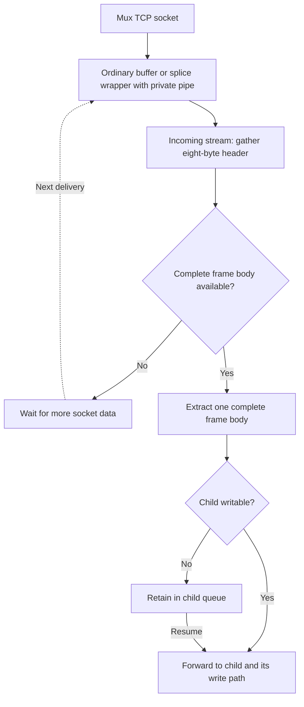

<!--
Documentation version: 165
-->

# Part 3: Buffers, Padding & Shift Buffers

If your change frames payloads, prepends a header, rewrites bytes in place, or
allocates working memory, you must understand `sbuf_t`, the buffer pools, and the
chain-wide left-padding contract. Getting this wrong produces tunnels that work in
one chain layout and corrupt memory in another.

Source of truth: `ww/bufio/shiftbuffer.h`, `ww/bufio/buffer_pool.h`, and the
`required_padding_left` field in `ww/objects/node.h`.

## The `sbuf_t` Anatomy

WaterWall payloads are carried in `sbuf_t` ("shift buffer"), a padded, shiftable
byte buffer. Its header is exactly 32 bytes and the data area is 32-byte aligned
(so AVX2 copies stay aligned):

```c
struct sbuf_s
{
    uint32_t curpos;       // offset of the current payload start within buf[]
    uint32_t len;          // current payload length, in bytes
    uint32_t capacity;     // ordinary: storage capacity; splice: logical geometry
    uint16_t l_pad;        // reserved left padding (constant once created)
    uint16_t flags;
    uint8_t  buf[];        // 32-byte aligned data
};
```

For ordinary buffers, the cursor moves inside a fixed allocation. The flag
`kSbufFlagSplice` gives the payload a different representation, described below.
The storage diagram and accessor descriptions here apply to ordinary buffers:

```text
   |<-- left capacity -->|<------- payload (len) ------->|<-- writeable tail -->|
   +---------------------+-------------------------------+----------------------+
buf[0]                curpos                        curpos+len             capacity
   |<------ l_pad ------>|
   (reserved padding)
```

- **`curpos`** moves left when you prepend (shift left) and right when you consume
  from the front.
- **`len`** is how many payload bytes are valid starting at `curpos`.
- **Left capacity** (`sbufGetLeftCapacity` = `curpos`) is how many bytes you can
  still prepend by shifting left.
- **Writeable tail** (`sbufGetMaximumWriteableSize` = `capacity - curpos`) is how
  much you can address forward from the cursor — note this is **not** the spare
  room beyond the current payload; to append `extra` bytes compare against
  `len + extra`.

### Key Accessors

| Call | Returns |
| --- | --- |
| `sbufGetLength(b)` | current payload length (`len`) |
| `sbufGetRawPtr(b)` / `sbufGetMutablePtr(b)` | pointer to the payload start (`buf + curpos`) |
| `sbufGetLeftCapacity(b)` | bytes available to prepend (`curpos`) |
| `sbufGetMaximumWriteableSize(b)` | bytes addressable from the cursor (`capacity - curpos`) |
| `sbufGetTotalCapacity(b)` | full allocation (constant) |
| `sbufGetLeftPadding(b)` | the original `l_pad` value |

### Reading and Writing

Aligned and unaligned integer helpers exist for header fields:

```c
sbufWriteUI16(b, port);            // aligned 16-bit write at the cursor
sbufWriteUnAlignedUI32(b, value);  // unaligned 32-bit write
uint16_t v; sbufReadUI16(b, &v);   // aligned read
sbufWrite(b, src, n);              // raw copy of n bytes at the cursor
sbufConsume(b, n);                 // drop n bytes from the payload tail count
sbufShiftRight(b, n);              // advance cursor: consume n bytes from the front
```

### Splice payloads: `kSbufFlagSplice`

A splice allocation keeps the common 32-byte `sbuf_t` header and exactly
32 bytes of control storage plus reserved left padding. Named metadata at the
fixed address `buf + l_pad` contains an exclusively owned `int pipefd[2]`, its
last known kernel capacity, and a monotonic capacity-retry deadline.
There is no source socket pointer or source-handle reference in the wrapper.
Access metadata and representation-level materialization through
`splice_buffer.h`; allocation/recycling lifecycle remains declared in
`shiftbuffer.h` and `buffer_pool.h`. Ordinary buffers never contain this
metadata.

`sbufCreateSplice(pad_left)` initializes `{-1, -1}` pipe descriptors without a
pipe syscall, including when pool refill allocates spare wrappers. Descriptor zero
is valid. `sbufSpliceInitPipe(buf, preferred_capacity)` lazily creates a
nonblocking, close-on-exec private pair with `pipe2`, publishing both ends only
on success. For an empty buffer, a positive preferred capacity (at most
`INT_MAX`) queries `F_GETPIPE_SZ` and requests `F_SETPIPE_SZ` if the known
capacity is smaller. Zero skips capacity negotiation. Neither a failed query
nor a rejected increase fails initialization or closes the pipe.

Undersized or unknown-capacity pairs retry during a later empty initialization,
at most once per second per pair. The capacity and retry deadline survive local
and master pool reuse and exclusive transfers between workers. Expiry does not
schedule background work: only a subsequent initialization can retry. A buffer
holding payload is never resized. Once the recorded capacity satisfies the
request, initialization skips both the clock check and capacity syscalls; larger
pipes are never shrunk. Pipe close clears the capacity and retry state so a new
pair starts fresh. Pipe creation failure returns `-1` with `errno`, leaving the
pair uninitialized; unsupported builds use `ENOSYS`.
The wrapper has one owner and serialized access. Copying metadata does not
duplicate ownership. Ordinary and splice buffers carry no generic ownership callbacks.

Checkout sets `kSbufFlagSplice`, which identifies the splice representation.
Use the inline `sbufIsSplice(buf)` helper to query it on a valid buffer; it does
not inspect payload bytes or require a pipe syscall.
Any claimed body bytes must already be in the wrapper's private pipe. There is
no separate body-location flag. An empty body may have an uninitialized pipe
or an existing empty pair; empty-body helpers need no pipe creation.
The real prefix occupies reserved headroom:

```text
prefix_bytes = l_pad - curpos
body_bytes   = len - prefix_bytes
```

Length and capacity describe logical payload, not resident bytes. Prefix
consumption advances the cursor; body consumption reduces length and logical
capacity without advancing into metadata. Prepending within advertised padding
is permitted. Inspecting or overwriting the kernel-backed body or control storage
through generic byte accessors is not permitted; those accessors do not add
splice checks. Opaque synchronous forwarding and size accounting remain valid.

`sbufGetResidentPrefixLength()` returns the addressable prefix of a splice
buffer, or the full length of an ordinary buffer. After successful pipe I/O,
`sbufSpliceConsumeBody(buf, bytes)` updates length and logical capacity together
without moving the cursor. This accounting helper does not read or discard pipe
bytes itself; use it only for bytes already removed from the private pipe.

#### Mode selection and pipe-backed reads

The core `misc.splice` boolean defaults to `true`. Setting it to `false` keeps
`chain->supports_splice` off for every chain. Finalization evaluates this startup
policy after topology expansion, alongside platform support, absence of packet
nodes, and splice support from every node. Enabling the option does not override
those eligibility checks or change node capability flags.

When splice is enabled on a supported Linux build, core startup also tries to
raise `fs.pipe-user-pages-soft`. A finite `fs.pipe-user-pages-hard` supplies the
target; an unlimited hard limit (`0`) uses 512 MiB converted to pages with the
system's page size, rounding up if needed. These live system-wide settings govern
each user's aggregate pipe-page allowance; they are not per-process resource
limits. An unlimited soft limit (`0`), or a soft value already at or above the
target, causes no change. Read/parse/write and page-size-query failures are
nonfatal. The hard limit and `fs.pipe-max-size` are never changed, and no
persistent sysctl configuration is written. A successful increase remains in
effect after WaterWall exits. Disabled splice skips this startup operation.

`wioEnableSplice()` and `wioDisableSplice()` select the read mode on the WIO's
owning worker. The WIO must be open. Selection may change before or after reads
start, including from a read callback; no read stop/restart is needed. The next
read observes the selected mode. Already delivered buffers, retained private
pipes, and queued writes keep their representations and ownership. Writes
dispatch by the buffer's representation, independently of the read mode.
Enabling on supported builds returns zero without creating a pipe; unsupported
builds return `-1` with `ENOSYS`. New descriptor adoption resets the mode.

A normal line has two one-way ordinary-read preferences, initially clear:

- `linePreferOrdinaryReadUpstream(l)` requests ordinary source reads that produce
  upstream payload: TcpListener applies it to its accepted socket.
- `linePreferOrdinaryReadDownstream(l)` requests ordinary source reads that produce
  downstream payload: TcpConnector applies it to its connected socket.
- `linePreferOrdinaryReadBoth(l)` requests both directions on the same line by
  calling the two directional helpers.

Call these helpers on the live line's owning worker. Requests may occur during
Init or later, are idempotent, and remain set for that exact line's lifetime.
There is no clear operation: one node must not undo another node's preference.
The `linePrefersOrdinaryReadUpstream()` and `linePrefersOrdinaryReadDownstream()`
queries expose the flags. A clear flag permits the adapter's normal splice policy;
it never overrides chain eligibility or the core setting.

TcpListener initially selects splice only for an eligible finalized chain, then
applies its preference after Init and before reading. TcpConnector consults its
preference when adopting the socket and again before connected reads start.
Both adapters also apply preferences at receive and payload/write callback entry,
including queued payload, write completion and read Resume. Applying a preference
only disables splice; it never re-enables it. TcpListener owns its normal line;
TcpConnector borrows it. These two sockets can share the same line and consult
different flags. No WIO pointer or ownership is stored in the line header.

These preferences are advisory, not representation guarantees. The receive
callback runs after its input was read: that delivery can still be splice, and
a preference requested while processing it may only be noticed on the following
receive. Nodes must still handle both representations and must not use the flag
as permission to inspect private pipe bytes as ordinary memory. Preferences do
not propagate to associated lines: a Mux child cannot disable its shared parent's
socket, and Mux need not materialize child payload because of a preference.
Choosing ordinary reads for a short parsing phase still applies for the rest of
the line; there is no automatic restoration after a handshake.

For NIO TCP splice reads, the read loop checks out a splice wrapper with its
private pipe already initialized by the pool and calls `splice()` directly. Each
request uses `bufferpoolGetSplicePayloadLimit()`, independently of ordinary
allocation sizes: 1 MiB in every memory profile.
There is no socket `FIONREAD` query before a
successful splice delivery. The socket and pipe are nonblocking, and the transfer
happens **before invoking the Payload callback**.

The preferred pipe capacity is that same read limit, independent of the bytes
currently ready: 1 MiB in every memory profile. Existing larger capacities are never reduced. A successful growth
request is not a promise of a full-size splice: pipe layout and available input
can still produce a shorter result. Rejected growth keeps the splice path active
with the pipe's existing capacity. Larger pipes consume the per-user pipe-page
allowance faster, including while their pairs remain cached.

Only the actual positive splice result is published as the body length. Logical
capacity becomes left padding plus that count; `kSbufFlagSplice` stays set.
A positive short splice produces a smaller valid buffer; remaining socket bytes
are handled by later reads. The requested count is an upper bound, not a promise
of a full-size transfer; a pipe smaller than the requested count remains usable.

`EINTR` retries the transfer. On `EAGAIN` or a zero result, the empty wrapper is
recycled and the loop attempts one ordinary nonblocking receive through the
best-fit path. TCP urgent data can stop splice at the urgent boundary while
`recv()` can advance and deliver subsequent ordinary bytes. With a peer FIN
already received, splice can even return zero at that boundary before those bytes
are drained. The ordinary receive confirms EOF rather than treating a zero splice
result alone as proof that the stream has no remaining data.

A successful fallback delivers ordinary bytes with the actual received length.
Ordinary `EAGAIN`/`EINTR` returns to the event loop; ordinary zero closes the stream.
Other splice errors recycle the wrapper and follow normal read-error closure.
If private pipe creation fails, checkout recycles the unused wrapper internally
and returns `NULL` with `errno`; the read loop also falls back to an ordinary
receive. None of these fallbacks has consumed socket bytes in the splice attempt.
Splice mode stays enabled for later reads.

`FIONREAD` remains an allocation hint in the ordinary receive path, including
these fallbacks. A failed or zero hint still attempts the ordinary receive.
Disabled, non-TCP, and unsupported splice paths retain ordinary behavior.

The common NIO event handler checks admission before entering the read path;
the read path checks again before delivery. If shutdown suppresses delivery
after a successful splice, WIO drains and recycles the
still-local wrapper. A missing read callback also releases the undelivered buffer.
After invoking the callback, the read path accesses neither the buffer nor the
source WIO. The callback may close/free the source immediately.

There is no FD-backed wrapper state, socket reservation, or post-callback source
reference check. WIO owns its primary descriptor directly; emitted buffers
have no dependency on that descriptor's lifetime.

#### Independent private bodies

```text
Socket -> this buffer's private pipe -> Payload callback

Buffer A -> private pipe A: [AAA]
Buffer B -> private pipe B: [BBB]
```

Every emitted splice body is independent as soon as the callback receives it.
Splice-aware code may retain the whole buffer or a partially consumed remainder
for later use, including after source WIO reclamation. No preparation call
or source reference is needed before deferral. Consume the private body through
the dedicated pipe helpers and preserve exclusive buffer ownership.

Converting B first reads BBB and leaves AAA intact, including when A is queued.
Final stream delivery must still preserve A-before-B order. Pool access remains
worker-affine; an explicitly transferred wrapper may use its receiving worker's
pool. BufferQueue preserves these owned entries. The fixed-header splice stream accepts ordinary and splice entries together;
BufferStream is ordinary-only. Callers must not scan private-pipe metadata as payload.

#### Conversion and partial reads

`sbufSpliceMaterializeToBuffer(buf, dest, pool)` replaces an ordinary
destination payload with the real prefix and body, preserving the source cursor
and total length. It checks destination capacity through sbuf accessors; the
destination's allocation geometry and left padding remain unchanged.
It recycles the consumed wrapper, which callers
must not access afterward.

`sbufSpliceReadToBuffer(buf, dest, bytes)` appends exactly the requested
prefix/body bytes. It validates source length, cursor, and destination append
space, without growing storage or consuming destination headroom. Zero bytes
is a validated no-op. The caller retains both buffers and returns the wrapper
through `bufferpoolReuseBuffer()` when finished, discarding any unconsumed remainder.

Both read helpers require `kSbufFlagSplice` and read only
from the wrapper's private pipe. A nonempty body requires an initialized pair.
Positive short reads accumulate until the required byte count is reached, and
`EINTR` retries without losing progress. Invalid flags/bounds, EOF, or any other
read error before completion use `LOGF()` and `abortProgramNow(1)`. This includes
`EAGAIN`: the private pipe must already hold all claimed bytes, so an incomplete
body cannot be deferred until more bytes arrive. These exact-size helper reads
are distinct from the read loop's socket-to-pipe transfer, whose actual positive
result determines delivery length.
Unsupported conversion and partial reads abort.

#### Recycling, discard, and physical destruction

`bufferpoolReuseBuffer(pool, buf)` takes exclusive ownership and discards any
remaining payload for ordinary and splice buffers. For a splice wrapper it calls
`sbufSpliceDiscard()` before resetting the header or entering the pool-bypass
branch in every build. When `BUFFER_POOL_DEBUG == 1`, it then verifies that the
private pipe is empty, using `LOGF()` and `abortProgramNow(1)` on failure.
WIO cleanup, BufferQueue destruction, `lineReuseBuffer()`, and `reuseBuffer()` share this behavior without
caller-side splice cleanup.

A wrapper claiming zero length must already have an empty pipe. The pool uses
`sbufSpliceIsReusable(buf)` to check kernel emptiness with `FIONREAD` only when
`BUFFER_POOL_DEBUG == 1`, including when pooling is bypassed. This check is
independent of `NDEBUG`. With pool debugging disabled, the verification and its
syscall disappear; discard remains active and recycling trusts the consumption
helpers' byte accounting. Resetting sbuf fields never empties a pipe. Normal reuse
restores physical capacity and clears transient state while preserving healthy
empty pipes. Unused empty wrappers can also be recycled directly.

`sbufSpliceDiscard()` requires exclusive ownership and leaves an empty wrapper
for recycling without freeing it. For nonempty payloads it drops the real prefix
and drains the private pipe with bounded scratch storage
and nonblocking reads, retrying `EINTR` and accepting positive short reads.
`EAGAIN` confirms emptiness. EOF or unexpected error closes both owned ends and
marks the pair uninitialized; teardown never creates a replacement. A later
transfer can recreate it.

The splice-specific destructor closes both ends exactly once and frees the
allocation without accessing the source. Cached entries have reset flags, so
local/master teardown, overflow, and geometry replacement use the known splice
tier's destructor. Incompatible-pool returns and bypass returns also close the
pair. Ordinary payload bytes must never be interpreted as descriptors.

Existing bounded local caches, bounded splice master, and four-item recharge
policy remain in force. Local shrink transfers reusable allocations to the
master; master overflow destroys them. Maximum idle pipe descriptors are bounded
by twice the sum of local splice-cache capacities and splice master capacity;
live wrappers add their own pairs.

#### Writing splice payloads

Supported NIO TCP writes accept splice buffers whose body bytes are already in
their private pipes. Empty and prefix-only wrappers need no initialized pipe.
Writing or queueing never reads the source socket. Real prefixes use send before bodies
use nonblocking splice to the destination. Actual combined progress drives
logical queue accounting. Short sends, `EAGAIN`, and `EINTR` retain the remainder
in the existing WIO FIFO, shared with ordinary writes. Queued buffers require no
source handle and remain valid after source reclamation.

Completion recycles empty wrappers. Rejection, output error, overflow, timeout,
forced close, and teardown discard private bodies through the same cleanup path.
Graceful TCP close drains the queue normally. Supported NIO UDP destinations
instead use the one-datagram path below. Generic `wioWrite()` rejects splice
input fatally on unsupported builds or destinations other than TCP/UDP;
`wioWriteDatagram()` consumes raw-IP splice input and returns `-1` with `EINVAL`.
The shared `udpSendBuffer()` returns `ENOSYS` for splice input on unsupported
builds, which never enable splice chains. Callback admission and reentrancy
follow the normal WIO contracts.

#### UDP datagram sending

`udpSendBuffer()` in the event layer retains caller ownership of the buffer on
all results, consumes accepted splice prefixes and actual pipe bytes, and returns
whole-datagram success, captured error and a separate socket-retirement verdict.
NIO and UdpStatelessSocket share it. UDP receives remain ordinary; raw-IP writes
never gain splice support. The caller runs the complete transaction and any
retirement on the socket's owning worker; the helper does not transfer ownership.
The caller supplies that socket owner's buffer pool. Any materialization fallback
uses best-fit storage with zero required left padding and returns the temporary
buffer to the same pool on success or failure. The input remains caller-owned,
including when it was posted from another worker.
All sends on that socket, including ordinary sends, remain serialized across the
transaction. No callback or other send may run while assembly is pending.

One sbuf is one datagram. Prefix-only and empty splice inputs use one ordinary
send. For nonempty bodies, send the real prefix (possibly empty) to the immutable
explicit destination with `MSG_MORE`, transfer the entire body with
`SPLICE_F_NONBLOCK | SPLICE_F_MORE`, then issue an empty send without `MSG_MORE`
to commit. These empty operations do not publish extra datagrams. Do not change
a shared socket's connection or default peer. IPv4 and mapped destinations allow
at most 65,507 payload bytes; IPv6 allows 65,527, including resident prefixes.
Route/MTU errors still belong to the kernel. There is no splitting or UDP retry
queue; ordinary sends retain their one-shot policy (UdpStatelessSocket retains
its ordinary/priming EINTR retry).

Older Linux UDP sendpage implementations have a finite skb fragment limit, so a
small logical body can still be unrepresentable when spread over many pipe slots.
A pipe-capacity bound of at most 64 KiB limits its slot count conservatively;
resident prefix pages reduce that budget, rounded down to a power-of-two number
of pipe slots. For larger or unknown-capacity pipes, a temporary non-consuming
`tee` into a pipe capped at that budget checks the bound before socket assembly. The probe pipe is closed on
every outcome. A short/refused probe selects full materialization and one ordinary
send before touching the socket. This is a layout/resource fallback; supported
layouts splice their bodies without userspace reads. Kernel-internal copies are
still possible, and no measured performance improvement is promised. The fragment
bound follows Linux's [skb fragment limit](https://github.com/torvalds/linux/blob/v5.15/include/linux/skbuff.h)
and [UDP sendpage assembly](https://github.com/torvalds/linux/blob/v5.15/net/ipv4/udp.c);
newer kernels use [splice-to-socket](https://github.com/torvalds/linux/blob/master/fs/splice.c).

Before priming, normal errors/drop policy settles the untouched input. After
successful priming, any short/failed splice or failed final commit retires the
socket through its owner. A positive short count may conceal an error that
already discarded the pending datagram, so never loop over it or send its suffix.
Account actual pipe consumption before recycling. Never clear `UDP_CORK` or
connect to `AF_UNSPEC` as an abort trick. The shared helper closes no FD itself;
its caller must prevent further writes and retire through WIO after settling the
buffer, before returning. Write/close callbacks may destroy associated lines.
See [Part 7](./part7-shutdown-and-signals.mdx#8-lines-during-drain) for socket-owned
peer cleanup.

#### BufferQueue splice ownership

BufferQueue accepts ordinary and splice buffers through its existing push, pop,
peek, reserve, and destroy API. It preserves entries, including empty entries,
and FIFO order. Logical byte accounting includes each splice buffer's real prefix
and remaining private-pipe body; it does not count control-storage capacity.

`bufferqueueGetBufLen()` reports logical bytes. `bufferqueueGetCharge()` reports
the sum of `sbufGetQueueCharge()` for entries still owned by the queue. Both are
cached O(1) totals, maintained by successful front/back insertion and pop. Empty
entries contribute charge even though they add no logical bytes. Callers choose
limits, their accounting scope, Pause/Resume decisions and overflow handling.
An optional attached `buffer_budget_t` enforces admission across one or more
queues and active reservations. Unbound queues retain their existing accounting
without a finite admission policy; parser and Mux policies remain with their owners.

Splice insertion retains the original wrapper and private pipe in every build.
It neither copies metadata as payload nor converts or consumes the body.
Splice entries must already own any claimed body bytes in their private pipes;
empty and prefix-only wrappers need no initialized pipe.
Ordinary Debug insertion
continues to replace allocations to detect stale aliases.

Successful insertion transfers ownership to the queue. Failed try-insertion
leaves the pointer, buffer, private-pipe contents, queue entries, and byte/charge
totals unchanged. Unrepresentable totals are refused before ownership transfers,
including before ordinary Debug replacement. Pop transfers ownership back to the
caller. Peek is borrowed: do not
consume or modify a queued buffer through an alias. Pop first, consume through
the splice helpers, and reinsert any remainder so queue accounting stays correct.

Destroying a nonempty queue discards remaining private bodies and recycles the
wrappers on the owning event worker, preserving healthy empty pipes. Drain errors
close the affected pair before recycling; teardown never creates a replacement.
Destroy releases only this queue's contribution to its attached budget and leaves
a valid empty, unbound queue with both totals zero. Empty queue destruction
requires no worker context. TCP adapter pause queues use these same ownership
rules; final stream delivery order remains the caller's
responsibility.

A budget tracks logical bytes, canonical queue-capacity charge and entries in O(1).
Initialize all three limits explicitly: `SIZE_MAX` is unrestricted and zero is a
real zero allowance. Admission checks representability even in unrestricted
dimensions. Empty buffers consume charge and an entry. Budgets own no buffers,
pools, callbacks or flow-control state; each lives at a stable address on its
owning worker until all attached queues and active reservations have settled.
Limits remain fixed while in use.

`bufferqueueTryAttachBudget()` requires an unbound queue and atomically admits its
existing totals before publishing the binding. It can attach populated parser
storage when that queue becomes output storage. Refusal preserves the queue and
budget unchanged. Initialize the final line-state object before attaching queues
to embedded budgets; copying a temporary with self-references is invalid.

Ordinary `bufferqueuePopFront()` releases the entry's budget cost before returning
ownership. When the same scope continues retaining a popped buffer, use
`bufferqueuePopFrontReserved()` with an empty reservation. It moves accounting to
the active owner without reducing aggregate usage or attempting new admission.
Reduce reservation bytes as plaintext or WIO progress is consumed, before reentrant
callbacks can admit more input. Retained capacity and the entry remain charged
until responsibility ends. Release clears the reservation; empty release is safe.
Never copy one live reservation into two independently released owners.

Same-budget `bufferqueueTryPushFrontReserved()` and `bufferqueueTryPushBackReserved()`
reserve destination storage before transferring accounting, without charging twice.
Their reservation must match the actual buffer cost; reconcile any consumption
first. Failure preserves the buffer and reservation; success clears the reservation.
`bufferqueueReserveExtra()` reserves deque slots only, never budget allowance.

Whole-queue moves carry the binding and both cached totals by assignment, then
initialize the relinquished source empty and unbound. Destroy an empty destination's
storage before overwriting it. Never reset a populated queue to erase accounting.
Destroy all queues and release all active reservations before asserting an embedded
budget empty and clearing its owner. Recreated queues must attach explicitly again.

BufferStream accepts ordinary entries only. The fixed-header splice stream owns
mixed representations for Mux; NIO's internal WIO FIFO stores owned wrappers directly.

## Prepending a Header: `sbufShiftLeft`

The whole reason `l_pad` exists is so a tunnel can prepend a protocol header
**without reallocating or memmoving** the payload. You move the cursor left and
write into the freed space:

```c
// Reserve room and move the cursor back by header_len bytes.
assert(sbufGetLeftCapacity(buf) >= header_len);
sbufShiftLeft(buf, header_len);     // curpos -= header_len; len += header_len

// Now write the header at the new front.
sbufWriteUI16(buf, htons(payload_len));
// ... fill the rest of the header ...
```

`sbufShiftLeft` asserts that enough left capacity exists:

```c
static inline void sbufShiftLeft(sbuf_t *const b, const uint32_t bytes)
{
    assert(sbufGetLeftCapacity(b) >= bytes);
    b->curpos -= bytes;
    b->len    += bytes;
}
```

If the assertion fires (or, in a release build, if you shift left past the start),
you have prepended more than your padding budget allows — which is the next
section.

## The Padding Contract: `required_padding_left`

A tunnel may only rely on left padding it **advertised** in its `node.c`:

```c
.required_padding_left = kMyProtocolHeaderSize,
```

During chain finalization, the runtime sums `required_padding_left` across every
node in the chain and reserves that much left padding in the buffers it hands out
(`tunnelchainInsert` accumulates `sum_padding_left`; `tunnelchainFinalize` calls
`globalstateUpdateAllocationPadding`). In other words:

> The left capacity available to your tunnel at runtime is the sum of the padding
> budgets of **your tunnel and every tunnel closer to the adapter that produced
> the buffer**. If you prepend bytes you never advertised, you are spending
> someone else's budget, and the buffer may not have it in a different chain.

This is why a framing tunnel that "works on my machine" can corrupt memory once a
user puts a different node in front of it. Advertise what you prepend.

Rules:

- Use `sbufShiftLeft()` only when `sbufGetLeftCapacity()` is at least the header
  size you need.
- Keep every prepend within this tunnel's advertised `required_padding_left`.
- If you must prepend more than your budget, either raise
  `required_padding_left` to match, or build a fresh buffer (see below) instead of
  shifting.

## Buffer Pools

For ordinary runtime buffers, do not `malloc`. Use the worker-local buffer pool so
allocations are recycled and correctly padded. The pool is reachable from any
line:

```c
buffer_pool_t *pool = lineGetBufferPool(line);     // this line's worker pool

sbuf_t *big   = bufferpoolGetLargeBuffer(pool);    // ordinary read/working buffer
sbuf_t *medium = bufferpoolGetMediumBuffer(pool); // 32 KiB in S1/S2, 64 KiB in higher profiles
sbuf_t *small = bufferpoolGetSmallBuffer(pool);    // small working buffer
sbuf_t *splice_buf = bufferpoolGetSpliceBuffer(pool); // ready private pipe, or NULL on pipe failure

// ... use the buffer ...

bufferpoolReuseBuffer(pool, buf);                  // return it to the pool
lineReuseBuffer(line, buf);                        // convenience: pool of line's worker
```

Pools are **per worker**. A line belongs to exactly one worker (`lineGetWID`), so
always use that line's pool — never a different worker's. Buffers from a pool
already carry the chain's reserved left padding, so a pooled buffer is the correct
place to build a payload you intend to prepend onto.

Each buffer pool has large, medium, small, and splice caches backed by separate
shared master pools. `bufferpoolCreate()` takes those four master pools in that
order, followed by the cache width and explicit large, medium, and small payload
capacities, then the independent splice payload limit and waiting-budget basis.
Both independent values must be in `[1, INT_MAX]` and stay fixed after construction.
Each pool stores its own settings; device pools inherit all five from their worker pool.

Worker and device pools select their local width with `PROPER_BUFFER_POOL_WIDTH()`;
it applies to all four local tiers. Ordinary masters use twice that width as their
constructor argument, while the splice master uses twice the full RAM-profile
value to retain reusable pipes. Master constructors double their argument, giving
these actual entry capacities:

| Profile | Local width | Each ordinary master | Splice master |
| --- | --- | --- | --- |
| S1 / `minimal` | 1 | 4 | 4 |
| S2 | 4 | 16 | 16 |
| M1 / `client` | 8 | 32 | 32 |
| M2 / `client-larger` | 32 | 128 | 128 |
| L1 | 64 | 256 | 512 |
| L2 / `server` | 128 | 512 | 1024 |

Local pointer arrays hold twice the selected width per tier. Recycling shrinks a
tier once its cached count exceeds `floor(4 * width / 3)`, transferring up to one
width of entries to its master; a full master destroys overflow. These are idle
cache bounds, not limits on active allocations. The RAM-profile enum values,
non-buffer pools, buffer sizes and independent limits retain their own sizing.

Payload capacities, excluding reserved left padding, are:

| Tier | Capacity | Use |
| --- | --- | --- |
| Small | 4 KiB | Small ordinary payloads and control messages |
| Medium | 32 KiB in S1/S2; 64 KiB in M1/M2/L1/L2 | Framing, retained queues including paused Mux children, and best-fit reads |
| Large | 64 KiB in S1/S2; 128 KiB in M1/M2/L1/L2 | Ordinary event-loop read buffers and larger working payloads |
| Splice storage | 32 bytes of control storage | Explicit splice wrappers; logical body size is independent of allocation size |
| Splice payload limit | 1 MiB in every profile | Socket read limit and preferred pipe capacity; kernel growth is best effort |

S1 and S2 share buffer sizes but retain different profile-based local and master
cache capacities; S1 caches fewer allocations. Higher profiles retain 64 KiB
medium and 128 KiB large buffers. Their independent splice target remains 1 MiB.
Linux NIO ordinary TCP/UDP reads select an
ordinary tier through best-fit allocation when a positive size hint is available.
Medium buffers also serve nodes and retained queues. Mux selects the smallest
fitting ordinary tier; a full 1 MiB frame requires dedicated ordinary storage in
every profile. The wire payload maximum remains 1 MiB.

`bufferpoolGetBestFit()` selects the smallest ordinary tier that satisfies both
payload and padding requirements, comparing actual sizes across small, medium,
and large. If no tier fits, it creates a dedicated padded buffer that is destroyed
on return. `bufferpoolTryGetBestFit()` accepts a 64-bit computed length and returns
`NULL` for unrepresentable geometry before using the same allocation path. Neither
helper shrinks an existing buffer. Splice allocation stays explicit.

The 128 KiB tier is not a maximum payload or total-memory limit. Smaller pooled
allocations do not cap process memory, kernel pipe memory, frame sizes, or
dedicated ordinary allocations. Frequent large materializations can incur
allocation/free work; these sizes make no throughput guarantee.

Materialization callers must request the complete logical payload plus required
headroom, including real prefixes, residual padding and any destination bytes
already present. Low-level conversion helpers do not grow caller storage. For
example, 600 KiB requires dedicated ordinary storage with a 128 KiB large tier;
a pipe with 1 MiB capacity holding only 20 KiB needs storage for its logical bytes,
not its kernel capacity. Dedicated buffers above all tiers are destroyed on
recycling, while consumed splice wrappers return to their separate splice cache.

Each tier refills at most four buffers at a time, further bounded by half the
local cache capacity and its available slots. Pools whose previous refill batch
was smaller than four retain that smaller batch. Cache capacities and shrink
thresholds are independent of this refill limit.

`bufferpoolGetSpliceBufferStorageSize()` and `bufferpoolGetSpliceBufferPadding()` expose
the splice geometry. `bufferpoolUpdateAllocationPaddings()` accepts separate
large, medium, small, and splice padding arguments. Global chain-padding updates cover
all four tiers, and device pools inherit each tier's padding value from their
worker pool. Set padding before populating the local caches.

The existing `lineGetBufferPool()`, `getWorkerBufferPool()`, and
`getCurrentEventWorkerBufferPool()` accessors expose every tier through the same pool, including
`bufferpoolGetMediumBuffer()` and `bufferpoolGetSpliceBuffer()`. `lineReuseBuffer()` and `reuseBuffer()` use the same
recycling path as `bufferpoolReuseBuffer()`, subject to their existing worker
ownership requirements. Recycling clears flags and length; for a splice wrapper,
it first restores physical capacity from the 32-byte control storage and its
reserved padding. Checkout restores `kSbufFlagSplice`.

`bufferpoolGetSpliceBuffer(pool)` initializes the selected wrapper's nonblocking,
close-on-exec private pipe before returning it. It requests the pool's independent
`bufferpoolGetSplicePayloadLimit()`, preserving the capacity
retry policy above. Pipe creation failure returns `NULL` with the original
`errno`, after internally recycling the unused wrapper; unsupported builds return
`NULL` with `ENOSYS`. Callers must handle this result before accessing the buffer.
A failed capacity query or increase still returns a usable buffer. This also
applies when pooling is bypassed, where failure destroys the unused wrapper.

Refill only allocates control storage; it never creates pipes for spare wrappers.
Empty private pipe pairs survive pool reuse and close on physical destruction.

If you need a buffer bigger than the current one for an append, use
`sbufReserveSpace()` (it reallocates and copies only when necessary) rather than
hand-rolling growth.

`sbufCreateSplice(pad_left)` directly allocates an empty buffer with exactly
32 bytes of payload capacity, plus left padding rounded up to a 32-byte
boundary. Its payload capacity stays at 32 bytes regardless of the CPU cache
line size. The buffer starts with zero length, only `kSbufFlagSplice` set; `sbufDestroy()` releases a live splice allocation and its private pipe.
Cached splice-tier entries use `sbufDestroySplice()` even with reset flags.

### Ordinary TCP and UDP receive sizing

On Linux, NIO uses `FIONREAD` as an allocation hint for ordinary TCP and UDP
reads. A positive TCP count is capped at the pool's large payload size before
calling `bufferpoolGetBestFit()`. The receive can fill the chosen buffer; any
remaining stream bytes stay queued for later reads. A TCP splice fallback obtains
this hint only after pipe creation fails or splice makes no progress.

For UDP, the hint is the full size of the next datagram, not the sum of queued
packets. Best-fit requests that complete size without the TCP cap. It can select
a larger tier or dedicated storage if the datagram exceeds a custom pool's large
tier. Each receive still delivers one datagram. The socket has one serialized
reader between the query and receive.

Both paths request at least the large tier's reserved left padding, so a smaller
tier with insufficient padding is ineligible. A failed or zero ordinary size query
falls back to the original large-buffer receive. Zero never skips the receive:
it may represent an empty UDP datagram, TCP EOF, or transient readiness. The
actual receive result determines the published length, and Linux UDP truncation
detection still drops incomplete datagrams. Small/medium/large allocation is not
an application message-boundary guarantee for TCP.

Other NIO socket types and non-Linux/IOCP receive paths keep their existing
allocation policy. The splice representation and its separate pool are unchanged.

### Sizing Destination Buffers for Untrusted or Variable Payloads

When sizing a destination buffer from an untrusted or variable payload length:

- Use `bufferpoolGetBestFit()` (or another checked growth operation) rather than
  assuming a fixed buffer tier fits the input. Supply the left padding required
  by the onward buffer contract as well as the payload capacity: when no
  pool tier fits, best-fit creates a dedicated buffer with exactly the requested
  padding. Request zero only for a locally consumed buffer or a proven
  zero-padding destination.
- Compare the requested length with actual writable capacity
  (`sbufGetMaximumWriteableSize()`) in ordinary Release control flow before any
  assert-only length mutator (such as `sbufSetLength()`) or write.
- Publish the `sbuf_t` length only after the producer has successfully written or
  validated that many bytes.

## Buffer Ownership

Buffer lifetime bugs are as common as line lifetime bugs. The rules:

- **A callback takes ownership of the buffer you pass it.** After
  `tunnelNextUpStreamPayload(t, line, buf)` (or the downstream form), `buf` is no
  longer yours. Do not read it, reuse it, or free it.
- **If you keep a buffer, you own it.** You are responsible for eventually
  recycling it with `bufferpoolReuseBuffer` / `lineReuseBuffer`, or handing it to
  a callback.
- **On an error path that still owns a buffer**, return it to the pool (or the
  line) before you close. Do not leak it, and do not touch it after the line dies.
- **If a re-entrant callback killed the line** (a `false` from
  `lineCallWithRef()` / `lineCallWithRefWithBuf()`), only recycle buffers you still hold; do not touch the dead
  line's state to do it.

### BufferStream representation, inspection, and extraction contracts

`buffer_stream_t` accepts **ordinary resident buffers only**. Use its views,
CRLF searches, exact/at-least/full reads, and `IdealRead()` only on ordinary
input. Logical stream entries are storage boundaries, not protocol records.
Push owns its input and preserves bounded ordinary coalescing: a positive input
of at most 4 KiB may append to a tail with sufficient spare space. Exact reads
preserve checked lengths and the explicit `use_left_padding` budget. Both stream
implementations operate exclusively on bytes and owned buffers. Fragment
assembly belongs to the device reader session; no claim, callback, sidecar token,
or hidden padding metadata follows a packet through buffer transforms.

`bufferstreamMoveExactBytesTo()` validates the source range and destination append
space before consumption. It appends into sufficient caller-owned ordinary
storage without growing/replacing it or spending additional headroom.

Views and searches consume no bytes. Bounded searches examine only
`[0, min(buffered, bound))`: a delimiter ending exactly at the bound matches;
a delimiter crossing it does not. `FindCRLF` returns the CR offset and
`FindDoubleCRLF` returns the offset after the delimiter. No-match leaves the
output offset unchanged. `FindDoubleCRLFWithin` requires ordinary bytes.
HTTP parsers remain ordinary-only. HttpClient and HttpServer do not advertise
splice support. HttpProxyServer establishes an ordinary-memory boundary at
payload admission: only a complete, immediately forwardable splice wrapper in
ready CONNECT/fallback relay bypasses materialization. Every input, output,
deferred and active incoming session slot is ordinary. Parsing, transitions,
Pause and reentry materialize the complete delivery through the shared splice
read helper, preserving onward padding. The temporary ordinary input is at most
`P + D` logical bytes and meets the existing remainder allocation bound based on
`max(small_capacity, 2 * D)`, plus padding, alignment and sbuf header. Existing
admission limits what survives return; conversion adds no persistent allowance
and makes no RSS or copy-cost guarantee.

### Fixed-header splice stream

`splice_stream_t` in `ww/bufio/splice_stream.{h,c}` owns a FIFO, an explicit active
head, an immutable header size and a trailing resident header cache. It borrows
its owner-worker pool. Construction checks object
allocation arithmetic. Mux parents use an eight-byte header cache; Mux children
have no receive stream. Bgp4Client and Bgp4Server use a 19-byte cache for marker,
length and type. BGP OPEN inspection consumes only ten fixed bytes and up to 255
optional bytes through representation-aware range helpers. Application bodies
remain eligible for private-pipe extraction and per-frame delivery. BGP uses a
fixed 2,162,705-byte logical budget per direction and a 1,024-frame output cap;
incoming fragment count is unrestricted. Its permission-aware pumps retain FIFO
order across Pause/Resume and reentrant callbacks, including producer Resume
when the next header or body is incomplete.

`splicestreamPush()` takes ownership on every result. It reserves fallible FIFO
metadata before consuming any new header bytes; refusal recycles the submitted
input while preserving existing bytes and costs. Empty inputs recycle immediately.
Ordinary bytes, real resident splice prefixes and private pipe bodies maintain
FIFO order. Push physically removes only missing header bytes from sources and
recycles exhausted sources. The header cache owns only bytes.

`splicestreamPeekHeader()` returns a borrowed cache pointer only when complete;
the pointer expires on mutation. Repeated peeks perform no I/O or allocation.
`splicestreamLength()` includes cached header bytes; `splicestreamBodyBytes()`
returns zero until the header is complete, then counts all following bytes.
Neither peeking nor waiting for a body refills a second header.

`splicestreamMoveFrame(stream, destination, N)` consumes the current cached header
**and exactly N body bytes**. Header readiness and complete body availability are
caller preconditions, together with an empty destination; Debug asserts these
without repeating the decoder's availability checks in Release. The supplied
destination transfers ownership; always use the
returned pointer because fallback may recycle/replace the supplied allocation.
A NULL destination selects ordinary output, including after failed pipe checkout.
The result preserves full onward pool padding. Ordinary-only ranges remain
ordinary. `splicestreamMoveFrameToOrdinary()` has the same caller preconditions
and retains fatal checks for ordinary destination type and sufficient storage
before consuming; it never grows or replaces the destination.
After the body completes, the stream clears its cache and gathers only the next
header. N=0 consumes one zero-body frame. With header size zero, extraction is an
exact body move with no header discard or look-ahead.

Pipe-backed extraction can split one source pipe or combine several independently
owned sources into a new private pipe. Whole suitable wrappers transfer directly.
Ordinary ranges and real prefixes copy/write in order; pipe bodies use nonblocking
pipe-to-pipe `splice()`. Positive short progress accumulates and EINTR retries.
Only successful transfers advance lengths; body consumption never moves the cursor
into metadata at `buf + l_pad`. No descriptors have two owning wrappers.

Pipe destination capacity is fallible: nominal `F_GETPIPE_SZ` does not prove slot
availability. Creation/growth failure, unsupported destinations and destination
pressure select complete ordinary fallback, not process termination. Allocate the
final best-fit result first, drain only the actual assembled destination bytes,
then append the still-unmoved source range. Return exactly N ordered bytes once,
leaving unrequested suffixes intact. Missing claimed source bytes or invalid owned
descriptors remain fatal invariants. Exact transfer primitives live in
`splice_buffer`, independently of Mux and the event loop.

### Protocol storage and admitted batches

Choose storage by the work it represents: incomplete metadata/body, a protocol
wait, an initialization/reentrancy ordering barrier, delayed replay, or an
association's independent producers. An otherwise-ready synchronous TCP buffer
must not acquire another output queue solely for Pause or Est. See
[Part 2's admission contract](./part2-lines-and-callbacks.mdx#flow-control-roles-and-admission).

Middle tunnels that need an application-data backlog use a default budget of
**2 MiB logical bytes and 1,024 buffers per retention budget**. Count queued buffers
and active backlog buffers still retained under that budget; multiple queues
sharing it do not each receive a separate allowance. This is a hard admission
limit, not a universal payload-size limit, a memory/RSS limit or a Pause threshold.
Do not create a queue on an otherwise-ready synchronous forwarding path just to
apply the default.

Protocol parsers, frame allowances, ciphertext shaping and transport/Mux storage
retain their own explicit bounds. Explicit node-specific application-backlog
limits take precedence over the default. For example,
[Socks5Server](../02-noderefs/Socks5Server.mdx) retains its 1 MiB /
1,024-buffer ordering limit per direction, and
[ConnectionFisherClient](../02-noderefs/ConnectionFisherClient.mdx) retains its
1 MiB selection backlog. Socks5Client follows the default application-data limit;
its separate 4,096-byte handshake-input limit remains unchanged.

TrojanClient, TrojanServer, VlessClient and VlessServer also use a **2 MiB logical-byte base
budget** for their necessary parser state. Input fragments have a byte
bound plus bounded parser metadata; do not apply an output-datagram count limit to
fragments of one incomplete frame. Empty queued datagrams consume output entries.
A parser's active head, cached header and queued sources are charged exactly once.

| Necessary retained state | Byte limit |
| --- | --- |
| Protocol/order/replay or output backlog in these four nodes | 2,097,152 bytes; 1,024 output/backlog entries |
| Trojan UDP input, including partial-frame/header state | 2,105,607 bytes: 2 MiB plus the 8,455-byte maximum incoming frame |
| TrojanServer initial request assembly | 2,105,607 wire bytes; incomplete-initial policy remains 4,096 bytes |
| VlessClient TCP response assembly | 2,097,409 bytes: 2 MiB plus 257 response metadata bytes |
| VlessServer request/UDP input, including active head and cached metadata | 2,162,689 bytes; incomplete-initial policy remains 4,096 bytes |
| VlessClient UDP input, including pending response/frame metadata | 2,162,689 bytes: 2 MiB plus the 65,537-byte maximum frame |

Equality is accepted. Overflow or failed queue admission settles only the affected
flow/association; private-pipe pressure instead uses the shared ordinary fallback.
Remove consumed metadata before applying a remaining-body/backlog budget. The
incomplete-initial limit must not reject a complete header coalesced with body.
These logical limits do not measure RSS or descriptor use. Receiving adapters and
Mux additionally bound entries or allocation/queue charge for the many outputs a
single coalesced input can produce, including empty datagrams.

TlsClient's pre-handshake application queue and RealityClient's early application
queue follow the default 2 MiB / 1,024-entry bound. They represent a real protocol wait,
including application data admitted before TCP Est. Their later plaintext release
is an independent FIFO drain that honors Pause; it is not part of the final
handshake input's synchronous batch. Keep ciphertext-shaping budgets separate.

An admitted input batch is not a newly allocated array of all decoded outputs.
Decode and transfer each complete frame in order, continuing after Pause for the
remainder of this accepted input while the exact lines remain live. Hold only an
incomplete suffix or data genuinely blocked by protocol/reentrancy. Stop on Finish,
malformed input or receiver closure; never exceed a receiver's hard limit just to
finish the batch. A separately scheduled or deferred backlog drain honors Pause.

### HalfDuplex setup and direct forwarding

HalfDuplexClient must combine its 17-byte upload intro and complete first input
into one ordinary best-fit buffer with full onward padding. Consume splice input
through exact representation helpers, including any resident prefix before its
private-pipe body; never treat logical length as pointer accessibility. Its
separate download intro is ordinary. Both intros and the publication guard exist
before callbacks. Empty input retains the same first-Payload timing. The existing
Init/intro FIFO may own splice wrappers and retains its inclusive 2 MiB / 1,024
buffer policy. Later payload in both directions transfers the original wrapper.

HalfDuplexServer must materialize whole deliveries in unknown and waiting-upload
states before parsing or retention. Its buffering slot is always ordinary,
including body bytes accompanying an intro. Check combined lengths and reserve
full onward padding before merging. Pair an available peer before applying the
existing waiting-upload limit. Strip exactly 17 ordinary bytes and replay the
retained body before direct traffic. After startup replay, upload and return traffic remain
representation-blind; download-side extra input is recycled without reading its
body. Conversion refusal removes any waiting map entry and releases retained input
before finishing the borrowed half through its owner.

The owned server main line publishes startup ownership before next Init: a separate
ordinary initial body, an Init/replay barrier, permission state, and a budgeted
FIFO for later input. Both transport halves (including a PipeTunnel companion)
remain borrowed. Reentrant upload must join that FIFO while the barrier is active,
even when the role enum already indicates direct upload. The initial body retains
its previous admission and is not charged to the new FIFO budget.

The later-input budget has inclusive 2 MiB logical bytes, 2 MiB canonical
allocation charge, and 1,024 entries. Initialize it and attach its queue at their
final stable addresses. Empty entries consume charge and entries. Materialize each
retained splice delivery fully with checked best-fit storage and onward padding;
refusal closes the association. Ready deliveries have no new cap or transport
queue. The waiting-map policy and HalfDuplexClient's policy are unchanged.

Replay cannot run inside next Init or recursively inside initial-body dispatch.
It waits while next is paused, detaches the initial body before handing it off,
then rechecks exact main/upload/download life and associations. Keep the barrier
active across that first handoff. Prepare the entire currently queued tail without
outward callbacks, reusing a sole entry or coalescing multiple entries into checked
ordinary storage. Release queue charges as ownership moves into this bounded
scratch. Clear the barrier immediately before the final tail handoff, so any
nested direct input follows all older bytes already handed to next. Do not loop
through a FIFO that callbacks can continuously refill or require a future input
to make progress. Materialization and coalescing overlap are not an aggregate
physical-memory bound.

Next-side Pause publishes permission and source notification state before
callbacks. Resume during Init/replay records permission without bypassing the
barrier. Release source Resume only after older startup output is handed off and
next remains writable. Publish notification state before callbacks and retain and
recheck all exact association lines. Every close origin releases main-owned
initial/FIFO storage, verifies empty budget usage, and detaches associations before
outward Finish; internal refusal finishes all initialized affected sides, while a
received Finish never reflects toward its sender. The owned main dies before its
Finish handler returns. Preserve the existing sibling-close scheduling fallback.

PipeTunnel transfers the wrapper through worker messages without inspecting its
body. The already-inspected intro is replayed as ordinary memory on the target
worker. Private-pipe bytes survive source closure; canceled messages destroy the
wrapper without borrowing a foreign worker's pool. No permanent ordinary-read
preference is needed for either HalfDuplex node.

### Client first-payload requests

TrojanClient and VlessClient assemble their initial request and the entire first
eligible application payload in **one ordinary best-fit buffer**. Write request
bytes into payload storage and append the source with the shared exact range
helpers, preserving any existing resident prefix and fully materializing a pipe
body. Do not spend another node's padding or leave the body in a splice wrapper
for this first combined transfer. Later opaque TCP preserves buffer identity and
splice representation where the existing helpers permit it.

Each client exposes `first-payload-timeout-ms`, a nonnegative integer defaulting
to **400**. A valid payload after next Init triggers the combined request immediately,
even before transport Est. If no request has been sent when Est arrives, establish
the deadline then; paused time counts. At expiry, a header-only request becomes due
and waits for Resume if its consumer is paused. Zero disables deliberate waiting.
An already-available eligible payload is still combined; expiry never forces it
into a second send if the request has not yet been submitted.

The timer is an independent producer. A synchronous admitted input can complete
its combined handoff under the in-flight contract even when a timer-generated send
would have to wait. Publish request admission before forwarding, cancel the timer,
and never send a second header. Empty TCP input does not trigger a request or
restart the deadline. UDP eligibility follows the protocol's own datagram rules.

Keep full onward padding in the new allocation: TrojanClient advertises **263**
bytes for subsequent UDP headers; VlessClient advertises **2**. UDP first output
contains the initial request, one datagram frame header and that complete body.
Its later datagrams prepend once within the existing budget. Header-only timeout
output has ordinary best-fit storage with onward padding. No queue or extra timer
is needed just to await Est or a peer response before outbound submission.

First-buffer construction can transiently add the actual request/frame headers
to a selected retained payload's size. That finite construction overhead is not
permission to hide a second retained output queue. Nested clients add headers and
repeat assembly; a normal 1 MiB splice delivery plus 64 maximum-size Trojan headers
adds only 20 KiB, within the 2 MiB retained-input base budget. One ordinary output
buffer does not promise one syscall, TCP packet or TLS record.

### TrojanClient variable headers and opaque TCP

The initial request is 68 bytes for IPv4, 80 for IPv6, or 65 plus domain length,
at most 320. UDP association uses `0.0.0.0:0`, a 68-byte initial request. The first
combined UDP output also includes `ATYP ADDR PORT LEN CRLF` for its datagram.
Subsequent upstream datagrams are wrapped inline; insufficient headroom uses
`sbufMoveRangeTo()` with full onward padding and preserves its returned pointer.

UDP receive caches at most 263 header bytes: 11 for IPv4, 23 for IPv6, or 8 plus
domain length. Consume only required metadata with `sbufReadRangeToMemory()`.
Validate address, nonzero port, CRLF and the 8,192-byte body bound before extraction.
Never retarget the application from a received source address. A zero-length body
is a valid datagram, including as the first application payload. Oversized local
UDP is dropped without triggering the first request; malformed carrier frames close
that association. Complete current-input datagrams continue after Pause; only an
incomplete suffix or a genuine protocol/ordering barrier is retained.

### VlessClient response transition and UDP framing

The initial request is 26 bytes for IPv4, 38 for IPv6, or 23 plus domain length,
at most 278. UDP frames contain a two-byte big-endian body length and no address.
Valid bodies are 1 through 65,535 bytes. Local empty/oversized datagrams are dropped
without triggering the initial request; a received zero length is malformed.

Response parsing caches at most 257 metadata bytes. Consume exactly the two fixed
response bytes and the indicated addons before body delivery. Version must be zero;
nonempty addons are accepted/skipped with the existing warning. TCP then stops
interpreting headers; preserve a coalesced body in its representation without
waiting for Est or building a separate ready-output queue. UDP gathers its exact
length header and extracts one complete body at a time, including every complete
frame in the accepted input after Pause. Retain the incomplete suffix.

Whole suitable bodies transfer directly. Split/mixed bodies use shared exact range
movement and preserve the returned replacement pointer, unrequested suffix and full
onward padding. Mutate only a popped, locally owned active head. Metadata, active
input and queued sources remain charged once until consumed.

### TrojanServer request inspection and retained wire bytes

Initial parsing caches at most 320 resident header bytes. Preserve authentication
and fallback policy: the first callback's logical length must include all 56 hash
bytes, even if splice-backed; validate available hex/CRLF before authentication and
cache successful lookup. Post-authentication malformed input closes the protected
flow. Rejected unauthenticated input replays every inspected byte before its untouched
tail, with replay ownership secured before fallback Init. Do not read opaque TCP
body merely to fill a maximum-sized header cache.

After selecting and initializing CONNECT, ordinary body/reply forwarding is inline;
retain only input needed to preserve ordering across branch Init or nested callbacks.
UDP stages address/port/length/CRLF with at most 263 metadata bytes and the existing
8,192-byte incoming-body maximum. A complete current-input datagram is submitted
through its selected backend even after Pause; the receiver owns bounded tolerance.
Keep only incomplete input or actual initialization/protocol-ordering state. Replies
preserve their distinct 65,535-byte backend-body maximum and prepend at most 263 bytes.

A necessary association reply FIFO accounts encoded wire bytes and datagram entries
under the 2 MiB / 1,024 limits. Live initialized backend replies have no Est waiter.
Immutable replies already accepted into the client FIFO belong to that FIFO, not to
a borrowed backend pointer. Its independent drain honors Pause; inline forwarding
of an already-admitted backend reply follows the synchronous batch rule.

Delayed fallback retains a real bounded backlog, including inspected replay bytes.
Its scheduled drain and narrow source-Finish final batch use exact representation-aware
assembly, sole-buffer transfer where suitable, and complete ordinary fallback. Those
independent/final drains retain their permission and no-reflection obligations.

### VlessServer request inspection and replay

VlessServer borrows the client normal line and owns only its fixed-destination UDP backend. It caches at most 278 request
metadata bytes, consuming only the next required field through shared range helpers. The first callback must contain
17 logical bytes (version plus UUID), regardless of resident/pipe boundaries; shorter or empty input takes fallback/reject.
Cache successful authentication. Nonzero request addons remain unsupported once their advertised bytes arrive;
post-authentication malformed input closes rather than replays. Remove accepted metadata before body budgeting.

One guarded mixed-input FIFO and popped active head preserve old body bytes across Init and nested input. TCP output
and fallback replay share a 2 MiB / 1,024-entry upstream budget; the response-header/reentry FIFO has its own equal budget.
Attach populated parser storage transactionally only when it becomes output. Parser bytes include cached metadata,
active head and queued sources exactly once, without an output-entry limit on incomplete UDP fragments.

Fallback restores all inspected bytes before untouched tails before branch Init. No drain or final batch runs inside Init.
Zero-delay admitted handoff follows synchronous input rules; delayed or independently retained replay honors Pause.
Sole suitable buffers transfer directly; mixed batches use exact range movement with complete ordinary fallback.
UDP gathers exactly two length bytes, rejects zero, extracts 1..65,535 body bytes with full onward padding, and leaves
following frames untouched. Complete accepted frames continue after Pause. Replies prepend only the advertised two bytes;
insufficient headroom uses shared movement, preserving any resident prefix and private body. Empty/oversized local replies
drop without closing the backend. The single `00 00` response precedes every protected body, including pre-Est replies;
Est remains prompt and independent of header readiness and output Pause.

### MUX parent streams and decoded child queues

Mux uses this exact eight-byte wire header, separate from decoded host fields:

| Offset | Size | Meaning |
| --- | --- | --- |
| 0 | 3 bytes | Unsigned payload length, big-endian. |
| 3 | 1 byte | Frame type/flags. |
| 4 | 4 bytes | Unsigned connection ID, big-endian. |

The inclusive payload maximum is **1 MiB (1,048,576 bytes)** for every frame
type, independent of RAM profile, buffer sizes and requested or granted pipe
capacity. A maximum frame occupies 1,048,584 wire bytes; a preceding Open adds
another eight bytes (1,048,592 total). Decoding rejects a larger declaration as
soon as all eight header bytes arrive, even for unknown CIDs or types, and closes
only that parent through normal parent-loss cleanup. Permitted frames wait for
the complete body; unknown frames consume their declared body and empty Data
still produces one delivery. Complete frames drain before the incomplete
remainder is checked against **1,048,584 bytes**, including its cached header.

Open=0, Close=1, FlowPause=2, FlowResume=3 and Data=4 retain their meanings; CID
uses the full 32-bit range. The serializer uses `mux_wire_header_t`; decoded
`mux_frame_t` has a 32-bit length and must never be copied as wire bytes.
Both Mux decoders wait for the complete permitted body. Extraction
returns only the body: do not shift away another eight bytes. Control/unknown-CID
frames consume their declared bodies too. Data delivers once per wire frame,
including empty Data. Paused children retain one queue entry per frame. After
callbacks, physical references protect allocation life and logical life/state
checks decide whether sibling parsing may continue.

MuxClient owns normal parent lines and borrows children. MuxServer borrows parents
and owns children created on Open. Splice support changes neither direction nor
Finish/lifetime rules. Complete frames in a large delivery drain before checking
the logical incomplete-carrier overflow limit.

#### Queue-capacity budgets

Mux uses one **queue-capacity charge** for every owned buffer:

```text
sizeof(sbuf_t) + sbufGetTotalCapacity(buf) + kSbufAllocationAlignment
```

Capacity includes reserved left padding. Ordinary entries therefore retain their
allocation-based charge; splice entries charge logical sbuf capacity, without
adding wrapper control storage or kernel pipe capacity. Unknown cached pipe
capacity does not force a valid retained source into ordinary storage.

The sbuf header and alignment overhead are each 32 bytes. For example, after a
read delivers 100 body bytes into a splice wrapper with 64 bytes of left padding:

| Value | Bytes |
| --- | ---: |
| `sbuf->len`, before any prepend | 100 |
| `sbuf->capacity`, including padding | 164 |
| Queue-capacity charge: `32 + 164 + 32` | **228** |

The charge stays 228 bytes even if the private pipe supports 1 MiB. This formula
does not add kernel capacity or the wrapper's control storage. Use
`sbufGetAllocationCharge()` when the question is the wrapper's actual userspace
allocation instead. An ordinary buffer holding 100 bytes still charges its full
allocated capacity, which can be larger than its length.

The boundaries below have different scopes and units. A **parent** is one Mux
carrier connection; its **children** are the streams multiplexed through it.

| Boundary | Default | Scope and behavior at the boundary |
| --- | --- | --- |
| Splice socket read request | **1 MiB in every profile** | Upper bound per read attempt. A positive short transfer produces a shorter valid buffer; remaining bytes wait for a later read. |
| Payload in one Mux frame | **1 MiB** | Independent protocol maximum. A larger declaration closes that parent as soon as its complete eight-byte header is decoded. |
| Incomplete incoming frame | **1 MiB + 8 bytes** | Logical bytes, including the cached header. Complete frames drain first; an oversized incomplete remainder closes the parent. |
| `child-buffer-limit` | **24 MiB charge** | One child's queued decoded data. Reaching the limit closes that child. |
| `parent-buffer-limit` | **128 MiB charge** | Incoming stream plus all attached child queues on one parent. At the limit, try beneficial incoming compaction, then shed largest queued children. Unrelieved pressure closes the parent. |
| `parent-write-buffer-pause-threshold` | **16 MiB charge** | One outgoing parent FIFO. Reaching it pauses child producers while the FIFO drains. |
| `parent-write-buffer-resume-threshold` | **12 MiB charge** | Release the outgoing producer gate at or below this charge while transport is writable. |
| `parent-write-buffer-limit` | **128 MiB charge** | One outgoing parent FIFO, including admitted frame batches. Equality is allowed; exceeding it refuses the new output and closes that parent. |
| `detached-buffer-limit` | **32–256 MiB charge**, by RAM profile | Per Mux instance/worker, for blocked child queues retained after parent loss. Reaching it closes the newly detached blocked child. L2 defaults to **256 MiB**. |
| `detached-child-limit` | **4,096–12,000 children**, by RAM profile | Count of those detached blocked children on one Mux instance/worker. Reaching it closes the newly detached blocked child. L2 defaults to **12,000**. |

The named queue settings are JSON-overridable. `parent-buffer-limit: 0` disables
the combined receive limit; it leaves individual-child and protocol limits in
force. The two detached limits also support `0` independently. Outgoing pause and hard limits
stay positive; resume may be zero, with `resume < pause < hard`. The read size follows the
pool/RAM profile, while the Mux frame maximum remains independent of it.
See the [MuxClient](../02-noderefs/MuxClient.mdx) and
[MuxServer](../02-noderefs/MuxServer.mdx) references for complete settings and
profile tables. Connection-count, idle-timeout, and server admission settings
remain separate from these buffer boundaries.

`parent-buffer-limit` (128 MiB by default) covers incoming frame assembly plus
all attached child queues. The stream counter remains separate from the child
aggregate, and their sum is checked at stable return boundaries. Complete frames
in a coalesced delivery drain first, even if its temporary charge exceeds the
limit. Cached header bytes count toward the independent 1,048,584-byte incomplete
frame bound, but the header cache and stream/queue metadata carry no sbuf charge.
Active splice-head body consumption reduces logical capacity and its charge;
prefix consumption and ordinary cursor movement do not reduce capacity.

```text
parent_receive_charge = incoming_stream_charge
                      + sum(attached_child_queue_charges)
```

Reaching a finite receive limit first attempts to combine incoming fragments
into one ordinary best-fit buffer, only if its predicted total charge is strictly
lower. Compaction preserves the cached header and exact byte order. It does not
run on every Push or rewrite child/output queues. Remaining pressure sheds the
largest queued child, preferring the oldest on ties, and rechecks after every
callback. Several victims may be needed. No victim or no progress closes only
that parent through normal parent-loss cleanup. A zero parent limit disables
this combined finite bound; it introduces no other aggregate cap.

`child-buffer-limit` remains 24 MiB by default and rejects equality. Outgoing
parent queues remain separate: their pause/resume thresholds are 16/12 MiB, hard limit is
128 MiB, and hard-limit equality is permitted. Detached queues retain their
per-worker settings and zero/unlimited meanings. The FlowResume threshold counts
logical payload bytes; FlowPause follows the local child pause state. Ordinary
child candidates may still compact to a cheaper pooled tier; valid splice
candidates are not individually materialized for queue pressure.

There is no worker-wide pipe-count or pipe-capacity quota. Other parents cannot
force fallback through shared pipe reservations. These charges are not physical
memory, FD, kernel page-reference, socket-queue or RSS bounds, nor a strict
instantaneous memory ceiling. More retained splice data can use more descriptors
and nominal kernel capacity under the same logical budget. Pools may cache empty
pipes after recycling; lower charge does not prove those resources were closed.

`sbufTryGetQueueCharge()` checks the scalar formula, including 32-bit overflow;
`sbufGetQueueCharge()` is the internal representable-result helper.
`splicestreamCharge()` exposes source ownership, while `splicestreamCompact()`
performs the explicit beneficial pressure operation. Queue entries are immutable;
the mutable active head reconciles its charge after every consumption. Extraction
settles source charge before a result is forwarded or charged to a child queue.
Parser depth defers combined enforcement across nested complete-frame delivery;
pressure cleanup prevents recursive enforcement and requires progress after Close.

### Mux allocation and data flow

For a Data frame addressed to a live child, the receive direction from the
carrier socket follows this path:



Incoming-stream sbufs and all attached child queues share the parent's receive
budget. A forwarded result leaves Mux ownership; socket-adapter write queues
have their own ownership and are outside this Mux budget.

| Object or storage | When allocated or obtained | How it is released |
| --- | --- | --- |
| Worker buffer pools and caches | Runtime/worker setup; ordinary tiers and splice wrappers refill through their pools. | Worker/runtime teardown after their users have drained. |
| Parent-only Mux state | Parent initialization. Includes the child map, outgoing queue, and incoming stream. | Normal parent-loss/Finish cleanup. |
| `splice_stream_t` and its eight-byte header cache | One allocation per parent, with the cache trailing the stream object. | Parent stream destruction; the cache is not a separate sbuf. |
| Child state and pending queue | Child initialization. The queue requests initial room for eight entries and can grow. | Child cleanup, or completion of its detached drain. |
| Ordinary sbuf or splice wrapper | Checked out from the owning worker's pool when data or framing needs it. | Forwarded to its next owner, recycled when consumed/discarded, or physically destroyed by pool policy. |
| Private pipe pair | Created lazily when a checked-out splice wrapper needs it; an existing cached pair is reused. | Healthy empty pairs can remain pooled; physical wrapper destruction closes them. |

Opening a child does not allocate a pipe for it. Queue-entry storage grows as
needed; the initial eight-entry reservation is not a maximum number of buffered
frames. Each splice wrapper still owns its own pipe exclusively.

1. **Read into an owned buffer.** The event loop checks out a wrapper containing
   the normal 32-byte sbuf header, left padding, and 32 bytes of control storage.
   It moves socket bytes into the private pipe before handing the buffer to a
   callback. Only actual positive progress becomes its logical length/capacity.
   Ordinary fallback instead obtains resident storage from the buffer pool.

2. **Gather the Mux header.** The incoming stream takes ownership and physically
   consumes only the missing header bytes into its eight-byte cache. Three bytes
   arriving first, then five bytes plus part of the body, complete the header
   without requiring the body to become resident. An exhausted source is
   recycled; any remaining body stays in its buffer or pipe while waiting.

3. **Extract a complete body.** A suitable whole source buffer can transfer
   directly. A body spanning several inputs, or using only part of one input,
   gets an independent result assembled in order. Pipe bodies can move
   pipe-to-pipe; resident prefixes and ordinary sources are copied or written
   as needed. The caller must use the returned buffer because ordinary fallback
   can replace its proposed destination.

4. **Deliver or retain for the child.** Writable children receive the result
   immediately. Paused children retain one entry per decoded frame. Source
   charges settle before the result is forwarded or added to a child queue.
   A split source remainder and a retained output each contribute their own
   charge; a whole-buffer handoff is not charged twice.

5. **Enforce receive retention after complete frames drain.** Mux adds incoming
   stream charge to attached child queue charge. Under pressure, only a strictly
   cheaper ordinary representation justifies combining incoming fragments.
   After any compaction, remaining pressure follows the largest-child/oldest-tie
   and parent-close policy in the limits table. Compaction preserves the cached
   header. It does not run on every Push or rewrite existing child/output queues.
   Ordinary child candidates
   retain their separate smaller-pool compaction behavior; a large kernel pipe
   alone does not cause a splice child buffer to be materialized.

6. **Encode the opposite direction toward the parent.** A fitting child payload
   receives its frame header in reserved left padding and can go directly to a
   writable parent when ordering permits. Paused parent output is queued inside
   Mux. A blocked writer is paused after admission; the outgoing pause threshold
   additionally pauses all children. Local holds resume
   at or below the resume charge threshold while the parent is writable, respecting other
   pause reasons. Large splice inputs are staged as complete ordered batches;
   admission precedes callbacks and Open precedes the first Data frame. A failed
   batch cannot publish just its first frames.

7. **Consume, recycle, or finish.** Once forwarded to an adapter, a buffer leaves
   Mux's queue accounting. Socket writes may send only part of its real prefix or
   pipe body; the write queue owns the remainder. Recycling discards unread body
   bytes and may cache a healthy empty pair. A wrapper has no source-socket
   reference, so closing its original reader cannot invalidate its private body.
   Parent loss discards its incoming stream and outgoing FIFO; eligible already
   decoded child queues can finish under the detached-child budgets.

### Mux buffer edge cases

| Situation | Result |
| --- | --- |
| Pipe creation fails at socket read | Checkout recycles the unused wrapper and ordinary socket reading takes over for that delivery. Splice mode remains available for later reads. |
| Pipe capacity query/growth fails | An initialized pipe remains usable at its existing capacity. A shorter successful read is valid. |
| Socket-to-pipe splice returns `EAGAIN` or zero | Recycle the empty wrapper and try an ordinary nonblocking receive. That receive distinguishes no-data-yet from EOF and handles TCP urgent-data boundaries. |
| Destination pipe fills during frame assembly | Return a complete ordinary fallback, preserving bytes already moved and appending the remaining source bytes exactly once. |
| A read of claimed private-pipe bytes is short or interrupted | Accumulate positive progress and retry `EINTR`. EOF, `EAGAIN`, or another failure before the claimed range is complete remains a fatal invariant. This is different from a short socket read. |
| One small splice buffer would become a larger pooled ordinary buffer | Skip pressure compaction when it would not strictly reduce total incoming charge. Kernel pipe capacity alone does not justify conversion. |
| One delivery contains many complete frames | Drain complete frames before checking combined retained receive charge. The limit is not an instantaneous ceiling on the current delivery. |
| A configured parent budget cannot fit the incomplete frame | After beneficial compaction and available child shedding, close only that parent; do not loop indefinitely or abort the process for ordinary limit pressure. |
| A child dies while its encoded data is queued to the parent | The parent still owns the admitted output and preserves its ordering until sent or discarded by parent cleanup. |
| Parent loss leaves decoded data for blocked children | Eligible queues detach and can drain independently, subject to their existing per-worker charge/count limits. The parent's unparsed input and outgoing data are discarded. |
| A callback closes a child or parent during delivery or pressure recovery | Hold the required temporary line reference and recheck logical life/state before continuing. A reference protects allocation life, not permission to use destroyed state. |
| Empty input or a zero-length Data frame | Empty incoming sbufs recycle without creating a frame. An actual zero-length Data frame remains valid and produces one delivery; an allocated empty result can still carry queue charge. |

The queue-capacity formula and ownership transitions do not promise that physical
RAM, descriptors, or cached pipe capacity fall when a charge is released. Runtime
I/O failures and the fatal claimed-byte invariants remain separate from configured
queue overflow and its connection-level cleanup.

### MUX outgoing parent queues

Inputs from zero through 1 MiB inclusive keep the in-place single-buffer path;
zero emits one Data header. The frame cap limits payload, not a local callback.
Large ordinary inputs keep
the ordinary aggregate encoder. A large splice input, including a real resident
prefix, splits into independently owned Data bodies of at most 1,048,576 bytes.
A real 1 MiB pipe body plus a resident prefix can exceed this cap and still requires splitting.
The encoder stages **the complete batch before any callback**, with Open before
first Data for a new client CID. It uses the shared exact range-transfer fallback;
no temporary stream is allocated around one encoder input.

Batch preflight includes checked wire/frame counts, existing parent backlog,
staged queue-capacity charges. Pipe estimates use completed logical sbuf capacity,
not the empty wrapper or nominal kernel capacity. Reserve the remaining
frames' ordinary allocation costs before selecting expensive pipes, so greedy
pipe choices cannot refuse a batch that fits as ordinary. Reserve all parent FIFO
entries before publication. Failure recycles the whole local batch and remainder,
publishes no Open state or output charge, and closes only the affected parent.

After admission, all frames belong to the parent. Publish wire state before gate
notifications or payload callbacks. The guarded pump preserves FIFO and stops
immediately on Pause. Resume continues the admitted remainder; nested payload or
reentrant child Close queues after it. Parent death discards undelivered frames.
Quiescence admits no new stream work, child, batch or protocol output.

`parent-write-buffer-pause-threshold` defaults to **16 MiB**,
`parent-write-buffer-resume-threshold` to **12 MiB**, and
`parent-write-buffer-limit` to **128 MiB** of queue-capacity charge. Pause and hard
accept strict integers in `[1, INT_MAX]`; resume accepts `[0, INT_MAX]`.
An omitted resume derives as `floor(effective_pause * 3 / 4)` using a wide
intermediate. Require `0 <= resume < pause < hard` without clamping; diagnostics
name all three effective values. Explicit zero retains empty-queue release. Every
split splice batch must fit the hard limit even when the transport is writable;
unusually small limits can therefore reject a large splice delivery before any
frame is sent. The existing fitting single-buffer direct path remains eligible
for immediate delivery without FIFO admission. Gate release occurs at or below resume while writable, before selecting the
next buffer and only after the previous callback has returned. Keep the pump
guarded during fanout so reentrant output follows the FIFO. Renewed pressure
interrupts Resume; the intrusive FIFO of held children releases only that subset,
even if the aggregate gate never activated. A writer held again joins the tail.
Snapshot references protect every member before callbacks, and current line life,
attachment and mux state are checked before use. Startup completion reconciles
reasons separately from emitted permission. Detach and terminal transitions
remove membership before destruction; cleanup does not send Resume. Peer-flow and terminal-close reasons stay
independent. Quiescence cannot release producers.

Individual holds are applied after complete ordinary/splice admission while the
transport is paused, or when delivery leaves it paused. Control submissions alone
do not acquire writer holds. Neither this policy nor a new child changes the
hard-limit accounting or FIFO ownership. Check low water after delivery returns,
not between subtracting a popped buffer's charge and delivering it. A release
that raises charge above low water stops; writable draining supplies the next
opportunity. An empty writable FIFO also releases ready held children.

These are per-parent retained charges, not physical memory or transport capacity.
The 4 MiB hysteresis gap does not promise continuous sender output or increased
carrier bandwidth. Already-admitted Data is not withdrawn by peer FlowPause;
the default 24 MiB child and 128 MiB aggregate receive budgets still apply.
A zero-child exhausted client parent still waits for its final FIFO frames to
leave before orderly close; crossing resume is not a terminal drain barrier.

MUX boundaries are wire-frame boundaries, not original callback or general UDP
datagram boundaries. Use explicit UdpOverTcp framing for UDP byte-stream transport.

### Stream delivery headroom and datagram framing

ConnectionToPackets retains at most `P + L` pending TCP payload bytes per flow,
where `P` is its configured `max-pending-bytes` and `L` is fixed at 1 MiB,
independent of pool sizes, RAM profile and splice settings. This headroom bounds
already-delivered input before Pause can take effect. Its 1,024-entry cap remains independent, and overflow is rejected
before queue insertion. PacketsToConnection applies the same `P + L` bound on
the return path; its acknowledgement records charge their original payload
length until fully acknowledged and keeps production paused while that charge
exceeds `P`, including when only ACK records remain. Both retain their independent
entry caps. UDP
has no such pending stream queue.

UdpOverTcp's negotiated TCP mode splits a large payload into wire frames of at
most 65,505 bytes each, with the existing two-byte lengths. The encoded frames
are emitted together in one callback, so an onward Pause cannot leave a local
fragment sequence unfinished.
UDP mode still treats each callback as one datagram and drops oversized input;
it must never split a datagram to accommodate the larger ordinary read tier.

Stream admission limits belong to the node and do not derive from the pool
large tier, splice read target or actual pipe capacity. HttpProxyServer keeps a
fixed 2 MiB of delivery headroom per direction alongside its configured working
budget. An active large delivery publishes its unconsumed buffer while its prefix
streams through working storage. Nested input appends behind that suffix and must
fit the same direction's delivery headroom together with any deferred remainder;
there is no separate reentry allowance. Raw fallback and CONNECT relay can hand
off retained ordinary buffers directly, preserving padding and FIFO order even
when the opposite direction occupies the working budget.
When first-request authentication fallback is eligible, only the original
complete header gets an extra immutable snapshot, bounded by `max-header-bytes + 1`.
Wipe it on protected commitment or refusal. Selected replay enters the existing
working/output budget before fallback Init; bodies and pipelined tails stay in
the existing input/deferred slots. Admission must account for the active Payload
suffix before any reentrant branch callback; snapshot storage is not another
backlog allowance. ObfuscatorClient/Server retain at most 2 MiB plus one maximum wire record
(65,540 bytes); their 65,535-byte record-body maximum remains separate. The
packet/stream adapters above keep 1 MiB of extra delivery headroom. These values
apply independently of RAM profile, platform support and `misc.splice`. Their
entry limits, allocation checks and overflow/close behavior remain in force.

A pool tier is not a universal maximum callback size: frame assembly and other
transforms can produce larger ordinary buffers even in chains without splice.
Keep protocol record limits, pending-data budgets and allocation geometry
distinct. Multiple valid records delivered together are not an oversized record;
process them when possible while preserving bounded admission and Pause. Changing
a pool or pipe target must not silently change these node policies.

Waiting caps instead use `bufferpoolGetWaitingBudgetBasis()`, a separate immutable
pool setting: 64 KiB in S1/S2 and 1 MiB in higher profiles. ReverseServer keeps
`65535 * max(1, ceil(basis / 32768))`; HalfDuplexServer and HttpServer split
waiting keep `131070 * max(1, ceil(basis / 32768))`. Their S1/S2 limits remain
131,070 and 262,140 bytes, and their higher-profile limits remain 2,097,120 and
4,194,240 bytes respectively. Enlarging splice targets does not enlarge these
waiting caps. Device pools inherit both the splice limit and waiting-budget
basis from their worker pool; custom pools provide each explicitly.

### Payload length versus retained allocation charge

`sbufGetLength()` measures buffer contents. That is the correct unit for ordinary
queue byte counts, protocol thresholds, FIFO delivery statistics, and
backpressure decisions, and `buffer_queue_t.total_len` intentionally keeps those
logical payload semantics.

Do not treat that content length as a memory charge when a security or resource
limit specifically promises to bound allocations retained by a live queue. An
empty or one-byte `sbuf_t` can still retain its full capacity, left padding,
header, and allocator alignment overhead. Memory-sensitive code that needs such
a hard bound must keep a separate storage/resource charge. Mux's child, parent,
detached and outgoing queues use the queue-capacity policy above; it deliberately
does not bound physical kernel resources. It must not replace logical length in
BufferQueue or in the incoming-child FlowResume threshold.

Use `bufferqueueGetCharge()` for an individual BufferQueue instead of maintaining
a duplicate counter beside it. A whole-queue ownership transfer carries the budget binding and both cached
totals; initialize the relinquished source as empty and unbound. Reserved pop
keeps continued active retention charged. TCP adapters share one budget between
the queue and active WIO reservation, retaining original capacity charge until
completion or terminal callback detachment. Partial writes release logical bytes.
Mux's children, parser and detached associations retain their existing policies.

`sbufGetAllocationCharge(const sbuf_t *buf)` is the canonical O(1) charge for an
allocated buffer's own userspace storage. For ordinary buffers it returns
`sizeof(sbuf_t) + sbufGetTotalCapacity(buf) + kSbufAllocationAlignment`; capacity
already includes left padding. For splice wrappers it returns the header plus
original left padding, `SPLICE_BUFFER_STORAGE_SIZE`, and alignment overhead.
Splice capacity and length are logical, so they cannot measure wrapper storage.
The helper works before pipe initialization, makes no allocation or syscall, and
reads no payload bytes. Cursor movement, consumption, and prepending leave the
charge unchanged unless storage is replaced. It excludes kernel pipe memory,
allocator bookkeeping beyond explicit
alignment overhead, and pool/queue storage. The separate queue-charge helpers use sbuf capacity for both representations. This does not change `sbufGetAllocationCharge()` or
BufferQueue's logical-byte accounting.

`bufferpoolQueryBestFit()` predicts ordinary storage without allocating, consuming
a cache entry, or making a reservation. It shares tier selection with
`bufferpoolGetBestFit()` and reports aligned payload capacity, left padding,
allocation charge, and whether a configured pool tier fits. Unrepresentable
geometry returns false without changing the output. Predictions remain valid
while pool geometry is unchanged. Mux uses this query for ordinary compaction
and batch fallback reservations; compaction still requires a smaller pooled tier.

### Buffers transferred to scheduled line tasks

Calling `lineScheduleTaskWithBuf()` or
`lineScheduleDelayedTaskWithBuf()` transfers the buffer on **every** result,
including synchronous `RejectedSettled`. The caller must never recycle, destroy,
or inspect it after the call. If the task executes, the task callback receives
ownership. Otherwise the scheduler settles the buffer after optional
cancellation notification: it returns the buffer to the line's pool only while
cleanup runs in that owner event-worker context, including owner-bound teardown,
and destroys it on a foreign or unbound cleanup thread.

The cancellation callback does not receive or own the buffer. It runs before
internal buffer release, while the scheduler's physical line reference remains
held, and must not attempt to infer buffer lifetime from the cancellation
reason. A null cancellation callback suppresses only notification; line death,
submission refusal, quiescence, and teardown still release the buffer exactly
once. This makes memory safety independent of task progress.

In debug builds, `BUFFER_WONT_BE_REUSED(x)` swaps a buffer for a fresh duplicate
and destroys the original, so any stale pointer to the old buffer is caught
quickly. If you see it in reference tunnels, it marks "this buffer must not be
touched again after this point."

## A Complete Prepend Example

Putting it together — a framing tunnel that prefixes a 2-byte big-endian length on
the upstream path, having advertised `.required_padding_left = 2` in `node.c`:

```c
void myTunnelUpStreamPayload(tunnel_t *t, line_t *l, sbuf_t *buf)
{
    const uint16_t payload_len = (uint16_t) sbufGetLength(buf);

    // We advertised 2 bytes of left padding, so this is guaranteed to fit.
    assert(sbufGetLeftCapacity(buf) >= sizeof(uint16_t));
    sbufShiftLeft(buf, sizeof(uint16_t));
    sbufWriteUI16(buf, payload_len);      // (use the project's endianness helper as needed)

    // Hand the buffer upstream; we no longer own it.
    tunnelNextUpStreamPayload(t, l, buf);
}
```

On the downstream side the paired tunnel reads and strips the header with
`sbufReadUI16` + `sbufShiftRight`, then forwards with
`tunnelPrevDownStreamPayload`.

## Common Buffer Mistakes

- Prepending without advertising padding, then relying on left capacity that only
  exists in one chain layout.
- Misusing `sbufShiftLeft` when left capacity is insufficient (the assert is your
  friend in debug; release builds corrupt memory).
- Reusing or reading a buffer after passing it to a forwarding callback.
- Leaking a buffer on an error/close path.
- Using a different worker's pool than the line's own.
- Treating `sbufGetMaximumWriteableSize` as "spare room beyond the payload" — it
  is room from the cursor, so subtract the current length first.

### HttpProxyClient framing and retention

Optional origin DNS precedes client Init. DomainResolver retains early ordinary,
private-pipe and prefix-plus-pipe input under its own 2 MiB logical/2 MiB allocation
charge FIFO bound, with no separate 1,024-entry cap. Client retention below starts
after core Init; these are separate stages, not a shared entry cap or an aggregate
2 MiB connection-memory guarantee. Neither DNS nor helper insertion requires
materializing body bytes or changing read preferences or splice capability.

HttpProxyClient advertises ten bytes of chunk-prefix padding. Its initial request
uses a separate checked best-fit ordinary buffer with onward padding. A chunk's
size prefix stays with its original body wrapper; an ordinary two-byte CRLF
suffix is published before handing off the body and sent immediately afterward.
Nested upload input waits behind that suffix. Pause permits completion of this
bounded admitted frame, while independent backlog drains wait for Resume.

HttpProxyClient does not request ordinary reads by default: uploads and body-only
response deliveries can preserve splice buffers. Preferences set by other nodes
remain advisory; both ordinary and splice input are valid in every phase.

Ready CONNECT, fixed uploads, and response buffers wholly within an established
fixed/EOF/chunk-data range can transfer intact. Inputs containing HTTP metadata
or crossing a body boundary materialize completely into checked best-fit storage.
No splice wrapper enters the ordinary parser. This practical scope deliberately
allows copies for mixed inputs and small chunks.

A delivery is at most 2 MiB. Necessary pending input per direction shares a
buffer_budget_t bound of 2 MiB logical bytes, 2 MiB queue-capacity charge and
1,024 entries. Active retained parsing input holds a reservation under the same
budget; consumption releases bytes before callbacks. The opposite direction has
its own budget so full upload storage cannot stop response progress. Header and
framing carry have explicit fixed bounds; they are not general body queues.
Materialization may transiently allocate one additional complete ordinary input
of at most 2 MiB payload with onward padding, independently of pool tier sizes.
This is not a physical-memory or kernel-pipe capacity guarantee.

---

Continue to **[Part 4: Packet Lines & Packet Tunnels](./part4-packet-tunnels.mdx)**.
