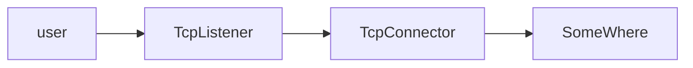
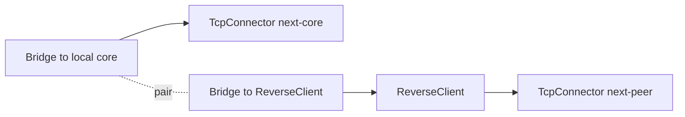
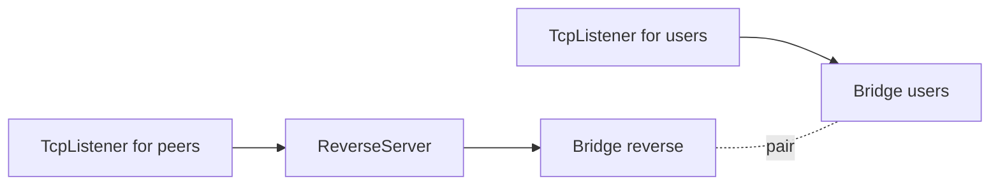
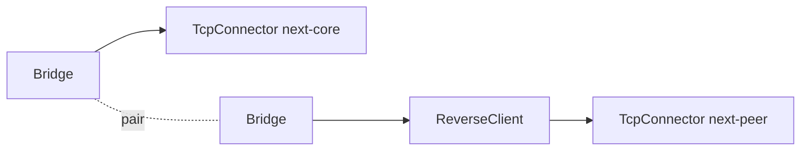
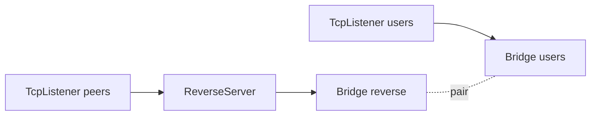

<!--
Documentation version: 152
-->

# Bridge

`Bridge` دو نقطه جدا در یک پیکربندی WaterWall را به هم وصل می‌کند. این نود
payload را تغییر نمی‌دهد، socket باز نمی‌کند و پروتکل جدیدی اضافه نمی‌کند؛
فقط callbackهای line مثل `Init`، `Payload`، `Finish`، `Pause` و `Resume` را بین
دو Bridge جفت‌شده، اما در جهت مخالف، عبور می‌دهد.
`Est` نیز مانند دیگر callbackهای lifecycle با همین الگو عبور داده می‌شود.

## چرا Bridge ساخته شد

در زمان نگارش مستند اولیه، این نود عملاً برای ساخت تونل معکوس
(`ReverseClient` / `ReverseServer`) طراحی شد و هنوز هم رایج‌ترین کاربرد آن
همین است.

در اغلب نودهای لایه انتقال WaterWall، جهت حرکت «چپ به راست» است؛ یعنی اتصال
از ابتدای زنجیره شروع می‌شود و با `next` به سمت جلو می‌رود.

ساده‌ترین نمونه، port forwarding است:



برای ساخت reverse tunnel دو مشکل اصلی وجود داشت:

- در سمت `ReverseClient` معمولاً Listener نداریم؛ این نود باید خودش اتصال‌های
  آماده به سمت `ReverseServer` ایجاد کند.
- یک `ReverseClient` عملاً به دو مسیر نیاز دارد: مسیر peer و مسیر مقصد محلی
  مثل xray-core. اما مدل عادی WaterWall برای هر node فقط یک `next` دارد.

### ایده اول: دو next برای ReverseClient

یک ایده این بود که `ReverseClient` دو مسیر داخلی داشته باشد:

```json
{
  "name": "reverse-client",
  "type": "ReverseClient",
  "settings": {
    "next-core": "local-core-path",
    "next-peer": "remote-peer-path"
  }
}
```

این طرح کنار گذاشته شد، چون `ReverseClient` را به یک نود خاص با مدل chain
اختصاصی تبدیل می‌کرد و از مدل استاندارد `next` دور می‌شد.

### ایده پذیرفته‌شده: Bridge

در طراحی نهایی، `next` خود `ReverseClient` برای مسیر peer استفاده می‌شود؛ یعنی
مسیری که در نهایت به `ReverseServer` می‌رسد:

اما مسیر مقصد محلی، مثلاً xray-core، باید از «پشت» `ReverseClient` وصل شود.
این کار با یک جفت Bridge انجام می‌شود:



به این ترتیب، هر داده‌ای که وارد یک Bridge شود انگار وارد Bridge جفتش شده است،
اما از جهت مخالف خارج می‌شود. این همان چیزی است که برای reverse tunnel نیاز
داشتیم، بدون اینکه مدل تک-`next` در WaterWall شکسته شود.

در سمت `ReverseServer` هم همین ایده استفاده می‌شود:



## راهنمای پیکربندی

دو Bridge باید به شکل جفت تنظیم شوند:

```json
{
  "name": "bridge-a",
  "type": "Bridge",
  "settings": {
    "pair": "bridge-b"
  },
  "next": "path-a-next-node"
}
```

```json
{
  "name": "bridge-b",
  "type": "Bridge",
  "settings": {
    "pair": "bridge-a"
  },
  "next": "path-b-next-node"
}
```

فیلد `next` از نظر JSON همیشه اجباری نیست، چون یک Bridge ممکن است در ابتدا یا
انتهای یک شاخه قرار بگیرد. اما چیدمان باید طوری باشد که سمتی که Bridge می‌خواهد
از آن خارج شود واقعاً همسایه داشته باشد.

## فیلدهای اجباری

فیلدهای سطح اصلی:

| فیلد | نوع | توضیح |
| --- | --- | --- |
| `name` | string | نام انتخابی نود که باید در فایل پیکربندی یکتا باشد. |
| `type` | string | باید دقیقاً `"Bridge"` باشد. |
| `settings` | object | باید فیلد `pair` را داشته باشد. |

فیلد اجباری در `settings`:

| فیلد | نوع | توضیح |
| --- | --- | --- |
| `pair` | string | نام Bridge جفت در همان پیکربندی. |

فیلد اختیاری دیگری در `settings` وجود ندارد.

اگر `pair` وجود نداشته باشد یا نودی با آن نام پیدا نشود، راه‌اندازی شکست می‌خورد.
برای رفتار قابل پیش‌بینی، دو Bridge را به‌صورت متقابل pair کنید:

```text
bridge-a.settings.pair = bridge-b
bridge-b.settings.pair = bridge-a
```

## رفتار جهت‌ها

Bridge داده را تغییر نمی‌دهد؛ فقط جهت callback را برعکس می‌کند:

| رویداد ورودی به Bridge فعلی | فراخوانی روی Bridge جفت | خروج از Bridge جفت |
| --- | --- | --- |
| upstream `Init` / `Est` / `Payload` / `Finish` / `Pause` / `Resume` | `tunnelPrevDownStream*` | سمت previous جفت |
| downstream `Init` / `Est` / `Payload` / `Finish` / `Pause` / `Resume` | `tunnelNextUpStream*` | سمت next جفت |

به همین دلیل Bridge شبیه آینه عمل می‌کند: مسیر را به Bridge جفت می‌فرستد و جهت
WaterWall را برعکس می‌کند.

## قواعد مجاورت نودهای Reverse

هنگام استفاده از Bridge همراه نودهای reverse، اتصال‌های زیر باید مستقیم باشند:

- `Bridge -> ReverseClient`
- `ReverseServer -> Bridge`

هیچ نودی نباید در هیچ‌کدام از این دو فاصله قرار بگیرد. برای مثال،
`Bridge -> SpeedLimit -> ReverseClient` و `ReverseServer -> SpeedLimit -> Bridge`
ممنوع هستند. هرگونه پردازش اضافی را بیرون از این دو فاصله قرار دهید.

این‌ها قواعد طراحی chain هستند که کاربر باید رعایت کند؛ کد این الزامات مجاورت را
به‌صورت خودکار بررسی نمی‌کند. این قواعد مربوط به همین اتصال‌ها با نودهای reverse
هستند و به این معنا نیستند که هر Bridge باید همسایه‌ای از نوع reverse داشته باشد.

## مثال کامل برای ReverseClient



```json
{
  "name": "outbound_to_core",
  "type": "TcpConnector",
  "settings": {
    "nodelay": true,
    "address": "127.0.0.1",
    "port": 443
  }
}
```

```json
{
  "name": "bridge_core",
  "type": "Bridge",
  "settings": {
    "pair": "bridge_reverse_client"
  },
  "next": "outbound_to_core"
}
```

```json
{
  "name": "bridge_reverse_client",
  "type": "Bridge",
  "settings": {
    "pair": "bridge_core"
  },
  "next": "reverse_client"
}
```

```json
{
  "name": "reverse_client",
  "type": "ReverseClient",
  "settings": {
    "minimum-unused": 4
  },
  "next": "outbound_to_peer"
}
```

```json
{
  "name": "outbound_to_peer",
  "type": "TcpConnector",
  "settings": {
    "nodelay": true,
    "address": "1.1.1.1",
    "port": 443
  }
}
```

در این ساختار، `next` خود `ReverseClient` مسیر peer است و مسیر core/local از
طریق Bridge جفت‌شده وصل می‌شود.

## مثال کامل برای ReverseServer



```json
{
  "name": "users_inbound",
  "type": "TcpListener",
  "settings": {
    "address": "0.0.0.0",
    "port": 443,
    "nodelay": true
  },
  "next": "bridge_users"
}
```

```json
{
  "name": "bridge_users",
  "type": "Bridge",
  "settings": {
    "pair": "bridge_reverse"
  }
}
```

```json
{
  "name": "bridge_reverse",
  "type": "Bridge",
  "settings": {
    "pair": "bridge_users"
  }
}
```

```json
{
  "name": "reverse_server",
  "type": "ReverseServer",
  "settings": {},
  "next": "bridge_reverse"
}
```

```json
{
  "name": "peers_inbound",
  "type": "TcpListener",
  "settings": {
    "address": "0.0.0.0",
    "port": 8443,
    "nodelay": true,
    "whitelist": ["1.1.1.1/32"]
  },
  "next": "reverse_server"
}
```

در این مثال بهتر است Listener مربوط به peer با `whitelist` یا لایه امنیتی
معادل محدود شود. در سناریوی واقعی معمولاً TLS، mux، router یا لایه‌های دیگر هم
به این مسیر اضافه می‌شوند.

## Lifecycle و رفتار Line

`Bridge` هیچ object از نوع `line_t` نمی‌سازد و آزاد نمی‌کند. همان اشاره‌گر مربوط به line را از طریق Bridge جفت عبور
می‌دهد و state مخصوص هر line در آن عملاً کاربردی ندارد.

Payload نیز بدون تغییر عبور داده می‌شود:

| جهت ورود به Bridge فعلی | نوع ارسال از Bridge جفت |
| --- | --- |
| upstream payload | downstream payload از Bridge جفت به سمت نود previous آن |
| downstream payload | upstream payload از Bridge جفت به سمت نود next آن |

چون Bridge هیچ بایتی prepend نمی‌کند و فریم‌بندی ندارد، `required_padding_left = 0` است.

## نکته‌ها

- `Bridge` نود adapter نیست و به address یا port وصل نمی‌شود.
- payload را فریم‌بندی، prepend، رمزنگاری، decode یا بازنویسی نمی‌کند.
- `required_padding_left` آن `0` است.
- مبدل packet/stream نیست؛ فقط callbackهای WaterWall را بین دو نقطه عبور
  می‌کند.
- Bridge جفت باید در همان فایل پیکربندی و زیر همان تنظیمات node manager وجود داشته باشد.
- بدون pair و چیدمان درست شاخه‌ها، Bridge رفتار مفیدی ندارد.

## متادیتای نود

متادیتای برگرفته از کد منبع:

| ویژگی | مقدار |
| --- | --- |
| node flags | `kNodeFlagChainHead` &#124; `kNodeFlagChainEnd` |
| `can_have_prev` | `true` |
| `can_have_next` | `true` |
| `layer_group` | `kNodeLayerAnything` |
| `layer_group_prev_node` | `kNodeLayerAnything` |
| `layer_group_next_node` | `kNodeLayerAnything` |
| `required_padding_left` | `0` bytes |
