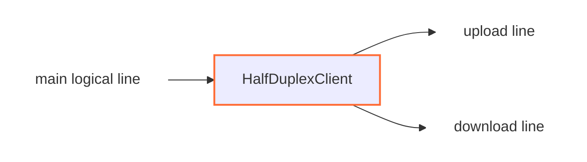

<!--
Documentation version: 152
-->

# HalfDuplexClient

`HalfDuplexClient` یک line عادی full-duplex را از نود قبلی می‌گیرد و آن را به
دو line خروجی جداگانه به سمت همان `next` تبدیل می‌کند:

- یک line برای upload، یعنی انتقال payload از کلاینت به سرور
- یک line برای download، یعنی انتقال payload از سرور به کلاینت

این نود باید در سمت مقابل با `HalfDuplexServer` استفاده شود تا آن دو اتصال
دوباره به یک اتصال منطقی عادی تبدیل شوند.

## جایگاه رایج

نمونه مستقیم داخل یک chain:

```text
TesterClient -> HalfDuplexClient -> HalfDuplexServer -> TesterServer
```

نمونه روی TCP:

```text
client side: TcpListener -> HalfDuplexClient -> TcpConnector
server side: TcpListener -> HalfDuplexServer -> TcpConnector
```

هر نود stream که میان کلاینت و سرور قرار می‌گیرد باید بایت‌های دو half-connection
را بدون تغییر عبور دهد. برای مثال اگر بعد از `HalfDuplexClient` یک `TlsClient`
بگذارید، هر دو اتصال upload و download handshake جداگانه TLS خواهند داشت.

## عملکرد



هر اتصال ورودی به این نود باعث ساخته شدن دو اتصال خروجی می‌شود. یعنی در عمل یک
اتصال منطقی اصلی و دو اتصال در سمت transport داریم. با بسته شدن هرکدام از این
مسیرها، مسیرهای جفت‌شده هم بسته می‌شوند.

این نود socket باز نمی‌کند و packet line هم نمی‌سازد؛ فقط روی lineهای stream در
وسط chain کار می‌کند.

## نمونه تنظیم

```json
{
  "name": "halfduplex-client",
  "type": "HalfDuplexClient",
  "settings": {},
  "next": "outbound-transport"
}
```

## فیلدهای لازم

| فیلد | نوع | توضیح |
| --- | --- | --- |
| `name` | string | نام دلخواه و یکتای نود. |
| `type` | string | باید دقیقاً `"HalfDuplexClient"` باشد. |
| `next` | string | نودی که هر دو half-connection خروجی را دریافت می‌کند. |

این نود باید هم نود قبلی داشته باشد و هم `next`. برای ابتدا یا انتهای chain
نیست.

## تنظیمات

در پیاده‌سازی فعلی هیچ تنظیم اختصاصی اجباری یا اختیاری ندارد.

هر دو اتصال upload و download به همان نودی می‌روند که در `next` آمده است. نسخه
فعلی فیلد جداگانه‌ای مثل `upload-next` یا `download-next` ندارد.

## Intro برای جفت کردن اتصال‌ها

نخستین payload در مسیر upstream به‌شکل ویژه پردازش می‌شود. همراه همان payload،
`HalfDuplexClient` با CSPRNG سریع یک شناسه تازه ۱۲۸ بیتی تولید می‌کند. intro دقیقاً
۱۷ بایت است: بایت صفر فرمان دقیق نقش و بایت‌های ۱ تا ۱۶ شناسه pair هستند:

| Line | رفتار intro |
| --- | --- |
| upload line | intro هفده‌بایتی به ابتدای نخستین payload واقعی کاربر اضافه می‌شود. |
| download line | فقط intro هفده‌بایتی، بدون payload کاربر، ارسال می‌شود. |

بعد از اولین payload:

- همه payloadهای upstream فقط از upload line ارسال می‌شوند.
- payloadهای downstream باید از download line برگردند.

این intro جزئیات داخلی پروتکل بین `HalfDuplexClient` و `HalfDuplexServer` است و
تنظیم کاربر محسوب نمی‌شود. شناسه pair فقط متادیتای مسیریابی داخلی است و احراز
هویت یا حفاظت transport را فراهم نمی‌کند؛ برای این ویژگی‌ها باید security node
مناسب پیکربندی شود.

## رفتار جهت‌ها

| جهت | رفتار |
| --- | --- |
| upstream payload از نود قبلی | پس از introِ نخستین payload، روی upload line به `next` فرستاده می‌شود. |
| downstream payload از نود بعدی | به main line اصلی و نود قبلی برگردانده می‌شود. |
| upstream pause/resume | به download line فرستاده می‌شود. |
| downstream pause/resume | اگر main line هنوز وجود داشته باشد، به آن برگردانده می‌شود. |

Upload line مسیر اصلی داده از کلاینت به سرور است و download line مسیر برگشت
داده از سرور به کلاینت.

## Lifecycle

در upstream `Init`، نود state مربوط به main line را مقداردهی می‌کند و دو line
جدید روی همان worker می‌سازد:

1. upload line
2. download line

هر دو line از طریق `next` مقداردهی اولیه می‌شوند.

به‌محض برقرار شدن هرکدام از half-connectionها، main line اصلی نیز به نود قبلی
برقرارشده اعلام می‌شود. بنابراین نود قبلی تنها یک اتصال منطقی می‌بیند.

اگر main line اصلی `Finish` شود، هر دو half-connection خروجی هم بسته می‌شوند.
اگر یکی از half-connectionها زودتر بسته شود، main line اصلی بسته می‌شود و بستن
بستن half دیگر زمان‌بندی می‌شود.

callbackهای `UpStreamEst` و `DownStreamInit` برای این نود غیرفعال هستند.

## محدودیت‌ها و Padding

| مقدار | اندازه |
| --- | --- |
| intro داخلی | `17 bytes` (یک بایت نقش و یک شناسه تازه ۱۲۸ بیتی) |
| `required_padding_left` | `0 bytes` |

این نود از chain فضای padding چپ درخواست نمی‌کند. برای نخستین payload آپلود، یک بافر
framed جدید ساخته می‌شود و بودجه padding کلی chain حفظ می‌شود. intro مربوط به
download نیز در یک بافر کوچک جداگانه ارسال می‌شود.

## نکته‌ها

- باید با `HalfDuplexServer` استفاده شود.
- هر اتصال منطقی ورودی، دو اتصال خروجی می‌سازد.
- intro تنها پس از رسیدن نخستین payloadِ upstream ارسال می‌شود.
- در حال حاضر مسیرهای upload و download هر دو از همان `next` استفاده می‌کنند.

## متادیتای نود

متادیتای برگرفته از کد منبع:

| ویژگی | مقدار |
| --- | --- |
| node flags | `kNodeFlagNone` |
| `can_have_prev` | `true` |
| `can_have_next` | `true` |
| `layer_group` | `kNodeLayer4` |
| `layer_group_prev_node` | `kNodeLayer4` |
| `layer_group_next_node` | `kNodeLayer4` |
| `required_padding_left` | `0` bytes |
