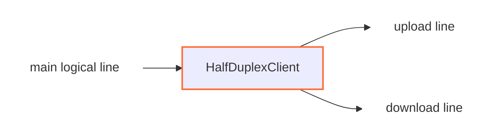

<!--
Documentation version: 159
-->

# HalfDuplexClient

`HalfDuplexClient` یک line عادی full-duplex را از node قبلی می‌گیرد و آن را به
دو line خروجی جداگانه به سمت همان `next` تبدیل می‌کند:

- یک line برای upload، یعنی انتقال payload از کلاینت به سرور
- یک line برای download، یعنی انتقال payload از سرور به کلاینت

این node باید در سمت مقابل با `HalfDuplexServer` استفاده شود تا آن دو اتصال
دوباره به یک اتصال منطقی عادی تبدیل شوند.

## جایگاه رایج

نمونه مستقیم داخل یک chain:

```text
TesterClient -> HalfDuplexClient -> HalfDuplexServer -> TesterServer
```

نمونه روی TCP:

```text
client side: TcpListener -> HalfDuplexClient -> TcpConnector
server side: TcpListener -> HalfDuplexServer -> TcpConnector
```

هر node stream که میان کلاینت و سرور قرار می‌گیرد باید بایت‌های دو half-connection
را بدون تغییر عبور دهد. برای مثال اگر بعد از `HalfDuplexClient` یک `TlsClient`
بگذارید، هر دو اتصال upload و download handshake جداگانه TLS خواهند داشت.

## عملکرد


```mermaid
flowchart LR
    Main[main logical line] --> Client[HalfDuplexClient]
    Client --> Upload[upload line]
    Client --> Download[download line]

    style Client stroke:#ff6b35,stroke-width:2px
    style Main fill:transparent,stroke:transparent
    style Upload fill:transparent,stroke:transparent
    style Download fill:transparent,stroke:transparent
```

هر اتصال ورودی به این node باعث ساخته شدن دو اتصال خروجی می‌شود. یعنی در عمل یک
اتصال منطقی اصلی و دو اتصال در سمت transport داریم. با بسته شدن هرکدام از این
مسیرها، مسیرهای جفت‌شده هم بسته می‌شوند.

این node socket باز نمی‌کند و packet line هم نمی‌سازد؛ فقط روی line‌های stream در
وسط chain کار می‌کند.

## نمونه تنظیم

```json
{
  "name": "halfduplex-client",
  "type": "HalfDuplexClient",
  "settings": {},
  "next": "outbound-transport"
}
```

## فیلدهای لازم

| فیلد | نوع | توضیح |
| --- | --- | --- |
| `name` | string | نام دلخواه و یکتای node. |
| `type` | string | باید دقیقاً `"HalfDuplexClient"` باشد. |
| `next` | string | node‌ای که هر دو half-connection خروجی را دریافت می‌کند. |

این node باید هم node قبلی داشته باشد و هم `next`. برای ابتدا یا انتهای chain
نیست.

## تنظیمات

در پیاده‌سازی فعلی هیچ تنظیم اختصاصی اجباری یا اختیاری ندارد.

هر دو اتصال upload و download به همان node‌ای می‌روند که در `next` آمده است. نسخه
فعلی فیلد جداگانه‌ای مثل `upload-next` یا `download-next` ندارد.

## Intro برای جفت کردن اتصال‌ها

نخستین payload در مسیر upstream به‌شکل ویژه پردازش می‌شود. همراه همان payload،
`HalfDuplexClient` با CSPRNG سریع یک شناسه تازه ۱۲۸ بیتی تولید می‌کند. intro دقیقاً
۱۷ بایت است: بایت صفر فرمان دقیق نقش و بایت‌های ۱ تا ۱۶ شناسه pair هستند:

| Line | رفتار intro |
| --- | --- |
| upload line | intro هفده‌بایتی به ابتدای نخستین payload واقعی کاربر اضافه می‌شود. |
| download line | فقط intro هفده‌بایتی، بدون payload کاربر، ارسال می‌شود. |

بعد از اولین payload:

- همه payload‌های upstream فقط از upload line ارسال می‌شوند.
- payload‌های downstream باید از download line برگردند.

این intro جزئیات داخلی پروتکل بین `HalfDuplexClient` و `HalfDuplexServer` است و
تنظیم کاربر محسوب نمی‌شود. شناسه pair فقط metadata مسیریابی داخلی است و احراز
هویت یا حفاظت transport را فراهم نمی‌کند؛ برای این ویژگی‌ها باید security node
مناسب config شود.

## رفتار جهت‌ها

| جهت | رفتار |
| --- | --- |
| upstream payload از node قبلی | پس از introِ نخستین payload، روی upload line به `next` فرستاده می‌شود. |
| downstream payload از node بعدی | به main line اصلی و node قبلی برگردانده می‌شود. |
| upstream pause/resume | به download line فرستاده می‌شود. |
| downstream pause/resume | اگر main line هنوز وجود داشته باشد، به آن برگردانده می‌شود. |

upload line مسیر اصلی داده از کلاینت به سرور است و download line مسیر برگشت
داده از سرور به کلاینت.

## Lifecycle

در upstream `Init`، node state مربوط به main line را مقداردهی می‌کند و دو line
جدید روی همان worker می‌سازد:

1. upload line
2. download line

هر دو line از طریق `next` مقداردهی اولیه می‌شوند.

رویداد transport Est از هر کدام از child‌ها با latch همین node فقط یک بار به برنامه
اعلام می‌شود. اگر Est همزمان داخل Init اولین child برسد، تنها تا پذیرش Init هر دو
child منتظر می‌ماند؛ handshake جفت‌سازی مانع Est نیست. پس از این Init، payload معتبر
پیش از Est هم پذیرفته می‌شود و callback آن می‌تواند اولین payload را ارسال یا جفت
را ببندد.

فقط ورودی موقت لازم برای ترتیب Init و intro نگهداری می‌شود: سقف شامل برابری
2 MiB و 1,024 buffer است. پیش از callback وضعیت ارسال intro ثبت می‌شود؛ ورودی تو در تو
هنگام intro دانلود، پشت intro آپلود قبلی و با همان شناسه جفت قرار می‌گیرد.
ورودی پذیرفته‌شده می‌تواند پس از Pause تکمیل شود، ولی تخلیه بعدی backlog مربوط به
Init، Pause تجمیعی child‌ها را رعایت می‌کند. Resume یک child دلیل Pause child دیگر
را رفع نمی‌کند. Pause خواندن برنامه که پیش از ایجاد child دانلود برسد، پس از Init
آن اعمال می‌شود. مسیر آماده داده، صف transport اضافی ندارد.

پیش از هر Finish خروجی، لینک‌ها و state محلی جفت جدا می‌شوند. هر دو child متعلق به
node به‌شکل همزمان و با نگهداری reference دقیق بسته می‌شوند؛ هیچ callback به سمت
فرستنده Finish بازتاب نمی‌شود. main line از نوع borrowed از طریق مالک خودش بسته می‌شود و هیچ
child جداشده‌ای منتظر task قابل لغو برای بسته‌شدن نمی‌ماند.

callback‌های `UpStreamEst` و `DownStreamInit` برای این node غیرفعال هستند.

## محدودیت‌ها و Padding

| مقدار | اندازه |
| --- | --- |
| intro داخلی | `17 bytes` (یک بایت نقش و یک شناسه تازه ۱۲۸ بیتی) |
| `required_padding_left` | `17 bytes` |

این node برای intro نخستین payload آپلود، ۱۷ بایت padding چپ رزرو می‌کند.
اگر buffer معمولی فضای کافی داشته باشد، همان buffer استفاده می‌شود؛ ورودی splice
یا buffer بدون فضای کافی به یک buffer معمولی جدید با padding کامل مسیر بعدی منتقل
می‌شود. intro مربوط به download نیز در یک buffer معمولی جداگانه با padding کامل
مسیر بعدی ارسال می‌شود.

## نکته‌ها

- باید با `HalfDuplexServer` استفاده شود.
- هر اتصال منطقی ورودی، دو اتصال خروجی می‌سازد.
- intro تنها پس از رسیدن نخستین payloadِ upstream ارسال می‌شود.
- در حال حاضر مسیرهای upload و download هر دو از همان `next` استفاده می‌کنند.

## متادیتای نود

metadata برگرفته از کد منبع:

| ویژگی | مقدار |
| --- | --- |
| node flags | `kNodeFlagSupportsSplice` |
| `can_have_prev` | `true` |
| `can_have_next` | `true` |
| `layer_group` | `kNodeLayer4` |
| `layer_group_prev_node` | `kNodeLayer4` |
| `layer_group_next_node` | `kNodeLayer4` |
| `required_padding_left` | `17` bytes |

## Splice و حافظهٔ مرحلهٔ آغازین

اولین تحویل upstream، حتی تحویل خالی، دو intro هفده‌بایتی با شناسهٔ ۱۲۸ بیتی
یکسان ایجاد می‌کند. intro آپلود و تمام payload اول در یک buffer معمولی ترکیب
می‌شوند. buffer معمولی با فضای کافی برای header بدون کپی استفاده می‌شود؛ در صورت
کمبود فضا یک buffer جدید ساخته می‌شود. ورودی splice کاملاً materialize می‌شود و
prefix موجود در حافظه و بدنهٔ pipe به ترتیب کپی می‌شوند. intro دانلود نیز معمولی است.
تحویل‌های بعدی در هر دو جهت نمایش معمولی یا splice خود را حفظ می‌کنند.
صف موقت Init/intro می‌تواند wrapper‌های splice را نگه دارد. سقف‌های ۲ MiB و ۱٬۰۲۴ buffer، با مجاز بودن رسیدن به خود سقف، تغییر نکرده و محدودیت هر تحویل در مسیر آماده نیست.
buffer‌های خروجی padding لازم برای node‌های بعدی را حفظ می‌کنند.

هر دو node پرچم `kNodeFlagSupportsSplice` دارند. کلاینت برای intro آپلود به ۱۷ بایت
padding چپ نیاز دارد؛ padding موردنیاز سرور صفر است.
خواندن splice تنها با پشتیبانی پلتفرم و build، فعال بودن `misc.splice` و پشتیبانی
تمام node‌های chainِ گسترش‌یافته، از جمله wrapper سرور و همسایه‌ها، فعال می‌شود.
buffer معمولی در همهٔ وضعیت‌ها پذیرفته می‌شود. تنظیم یا فیلد جدیدی به پروتکل اضافه
نشده است و ترجیح دائمی برای خواندن معمولی ثبت نمی‌شود.
