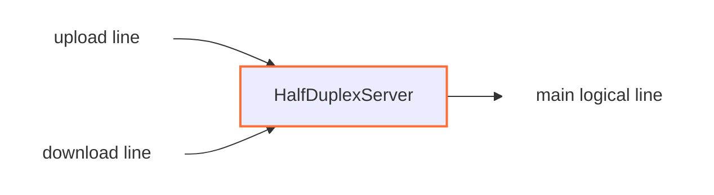

<!--
Documentation version: 152
-->

# HalfDuplexServer

`HalfDuplexServer` بخش سرور `HalfDuplexClient` است. دو half-connection ورودی را
می‌گیرد، با intro داخلی ارسالی کلاینت آن‌ها را به هم متصل می‌کند و یک line
منطقی عادی به سمت `next` می‌سازد.

این نود زمانی استفاده می‌شود که سمت مقابل یک جریان full-duplex را به دو اتصال
upload و download جداگانه تقسیم کرده باشد.

## جایگاه رایج

نمونه مستقیم داخل یک chain:

```text
TesterClient -> HalfDuplexClient -> HalfDuplexServer -> TesterServer
```

نمونه روی TCP:

```text
client side: TcpListener -> HalfDuplexClient -> TcpConnector
server side: TcpListener -> HalfDuplexServer -> TcpConnector
```

`HalfDuplexServer` باید در سمت مقابل مسیر transport نسبت به `HalfDuplexClient`
قرار بگیرد.

## عملکرد



این نود از داده‌ای که `HalfDuplexClient` در شروع هر half-connection قرار داده
متوجه می‌شود که آن اتصال upload است یا download، سپس اتصال‌های متناظر را به هم
وصل می‌کند و یک اتصال منطقی جدید برای نود بعدی می‌سازد.

این نود socket باز نمی‌کند و packet line هم نمی‌سازد؛ فقط روی lineهای stream در
وسط chain کار می‌کند.

## نمونه تنظیم

```json
{
  "name": "halfduplex-server",
  "type": "HalfDuplexServer",
  "settings": {},
  "next": "service-node"
}
```

## فیلدهای لازم

| فیلد | نوع | توضیح |
| --- | --- | --- |
| `name` | string | نام دلخواه و یکتای نود. |
| `type` | string | باید دقیقاً `"HalfDuplexServer"` باشد. |
| `next` | string | نودی که line منطقی بازسازی‌شده را دریافت می‌کند. |

این نود باید هم نود قبلی داشته باشد و هم `next`. برای ابتدا یا انتهای chain
نیست.

## تنظیمات

در پیاده‌سازی فعلی هیچ تنظیم اختصاصی اجباری یا اختیاری ندارد.

## روش جفت کردن اتصال‌ها

هر transport line ورودی ابتدا در حالت unknown است. سرور تا زمانی که حداقل ۸ بایت
داده داشته باشد بافر می‌کند و سپس intro ارسالی از `HalfDuplexClient` را می‌خواند.

از این intro دو چیز مشخص می‌شود:

- این half متعلق به کدام اتصال منطقی است
- این half نقش upload دارد یا download

سرور دو map داخلی دارد:

| Map | کاربرد |
| --- | --- |
| upload-line map | نگه‌داری uploadهایی که پیش از download متناظر رسیده‌اند. |
| download-line map | نگه‌داری downloadهایی که پیش از upload متناظر رسیده‌اند. |

اگر half متناظر از قبل منتظر باشد، جفت بلافاصله ساخته می‌شود. در غیر این صورت، half فعلی
داخل map مناسب ذخیره می‌شود تا طرف مقابل برسد.

## ساخت Main Line

پس از آماده شدن هر دو half، `HalfDuplexServer` این مراحل را انجام می‌دهد:

1. یک main line جدید روی worker مربوط به upload line می‌سازد
2. main line را به هر دو half-connection وصل می‌کند
3. نود بعدی را با main line مقداردهی اولیه می‌کند
4. intro هشت‌بایتی را از اولین payload آپلود حذف می‌کند
5. اگر بعد از intro payload واقعی باقی مانده باشد، آن را به `next` می‌فرستد

بعد از این مرحله، نودهای downstream فقط یک اتصال عادی WaterWall می‌بینند و لازم
نیست بدانند transport پشت آن دو اتصال بوده است.

Intro مربوط به download هیچ payloadی از کاربر ندارد و فقط برای پیدا کردن اتصال متناظر مصرف می‌شود.

## انتقال میان workerها

این نود با wrapper داخلی pipe-tunnel ساخته می‌شود. اگر upload و download روی دو
worker متفاوت برسند، half جدیدتر به worker مربوط به half قدیمی‌تر منتقل می‌شود و
جفت کردن اتصال‌ها همان‌جا ادامه پیدا می‌کند.

این نکته برای TCP مهم است، چون ممکن است دو اتصال upload و download به‌صورت طبیعی
روی workerهای متفاوت پذیرفته شوند.

## رفتار جهت‌ها

| جهت | رفتار |
| --- | --- |
| upstream payload روی upload line | پس از پیدا شدن اتصال متناظر، به main line و `next` فرستاده می‌شود. |
| upstream payload روی download line | مصرف می‌شود و بافرش برای استفاده مجدد برمی‌گردد؛ download مسیر کلاینت به سرور نیست. |
| downstream payload از `next` | از طریق download line به سمت نود قبلی برگردانده می‌شود. |
| upstream pause/resume روی download line | از طریق main line به `next` فرستاده می‌شود. |
| downstream pause/resume از `next` | از طریق upload line به نود قبلی فرستاده می‌شود. |

Upload line داده کلاینت به service را حمل می‌کند و download line پاسخ service را
به کلاینت برمی‌گرداند.

## Buffer موقت

اگر upload قبل از download متناظر برسد، سرور payload آپلود را تا کامل شدن pair
بافر می‌کند.

| مقدار | اندازه |
| --- | --- |
| حداکثر بافر برای upload منتظر | `65535 * 2 bytes`، یعنی `131070 bytes` |
| intro داخلی | `8 bytes` |
| `required_padding_left` | `0 bytes` |

اگر بافر upload منتظر پیش از رسیدن download به این حد برسد، upload از
map حذف و بسته می‌شود.

Downloadها به این شکل بافر نمی‌شوند؛ معمولاً فقط به‌عنوان ورودی منتظر در map
نگه‌داری می‌شوند.

## Lifecycle

در upstream `Init` برای هر half-line ورودی، state محلی مقداردهی می‌شود و همان
transport half به نود قبلی برقرارشده اعلام می‌شود. Main line منطقی تنها پس
از جفت شدن هر دو half ساخته می‌شود.

اگر یک half پیش از جفت شدن بسته شود، از map انتظار حذف و state آن پاک می‌شود.
اگر upload منتظر بافری داشته باشد، آن بافر برای استفاده مجدد برگردانده می‌شود.

اگر یکی از halfها پس از جفت شدن بسته شود، main line نیز finish و سپس نابود می‌شود؛
بستن half دیگر به‌سمت نود قبلی برای اجرا در صف قرار می‌گیرد.

اگر سمت downstream، main line بازسازی‌شده را ببندد، سرور download line را بی‌درنگ
finish می‌کند و بستن upload line را برای اجرا در صف می‌گذارد.

callbackهای `UpStreamEst` و `DownStreamInit` برای این نود غیرفعال هستند.

## نکته‌ها

- باید با `HalfDuplexClient` استفاده شود.
- این نود به intro داخلی ۸ بایتی ساخته‌شده توسط client وابسته است.
- اگر hash تکراری برای upload یا download منتظر برسد، اتصال تکراری بسته می‌شود.
- uploadهای منتظر تا زمان جفت شدن یا رسیدن به سقف تعیین‌شده می‌توانند حافظه مصرف کنند.
- فعلاً تنظیم جداگانه‌ای برای timeout یا اندازه بافر جفت‌سازی وجود ندارد.

## متادیتای نود

متادیتای برگرفته از کد منبع:

| ویژگی | مقدار |
| --- | --- |
| node flags | `kNodeFlagNone` |
| `can_have_prev` | `true` |
| `can_have_next` | `true` |
| `layer_group` | `kNodeLayer4` |
| `layer_group_prev_node` | `kNodeLayer4` |
| `layer_group_next_node` | `kNodeLayer4` |
| `required_padding_left` | `0` bytes |
