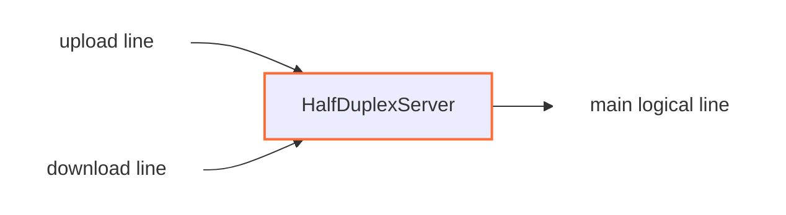

<!-- Written from version 106 of the English doc. -->

# HalfDuplexServer

`HalfDuplexServer` سمت server برای `HalfDuplexClient` است. این نود دو
half-connection ورودی را می‌گیرد، با intro داخلی‌ای که client فرستاده آن‌ها را
pair می‌کند، و یک line منطقی عادی به سمت `next` می‌سازد.

این نود زمانی استفاده می‌شود که سمت مقابل یک جریان full-duplex را به دو اتصال
upload و download جداگانه تقسیم کرده باشد.

## جایگاه رایج

نمونه مستقیم داخل یک chain:

```text
TesterClient -> HalfDuplexClient -> HalfDuplexServer -> TesterServer
```

نمونه روی TCP:

```text
client side: TcpListener -> HalfDuplexClient -> TcpConnector
server side: TcpListener -> HalfDuplexServer -> TcpConnector
```

`HalfDuplexServer` باید در سمت مقابل مسیر transport نسبت به `HalfDuplexClient`
قرار بگیرد.

## عملکرد



این نود از داده‌ای که `HalfDuplexClient` در شروع هر half-connection قرار داده
متوجه می‌شود که آن اتصال upload است یا download، سپس اتصال‌های متناظر را به هم
وصل می‌کند و یک اتصال منطقی جدید برای نود بعدی می‌سازد.

این نود socket باز نمی‌کند و packet line هم نمی‌سازد؛ فقط روی lineهای stream در
وسط chain کار می‌کند.

## نمونه تنظیم

```json
{
  "name": "halfduplex-server",
  "type": "HalfDuplexServer",
  "settings": {},
  "next": "service-node"
}
```

## فیلدهای لازم

| فیلد | نوع | توضیح |
| --- | --- | --- |
| `name` | string | نام دلخواه و یکتا برای node. |
| `type` | string | باید دقیقا `"HalfDuplexServer"` باشد. |
| `next` | string | نودی که line منطقی بازسازی‌شده را دریافت می‌کند. |

این نود باید هم نود قبلی داشته باشد و هم `next`. برای ابتدا یا انتهای chain
نیست.

## تنظیمات

در پیاده‌سازی فعلی هیچ تنظیم اختصاصی اجباری یا اختیاری ندارد.

## مدل Pairing

هر transport line ورودی ابتدا در حالت unknown است. سرور تا زمانی که حداقل ۸ بایت
داده داشته باشد buffer می‌کند، سپس intro ارسالی از `HalfDuplexClient` را می‌خواند.

از این intro دو چیز مشخص می‌شود:

- این half متعلق به کدام اتصال منطقی است
- این half نقش upload دارد یا download

سرور دو map داخلی دارد:

| Map | کاربرد |
| --- | --- |
| upload-line map | نگهداری uploadهایی که قبل از download متناظر رسیده‌اند. |
| download-line map | نگهداری downloadهایی که قبل از upload متناظر رسیده‌اند. |

اگر half متناظر قبلا منتظر باشد، pair بلافاصله ساخته می‌شود. اگر نه، half فعلی
داخل map مناسب ذخیره می‌شود تا طرف مقابل برسد.

## ساخت Main Line

وقتی هر دو half آماده باشند، `HalfDuplexServer` این کارها را انجام می‌دهد:

1. یک main line جدید روی worker مربوط به upload line می‌سازد
2. main line را به هر دو half-connection وصل می‌کند
3. نود بعدی را با main line initialize می‌کند
4. intro هشت‌بایتی را از اولین payload آپلود حذف می‌کند
5. اگر بعد از intro payload واقعی باقی مانده باشد، آن را به `next` می‌فرستد

بعد از این مرحله، نودهای downstream فقط یک اتصال عادی WaterWall می‌بینند و لازم
نیست بدانند transport پشت آن دو اتصال بوده است.

intro مربوط به download payload کاربر ندارد و فقط برای matching مصرف می‌شود.

## Worker Handoff

این نود با wrapper داخلی pipe-tunnel ساخته می‌شود. اگر upload و download روی دو
worker متفاوت برسند، half جدیدتر به worker مربوط به half قدیمی‌تر منتقل می‌شود و
pairing همان‌جا ادامه پیدا می‌کند.

این نکته برای TCP مهم است، چون ممکن است دو اتصال upload و download به صورت طبیعی
روی workerهای متفاوت accept شوند.

## رفتار جهت‌ها

| جهت | رفتار |
| --- | --- |
| upstream payload روی upload line | بعد از matching به main line و `next` فرستاده می‌شود. |
| upstream payload روی download line | مصرف یا recycle می‌شود؛ download مسیر client-to-server نیست. |
| downstream payload از `next` | از طریق download line به سمت نود قبلی برگردانده می‌شود. |
| upstream pause/resume روی download line | به main line به سمت `next` forward می‌شود. |
| downstream pause/resume از `next` | به upload line به سمت نود قبلی forward می‌شود. |

upload line داده client به service را حمل می‌کند و download line پاسخ service به
client را برمی‌گرداند.

## Buffer موقت

اگر upload قبل از download متناظر برسد، سرور payload آپلود را تا کامل شدن pair
buffer می‌کند.

| مقدار | اندازه |
| --- | --- |
| حداکثر buffer برای upload منتظر | `65535 * 2 bytes`، یعنی `131070 bytes` |
| intro داخلی | `8 bytes` |
| `required_padding_left` | `0 bytes` |

اگر buffer مربوط به upload منتظر قبل از رسیدن download به این حد برسد، upload از
map حذف و بسته می‌شود.

downloadها به این شکل buffer نمی‌شوند؛ معمولا فقط به عنوان entry منتظر در map
نگهداری می‌شوند.

## Lifecycle

در upstream `Init` برای هر half-line ورودی، state محلی مقداردهی می‌شود و همان
transport half به سمت نود قبلی established اعلام می‌شود. main line منطقی فقط بعد
از pair شدن هر دو half ساخته می‌شود.

اگر یک half قبل از pair شدن بسته شود، از map انتظار حذف می‌شود و state آن پاک
می‌شود. اگر upload منتظر buffer داشته باشد، buffer recycle می‌شود.

اگر یکی از halfها بعد از pair شدن بسته شود، main line finish و destroy می‌شود و
بستن half دیگر به سمت نود قبلی schedule می‌شود.

اگر سمت downstream، main line بازسازی‌شده را ببندد، سرور download line را فورا
finish می‌کند و بستن upload line را schedule می‌کند.

callbackهای `UpStreamEst` و `DownStreamInit` برای این نود غیرفعال هستند.

## نکته‌ها

- باید با `HalfDuplexClient` استفاده شود.
- این نود به intro داخلی ۸ بایتی ساخته‌شده توسط client وابسته است.
- اگر hash تکراری برای upload یا download منتظر برسد، duplicate بسته می‌شود.
- uploadهای منتظر تا زمان pair شدن یا رسیدن به limit می‌توانند memory مصرف کنند.
- فعلا تنظیم جداگانه‌ای برای timeout یا اندازه buffer pairing وجود ندارد.
