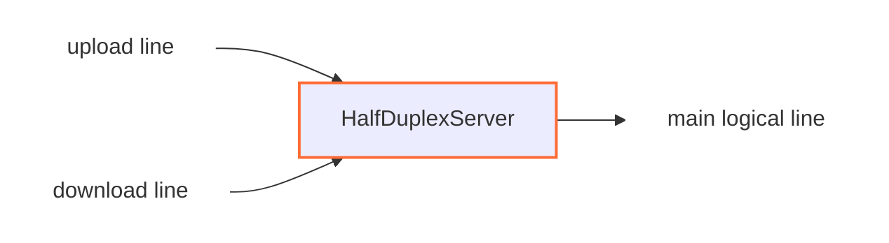

<!--
Documentation version: 156
-->

# HalfDuplexServer {#halfduplexserver}

## نمای کلی {#overview}

`HalfDuplexServer` بخش سرور `HalfDuplexClient` است. دو half-connection ورودی را
می‌گیرد، با intro داخلی ارسالی کلاینت آن‌ها را به هم متصل می‌کند و یک line
منطقی عادی به سمت `next` می‌سازد.

این گره زمانی استفاده می‌شود که سمت مقابل یک جریان بایتی از نوع دوطرفه را به دو اتصال
upload و download جداگانه تقسیم کرده باشد.

سرور روی هر `line` انتقال ورودی TCP را انتخاب می‌کند. `line` بازسازی‌شدهٔ
برنامه پیش از نخستین `Init` در جهت upstream تنها TCP را پیشنهاد می‌دهد.

## جایگاه معمول در زنجیره {#typical-placement}

<a id="جایگاه-رایج"></a>

جفت مستقیم درون یک فرایند:

```text
TesterClient -> HalfDuplexClient -> HalfDuplexServer -> TesterServer
```

نمونه روی TCP:

```text
client side: TcpListener -> HalfDuplexClient -> TcpConnector
server side: TcpListener -> HalfDuplexServer -> TcpConnector
```

`HalfDuplexServer` باید در سمت مقابل مسیر transport نسبت به `HalfDuplexClient`
قرار بگیرد.

## نمونهٔ کاربردی ساده {#minimal-practical-example}

این‌ها قطعه‌های پیکربندی گره هستند؛ گره‌های همسایهٔ ارجاع‌شده را در پیکربندی پیرامون آن‌ها تعریف کنید.

### نمونهٔ پیکربندی {#configuration-example}

<a id="نمونه-تنظیم"></a>

```json
{
  "name": "halfduplex-server",
  "type": "HalfDuplexServer",
  "settings": {},
  "next": "service-node"
}
```

## پیکربندی {#configuration}

### فیلدهای الزامی {#required-fields}

<a id="فیلدهای-لازم"></a>

| فیلد | نوع | توضیح |
| --- | --- | --- |
| `name` | string | نام دلخواه و یکتای گره. |
| `type` | string | باید دقیقاً `"HalfDuplexServer"` باشد. |
| `next` | string | بدون `settings.pair` اجباری و همراه آن ممنوع است؛ line منطقی بازسازی‌شده را دریافت می‌کند. |

هر سرور باید گره قبلی داشته باشد. سرور فرعی در انتهای شاخهٔ transport خود قرار
می‌گیرد و از مسیر برنامهٔ سرور اصلی استفاده می‌کند.

### تنظیمات {#settings}

<a id="تنظیمات"></a>

| تنظیم | نوع | توضیح |
| --- | --- | --- |
| `pair` | string | نام اختیاری یک `HalfDuplexServer` اصلی در همان پیکربندی. |

بدون `pair`، این گره سرور اصلی است و باید `next` غیرخالی داشته باشد. با `pair`،
سرور فرعی است و `next` باید کاملاً حذف شود؛ حتی `next: null` مجاز نیست. سرور اصلی
به تنظیم متقابل نیازی ندارد. چند سرور فرعی می‌توانند نام یک سرور اصلی را بدهند.

نام خالی، مقدار غیررشته‌ای، مقصد ناشناخته، ارجاع به خود یا گره از نوع دیگر در
startup رد می‌شود. مقصد نیز نباید خودش `pair` داشته باشد؛ بنابراین زنجیره و
حلقهٔ pair پذیرفته نیست. هر سرور همچنان transport ورودی خودش را دارد.

## کاربرد و رفع اشکال {#usage-and-troubleshooting}

### نمونه‌های دیگر {#alternative-examples}

یک transport دیگر می‌تواند با نام بردن سرور اصلی به همان گروه جفت‌سازی بپیوندد:

```json
[
  {
    "name": "hs1",
    "type": "HalfDuplexServer",
    "settings": {},
    "next": "vless-server"
  },
  {
    "name": "hs2",
    "type": "HalfDuplexServer",
    "settings": { "pair": "hs1" }
  }
]
```

هر یک از upload و download می‌تواند از هر سرور وارد شود. نقش اتصال از intro
مشخص می‌شود؛ `pair` نقش ثابت آپلود یا دانلود به گره نمی‌دهد.

### توپولوژی کامل TLS/KCP {#complete-tlskcp-topology}

<a id="توپولوژی-کامل-tlskcp"></a>

یک جریان بایتی محلی TCP می‌تواند آپلود را از TLS/TCP و دانلود را از KCP/UDP عبور دهد.
دو شاخهٔ کلاینت از `HalfDuplexClient` شروع می‌شوند و هر دو شاخهٔ سرور در یک
پیکربندی قرار دارند:

```text
Client:
TcpListener -> VlessClient -> HalfDuplexClient
  upload   -> TlsClient -> TcpConnector == TLS/TCP ==> server TcpListener
  download -> KcpClient -> UdpConnector == KCP/UDP ==> server UdpListener

Server:
TcpListener -> TlsServer -> hs1 -> VlessServer -> TcpUdpConnector
UdpListener -> KcpServer -> hs2 (pair: hs1)
```

`hs1` و `hs2` یک گروه جفت‌سازی مشترک دارند و line برنامهٔ بازسازی‌شده از `hs1`
به `VlessServer` و `TcpUdpConnector` می‌رود.
هر دو اتصال transport را کلاینت آغاز می‌کند. نام مسیرها جهت payload برنامه را
مشخص می‌کند؛ KCP همچنان تأیید دریافت و ترافیک کنترلی را در هر دو جهت ردوبدل
می‌کند. با جابه‌جایی مقدارهای `upload` و `download` در کلاینت می‌توان نقش دو
transport را عوض کرد، بدون تغییر تنظیم `pair` سرور.

برای فایل‌های کامل کلاینت و سرور و مراحل اجرا، [نمونهٔ TLS/KCP (انگلیسی)](https://radkesvat.github.io/WaterWall-Docs/docs/examples/tunnels/halfduplex-split-transports) را ببینید.

### نکته‌ها و ملاحظات {#notes-and-caveats}

<a id="نکتهها"></a>

- باید با `HalfDuplexClient` استفاده شود.
- این گره به intro داخلی ۱۷ بایتی ساخته‌شده توسط client وابسته است.
- اگر شناسه pair تکراری برای upload یا download منتظر برسد، اتصال تکراری بسته می‌شود.
- upload‌های منتظر تا زمان جفت شدن یا رسیدن به سقف تعیین‌شده می‌توانند حافظه مصرف کنند.
- فعلاً تنظیم جداگانه‌ای برای timeout یا اندازه بافر جفت‌سازی وجود ندارد.

## رفتار پیشرفته {#advanced-behavior}

### مدل جفت‌سازی {#matching-model}

<a id="روش-جفت-کردن-اتصالها"></a>

هر transport line ورودی ابتدا در حالت unknown است. سرور تا زمانی که هر ۱۷ بایت
داده داشته باشد بافر می‌کند و سپس intro ارسالی از `HalfDuplexClient` را می‌خواند.
بایت صفر فرمان دقیق نقش و ۱۶ بایت بعدی شناسه تازه ۱۲۸ بیتی pair هستند.

از این intro دو چیز مشخص می‌شود:

- این half متعلق به کدام اتصال منطقی است
- این half نقش upload دارد یا download

سرور اصلی دو map داخلی دارد که همهٔ اعضای گروه جفت‌سازی از آن‌ها استفاده می‌کنند:

| Map | کاربرد |
| --- | --- |
| upload-line map | نگه‌داری upload‌هایی که پیش از download متناظر رسیده‌اند. |
| download-line map | نگه‌داری download‌هایی که پیش از upload متناظر رسیده‌اند. |

اگر half متناظر از قبل منتظر باشد، جفت بلافاصله ساخته می‌شود. در غیر این صورت، half فعلی
داخل map مناسب ذخیره می‌شود تا طرف مقابل برسد.

## جزئیات پیاده‌سازی {#implementation-details}

### عملکرد گره {#what-it-does}

<a id="عملکرد"></a>

- half-connectionهای ورودی را از گرهٔ قبلی می‌پذیرد.
- intro کامل 17 بایتی را می‌خواند: یک بایت دقیق نقش و یک شناسهٔ جفت 128 بیتی.
- lineهای آپلود و دانلود متعلق به یک اتصال منطقی را با هم جفت می‌کند.
- پس از آماده‌شدن هر دو نیمه، یک main line به سمت `next` می‌سازد.
- payload سمت آپلود را به گرهٔ بعدی می‌فرستد.
- پاسخ‌های گرهٔ بعدی را از line دانلود برمی‌گرداند.
- از wrapper داخلی pipe استفاده می‌کند تا half-connection دیرتررسیده بتواند به worker مالک همتای خود منتقل شود.


```mermaid
flowchart LR
    Upload[upload line] --> Server[HalfDuplexServer]
    Download[download line] --> Server
    Server --> Main[main logical line]

    style Server stroke:#ff6b35,stroke-width:2px
    style Upload fill:transparent,stroke:transparent
    style Download fill:transparent,stroke:transparent
    style Main fill:transparent,stroke:transparent
```

`HalfDuplexServer` یک تونل میانی جریان بایتی است. خودش سوکت یا line بسته‌ای نمی‌سازد.

### ساخت main line {#main-line-creation}

<a id="ساخت-main-line"></a>

پس از آماده شدن هر دو half، سرور اصلی `HalfDuplexServer` این مراحل را انجام می‌دهد:

1. یک main line جدید روی worker مربوط به upload line می‌سازد
2. main line را به هر دو half-connection وصل می‌کند
3. گره بعدی را با main line مقداردهی اولیه می‌کند
4. intro کامل هفده‌بایتی را از اولین payload آپلود حذف می‌کند
5. اگر بعد از intro payload واقعی باقی مانده باشد، آن را به `next` می‌فرستد

بعد از این مرحله، گره‌های downstream فقط یک اتصال عادی WaterWall می‌بینند و لازم
نیست بدانند transport پشت آن دو اتصال بوده است.

Intro مربوط به download هیچ payload‌ی از کاربر ندارد و فقط برای پیدا کردن اتصال متناظر مصرف می‌شود.
شناسه pair فقط فراداده مسیریابی داخلی است و احراز هویت یا حفاظت transport را
فراهم نمی‌کند؛ برای این ویژگی‌ها باید security گره مناسب پیکربندی شود.

### انتقال میان workerها {#worker-handoff}

<a id="انتقال-میان-workerها"></a>

این گره با wrapper داخلی pipe-tunnel ساخته می‌شود. اگر upload و download روی دو
worker متفاوت برسند، half جدیدتر به worker مربوط به half قدیمی‌تر منتقل می‌شود و
جفت کردن اتصال‌ها همان‌جا ادامه پیدا می‌کند.

این نکته برای TCP مهم است، چون ممکن است دو اتصال upload و download به‌صورت طبیعی
روی worker‌های متفاوت پذیرفته شوند.

هر سرور wrapper داخلی PipeTunnel خودش را نگه می‌دارد. انتقال بین worker‌ها از
wrapper همان half تازه‌وارد استفاده می‌کند و callback‌های transport نیز از سرور
و شاخهٔ ورودی همان half برمی‌گردند. mapهای تطبیق و main line متعلق به سرور اصلی
هستند؛ پاسخ از مسیر download و فشار سمت service از مسیر upload عبور می‌کند.
تمام شاخه‌ها برای وضعیت خطوط، padding، بررسی لایه و چرخهٔ عمر در یک توپولوژی
نهایی قرار می‌گیرند.

### رفتار جهت‌ها {#direction-behavior}

<a id="رفتار-جهتها"></a>

| جهت | رفتار |
| --- | --- |
| upstream payload روی upload line | پس از پیدا شدن اتصال متناظر، به main line و `next` فرستاده می‌شود. |
| upstream payload روی download line | مصرف می‌شود و بافر‌ش برای استفاده مجدد برمی‌گردد؛ download مسیر کلاینت به سرور نیست. |
| downstream payload از `next` | از طریق download line به سمت گره قبلی برگردانده می‌شود. |
| upstream pause/resume روی download line | از طریق main line به `next` فرستاده می‌شود. |
| downstream pause/resume از `next` | از طریق upload line به گره قبلی فرستاده می‌شود. |

upload line داده کلاینت به service را حمل می‌کند و download line پاسخ service را
به کلاینت برمی‌گرداند.

سرور برای هر line یک endpoint است: دو transport را قرض می‌گیرد و مالک main line
بازسازی‌شده است. برای نگاشت payload، فشار و Finish میان آن‌ها باید فعال بماند.
ارسال دوبارهٔ داده‌های شروع همچنان Pause سمت next را رعایت می‌کند؛ قانون عبور
شفاف در گره‌های میانی معمولی این کنترل تولیدکننده را حذف نمی‌کند.

### بافرکردن موقت {#temporary-buffering}

<a id="buffer-موقت"></a>

اگر upload قبل از download متناظر برسد، سرور payload آپلود را تا کامل شدن pair
بافر می‌کند.

| مقدار | اندازه |
| --- | --- |
| حداکثر بافر برای upload منتظر | `131070 * max(1, ceil(L / 32768))` بایت |
| intro داخلی | `17 bytes` (یک بایت نقش و یک شناسه تازه ۱۲۸ بیتی) |
| `required_padding_left` | `0 bytes` |

`L` مبنای مستقل بودجهٔ انتظار در pool مربوط به line است: ۶۴ KiB در S1/S2 و ۱ MiB در پروفایل‌های بالاتر. این مبنا از اندازهٔ بافر‌های عادی و سقف splice مستقل است. حد انتظار در S1/S2 برابر ۲۶۲۱۴۰ و در پروفایل‌های بالاتر برابر ۴۱۹۴۲۴۰ بایت است. رسیدن به حد یا عبور از آن، هم برای ورودی نخست و هم افزودن بعدی، موجب بستن می‌شود؛ دادهٔ جفت‌شده مستقیم عبور می‌کند.

اگر بافر upload منتظر پیش از رسیدن download به این حد برسد، upload از
map حذف و بسته می‌شود.

download‌ها به این شکل بافر نمی‌شوند؛ معمولاً فقط به‌عنوان ورودی منتظر در map
نگه‌داری می‌شوند.

### رفتار چرخهٔ عمر {#lifecycle-behavior}

<a id="lifecycle"></a>

در upstream `Init` برای هر half-line ورودی، وضعیت محلی مقداردهی می‌شود و بی‌درنگ `Est` همان
transport half به گرهٔ قبلی اعلام می‌شود. main line منطقی تنها پس
از جفت شدن هر دو half ساخته می‌شود.

اگر آپلود پس از دریافت intro کامل و معتبر، پیش از رسیدن دانلود پایان یابد، سرور شناسهٔ جفت و دادهٔ پذیرفته‌شده را تا ۳۰ ثانیه از `Finish` آپلود نگه می‌دارد. سقف هر گروه ۶۴ آپلود و ۸ MiB هزینهٔ تخصیص بافر است. دانلود همتا از worker دیگر به کمک PipeTunnel به worker مالک منتقل می‌شود. intro ناقص دور ریخته می‌شود.

پس از جفت شدن، `Finish` آپلود line آن را جدا می‌کند. سرویس دادهٔ اولیه و صف پذیرفته‌شدهٔ راه‌اندازی را به‌ترتیب و با رعایت `Pause` می‌گیرد و سپس یک `Finish` دریافت می‌کند. اگر دانلود هنگام اجرای callback پایان سرویس، `Finish` بفرستد، اعلان پایانِ در انتظار لغو می‌شود. در غیر این صورت سرور پس از آزادسازی line سرویس، دانلود را می‌بندد. مهلت ۳۰ ثانیه زمان انتظار برای همتا را نیز در بر می‌گیرد. پایان سرویس یا توقف worker تخلیه را متوقف می‌کند. خرابی دانلود وقتی هر دو transport هنوز متصل‌اند، جفت را می‌بندد.

اگر سمت downstream، main line بازسازی‌شده را ببندد، سرور download line را بی‌درنگ
finish می‌کند و بستن upload line را برای اجرا در صف می‌گذارد.

`Est` ورودی transport مصرف می‌شود و main line برنامه را راه‌اندازی نمی‌کند.
callback `DownStreamInit` برای این گره غیرفعال است.

### splice و فضای نگه‌داری راه‌اندازی {#splice-and-setup-storage}

<a id="splice-و-حافظهٔ-مرحلهٔ-آغازین"></a>

هر تحویلی که برای خواندن intro یا نگهداری آپلود منتظر استفاده شود، به‌طور کامل
به حافظهٔ معمولی منتقل می‌شود؛ این شامل بدنهٔ همراه intro هم هست. بافر‌های
نگهداری‌شده همیشه معمولی هستند. پس از جفت شدن، دقیقاً ۱۷ بایت حذف و بدنهٔ
ذخیره‌شده پیش از داده‌های بعدی ارسال می‌شود. مسیر آماده در هر دو جهت، حتی بین
worker‌ها، wrapper معمولی یا splice را حفظ می‌کند. دادهٔ اضافی ورودی سمت دانلود
بدون انتقال بدنه به حافظه دور ریخته می‌شود.

حد انتظار آپلود همچنان `131070 * max(1, ceil(basis / 32768))` و شامل intro است:
در S1/S2 رسیدن به ۲۶۲٬۱۴۰ بایت و در پروفایل‌های بالاتر رسیدن به ۴٬۱۹۴٬۲۴۰ بایت
باعث بسته شدن می‌شود. همتای موجود پیش از بررسی این حد جفت می‌شود. این حد مربوط
به بایت‌های منطقی در انتظار است، نه تحویل آماده یا مجموع حافظهٔ فیزیکی.
بافر‌های جدید و بافر‌های بزرگ‌شده padding لازم برای ادامهٔ مسیر را حفظ می‌کنند.

هر دو گره پرچم `kNodeFlagSupportsSplice` دارند. کلاینت برای intro آپلود به ۱۷ بایت
padding چپ نیاز دارد؛ padding موردنیاز سرور صفر است.
خواندن splice تنها با پشتیبانی پلتفرم و build، فعال بودن `misc.splice` و پشتیبانی
تمام گره‌های زنجیرهِ گسترش‌یافته، از جمله wrapper نوع PipeTunnel سرور و همهٔ همسایه‌ها، فعال می‌شود.
بافر معمولی در همهٔ وضعیت‌ها پذیرفته می‌شود. `pair` قالب پروتکل یا رفتار ترجیح
خواندن را تغییر نمی‌دهد.

#### ترتیب داده هنگام راه‌اندازی main line {#ordering-during-main-line-startup}

<a id="ترتیب-داده-هنگام-راهاندازی-خط-اصلی"></a>

پیش از فراخوانی Init گره بعدی، مانع موقت ترتیب منتشر می‌شود. main line که مالک آن
سرور است، بدنهٔ اولیهٔ معمولی را جدا از ورودی‌های آپلود بعدی نگه می‌دارد. ورودی
بازگشتی درون Init یا ارسال بدنهٔ اولیه نمی‌تواند از داده‌های قدیمی جلو بزند.
حتی بدنهٔ اولیهٔ خالی نیز مانع ترتیب Init را زودتر برنمی‌دارد.

ورودی‌های بعدی که پشت این مانع نگه داشته می‌شوند، دو سقف مستقل دارند و رسیدن به خود سقف هم مجاز است: ۲ MiB بایت منطقی و ۲ MiB هزینهٔ تخصیص استاندارد بافر.
ورودی خالی هم هزینهٔ تخصیص مصرف می‌کند. ممکن است ظرفیت تخصیص پیش از حد بایت‌ها به
سقف برسد. رد پذیرش اتصال را می‌بندد و بایت‌های TCP حذف نمی‌شوند.
بدنهٔ اولیه جزو این بودجه نیست؛ پذیرش قبلی و محدودیت انتظار آپلود، از جمله
ورودی بزرگ با همتای آماده، تغییر نکرده‌اند.

تمام دادهٔ نگهداری‌شده معمولی است. ورودی splice که وارد این صف شود به‌طور کامل
با padding لازم به حافظه منتقل می‌شود. ابتدا بدنهٔ اولیه ارسال می‌شود، سپس کل
دنبالهٔ صف به ترتیب تحویل داده می‌شود. چند ورودی در یک بافر معمولی با اندازهٔ
بررسی‌شده ترکیب می‌شوند؛ هنگام ترکیب هیچ callback بیرونی اجرا نمی‌شود. فضای موقت تبدیل و ادغام، حافظهٔ کاری محدود است و تضمینی برای سقف مجموع حافظهٔ فیزیکی نیست.

ارسال دادهٔ نگهداری‌شده هنگام Pause متوقف می‌ماند. Resume داخل Init فقط مجوز را
ثبت می‌کند؛ Resume منبع پس از تحویل داده‌های قدیمی و فقط وقتی گره بعدی متوقف
نیست ارسال می‌شود. مانع درست پیش از تحویل دنبالهٔ نهایی برداشته می‌شود. این زمان‌بندی اجازه می‌دهد دادهٔ بازگشتی بعدی پس از همهٔ بایت‌های قدیمی قرار بگیرد. پس از
آن مسیر آماده بدون صف است و wrapper معمولی یا splice را حفظ می‌کند. با `Finish` عادی آپلود، line سرویس بافرهای راه‌اندازی را تا تحویل یا لغو نگه می‌دارد. سهم هر بافر از بودجه هنگام تحویل یا آزادسازی آن برگردانده می‌شود.

### فرادادهٔ گره {#node-metadata}

<a id="متادیتای-نود"></a>

فراداده برگرفته از کد منبع:

| ویژگی | مقدار |
| --- | --- |
| پرچم‌های گره | `kNodeFlagChainEnd \| kNodeFlagSupportsSplice` |
| `can_have_prev` | `true` |
| `can_have_next` | `true` |
| `layer_group` | `kNodeLayer4` |
| `layer_group_prev_node` | `kNodeLayer4Stream` |
| `layer_group_next_node` | `kNodeLayer4Stream` |
| `required_padding_left` | `0` بایت |
