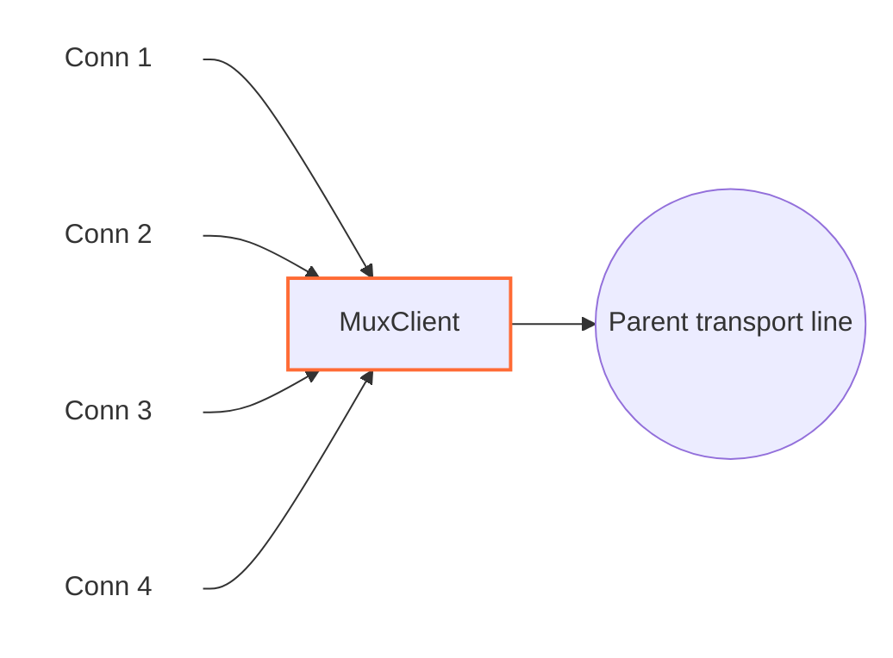

<!--
Documentation version: 156
-->

# MuxClient

`MuxClient` چند اتصال منطقی WaterWall را روی تعداد کمتری اتصال مشترک transport حمل می‌کند. به‌جای ساخت یک اتصال کامل تا سمت مقابل برای هر line ورودی، یک یا چند parent line به سمت `next` می‌سازد یا دوباره به کار می‌گیرد و رویدادهای هر child را در قالب فریم داخلی MUX می‌فرستد. در سمت مقابل، `MuxServer` این child lineهای مستقل را بازسازی می‌کند.



`MuxClient` خودش listener یا connector نیست؛ نود قبلی child lineها را می‌سازد و نود بعدی transport مشترک parent را فراهم می‌کند.

## جایگاه رایج

TCP ساده:

```text
client side: TcpListener -> MuxClient -> TcpConnector
server side: TcpListener -> MuxServer -> TcpConnector
```

با protocol stack بیرونی:

```text
client side: TcpListener -> MuxClient -> HttpClient -> TlsClient -> TcpConnector
server side: TcpListener -> TlsServer -> HttpServer -> MuxServer -> TcpConnector
```

از MUX زمانی استفاده کنید که تعداد زیادی اتصال منطقی کوتاه یا متوسط باید روی تعداد کمتری اتصال بیرونی transport عبور کنند.

## این نود چه می‌کند؟

- lineهای child معمولی را از نود قبلی می‌پذیرد.
- parent transport lineها را به سمت `next` می‌سازد.
- parent lineها را بر اساس حالت concurrency انتخاب‌شده دوباره به کار می‌گیرد.
- به هر child یک connection id یا `cid` اختصاص می‌دهد.
- payload و رویدادهای pause، resume و Finish هر child را در فریم MUX encode می‌کند.
- فریم‌های برگشتی `MuxServer` را به child مناسب هدایت می‌کند.
- اگر سمت نوشتن child محلی pause باشد، داده رسیده از parent را در صف نگه می‌دارد.
- backpressure per-child را با `FlowPause` و `FlowResume` frame بازتاب می‌دهد.
- parent lineهای exhausted و بی‌کار را پس از بسته شدن آخرین child می‌بندد.

`MuxClient` objectهای parent از نوع `line_t` را داخل خود می‌سازد و مسئول آزاد کردن آن‌هاست. Child lineهایی را که نود قبلی ساخته، آزاد نمی‌کند.

## نمونه تنظیم‌ها

حالت timer:

```json
{
  "name": "mux-client",
  "type": "MuxClient",
  "settings": {
    "mode": "timer",
    "connection-duration-ms": 30000
  },
  "next": "outbound-transport"
}
```

حالت counter:

```json
{
  "name": "mux-client",
  "type": "MuxClient",
  "settings": {
    "mode": "counter",
    "connection-capacity": 128
  },
  "next": "outbound-transport"
}
```

حالت pool ثابت parentها:

```json
{
  "name": "mux-client",
  "type": "MuxClient",
  "settings": {
    "mode": "fixed-connections-count",
    "per-worker-connections-count": 2
  },
  "next": "outbound-transport"
}
```

## فیلدهای اجباری

فیلدهای سطح اصلی:

| فیلد | نوع | توضیح |
| --- | --- | --- |
| `name` | string | نام یکتای نود در پیکربندی. |
| `type` | string | باید دقیقاً `"MuxClient"` باشد. |
| `settings` | object | اجباری. باید `mode` و تنظیم ویژه همان حالت را داشته باشد. |
| `next` | string | اجباری. نود بعدی parent transport lineها را حمل می‌کند. |

فیلدهای اجباری داخل `settings`:

| گزینه | اجباری در | توضیح |
| --- | --- | --- |
| `mode` | همیشه | یکی از `timer`، `counter` یا `fixed-connections-count`. |
| `connection-duration-ms` | `mode: "timer"` | مدت پذیرش child جدید روی هر parent، به میلی‌ثانیه. باید بزرگ‌تر از `60` باشد. |
| `connection-capacity` | `mode: "counter"` | حداکثر تعداد cid باز شده روی یک parent. باید بزرگ‌تر از `0` باشد. |
| `per-worker-connections-count` | `mode: "fixed-connections-count"` | تعداد parent lineهای ثابت برای هر worker. باید بزرگ‌تر از `0` باشد. |

## تنظیمات اختیاری

| گزینه | نوع | پیش‌فرض | توضیح |
| --- | --- | --- | --- |
| `max-children` | integer | `10000` | بیشترین child live هم‌زمان روی یک parent. باید مثبت باشد و از `connection-capacity` تجمعی در حالت counter مستقل است. |
| `child-buffer-limit` | integer | `25165824` | سقف charge تخصیص `sbuf_t` نگه‌داشته‌شده برای یک child در حالت pause. ظرفیت واقعی شامل padding چپ، header بافر و overhead تخصیص aligned شمرده می‌شود، نه فقط طول payload. باید بزرگ‌تر از `0` باشد؛ رسیدن به سقف child را با فریم `Close` می‌بندد. |
| `child-buffer-pause-tolerance` | integer | `524288` | سقف پشتیبان برحسب بایت منطقی payload صف‌شده برای ارسال `FlowPause`، وقتی Callback معمول Pause هنوز آن را نفرستاده است. باید `0` یا بزرگ‌تر باشد و مقدار عددی آن به `child-buffer-limit` cap می‌شود. |
| `child-buffer-resume-threshold` | integer | `262144` | Low-water mark برحسب بایت منطقی payload صف‌شده برای ارسال `FlowResume` پس از writableشدن child محلی. باید بزرگ‌تر از `0` باشد و مقدار عددی آن به `child-buffer-limit` cap می‌شود. مقدار بزرگ‌تر peer را زودتر Resume می‌کند، اما Hysteresis را کاهش می‌دهد و ممکن است چرخه‌های Pause/Resume را بیشتر کند. |
| `parent-buffer-limit` | integer | `33554432` | سقف charge تخصیص‌های نگه‌داشته‌شده در صف childها به‌ازای هر parent. با رسیدن به سقف، child با بیشترین charge بسته می‌شود؛ در صورت مساوی بودن، اولویت با قدیمی‌ترین child متصل است. برای غیرفعال کردن سقف تجمیعی مقدار `0` را قرار دهید. |
| `detached-buffer-limit` | integer | بر اساس `ram-profile` | سقف charge تخصیص نگه‌داشته‌شده به‌ازای هر worker برای صف childهای مسدودشده پس از از دست رفتن parent. رسیدن به سقف فقط child تازه detachedشده را abort می‌کند. برای غیرفعال کردن این سقف تجمیعی مقدار `0` را قرار دهید. |
| `detached-child-limit` | integer | بر اساس `ram-profile` | سقف تعداد به‌ازای هر worker برای childهای مسدودشده‌ای که پس از از دست رفتن parent نگه داشته می‌شوند. رسیدن به سقف فقط child مسدودشده‌ای را که به‌تازگی detached شده است abort می‌کند. برای غیرفعال کردن این سقف تجمیعی مقدار `0` را قرار دهید. |
| `log-main-line-stats` | boolean | `false` | اگر فعال باشد، parent lineها هر `5000` ms آمار best-effort را در لاگ می‌نویسند. مرگ منطقی parent اجرای عادی را suppress می‌کند و هنگام رسیدن runner صف‌شده/زمان‌بندی‌شده، task با `LineDead` settle می‌شود. quiescence worker کار معلق را فعالانه لغو می‌کند و هیچ‌یک از این مسیرها آن را دوباره arm نمی‌کند. |

اگر این دو گزینه در تنظیمات نود نوشته نشوند، مقدار پیش‌فرض آن‌ها از `misc.ram-profile` سراسری انتخاب می‌شود:

| پروفایل RAM | سقف پیش‌فرض charge detached | سقف پیش‌فرض childهای detached |
| --- | ---: | ---: |
| S1 (`minimal` / `ultralow`) | `33554432` (`32 MiB`) | `4096` |
| S2 | `80740352` (`77 MiB`) | `5677` |
| M1 (`client`) | `127926272` (`122 MiB`) | `7258` |
| M2 (`client-larger`) | `174063616` (`166 MiB`) | `8838` |
| L1 | `221249536` (`211 MiB`) | `10419` |
| L2 (`server`، پیش‌فرض سراسری) | `268435456` (`256 MiB`) | `12000` |

مقادیر بین کمینه و بیشینه روی شش رده مرتب پروفایل RAM به‌صورت خطی درون‌یابی می‌شوند و سقف charge به نزدیک‌ترین MiB گرد می‌شود. نوشتن صریح هر گزینه در تنظیمات نود، فقط مقدار مشتق‌شده از پروفایل برای همان گزینه را جایگزین می‌کند.

`child-buffer-pause-tolerance` و `child-buffer-resume-threshold` عمداً طول منطقی
payload را می‌شمارند. charge تخصیص فقط برای سه سقف سخت و حساس به حافظه استفاده
می‌شود؛ طول محتوای بافر همچنان معیار درست برای صف‌های معمولی و flow control است.

آمار شامل worker id، وضعیت write-pause والد، مجموع charge نگه‌داشته‌شده، `children-close-pending`، تعداد child، تعداد childهای read-pause و تعداد childهای write-pause است. فیلد قدیمی `parent-line-read-paused` برای سازگاری همچنان با مقدار `no` در لاگ باقی می‌ماند و `parent-queued-bytes` charge سقف سخت را گزارش می‌کند، نه طول منطقی payload.

## مدل parent و child

`MuxClient` دو نقش line دارد:

| نقش | معنی |
| --- | --- |
| child line | اتصال منطقی WaterWall دریافتی از نود قبلی. |
| parent line | اتصال transport مشترک که `MuxClient` به سمت `next` می‌سازد. |

هر child یک `cid` می‌گیرد. مقدار `cid` در محدوده همان parent line محلی است و در فریم‌های MUX به کار می‌رود تا `MuxServer` بتواند payload و رویدادهای کنترلی را به stream منطقی درست نسبت دهد.

در حالت timer و counter، هر worker یک parent فعال و قابل استفاده دارد. Childهای جدید تا exhausted شدن parent به آن متصل می‌شوند. اگر با رسیدن child بعدی count به `max-children` رسیده باشد، parent از selection بازنشسته می‌شود، برای childهای فعلی زنده می‌ماند و در صفر بسته می‌شود؛ child جدید parent دیگری می‌گیرد.

در حالت pool ثابت parentها، نخستین child روی یک worker باعث می‌شود `MuxClient` به تعداد `per-worker-connections-count` برای همان worker parent line بسازد. Childهای تازه به کم‌بارترین parent غیر-finishing با count کمتر از `max-children` می‌روند و تساوی با round-robin شکسته می‌شود. اگر همه full باشند child قرضی جدید فوراً Finish می‌گیرد؛ parent اضافه یا صف انتظار نامحدود ساخته نمی‌شود. با افت count، parent دوباره قابل استفاده است.

## رفتار modeها

| mode | parent چه زمانی child جدید نمی‌پذیرد | مناسب برای |
| --- | --- | --- |
| `timer` | وقتی عمر parent از `connection-duration-ms` بیشتر شود | چرخش parent transport lineها در طول زمان. |
| `counter` | وقتی `cid` به `connection-capacity` برسد | cap ساده روی streamهای منطقی به‌ازای هر parent. |
| `fixed-connections-count` | با زمان یا counter تجمعی exhausted نمی‌شود؛ `max-children` همچنان اعمال می‌شود | تعداد ثابت اتصال بیرونی per-worker. |

Parentِ exhausted بی‌درنگ بسته نمی‌شود؛ فقط child تازه نمی‌پذیرد و childهای موجود تا پایان ادامه می‌دهند. اگر چنین parentی child نداشته باشد، `MuxClient` آن را می‌بندد و آزاد می‌کند.

همچنین یک hard limit مطلق برای cid وجود دارد: وقتی parent به `4294967295` برسد، exhausted می‌شود.

dispatch پاسخ child با hash index و به‌طور متوسط O(1) است. اگر `MuxServer` یک
Open جدید را با `Close(cid)` رد کند، فقط همان child قرضی Finish می‌شود و parent
و siblingهای دیگر ادامه می‌دهند.

## باز شدن Stream

کد فعلی یک child را در upstream `Init` attach می‌کند:

1. یک parent line موجود یا تازه روی همان worker انتخاب می‌کند.
2. state مربوط به MUX را برای child مقداردهی اولیه می‌کند.
3. child را به parent link می‌کند.
4. `cid` بعدی را اختصاص می‌دهد.
5. downstream `Est` را به نود قبلی برای child گزارش می‌دهد.

فریم `Open` هنگام `Init` فرستاده نمی‌شود. با رسیدن نخستین payloadِ upstream، فریم‌های `Open` و `Data` در یک بافر ارسال می‌شوند. اگر child پیش از فرستادن payload finish شود، `MuxClient` ابتدا `Open` و سپس `Close` می‌فرستد تا peer یک توالی کامل open/close ببیند.

## فرمت frame

`MuxClient` و `MuxServer` از header packed هشت‌بایتی مشترک استفاده می‌کنند:

| فیلد | اندازه | توضیح |
| --- | ---: | --- |
| `length` | `uint16` | طول payload بعد از header، big-endian. |
| `flags` | `uint8` | نوع frame. |
| `_pad1` | `uint8` | بایت padding داخلی. |
| `cid` | `uint32` | شناسه child stream، big-endian. |

flagهای frame:

| flag | معنی |
| ---: | --- |
| `0` | `Open` |
| `1` | `Close` |
| `2` | `FlowPause` |
| `3` | `FlowResume` |
| `4` | `Data` |

`65,527` بایت سقف payload در **یک** فریم `Data` است، نه سقف یک callback از نوع
`Payload` برای child. encoder یک payload بزرگ‌تر را، با حفظ ترتیب دقیق بایت‌ها، به
چند فریم پیاپی `Data` با حداکثر `65,527` بایت تقسیم می‌کند.

اندازهٔ تجمیعی encodeشده ــ شامل payload، header هشت‌بایتی هر فریم `Data` و فریم
اختیاری `Open` ــ به‌صورت checked محاسبه می‌شود و باید در `uint32_t` جا شود. اگر
جا نشود، buffer ورودی recycle می‌شود و فقط همان child بسته می‌شود؛ هیچ فریم ناقصی
منتشر نمی‌شود. تخصیص buffer تجمیعی نیز از قرارداد fail-fast مربوط به shift buffer
پیروی می‌کند، بنابراین شکست واقعی allocator باعث خاتمه می‌شود و هرگز دادهٔ ناقص
forward نخواهد شد.

## جهت و رفتار Callback

| callback ورودی | رفتار |
| --- | --- |
| upstream `Init` child | یک parent انتخاب یا می‌سازد، child را link می‌کند، `cid` اختصاص می‌دهد، `Est` را به نود قبلی برای child گزارش می‌دهد. |
| upstream `Payload` child | برای اولین payload `Open + Data` prepend می‌کند، در غیر این صورت `Data` prepend می‌کند، سپس به parent به سمت `next` می‌فرستد. |
| upstream `Pause` / `Resume` child | `FlowPause` می‌فرستد / داده queue شده را flush می‌کند و در صورت نیاز `FlowResume` می‌فرستد. |
| upstream `Finish` child | `Close` می‌فرستد، یا `Open + Close` اگر هنوز payload stream را باز نکرده؛ در صورت نیاز parent exhausted بیکار را می‌بندد. |
| downstream `Payload` والد | فریم‌های MUX از `MuxServer` را تجزیه می‌کند و `Data`، `Close`، `FlowPause` و `FlowResume` را به child مناسب می‌فرستد. |
| downstream `Pause` / `Resume` والد | write pressure والد را به child نویسنده اخیر یا همه childها (اگر نویسنده اخیر نامشخص باشد) بازتاب می‌دهد. |
| downstream `Finish` والد | state و line تحت مالکیت parent را بی‌درنگ از بین می‌برد، صف‌های پذیرفته‌شده childها را به drainهای مستقل از parent منتقل می‌کند و هر child را پس از خالی و قابل‌نوشتن شدن صف آن finish می‌کند. |
| upstream `Est` | غیرفعال؛ رسیدن به این callback fatal است. |
| downstream `Init` | غیرفعال؛ رسیدن به این callback fatal است. |

فریم‌های ناشناخته، فریم‌های مربوط به cid ناموجود و فریم `Open` ناخواسته از سمت سرور دور ریخته می‌شوند.

## Backpressure و صف‌ها

MUX backpressure را per-child نگه می‌دارد:

- اگر child محلی pause شود، `MuxClient` برای همان `cid` یک `FlowPause` می‌فرستد.
- اگر `FlowPause` از peer برسد، خواندن از child محلی pause می‌شود.
- اگر برای childی که pause است داده‌ای از parent برسد، داده روی همان child در صف می‌ماند.
- `FlowPause` معمولاً همان لحظه‌ای ارسال می‌شود که Callback محلی child را Pause می‌کند؛ `child-buffer-pause-tolerance` فقط برای حالت ترتیبی‌ای است که این فریم هنوز ارسال نشده باشد.
- وقتی بایت منطقی payload صف‌شده پایین‌تر از `child-buffer-resume-threshold` برسد، `FlowResume` می‌تواند ارسال شود. مقدار تنظیم‌شده به `child-buffer-limit` cap می‌شود.
- اگر charge صف یک child به `child-buffer-limit` برسد، آن child بسته می‌شود.
- اگر مجموع charge نگه‌داشته‌شده به `parent-buffer-limit` برسد، child با بیشترین charge بسته می‌شود.

فریم `Data` با طول صفر همچنان معتبر است و طول منطقی صف یا activity را زیاد نمی‌کند،
اما اگر برای child در حالت pause نگه داشته شود charge مثبت دارد و سقف‌های سخت حافظه
را جلو می‌برد. این charge تقریب حافظه صف‌های live در Mux است؛ cacheهای allocator،
حافظه حلقه اشاره‌گرها و baseline ثابت pool در charge یک صف مشخص نیستند.

به این ترتیب یک child کُند می‌تواند stream خود را متوقف کند، بی‌آنکه همه childهای دیگر روی همان parent فوراً متوقف شوند.

فریم `Close` رسیده از peer پس از همه فریم‌های `Data` قبلی همان `cid` اعمال می‌شود. اگر مقصد محلی child در حالت pause باشد، `MuxClient` بایت‌های قبلی را نگه می‌دارد و منتظر Resume می‌ماند؛ هیچ `Payload`ی را برخلاف Pause اجباری ارسال نمی‌کند و `Finish` محلی را فقط پس از خالی و قابل‌نوشتن شدن صف می‌فرستد. فریم‌های بعدی برای آن `cid` بسته‌شده دور ریخته می‌شوند و childهای نامرتبط روی همان parent به کار عادی ادامه می‌دهند.

اگر parent transport از دست برود، parent line همچنان بی‌درنگ بسته می‌شود. صف‌هایی که پیش‌تر برای childها پذیرفته شده‌اند به drainهایی مستقل از parent تبدیل می‌شوند: childهای قابل‌نوشتن فوراً کامل می‌شوند و childهای pauseشده پس از Resume ادامه می‌دهند، بدون آنکه parent مرده را نگه دارند یا به آن دسترسی پیدا کنند. داده خروجی تازه از child در این حالت رد می‌شود. `detached-buffer-limit` مجموع charge تخصیص نگه‌داشته‌شده و `detached-child-limit` تعداد child باقی‌مانده را به‌ازای هر worker محدود می‌کند. `MuxClient` مالک child lineها نیست؛ بنابراین owner واقعی source همچنان مسئول فهرست‌کردن و finish کردن آن‌ها هنگام shutdown است.

## Buffer و Padding

`MuxClient` MUX headerها را به payload خروجی parent prepend می‌کند. متادیتای نود:

```text
required_padding_left = 16
layer_group = kNodeLayer4
```

این `16` بایت لازم است، زیرا نخستین payloadِ child ممکن است دو header داشته باشد: یکی برای `Open` و دیگری برای `Data`. داده‌ها و فریم‌های کنترلی بعدی تنها یک header هشت‌بایتی دارند.

بایت‌های ورودی parent در یک stream خواندن جمع می‌شوند تا فریم کامل MUX آماده باشد. اگر این stream از `1 MiB` بزرگ‌تر شود، `MuxClient` باقی‌مانده ناقص parent را دور می‌ریزد، parent line را می‌بندد و همان رفتار detached drain را برای صف childهایی که پیش‌تر parse شده‌اند اعمال می‌کند.

## نکته‌های عملی

- `MuxClient` باید با `MuxServer` جفت شود.
- `mode` در implementation فعلی اجباری است.
- `connection-duration-ms` فقط برای timer mode اعمال می‌شود.
- `connection-capacity` فقط برای counter mode اعمال می‌شود.
- `per-worker-connections-count` فقط برای fixed parent pool mode اعمال می‌شود.
- با چند worker، اندازه pool ثابت parentها نیز با تعداد workerها بالا می‌رود. برای مثال، `per-worker-connections-count: 2` با چهار worker می‌تواند تا هشت parent transport line بسازد.
- `Finish` محلی child یا shutdown منظم برنامه ممکن است صف detached باقی‌مانده را به‌جای forward کردن آزاد کند.
- detached drain هیچ بایتی از پروتکل MUX یا نیازمندی قابلیت peer را تغییر نمی‌دهد.
- `MuxClient` یک تونل میانی است، نه endpoint عمومی.

## متادیتای نود

متادیتای برگرفته از کد منبع:

| ویژگی | مقدار |
| --- | --- |
| node flags | `kNodeFlagNone` |
| `can_have_prev` | `true` |
| `can_have_next` | `true` |
| `layer_group` | `kNodeLayer4` |
| `layer_group_prev_node` | `kNodeLayer4` |
| `layer_group_next_node` | `kNodeLayer4` |
| `required_padding_left` | `16` bytes |
