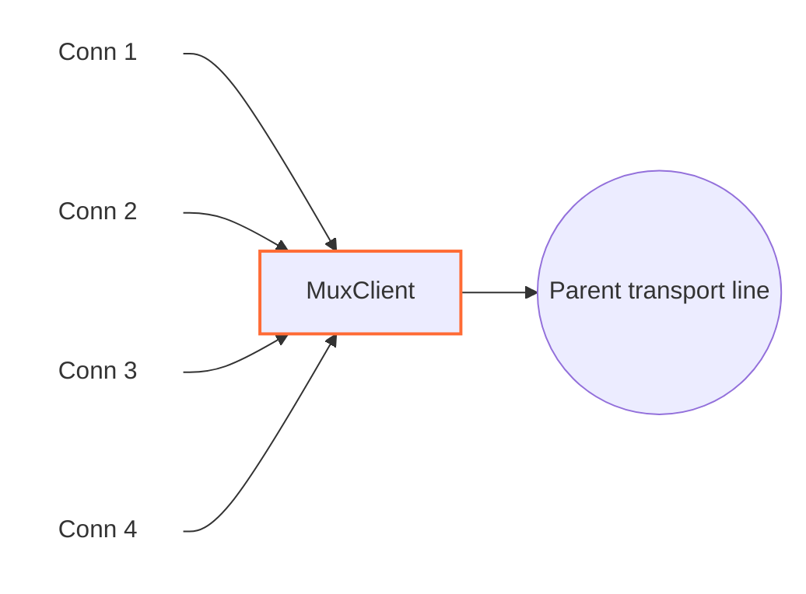

<!--
Documentation version: 161
-->

# MuxClient

`MuxClient` چند اتصال منطقی WaterWall را روی تعداد کمتری اتصال مشترک transport حمل می‌کند. به‌جای ساخت یک اتصال کامل تا سمت مقابل برای هر line ورودی، یک یا چند parent line به سمت `next` می‌سازد یا دوباره به کار می‌گیرد و رویدادهای هر child را در قالب فریم داخلی MUX می‌فرستد. در سمت مقابل، `MuxServer` این child lineهای مستقل را بازسازی می‌کند.



`MuxClient` خودش listener یا connector نیست؛ نود قبلی child lineها را می‌سازد و نود بعدی transport مشترک parent را فراهم می‌کند.

## جایگاه رایج

TCP ساده:

```text
client side: TcpListener -> MuxClient -> TcpConnector
server side: TcpListener -> MuxServer -> TcpConnector
```

با protocol stack بیرونی:

```text
client side: TcpListener -> MuxClient -> HttpClient -> TlsClient -> TcpConnector
server side: TcpListener -> TlsServer -> HttpServer -> MuxServer -> TcpConnector
```

از MUX زمانی استفاده کنید که تعداد زیادی اتصال منطقی کوتاه یا متوسط باید روی تعداد کمتری اتصال بیرونی transport عبور کنند.

## این نود چه می‌کند؟

- lineهای child معمولی را از نود قبلی می‌پذیرد.
- parent transport lineها را به سمت `next` می‌سازد.
- parent lineها را بر اساس حالت concurrency انتخاب‌شده دوباره به کار می‌گیرد.
- به هر child یک connection id یا `cid` اختصاص می‌دهد.
- payload و رویدادهای pause، resume و Finish هر child را در فریم MUX encode می‌کند.
- فریم‌های برگشتی `MuxServer` را به child مناسب هدایت می‌کند.
- اگر سمت نوشتن child محلی pause باشد، داده رسیده از parent را در صف نگه می‌دارد.
- backpressure per-child را با `FlowPause` و `FlowResume` frame بازتاب می‌دهد.
- parent lineهای exhausted و بی‌کار را پس از بسته شدن آخرین child و تحویل خروجی صف‌شده می‌بندد.

`MuxClient` objectهای parent از نوع `line_t` را داخل خود می‌سازد و مسئول آزاد کردن آن‌هاست. Child lineهایی را که نود قبلی ساخته، آزاد نمی‌کند.

## نمونه تنظیم‌ها

حالت timer:

```json
{
  "name": "mux-client",
  "type": "MuxClient",
  "settings": {
    "mode": "timer",
    "connection-duration-ms": 30000
  },
  "next": "outbound-transport"
}
```

حالت counter:

```json
{
  "name": "mux-client",
  "type": "MuxClient",
  "settings": {
    "mode": "counter",
    "connection-capacity": 128
  },
  "next": "outbound-transport"
}
```

حالت pool ثابت parentها:

```json
{
  "name": "mux-client",
  "type": "MuxClient",
  "settings": {
    "mode": "fixed-connections-count",
    "per-worker-connections-count": 2
  },
  "next": "outbound-transport"
}
```

## فیلدهای اجباری

فیلدهای سطح اصلی:

| فیلد | نوع | توضیح |
| --- | --- | --- |
| `name` | string | نام یکتای نود در پیکربندی. |
| `type` | string | باید دقیقاً `"MuxClient"` باشد. |
| `settings` | object | اجباری. باید `mode` و تنظیم ویژه همان حالت را داشته باشد. |
| `next` | string | اجباری. نود بعدی parent transport lineها را حمل می‌کند. |

فیلدهای اجباری داخل `settings`:

| گزینه | اجباری در | توضیح |
| --- | --- | --- |
| `mode` | همیشه | یکی از `timer`، `counter` یا `fixed-connections-count`. |
| `connection-duration-ms` | `mode: "timer"` | مدت پذیرش child جدید روی هر parent، به میلی‌ثانیه. باید بزرگ‌تر از `60` باشد. |
| `connection-capacity` | `mode: "counter"` | حداکثر تعداد cid باز شده روی یک parent. باید بزرگ‌تر از `0` باشد. |
| `per-worker-connections-count` | `mode: "fixed-connections-count"` | تعداد parent lineهای ثابت برای هر worker. باید بزرگ‌تر از `0` باشد. |

## تنظیمات اختیاری

| گزینه | نوع | پیش‌فرض | توضیح |
| --- | --- | --- | --- |
| `max-children` | integer | `10000` | بیشترین child live هم‌زمان روی یک parent. باید مثبت باشد و از `connection-capacity` تجمعی در حالت counter مستقل است. |
| `child-buffer-limit` | integer | `25165824` | سقف charge منابع `sbuf_t` نگه‌داشته‌شده برای یک child در حالت pause. برای ordinary هزینهٔ تخصیص و برای splice ظرفیت منطقی sbuf به‌علاوهٔ header و alignment شمرده می‌شود؛ padding یک‌بار حساب می‌شود. باید بزرگ‌تر از `0` باشد؛ رسیدن به سقف child را با فریم `Close` می‌بندد. |
| `child-buffer-pause-tolerance` | integer | `524288` | سقف پشتیبان برحسب بایت منطقی payload صف‌شده برای ارسال `FlowPause`، وقتی Callback معمول Pause هنوز آن را نفرستاده است. باید `0` یا بزرگ‌تر باشد و مقدار عددی آن به `child-buffer-limit` cap می‌شود. |
| `child-buffer-resume-threshold` | integer | `262144` | Low-water mark برحسب بایت منطقی payload صف‌شده برای ارسال `FlowResume` پس از writableشدن child محلی. باید بزرگ‌تر از `0` باشد و مقدار عددی آن به `child-buffer-limit` cap می‌شود. مقدار بزرگ‌تر peer را زودتر Resume می‌کند، اما Hysteresis را کاهش می‌دهد و ممکن است چرخه‌های Pause/Resume را بیشتر کند. |
| `parent-buffer-limit` | integer | `50331648` | سقف ظرفیت ورودی در حال تشکیل فریم به‌علاوهٔ صف childهای متصل روی هر parent. ابتدا ترکیب سودمند ورودی و سپس بستن بزرگ‌ترین صف با اولویت قدیمی‌ترین child در تساوی انجام می‌شود؛ فشار حل‌نشده parent را می‌بندد. برای غیرفعال کردن سقف تجمیعی مقدار `0` را قرار دهید. |
| `detached-buffer-limit` | integer | بر اساس `ram-profile` | سقف charge منابع نگه‌داشته‌شده به‌ازای هر worker برای صف childهای مسدودشده پس از از دست رفتن parent. رسیدن به سقف فقط child تازه detachedشده را abort می‌کند. برای غیرفعال کردن این سقف تجمیعی مقدار `0` را قرار دهید. |
| `detached-child-limit` | integer | بر اساس `ram-profile` | سقف تعداد به‌ازای هر worker برای childهای مسدودشده‌ای که پس از از دست رفتن parent نگه داشته می‌شوند. رسیدن به سقف فقط child مسدودشده‌ای را که به‌تازگی detached شده است abort می‌کند. برای غیرفعال کردن این سقف تجمیعی مقدار `0` را قرار دهید. |
| `log-main-line-stats` | boolean | `false` | اگر فعال باشد، parent lineها هر `5000` ms آمار best-effort را در لاگ می‌نویسند. مرگ منطقی parent اجرای عادی را suppress می‌کند و هنگام رسیدن runner صف‌شده/زمان‌بندی‌شده، task با `LineDead` settle می‌شود. quiescence worker کار معلق را فعالانه لغو می‌کند و هیچ‌یک از این مسیرها آن را دوباره arm نمی‌کند. |

اگر این دو گزینه در تنظیمات نود نوشته نشوند، مقدار پیش‌فرض آن‌ها از `misc.ram-profile` سراسری انتخاب می‌شود:

| پروفایل RAM | سقف پیش‌فرض charge detached | سقف پیش‌فرض childهای detached |
| --- | ---: | ---: |
| S1 (`minimal` / `ultralow`) | `33554432` (`32 MiB`) | `4096` |
| S2 | `80740352` (`77 MiB`) | `5677` |
| M1 (`client`) | `127926272` (`122 MiB`) | `7258` |
| M2 (`client-larger`) | `174063616` (`166 MiB`) | `8838` |
| L1 | `221249536` (`211 MiB`) | `10419` |
| L2 (`server`، پیش‌فرض سراسری) | `268435456` (`256 MiB`) | `12000` |

مقادیر بین کمینه و بیشینه روی شش رده مرتب پروفایل RAM به‌صورت خطی درون‌یابی می‌شوند و سقف charge به نزدیک‌ترین MiB گرد می‌شود. نوشتن صریح هر گزینه در تنظیمات نود، فقط مقدار مشتق‌شده از پروفایل برای همان گزینه را جایگزین می‌کند.

`child-buffer-pause-tolerance` و `child-buffer-resume-threshold` عمداً طول منطقی
payload را می‌شمارند. charge منابع برای سقف‌های سخت صف و threshold خروجی parent
استفاده می‌شود؛ طول محتوا همچنان معیار صف‌های معمولی و flow control است.

آمار شامل worker id، وضعیت write-pause والد، مجموع charge نگه‌داشته‌شده، `children-close-pending`، تعداد child، تعداد childهای read-pause و تعداد childهای write-pause است. فیلد قدیمی `parent-line-read-paused` برای سازگاری همچنان با مقدار `no` در لاگ باقی می‌ماند و `parent-child-queue-charge` و `parent-input-queue-charge` charge سقف سخت را گزارش می‌کند، نه طول منطقی payload.

## مدل parent و child

`MuxClient` دو نقش line دارد:

| نقش | معنی |
| --- | --- |
| child line | اتصال منطقی WaterWall دریافتی از نود قبلی. |
| parent line | اتصال transport مشترک که `MuxClient` به سمت `next` می‌سازد. |

هر child یک `cid` می‌گیرد. مقدار `cid` در محدوده همان parent line محلی است و در فریم‌های MUX به کار می‌رود تا `MuxServer` بتواند payload و رویدادهای کنترلی را به stream منطقی درست نسبت دهد.

در حالت timer و counter، هر worker یک parent فعال و قابل استفاده دارد. Childهای جدید تا exhausted شدن parent به آن متصل می‌شوند. اگر با رسیدن child بعدی count به `max-children` رسیده باشد، parent از selection بازنشسته می‌شود، برای childهای فعلی زنده می‌ماند و پس از صفر شدن تعداد child و تحویل خروجی صف بسته می‌شود؛ child جدید parent دیگری می‌گیرد.

در حالت pool ثابت parentها، نخستین child روی یک worker باعث می‌شود `MuxClient` به تعداد `per-worker-connections-count` برای همان worker parent line بسازد. Childهای تازه به کم‌بارترین parent غیر-finishing با count کمتر از `max-children` می‌روند و تساوی با round-robin شکسته می‌شود. اگر همه full باشند child قرضی جدید فوراً Finish می‌گیرد؛ parent اضافه یا صف انتظار نامحدود ساخته نمی‌شود. با افت count، parent دوباره قابل استفاده است.

## رفتار modeها

| mode | parent چه زمانی child جدید نمی‌پذیرد | مناسب برای |
| --- | --- | --- |
| `timer` | وقتی عمر parent از `connection-duration-ms` بیشتر شود | چرخش parent transport lineها در طول زمان. |
| `counter` | وقتی `cid` به `connection-capacity` برسد | cap ساده روی streamهای منطقی به‌ازای هر parent. |
| `fixed-connections-count` | با زمان یا counter تجمعی exhausted نمی‌شود؛ `max-children` همچنان اعمال می‌شود | تعداد ثابت اتصال بیرونی per-worker. |

Parentِ exhausted بی‌درنگ بسته نمی‌شود؛ فقط child تازه نمی‌پذیرد و childهای موجود تا پایان ادامه می‌دهند. اگر چنین parentی child نداشته باشد، تا تحویل آخرین خروجی و پایان ارسال فعال در فهرست مالکیت می‌ماند، ولی دیگر برای child تازه انتخاب نمی‌شود. در حالت fixed، parent طبق سیاست قبلی قابل استفاده مجدد است. Worker Stop همه parentهای تحت مالکیت، حتی parent بازنشسته بدون child، را بدون انتظار برای Resume می‌بندد و خروجی باقی‌مانده را آزاد می‌کند.

همچنین یک hard limit مطلق برای cid وجود دارد: وقتی parent به `4294967295` برسد، exhausted می‌شود.

dispatch پاسخ child با hash index و به‌طور متوسط O(1) است. اگر `MuxServer` یک
Open جدید را با `Close(cid)` رد کند، فقط همان child قرضی Finish می‌شود و parent
و siblingهای دیگر ادامه می‌دهند.

## باز شدن Stream

کد فعلی یک child را در upstream `Init` attach می‌کند:

1. یک parent line موجود یا تازه روی همان worker انتخاب می‌کند.
2. state مربوط به MUX را برای child مقداردهی اولیه می‌کند.
3. child را به parent link می‌کند.
4. `cid` بعدی را اختصاص می‌دهد.
5. downstream `Est` را به نود قبلی برای child گزارش می‌دهد.

فریم `Open` هنگام `Init` فرستاده نمی‌شود. با رسیدن نخستین payloadِ upstream، فریم‌های `Open` و `Data` در یک بافر ارسال می‌شوند. اگر child پیش از فرستادن payload finish شود، `MuxClient` ابتدا `Open` و سپس `Close` می‌فرستد تا peer یک توالی کامل open/close ببیند.

## فرمت frame

`MuxClient` و `MuxServer` از header هشت‌بایتی مشترک استفاده می‌کنند:

| offset | اندازه | معنی |
| --- | --- | --- |
| 0 | ۳ بایت | طول بدون علامت payload، به‌ترتیب big-endian. |
| 3 | ۱ بایت | نوع فریم / flags. |
| 4 | ۴ بایت | شناسهٔ بدون علامت اتصال، به‌ترتیب big-endian. |

سقف قطعی و شامل payload برای **همهٔ انواع فریم، ۱ MiB یعنی 1,048,576 بایت** است؛
این مقدار به پروفایل RAM، اندازهٔ buffer یا ظرفیت درخواستی و واقعی pipe وابسته نیست.
فریم حداکثری با header برابر 1,048,584 بایت است و Open پیش از آن، مجموع را به
1,048,592 می‌رساند. پس از دریافت هر هشت بایت header، طول بزرگ‌تر بی‌درنگ رد می‌شود؛
حتی برای CID یا نوع ناشناخته. فقط همان parent با مسیر عادی parent-loss بسته می‌شود.
برای طول مجاز، decoder منتظر تمام بدنه می‌ماند؛ فریم ناشناخته بدنهٔ اعلام‌شده را
مصرف می‌کند و Data خالی نیز یک delivery دارد. فریم‌های کامل پیش از بررسی سقف
**1,048,584 بایت** برای باقی‌ماندهٔ ناقص تخلیه می‌شوند؛ headerِ cache‌شده نیز شمرده می‌شود.

flagهای frame:

| flag | معنی |
| ---: | --- |
| `0` | `Open` |
| `1` | `Close` |
| `2` | `FlowPause` |
| `3` | `FlowResume` |
| `4` | `Data` |

`1,048,576` بایت سقف payload در **یک** فریم `Data` است، نه سقف یک callback از نوع
`Payload` برای child. encoder یک payload بزرگ‌تر را، با حفظ ترتیب دقیق بایت‌ها، به
چند فریم پیاپی `Data` با حداکثر `1,048,576` بایت تقسیم می‌کند.

اندازهٔ تجمیعی encodeشده ــ شامل payload، header هشت‌بایتی هر فریم `Data` و فریم
اختیاری `Open` ــ به‌صورت checked محاسبه می‌شود و باید در `uint32_t` جا شود. اگر
جا نشود، bufferِ ordinary ورودی recycle می‌شود و فقط همان child بسته می‌شود؛ هیچ فریم ناقصی
منتشر نمی‌شود. تخصیص buffer تجمیعی نیز از قرارداد fail-fast مربوط به shift buffer
پیروی می‌کند، بنابراین شکست واقعی allocator باعث خاتمه می‌شود و هرگز دادهٔ ناقص
forward نخواهد شد. batch بزرگ splice به‌جای این مسیر، سقف کامل batch و بستن parent
مربوط را در صورت رد پذیرش به کار می‌برد؛ جزئیات در بخش نگه‌داری splice آمده است.

## جهت و رفتار Callback

| callback ورودی | رفتار |
| --- | --- |
| upstream `Init` child | یک parent انتخاب یا می‌سازد، child را link می‌کند، `cid` اختصاص می‌دهد، `Est` را به نود قبلی برای child گزارش می‌دهد. |
| upstream `Payload` child | برای اولین payload `Open + Data` prepend می‌کند، در غیر این صورت `Data` prepend می‌کند، سپس به parent به سمت `next` می‌فرستد. |
| upstream `Pause` / `Resume` child | `FlowPause` می‌فرستد / داده queue شده را flush می‌کند و در صورت نیاز `FlowResume` می‌فرستد. |
| upstream `Finish` child | `Close` می‌فرستد، یا `Open + Close` اگر هنوز payload stream را باز نکرده؛ در صورت نیاز parent exhausted بیکار را می‌بندد. |
| downstream `Payload` والد | فریم‌های MUX از `MuxServer` را تجزیه می‌کند و `Data`، `Close`، `FlowPause` و `FlowResume` را به child مناسب می‌فرستد. |
| downstream `Pause` / `Resume` والد | خروجی parent را بی‌درنگ متوقف می‌کند / FIFO را تخلیه می‌کند؛ محدودیت childها فقط در threshold صف اعمال می‌شود. |
| downstream `Finish` والد | state و line تحت مالکیت parent را بی‌درنگ از بین می‌برد، صف‌های پذیرفته‌شده childها را به drainهای مستقل از parent منتقل می‌کند و هر child را پس از خالی و قابل‌نوشتن شدن صف آن finish می‌کند. |
| upstream `Est` | غیرفعال؛ رسیدن به این callback fatal است. |
| downstream `Init` | غیرفعال؛ رسیدن به این callback fatal است. |

فریم‌های ناشناخته، فریم‌های مربوط به cid ناموجود و فریم `Open` ناخواسته از سمت سرور دور ریخته می‌شوند.

### صف خروجی parent

هر parent یک FIFO مستقل و با تخصیص تنبل برای خروجی رمزگذاری‌شده دارد. تنظیم‌های
اختیاری زیر برحسب ظرفیت sbuf به‌علاوهٔ هدر بافر و alignment هستند. ظرفیت ordinary
فیزیکی و ظرفیت splice منطقی است؛ padding یک‌بار شمرده می‌شود. ظرفیت pipe به آن
اضافه نمی‌شود و این معیار، اندازه‌گیری حافظهٔ kernel یا RSS نیست.

| تنظیم | پیش‌فرض | معنی |
| --- | --- | --- |
| `parent-write-buffer-pause-threshold` | `8388608` (8 MiB) | با رسیدن charge صف به این مقدار، تولیدکننده‌های child متصل Pause می‌شوند. |
| `parent-write-buffer-limit` | `16777216` (16 MiB) | سقف سخت charge صف هر parent؛ برابری با سقف مجاز است. |

هر دو مقدار باید عدد صحیح مثبت در بازه `[1, INT_MAX]` باشند و threshold باید
اکیداً کمتر از limit باشد. صفر، مقدار منفی، اعشاری، نوع JSON نامعتبر و مقدار خارج
از بازه باعث رد تنظیمات در startup می‌شوند. هر فیلد حذف‌شده مستقلاً مقدار پیش‌فرض
خود را می‌گیرد؛ هیچ مقدار دیگری خودکار تغییر نمی‌کند. پس limit کمتر از 8 MiB
به override کردن threshold هم نیاز دارد. نمونه داخل `settings`:

```json
{
  "parent-write-buffer-pause-threshold": 2097152,
  "parent-write-buffer-limit": 4194304
}
```

این بودجهٔ خروجی برای هر parent جداست. `parent-buffer-limit` مجموع ورودی در حال
تشکیل فریم و صف childهای متصل را محدود می‌کند.

با دریافت Pause از transport والد، هیچ Payload تازه‌ای به آن سمت فرستاده نمی‌شود؛
این قاعده شامل فریم‌های کنترلی و Close هم هست. خروجی تازه در FIFO می‌ماند و عمر
آن به زنده ماندن child وابسته نیست. توقف کوتاه زیر threshold هیچ پیمایشی روی
childها ایجاد نمی‌کند. رسیدن به threshold یک‌بار تولیدکننده‌ها را Pause می‌کند؛
child تازه پس از پایان Callback مربوط به Init/Est، همین محدودیت را می‌گیرد.

Resume صف را به ترتیب FIFO تا خالی شدن یا Pause بعدی تخلیه می‌کند. محدودیت محلی
تولیدکننده‌ها فقط وقتی صف خالی و transport قابل‌نوشتن باشد برداشته می‌شود؛
FlowPause دریافتی از peer و حالت بسته شدن child مستقل باقی می‌مانند. خروجی
بازگشتی از Callback پشت خروجی قدیمی‌تر قرار می‌گیرد. خواندن ورودی parent و
parentهای دیگر مسدود نمی‌شوند.

اگر charge بافر تازه از سقف عبور کند یا رزرو صف شکست بخورد، فقط همان parent از
مسیر معمول teardown بسته می‌شود؛ بافرها آزاد می‌شوند و فرایند متوقف نمی‌شود.
مسیر مستقیمِ قابل‌نوشتن با صف خالی، تخصیص صف ندارد و مشمول سقف نگه‌داری نیست.
فریم‌های کنترلی کوچک از رده مناسب pool با padding زنجیره استفاده می‌کنند.
با از دست رفتن parent، خروجی غیرقابل‌ارسال بی‌درنگ آزاد می‌شود؛ drain مستقل
صف‌های ورودی child طبق قرارداد قبلی ادامه دارد. Open و وضعیت flow-control پیش
از Callback بازگشتی، پس از پذیرش در مسیر خروجی مرتب، منتشر می‌شوند.

## Backpressure و صف‌ها

MUX backpressure را per-child نگه می‌دارد:

- اگر child محلی pause شود، `MuxClient` برای همان `cid` یک `FlowPause` می‌فرستد.
- اگر `FlowPause` از peer برسد، خواندن از child محلی pause می‌شود.
- اگر برای childی که pause است داده‌ای از parent برسد، داده روی همان child در صف می‌ماند.
- `FlowPause` معمولاً همان لحظه‌ای ارسال می‌شود که Callback محلی child را Pause می‌کند؛ `child-buffer-pause-tolerance` فقط برای حالت ترتیبی‌ای است که این فریم هنوز ارسال نشده باشد.
- وقتی بایت منطقی payload صف‌شده پایین‌تر از `child-buffer-resume-threshold` برسد، `FlowResume` می‌تواند ارسال شود. مقدار تنظیم‌شده به `child-buffer-limit` cap می‌شود.
- اگر charge صف یک child به `child-buffer-limit` برسد، آن child بسته می‌شود.
- سقف `parent-buffer-limit` مجموع ورودی در حال تشکیل فریم و صف childهای متصل را می‌سنجد. ترکیب سودمند ورودی مقدم است؛ سپس بزرگ‌ترین صف با اولویت قدیمی‌ترین child در تساوی بسته می‌شود. چند قربانی ممکن است لازم باشد و فشار حل‌نشده همان parent را می‌بندد.

فریم `Data` با طول صفر همچنان معتبر است و طول منطقی صف یا activity را زیاد نمی‌کند،
اما اگر برای child در حالت pause نگه داشته شود charge مثبت دارد و سقف‌های سخت حافظه
را جلو می‌برد. این charge یک budget proxy برای منابع صف‌های live است، نه حافظهٔ دقیق kernel یا RSS؛ cacheهای allocator،
حافظه حلقه اشاره‌گرها و baseline ثابت pool در charge یک صف مشخص نیستند.

به این ترتیب یک child کُند می‌تواند stream خود را متوقف کند، بی‌آنکه همه childهای دیگر روی همان parent فوراً متوقف شوند.

فریم `Close` رسیده از peer پس از همه فریم‌های `Data` قبلی همان `cid` اعمال می‌شود. اگر مقصد محلی child در حالت pause باشد، `MuxClient` بایت‌های قبلی را نگه می‌دارد و منتظر Resume می‌ماند؛ هیچ `Payload`ی را برخلاف Pause اجباری ارسال نمی‌کند و `Finish` محلی را فقط پس از خالی و قابل‌نوشتن شدن صف می‌فرستد. فریم‌های بعدی برای آن `cid` بسته‌شده دور ریخته می‌شوند و childهای نامرتبط روی همان parent به کار عادی ادامه می‌دهند.

اگر parent transport از دست برود، parent line همچنان بی‌درنگ بسته می‌شود. صف‌هایی که پیش‌تر برای childها پذیرفته شده‌اند به drainهایی مستقل از parent تبدیل می‌شوند: childهای قابل‌نوشتن فوراً کامل می‌شوند و childهای pauseشده پس از Resume ادامه می‌دهند، بدون آنکه parent مرده را نگه دارند یا به آن دسترسی پیدا کنند. داده خروجی تازه از child در این حالت رد می‌شود. `detached-buffer-limit` مجموع charge منابع نگه‌داشته‌شده و `detached-child-limit` تعداد child باقی‌مانده را به‌ازای هر worker محدود می‌کند. `MuxClient` مالک child lineها نیست؛ بنابراین owner واقعی source همچنان مسئول فهرست‌کردن و finish کردن آن‌ها هنگام shutdown است.

## Buffer و Padding

`MuxClient` MUX headerها را به payload خروجی parent prepend می‌کند. متادیتای نود:

```text
required_padding_left = 16
layer_group = kNodeLayer4
```

این `16` بایت لازم است، زیرا نخستین payloadِ child ممکن است دو header داشته باشد: یکی برای `Open` و دیگری برای `Data`. داده‌ها و فریم‌های کنترلی بعدی تنها یک header هشت‌بایتی دارند.

بایت‌های ورودی parent در یک stream خواندن جمع می‌شوند تا فریم کامل MUX آماده باشد. اگر باقی‌ماندهٔ ناقص پس از پردازش فریم‌های کامل، با احتساب header، از `1,048,584` بایت بزرگ‌تر شود، `MuxClient` باقی‌مانده ناقص parent را دور می‌ریزد، parent line را می‌بندد و همان رفتار detached drain را برای صف childهایی که پیش‌تر parse شده‌اند اعمال می‌کند.

## نکته‌های عملی

- `MuxClient` باید با `MuxServer` جفت شود.
- `mode` در implementation فعلی اجباری است.
- `connection-duration-ms` فقط برای timer mode اعمال می‌شود.
- `connection-capacity` فقط برای counter mode اعمال می‌شود.
- `per-worker-connections-count` فقط برای fixed parent pool mode اعمال می‌شود.
- با چند worker، اندازه pool ثابت parentها نیز با تعداد workerها بالا می‌رود. برای مثال، `per-worker-connections-count: 2` با چهار worker می‌تواند تا هشت parent transport line بسازد.
- `Finish` محلی child یا shutdown منظم برنامه ممکن است صف detached باقی‌مانده را به‌جای forward کردن آزاد کند.
- detached drain هیچ بایتی از پروتکل MUX یا نیازمندی قابلیت peer را تغییر نمی‌دهد.
- `MuxClient` یک تونل میانی است، نه endpoint عمومی.

## خاموش‌سازی worker

هنگام quiescence، پاک‌سازی پایانی `MuxClient` صف‌های باقی‌مانده را بدون ارسال Payload، فریم‌های
Open/Close یا پیام‌های کنترل جریان آزاد می‌کند. هر worker تمام parentهایی را که ساخته است، مستقل از
انتخاب اتصال، نگه می‌دارد؛ این فهرست اتصال‌های در حال برقراری، بیکار، فعال و بازنشسته از انتخاب را هم شامل
می‌شود. در worker stop همهٔ این parentها بسته می‌شوند و Finish برای childهای متصل به سمت مالک مبدأ
ارسال می‌شود؛ فقط مالک واقعی child خط قرض‌گرفته‌شده را نابود می‌کند. childهای از قبل جداشده می‌توانند تا
Finish مالک مبدأ پس از اجرای hook زنده بمانند و وضعیت و حساب دقیق حافظهٔ صف آن‌ها حفظ می‌شود.
هنگام نابودی نهایی نمونه، فهرست مالکیت و حساب اتصال‌های جداشده باید خالی باشند. تخلیهٔ عادی در قطع اتصال
و Close دریافتی همچنان از backpressure پیروی می‌کند.

## مرز فریم‌ها و UDP

دریافت parent از `splice_stream_t` با هدر ثابت استفاده می‌کند. فقط هدر هشت‌بایتی
از بافرهای ورودی جدا و در cache نگه داشته می‌شود؛ بدنه پس از کامل‌شدن دقیقاً استخراج
می‌شود. یک pipe می‌تواند میان چند فریم تقسیم شود و بدنهٔ یک فریم می‌تواند از چند pipe
ساخته شود؛ هر خروجی مالک مستقل pipe خودش است. هدر بعدی فقط پس از مصرف بدنهٔ فعلی
پر می‌شود. callbackِ child فقط بدنه را می‌گیرد و صفِ Pause یک ورودی برای هر فریم دارد.

payload با طول صفر معتبر است: encoder یک فریم `Data` با هدر هشت‌بایتی و
بدون بدنه می‌سازد و decoder یک payload خالی تحویل می‌دهد. این حالت نه EOF
است و نه `Close`. فریم‌های خالی در صف child جدا می‌مانند، حتی وقتی مجموع
بایت‌های منطقی صف صفر است. این ورودی‌ها همچنان charge تخصیص حافظه دارند و
activity غیرخالی برای مهلت idle محسوب نمی‌شوند.

MUX مرز فریم‌های wire خودش را حفظ می‌کند، نه مرز همه callbackها یا دیتاگرام‌های
اصلی UDP را. هر دو encoder یک payload تا سقف `1,048,576` بایت را در یک فریم
`Data` می‌گذارند و payload بزرگ‌تر را میان چند فریم تقسیم می‌کنند. گیرنده
مرز callback اصلی را بازسازی نمی‌کند. نودهای تبدیل‌کننده در سمت child نیز
ممکن است مرز payload را پیش از framing یا پس از decoding تغییر دهند.

برای ترافیک UDP، به‌جای اتکا به چیدمان مستقیم و غیرمعمول UDP/MUX، بخش جریان
بایت زنجیره را با `UdpOverTcpClient` و `UdpOverTcpServer` قاب‌بندی کنید:

```text
client: UdpListener -> UdpOverTcpClient -> MuxClient -> TcpConnector
server: TcpListener -> MuxServer -> UdpOverTcpServer -> UdpConnector
```

آداپتورهای UDP که مستقیم کنار MUX قرار دارند می‌توانند دیتاگرام‌هایی را که
سالم به MUX می‌رسند و در یک فریم `Data` جا می‌شوند جدا نگه دارند؛ این تضمین
عمومی مرزها در زنجیره‌های دلخواه نیست. جفت UdpOverTcp محدودیت‌های خودش را
دارد و فعلاً دیتاگرام غیرخالی می‌خواهد. این محدودیت، پشتیبانی MUX از
`Data` خالی را تغییر نمی‌دهد.

### نگه‌داری splice و بودجهٔ ظرفیت صف

جدول یکپارچهٔ محدودیت‌ها، روند تخصیص و حرکت داده، و حالت‌های مرزی را در
[راهنمای توسعه (انگلیسی)](https://radkesvat.github.io/WaterWall-Docs/docs/devguides/part3-buffers-and-padding#queue-capacity-budgets) ببینید.

هزینهٔ هر بافر از فرمول مشترک زیر محاسبه می‌شود:

```text
sizeof(sbuf_t) + sbufGetTotalCapacity(buf) + kSbufAllocationAlignment
```

ظرفیت شامل padding است و دوباره اضافه نمی‌شود. برای ordinary این همان هزینهٔ
تخصیص قبلی است؛ برای splice ظرفیت منطقی sbuf شمرده می‌شود، بدون افزودن حافظهٔ
کنترل wrapper یا ظرفیت kernel pipe. نامعلوم بودن ظرفیت cache‌شدهٔ pipe، یک منبع
معتبر را به ordinary تبدیل نمی‌کند.

`parent-buffer-limit` با پیش‌فرض **۴۸ MiB**، مجموع ورودی در حال تشکیل فریم و
صف‌های child متصل را محدود می‌کند. شمارندهٔ stream از `pending_child_queue_charge`
جدا می‌ماند و مجموع با بررسی سرریز محاسبه می‌شود. فریم‌های کامل یک delivery ابتدا
پردازش می‌شوند؛ عبور موقت همان delivery از سقف باعث رد آن نمی‌شود. headerِ cache‌شده
در طول منطقی و سقف مستقل **1,048,584 بایت** حساب می‌شود، اما sbuf charge ندارد.
مصرف بدنهٔ headِ splice ظرفیت منطقی و هزینه‌اش را کم می‌کند؛ جابه‌جایی cursorِ ordinary
یا مصرف prefix چنین کاهشی ندارد.

با رسیدن به سقف دریافت، ابتدا فقط در صورت کاهش قطعی هزینه، fragmentهای ورودی
در یک بافر ordinary با اندازهٔ best-fit ترکیب می‌شوند. header و ترتیب بایت‌ها حفظ
می‌شوند. این کار روی هر Push اجرا نمی‌شود و صف child یا خروجی را بازنویسی نمی‌کند.
اگر فشار باقی بماند، child با بزرگ‌ترین صف بسته می‌شود؛ در تساوی، قدیمی‌ترین child
اولویت دارد. پس از هر callback وضعیت و هزینه دوباره بررسی می‌شوند و ممکن است چند
child بسته شوند. نبود قربانی یا نبود پیشرفت، فقط همان parent را می‌بندد. مقدار `0`
سقف تجمیعی دریافت را غیرفعال می‌کند و سقف پنهان دیگری جای آن نمی‌گیرد.

سقف child همچنان **۲۴ MiB** است و برابری رد می‌شود. خروجی parent بودجه‌ای جدا با
آستانهٔ Pause برابر **۸ MiB** و سقف **۱۶ MiB** دارد؛ برابری سقف خروجی مجاز است.
بودجه‌های detached روی هر worker و معنی صفر/نامحدود آن‌ها حفظ می‌شوند.
FlowPause/FlowResume همچنان طول منطقی payload را می‌شمارند. برای ordinaryِ child
انتخاب ردهٔ pooled ارزان‌تر باقی است؛ spliceها برای فشار صف تک‌تک materialize نمی‌شوند.

هیچ سهمیهٔ مشترک تعداد یا ظرفیت pipe روی worker وجود ندارد. نگه‌داری یک parent
باعث fallback والد دیگر نمی‌شود. این هزینه سقف FD، ظرفیت kernel، ارجاع صفحه، صف
socket یا RSS نیست و سقف لحظه‌ای حافظه نیز محسوب نمی‌شود. splice بیشتر می‌تواند با
همان بودجهٔ منطقی از descriptor و ظرفیت kernel بیشتری استفاده کند. recycle ممکن است
pipe خالی را در pool نگه دارد؛ کاهش charge به معنی بسته‌شدن واقعی pipe نیست.

ورودی تا ۱ MiB در مسیر تک‌بافری می‌ماند؛ ورودی خالی یک Data دارد. ordinary بزرگ‌تر
یک aggregate می‌سازد و splice بزرگ‌تر یک batch کامل و مرتب، با Open فقط یک‌بار پیش
از نخستین Dataِ client. بدنهٔ ۱ MiB به‌علاوهٔ prefix ممکن است نیازمند تقسیم باشد.
تخمین هزینهٔ pipe مقصد از ظرفیت منطقی پس از تکمیل بدنه است. هزینهٔ fallback ordinary
برای فریم‌های باقی‌مانده رزرو می‌شود. تمام پذیرش‌های قابل شکست پیش از انتشار batch
و callback انجام می‌شوند؛ رد پذیرش همهٔ batch را آزاد و parent مربوط را می‌بندد.
مسیر مستقیم تک‌بافریِ parent قابل‌نوشتن به پذیرش FIFO نیاز ندارد.

ساخت ناموفق pipe، ظرفیت ناکافی، کمبود slot، انتقال کوتاه و EINTR همچنان با fallback
کامل ordinary مدیریت می‌شوند؛ ظرفیت اسمی ۱ MiB تضمین slot کافی نیست. headroom و همهٔ
بایت‌ها حتی پس از پیشرفت جزئی حفظ می‌شوند. اندازهٔ pool/pipe و پیش‌فرض‌های JSON و
سقف پروتکل تغییر نمی‌کنند. Pause پمپ را متوقف می‌کند؛ Resume، ورودی بازگشتی و Close
ترتیب FIFO را حفظ می‌کنند. مرگ child خروجی متعلق به parent را آزاد نمی‌کند. parent-loss
ورودی و خروجی را آزاد و صف‌های مجاز child را به حساب detached منتقل می‌کند. هر pop و
discard پیش از callback هزینهٔ مالک را تسویه می‌کند. BufferStream و HTTP فقط ordinary
می‌پذیرند.

## متادیتای نود

متادیتای برگرفته از کد منبع:

| ویژگی | مقدار |
| --- | --- |
| node flags | `kNodeFlagSupportsSplice` |
| `can_have_prev` | `true` |
| `can_have_next` | `true` |
| `layer_group` | `kNodeLayer4` |
| `layer_group_prev_node` | `kNodeLayer4` |
| `layer_group_next_node` | `kNodeLayer4` |
| `required_padding_left` | `16` bytes |
