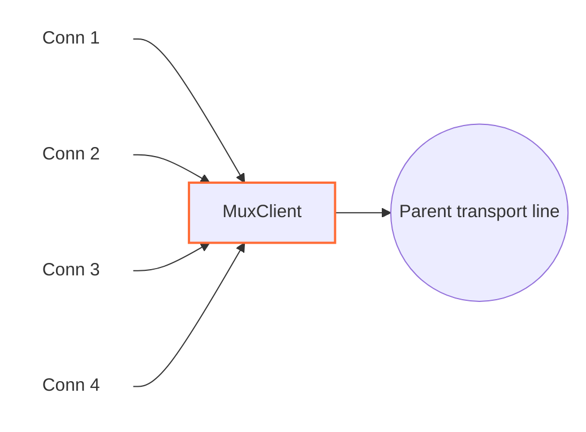

<!-- Written from version 106 of the English doc. -->

# MuxClient

`MuxClient` چندین اتصال منطقی WaterWall را روی تعداد کمتری اتصال transport مشترک حمل می‌کند. به جای اینکه برای هر line ورودی یک اتصال کامل تا سمت مقابل ساخته شود، `MuxClient` یک یا چند parent line به سمت `next` می‌سازد یا reuse می‌کند، و eventهای هر child را به صورت MUX frame داخلی می‌فرستد. در سمت مقابل باید `MuxServer` قرار بگیرد تا lineهای child مستقل را دوباره بسازد.



`MuxClient` خودش listener یا connector نیست. نود قبلی lineهای child را می‌سازد و نود بعدی transport مشترک parent را فراهم می‌کند.

## جایگاه رایج

TCP ساده:

```text
سمت client: TcpListener -> MuxClient -> TcpConnector
سمت server: TcpListener -> MuxServer -> TcpConnector
```

با protocol stack بیرونی:

```text
سمت client: TcpListener -> MuxClient -> HttpClient -> TlsClient -> TcpConnector
سمت server: TcpListener -> TlsServer -> HttpServer -> MuxServer -> TcpConnector
```

از MUX زمانی استفاده کنید که بسیاری از اتصال‌های منطقی کوتاه یا متوسط باید از تعداد کمتری اتصال transport بیرونی عبور کنند.

## این نود چه می‌کند؟

- lineهای child معمولی را از نود قبلی می‌پذیرد.
- parent transport lineها را به سمت `next` می‌سازد.
- parent lineها را طبق mode انتخابی concurrency reuse می‌کند.
- به هر child یک connection id یا `cid` اختصاص می‌دهد.
- payloadها، pause، resume و Finish eventهای child را به MUX frame رمزگذاری می‌کند.
- frameهای reply از `MuxServer` را دریافت و به child مناسب route می‌کند.
- داده delivered توسط parent را queue می‌کند وقتی سمت write child local pause شده.
- backpressure per-child را با `FlowPause` و `FlowResume` frame بازتاب می‌دهد.
- parent lineهای exhausted بیکار را هنگام بسته شدن آخرین child می‌بندد.

`MuxClient` objectهای parent `line_t` را داخلی می‌سازد و مسئول destroy آن‌ها است. lineهای child ساخته‌شده توسط نود قبلی را destroy نمی‌کند.

## نمونه تنظیم‌ها

حالت timer:

```json
{
  "name": "mux-client",
  "type": "MuxClient",
  "settings": {
    "mode": "timer",
    "connection-duration-ms": 30000
  },
  "next": "outbound-transport"
}
```

حالت counter:

```json
{
  "name": "mux-client",
  "type": "MuxClient",
  "settings": {
    "mode": "counter",
    "connection-capacity": 128
  },
  "next": "outbound-transport"
}
```

حالت fixed parent pool:

```json
{
  "name": "mux-client",
  "type": "MuxClient",
  "settings": {
    "mode": "fixed-connections-count",
    "per-worker-connections-count": 2
  },
  "next": "outbound-transport"
}
```

## فیلدهای اجباری

فیلدهای top-level:

| فیلد | نوع | توضیح |
| --- | --- | --- |
| `name` | string | نام یکتای نود داخل config. |
| `type` | string | باید دقیقاً `"MuxClient"` باشد. |
| `settings` | object | اجباری. باید `mode` و تنظیم اختصاصی همان mode را داشته باشد. |
| `next` | string | اجباری. نود بعدی parent transport lineها را حمل می‌کند. |

فیلدهای اجباری داخل `settings`:

| گزینه | اجباری در | توضیح |
| --- | --- | --- |
| `mode` | همیشه | یکی از `timer`، `counter` یا `fixed-connections-count`. |
| `connection-duration-ms` | `mode: "timer"` | مدت پذیرش child جدید روی هر parent، به میلی‌ثانیه. باید بزرگ‌تر از `60` باشد. |
| `connection-capacity` | `mode: "counter"` | حداکثر تعداد cid باز شده روی یک parent. باید بزرگ‌تر از `0` باشد. |
| `per-worker-connections-count` | `mode: "fixed-connections-count"` | تعداد parent lineهای ثابت برای هر worker. باید بزرگ‌تر از `0` باشد. |

## تنظیمات اختیاری

| گزینه | نوع | پیش‌فرض | توضیح |
| --- | --- | --- | --- |
| `child-buffer-limit` | integer | `8388608` | حداکثر bytes queue شده برای یک child pause شده. باید بزرگ‌تر از `0` باشد. اگر به حد برسد، child با `Close` frame بسته می‌شود. |
| `child-buffer-pause-tolerance` | integer | `524288` | حدی که child یک `FlowPause` می‌فرستد و parent reads ممکن است pause شوند. باید `0` یا بزرگ‌تر باشد. مقادیر بالاتر از `child-buffer-limit` به همان حد cap می‌شوند. |
| `log-main-line-stats` | boolean | `false` | اگر فعال باشد، parent lineها هر `5000` ms آمار log می‌کنند. |

آمار شامل worker id، وضعیت pause read/write والد، تعداد child، تعداد read-pause child و تعداد write-pause child است.

## مدل parent و child

`MuxClient` دو نقش line دارد:

| نقش | معنی |
| --- | --- |
| child line | اتصال منطقی WaterWall دریافتی از نود قبلی. |
| parent line | اتصال transport مشترک که `MuxClient` به سمت `next` می‌سازد. |

هر child یک `cid` می‌گیرد. `cid` برای یک parent line local است و داخل MUX frameها استفاده می‌شود تا `MuxServer` بتواند payload و control eventها را به stream منطقی درست map کند.

در timer و counter mode، هر worker یک parent قابل استفاده فعلی دارد. childهای جدید به آن join می‌شوند تا exhausted شود.

در fixed parent pool mode، اولین child روی یک worker باعث می‌شود `MuxClient` برای همان worker به تعداد `per-worker-connections-count` parent line بسازد. childهای جدید به کم‌بارترین parent در pool همان worker اختصاص می‌یابند، با round-robin به عنوان tie-break. تا زمانی که slotهای pool زنده‌اند، parent اضافی ساخته نمی‌شود.

## رفتار modeها

| mode | parent چه زمانی child جدید نمی‌پذیرد | مناسب برای |
| --- | --- | --- |
| `timer` | وقتی عمر parent از `connection-duration-ms` بیشتر شود | چرخش parent transport lineها در طول زمان. |
| `counter` | وقتی `cid` به `connection-capacity` برسد | cap ساده روی streamهای منطقی به ازای هر parent. |
| `fixed-connections-count` | exhausted نمی‌شود بر اساس زمان یا تعداد child | تعداد ثابت اتصال بیرونی per-worker. |

parent exhausted شده بلافاصله بسته نمی‌شود. فقط child جدید قبول نمی‌کند، اما childهای موجود تا پایان ادامه می‌دهند. اگر parent exhausted شده child نداشته باشد، `MuxClient` آن را می‌بندد و destroy می‌کند.

همچنین یک hard limit مطلق برای cid وجود دارد: وقتی parent به `4294967295` برسد، exhausted می‌شود.

## باز شدن Stream

کد فعلی یک child را در upstream `Init` attach می‌کند:

1. یک parent line موجود یا جدید روی همان worker انتخاب می‌کند.
2. state MUX line مربوط به child را initialize می‌کند.
3. child را به parent link می‌کند.
4. `cid` بعدی را اختصاص می‌دهد.
5. downstream `Est` را به نود قبلی برای child گزارش می‌دهد.

frame `Open` در زمان `Init` ارسال نمی‌شود. هنگام اولین upstream payload به صورت `Open` frame + `Data` frame در یک buffer ارسال می‌شود. اگر child قبل از ارسال payload finish شود، `MuxClient` یک `Open` و بعد `Close` می‌فرستد تا peer یک open/close sequence کامل ببیند.

## فرمت frame

`MuxClient` و `MuxServer` از header packed هشت‌بایتی مشترک استفاده می‌کنند:

| فیلد | اندازه | توضیح |
| --- | ---: | --- |
| `length` | `uint16` | طول payload بعد از header، big-endian. |
| `flags` | `uint8` | نوع frame. |
| `_pad1` | `uint8` | بایت padding داخلی. |
| `cid` | `uint32` | شناسه child stream، big-endian. |

flagهای frame:

| flag | معنی |
| ---: | --- |
| `0` | `Open` |
| `1` | `Close` |
| `2` | `FlowPause` |
| `3` | `FlowResume` |
| `4` | `Data` |

implementation payloadهای بزرگ‌تر از `0xFFFF - 8` را reject می‌کند، پس یک MUX data frame حداکثر `65527` بایت payload می‌برد. `MuxClient` یک child payload بزرگ را به چند frame تقسیم نمی‌کند؛ payloadهایی که به این نود می‌رسند باید از قبل در این حد باشند.

## جهت و رفتار Callback

| callback ورودی | رفتار |
| --- | --- |
| upstream `Init` child | یک parent انتخاب یا می‌سازد، child را link می‌کند، `cid` اختصاص می‌دهد، `Est` را به نود قبلی برای child گزارش می‌دهد. |
| upstream `Payload` child | برای اولین payload `Open + Data` prepend می‌کند، در غیر این صورت `Data` prepend می‌کند، سپس به parent به سمت `next` می‌فرستد. |
| upstream `Pause` / `Resume` child | `FlowPause` می‌فرستد / داده queue شده را flush می‌کند و در صورت نیاز `FlowResume` می‌فرستد. |
| upstream `Finish` child | `Close` می‌فرستد، یا `Open + Close` اگر هنوز payload stream را باز نکرده؛ در صورت نیاز parent exhausted بیکار را می‌بندد. |
| downstream `Payload` والد | MUX frameهای `MuxServer` را parse می‌کند، `Data`، `Close`، `FlowPause` و `FlowResume` را به child مناسب route می‌کند. |
| downstream `Pause` / `Resume` والد | write pressure والد را به child نویسنده اخیر یا همه childها (اگر نویسنده اخیر نامشخص باشد) بازتاب می‌دهد. |
| downstream `Finish` والد | والد را finishing علامت می‌زند، همه childها را به نود قبلی flush/finish می‌کند، state والد را destroy می‌کند و owned parent line را destroy می‌کند. |
| upstream `Est` | غیرفعال؛ رسیدن به این callback fatal است. |
| downstream `Init` | غیرفعال؛ رسیدن به این callback fatal است. |

frameهای ناشناخته، frameهایی برای cidهای گمشده و frameهای `Open` ناخواسته از سمت server drop می‌شوند.

## Backpressure و صف‌ها

MUX backpressure را per-child نگه می‌دارد:

- اگر child local pause شود، `MuxClient` یک `FlowPause` برای همان `cid` می‌فرستد.
- اگر peer `FlowPause` برسد، خواندن از child local pause می‌شود.
- اگر داده delivered توسط parent برای یک child pause شده برسد، داده روی همان child queue می‌شود.
- وقتی صف یک child به `child-buffer-pause-tolerance` برسد، child یک `FlowPause` می‌فرستد و parent input ممکن است pause شود.
- همین tolerance روی aggregate داده queue شده child روی parent line هم اعمال می‌شود.
- وقتی داده queue شده پایین‌تر از `min(512 KiB, child-buffer-limit)` برسد، `FlowResume` و resume خواندن parent می‌توانند ارسال شوند.
- اگر صف یک child به `child-buffer-limit` برسد، آن child بسته می‌شود.

این به یک child کُند اجازه می‌دهد stream خودش را بدون توقف فوری همه childهای دیگر روی همان parent متوقف کند.

## Buffer و Padding

`MuxClient` MUX headerها را به payload خروجی parent prepend می‌کند. متادیتای نود:

```text
required_padding_left = 16
layer_group = kNodeLayerAnything
```

`16` بایت لازم است چون اولین child payload می‌تواند دو header prepend کند: یک `Open` header و یک `Data` header. dataها و control frameهای بعدی از یک header هشت‌بایتی استفاده می‌کنند.

bytes ورودی parent در یک read stream جمع می‌شوند تا یک MUX frame کامل در دسترس باشد. اگر read stream parent از `1 MiB` بیشتر شود، parent و همه childهای متصل بسته می‌شوند.

## نکته‌های عملی

- `MuxClient` باید با `MuxServer` pair شود.
- `mode` در implementation فعلی اجباری است.
- `connection-duration-ms` فقط برای timer mode اعمال می‌شود.
- `connection-capacity` فقط برای counter mode اعمال می‌شود.
- `per-worker-connections-count` فقط برای fixed parent pool mode اعمال می‌شود.
- با چند worker، fixed parent pool mode با تعداد worker scale می‌شود. مثلاً `per-worker-connections-count: 2` با ۴ worker می‌تواند تا ۸ parent transport line بسازد.
- `MuxClient` یک middle tunnel است، نه یک endpoint عمومی.
