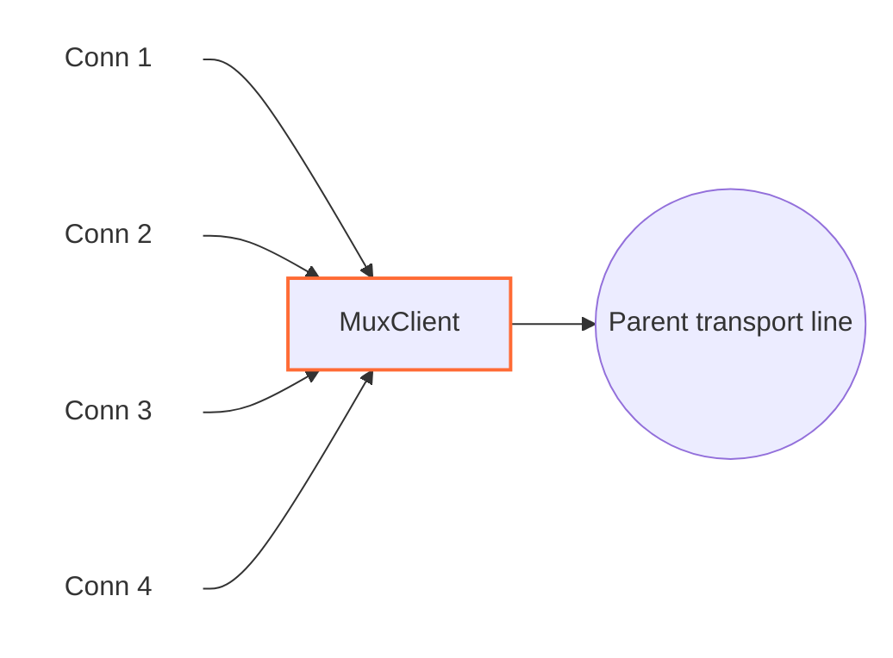

<!-- Written from version 107 of the English doc. -->

# MuxClient

`MuxClient` چند اتصال منطقی WaterWall را روی تعداد کمتری اتصال مشترک transport حمل می‌کند. به‌جای ساخت یک اتصال کامل تا سمت مقابل برای هر line ورودی، یک یا چند parent line به سمت `next` می‌سازد یا دوباره به کار می‌گیرد و رویدادهای هر child را در قالب فریم داخلی MUX می‌فرستد. در سمت مقابل، `MuxServer` این child lineهای مستقل را بازسازی می‌کند.



`MuxClient` خودش listener یا connector نیست؛ نود قبلی child lineها را می‌سازد و نود بعدی transport مشترک parent را فراهم می‌کند.

## جایگاه رایج

TCP ساده:

```text
client side: TcpListener -> MuxClient -> TcpConnector
server side: TcpListener -> MuxServer -> TcpConnector
```

با protocol stack بیرونی:

```text
client side: TcpListener -> MuxClient -> HttpClient -> TlsClient -> TcpConnector
server side: TcpListener -> TlsServer -> HttpServer -> MuxServer -> TcpConnector
```

از MUX زمانی استفاده کنید که تعداد زیادی اتصال منطقی کوتاه یا متوسط باید روی تعداد کمتری اتصال بیرونی transport عبور کنند.

## این نود چه می‌کند؟

- lineهای child معمولی را از نود قبلی می‌پذیرد.
- parent transport lineها را به سمت `next` می‌سازد.
- parent lineها را بر اساس حالت concurrency انتخاب‌شده دوباره به کار می‌گیرد.
- به هر child یک connection id یا `cid` اختصاص می‌دهد.
- payload و رویدادهای pause، resume و Finish هر child را در فریم MUX encode می‌کند.
- فریم‌های برگشتی `MuxServer` را به child مناسب هدایت می‌کند.
- اگر سمت نوشتن child محلی pause باشد، داده رسیده از parent را در صف نگه می‌دارد.
- backpressure per-child را با `FlowPause` و `FlowResume` frame بازتاب می‌دهد.
- parent lineهای exhausted و بی‌کار را پس از بسته شدن آخرین child می‌بندد.

`MuxClient` objectهای parent از نوع `line_t` را داخل خود می‌سازد و مسئول آزاد کردن آن‌هاست. Child lineهایی را که نود قبلی ساخته، آزاد نمی‌کند.

## نمونه تنظیم‌ها

حالت timer:

```json
{
  "name": "mux-client",
  "type": "MuxClient",
  "settings": {
    "mode": "timer",
    "connection-duration-ms": 30000
  },
  "next": "outbound-transport"
}
```

حالت counter:

```json
{
  "name": "mux-client",
  "type": "MuxClient",
  "settings": {
    "mode": "counter",
    "connection-capacity": 128
  },
  "next": "outbound-transport"
}
```

حالت pool ثابت parentها:

```json
{
  "name": "mux-client",
  "type": "MuxClient",
  "settings": {
    "mode": "fixed-connections-count",
    "per-worker-connections-count": 2
  },
  "next": "outbound-transport"
}
```

## فیلدهای اجباری

فیلدهای سطح اصلی:

| فیلد | نوع | توضیح |
| --- | --- | --- |
| `name` | string | نام یکتای نود در پیکربندی. |
| `type` | string | باید دقیقاً `"MuxClient"` باشد. |
| `settings` | object | اجباری. باید `mode` و تنظیم ویژه همان حالت را داشته باشد. |
| `next` | string | اجباری. نود بعدی parent transport lineها را حمل می‌کند. |

فیلدهای اجباری داخل `settings`:

| گزینه | اجباری در | توضیح |
| --- | --- | --- |
| `mode` | همیشه | یکی از `timer`، `counter` یا `fixed-connections-count`. |
| `connection-duration-ms` | `mode: "timer"` | مدت پذیرش child جدید روی هر parent، به میلی‌ثانیه. باید بزرگ‌تر از `60` باشد. |
| `connection-capacity` | `mode: "counter"` | حداکثر تعداد cid باز شده روی یک parent. باید بزرگ‌تر از `0` باشد. |
| `per-worker-connections-count` | `mode: "fixed-connections-count"` | تعداد parent lineهای ثابت برای هر worker. باید بزرگ‌تر از `0` باشد. |

## تنظیمات اختیاری

| گزینه | نوع | پیش‌فرض | توضیح |
| --- | --- | --- | --- |
| `child-buffer-limit` | integer | `25165824` | بیشترین تعداد بایت صف‌شده برای یک child در حالت pause. باید بزرگ‌تر از `0` باشد. با رسیدن به سقف، child با فریم `Close` بسته می‌شود. |
| `child-buffer-pause-tolerance` | integer | `524288` | حدی که child یک `FlowPause` می‌فرستد و parent reads ممکن است pause شوند. باید `0` یا بزرگ‌تر باشد. مقادیر بالاتر از `child-buffer-limit` به همان حد cap می‌شوند. |
| `parent-buffer-limit` | integer | `33554432` | سقف بودجه داده‌های صف‌شده برای childها به‌ازای هر parent. با رسیدن به سقف، child با بیشترین صف بسته می‌شود؛ در صورت مساوی بودن، اولویت با child کم‌فعالیت‌تر است. برای غیرفعال کردن سقف تجمیعی مقدار `0` را قرار دهید. |
| `log-main-line-stats` | boolean | `false` | اگر فعال باشد، parent lineها هر `5000` ms آمار را در لاگ می‌نویسند. |

آمار شامل worker id، وضعیت pause read/write والد، تعداد child، تعداد read-pause child و تعداد write-pause child است.

## مدل parent و child

`MuxClient` دو نقش line دارد:

| نقش | معنی |
| --- | --- |
| child line | اتصال منطقی WaterWall دریافتی از نود قبلی. |
| parent line | اتصال transport مشترک که `MuxClient` به سمت `next` می‌سازد. |

هر child یک `cid` می‌گیرد. مقدار `cid` در محدوده همان parent line محلی است و در فریم‌های MUX به کار می‌رود تا `MuxServer` بتواند payload و رویدادهای کنترلی را به stream منطقی درست نسبت دهد.

در حالت timer و counter، هر worker یک parent فعال و قابل استفاده دارد. Childهای جدید تا exhausted شدن parent به آن متصل می‌شوند.

در حالت pool ثابت parentها، نخستین child روی یک worker باعث می‌شود `MuxClient` به تعداد `per-worker-connections-count` برای همان worker parent line بسازد. Childهای تازه به کم‌بارترین parent در pool آن worker می‌روند و در صورت مساوی بودن بار، round-robin تصمیم می‌گیرد. تا زمانی که slotهای pool زنده باشند، parent اضافه‌ای ساخته نمی‌شود.

## رفتار modeها

| mode | parent چه زمانی child جدید نمی‌پذیرد | مناسب برای |
| --- | --- | --- |
| `timer` | وقتی عمر parent از `connection-duration-ms` بیشتر شود | چرخش parent transport lineها در طول زمان. |
| `counter` | وقتی `cid` به `connection-capacity` برسد | cap ساده روی streamهای منطقی به‌ازای هر parent. |
| `fixed-connections-count` | exhausted نمی‌شود بر اساس زمان یا تعداد child | تعداد ثابت اتصال بیرونی per-worker. |

Parentِ exhausted بی‌درنگ بسته نمی‌شود؛ فقط child تازه نمی‌پذیرد و childهای موجود تا پایان ادامه می‌دهند. اگر چنین parentی child نداشته باشد، `MuxClient` آن را می‌بندد و آزاد می‌کند.

همچنین یک hard limit مطلق برای cid وجود دارد: وقتی parent به `4294967295` برسد، exhausted می‌شود.

## باز شدن Stream

کد فعلی یک child را در upstream `Init` attach می‌کند:

1. یک parent line موجود یا تازه روی همان worker انتخاب می‌کند.
2. state مربوط به MUX را برای child مقداردهی اولیه می‌کند.
3. child را به parent link می‌کند.
4. `cid` بعدی را اختصاص می‌دهد.
5. downstream `Est` را به نود قبلی برای child گزارش می‌دهد.

فریم `Open` هنگام `Init` فرستاده نمی‌شود. با رسیدن نخستین payloadِ upstream، فریم‌های `Open` و `Data` در یک بافر ارسال می‌شوند. اگر child پیش از فرستادن payload finish شود، `MuxClient` ابتدا `Open` و سپس `Close` می‌فرستد تا peer یک توالی کامل open/close ببیند.

## فرمت frame

`MuxClient` و `MuxServer` از header packed هشت‌بایتی مشترک استفاده می‌کنند:

| فیلد | اندازه | توضیح |
| --- | ---: | --- |
| `length` | `uint16` | طول payload بعد از header، big-endian. |
| `flags` | `uint8` | نوع frame. |
| `_pad1` | `uint8` | بایت padding داخلی. |
| `cid` | `uint32` | شناسه child stream، big-endian. |

flagهای frame:

| flag | معنی |
| ---: | --- |
| `0` | `Open` |
| `1` | `Close` |
| `2` | `FlowPause` |
| `3` | `FlowResume` |
| `4` | `Data` |

`65,527` بایت سقف payload در **یک** فریم `Data` است، نه سقف یک callback از نوع
`Payload` برای child. encoder یک payload بزرگ‌تر را، با حفظ ترتیب دقیق بایت‌ها، به
چند فریم پیاپی `Data` با حداکثر `65,527` بایت تقسیم می‌کند.

اندازهٔ تجمیعی encodeشده ــ شامل payload، header هشت‌بایتی هر فریم `Data` و فریم
اختیاری `Open` ــ به‌صورت checked محاسبه می‌شود و باید در `uint32_t` جا شود. اگر
جا نشود، buffer ورودی recycle می‌شود و فقط همان child بسته می‌شود؛ هیچ فریم ناقصی
منتشر نمی‌شود. تخصیص buffer تجمیعی نیز از قرارداد fail-fast مربوط به shift buffer
پیروی می‌کند، بنابراین شکست واقعی allocator باعث خاتمه می‌شود و هرگز دادهٔ ناقص
forward نخواهد شد.

## جهت و رفتار Callback

| callback ورودی | رفتار |
| --- | --- |
| upstream `Init` child | یک parent انتخاب یا می‌سازد، child را link می‌کند، `cid` اختصاص می‌دهد، `Est` را به نود قبلی برای child گزارش می‌دهد. |
| upstream `Payload` child | برای اولین payload `Open + Data` prepend می‌کند، در غیر این صورت `Data` prepend می‌کند، سپس به parent به سمت `next` می‌فرستد. |
| upstream `Pause` / `Resume` child | `FlowPause` می‌فرستد / داده queue شده را flush می‌کند و در صورت نیاز `FlowResume` می‌فرستد. |
| upstream `Finish` child | `Close` می‌فرستد، یا `Open + Close` اگر هنوز payload stream را باز نکرده؛ در صورت نیاز parent exhausted بیکار را می‌بندد. |
| downstream `Payload` والد | فریم‌های MUX از `MuxServer` را تجزیه می‌کند و `Data`، `Close`، `FlowPause` و `FlowResume` را به child مناسب می‌فرستد. |
| downstream `Pause` / `Resume` والد | write pressure والد را به child نویسنده اخیر یا همه childها (اگر نویسنده اخیر نامشخص باشد) بازتاب می‌دهد. |
| downstream `Finish` والد | parent را finishing علامت می‌زند، همه childها را به سمت نود قبلی flush/finish می‌کند، state parent و parent line تحت مالکیت خود را از بین می‌برد. |
| upstream `Est` | غیرفعال؛ رسیدن به این callback fatal است. |
| downstream `Init` | غیرفعال؛ رسیدن به این callback fatal است. |

فریم‌های ناشناخته، فریم‌های مربوط به cid ناموجود و فریم `Open` ناخواسته از سمت سرور دور ریخته می‌شوند.

## Backpressure و صف‌ها

MUX backpressure را per-child نگه می‌دارد:

- اگر child محلی pause شود، `MuxClient` برای همان `cid` یک `FlowPause` می‌فرستد.
- اگر `FlowPause` از peer برسد، خواندن از child محلی pause می‌شود.
- اگر برای childی که pause است داده‌ای از parent برسد، داده روی همان child در صف می‌ماند.
- وقتی صف یک child به `child-buffer-pause-tolerance` برسد، child یک `FlowPause` می‌فرستد و parent input ممکن است pause شود.
- همین tolerance روی aggregate داده queue شده child روی parent line هم اعمال می‌شود.
- وقتی داده queue شده پایین‌تر از `min(256 KiB, child-buffer-limit)` برسد، `FlowResume` و resume خواندن parent می‌توانند ارسال شوند.
- اگر صف یک child به `child-buffer-limit` برسد، آن child بسته می‌شود.

به این ترتیب یک child کُند می‌تواند stream خود را متوقف کند، بی‌آنکه همه childهای دیگر روی همان parent فوراً متوقف شوند.

## Buffer و Padding

`MuxClient` MUX headerها را به payload خروجی parent prepend می‌کند. متادیتای نود:

```text
required_padding_left = 16
layer_group = kNodeLayer4
```

این `16` بایت لازم است، زیرا نخستین payloadِ child ممکن است دو header داشته باشد: یکی برای `Open` و دیگری برای `Data`. داده‌ها و فریم‌های کنترلی بعدی تنها یک header هشت‌بایتی دارند.

بایت‌های ورودی parent در یک stream خواندن جمع می‌شوند تا فریم کامل MUX آماده باشد. اگر این stream از `1 MiB` بزرگ‌تر شود، parent و همه childهای متصل بسته می‌شوند.

## نکته‌های عملی

- `MuxClient` باید با `MuxServer` جفت شود.
- `mode` در implementation فعلی اجباری است.
- `connection-duration-ms` فقط برای timer mode اعمال می‌شود.
- `connection-capacity` فقط برای counter mode اعمال می‌شود.
- `per-worker-connections-count` فقط برای fixed parent pool mode اعمال می‌شود.
- با چند worker، اندازه pool ثابت parentها نیز با تعداد workerها بالا می‌رود. برای مثال، `per-worker-connections-count: 2` با چهار worker می‌تواند تا هشت parent transport line بسازد.
- `MuxClient` یک تونل میانی است، نه endpoint عمومی.
