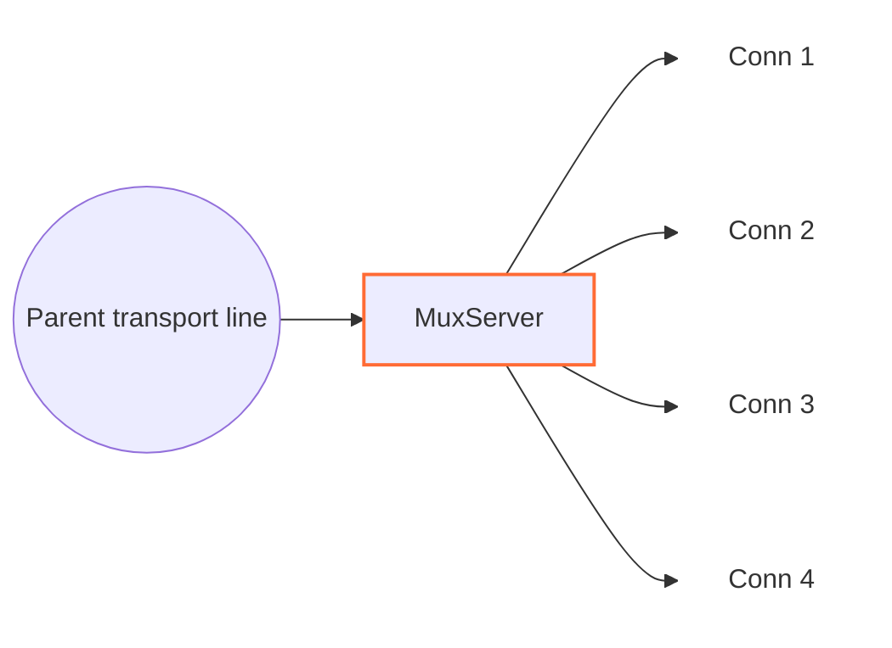

<!--
Documentation version: 161
-->

# MuxServer

`MuxServer` همتای سمت مقابل `MuxClient` است. ترافیک فریم‌شده MUX را روی یک parent transport line می‌گیرد، با رسیدن فریم `Open` یک child line می‌سازد و هر child را به‌عنوان line مستقلی در WaterWall به `next` می‌فرستد.



سمت قبلی باید transport line حامل فریم‌های `MuxClient` را فراهم کند و سمت بعدی child lineهای منطقی بازسازی‌شده را می‌گیرد.

## جایگاه رایج

TCP ساده:

```text
client side: TcpListener -> MuxClient -> TcpConnector
server side: TcpListener -> MuxServer -> TcpConnector
```

با protocol stack بیرونی:

```text
client side: TcpListener -> MuxClient -> HttpClient -> TlsClient -> TcpConnector
server side: TcpListener -> TlsServer -> HttpServer -> MuxServer -> TcpConnector
```

از دید نود بعدی، هر child ساخته‌شده توسط `MuxServer` مثل یک اتصال WaterWall جداگانه رفتار می‌کند.

## این نود چه می‌کند؟

- با رسیدن `Init` در upstream از transport، parent line را مقداردهی اولیه می‌کند.
- MUX frameها را از parent line می‌خواند.
- به‌ازای هر `Open` frame معتبر یک child line می‌سازد.
- هر child line را به سمت `next` مقداردهی اولیه می‌کند.
- `Data`، `Close`، `FlowPause` و `FlowResume` را بر اساس `cid` به مقصد مناسب می‌فرستد.
- payload childهای downstream را دوباره داخل MUX `Data` frame می‌پیچد.
- رویدادهای Finishِ child را به شکل فریم `Close` به `MuxClient` برمی‌گرداند.
- اگر سمت نوشتن child pause باشد، داده رسیده از parent را در صف نگه می‌دارد.
- هنگام finish شدن parent transport، صف‌های پذیرفته‌شده childها را detached می‌کند و با رعایت backpressure هر child تخلیه می‌کند.

`MuxServer` objectهای child از نوع `line_t` را پشت parent می‌سازد و مسئول آزاد کردن آن‌هاست. Parent transport line را خودش نمی‌سازد.

## نمونه تنظیم

```json
{
  "name": "mux-server",
  "type": "MuxServer",
  "settings": {
    "child-buffer-limit": 25165824,
    "child-buffer-resume-threshold": 262144,
    "parent-buffer-limit": 134217728,
    "max-children": 10000,
    "max-live-children": 262144,
    "initial-child-idle-timeout-ms": 10000,
    "active-child-idle-timeout-ms": 300000,
    "memory-high-watermark-percent": 85,
    "memory-low-watermark-percent": 75,
    "memory-reserve": 268435456,
    "memory-fallback-max-live-children": 12000,
    "detached-buffer-limit": 268435456,
    "detached-child-limit": 12000,
    "log-main-line-stats": false
  },
  "next": "service-side-node"
}
```

## فیلدهای اجباری

فیلدهای سطح اصلی:

| فیلد | نوع | توضیح |
| --- | --- | --- |
| `name` | string | نام یکتای نود در پیکربندی. |
| `type` | string | باید دقیقاً `"MuxServer"` باشد. |
| `settings` | object | اختیاری. وقتی نوشته نشود پیش‌فرض‌ها استفاده می‌شوند. |
| `next` | string | اجباری. نود بعدی lineهای child بازسازی‌شده را دریافت می‌کند. |

`MuxServer` باید یک نود transport-facing قبل از خودش داشته باشد و از `MuxClient` متناظر برسد.

## تنظیمات اختیاری

| گزینه | نوع | پیش‌فرض | توضیح |
| --- | --- | --- | --- |
| `child-buffer-limit` | integer | `25165824` | سقف charge منابع `sbuf_t` نگه‌داشته‌شده برای یک child در حالت pause. برای ordinary هزینهٔ تخصیص و برای splice ظرفیت منطقی sbuf به‌علاوهٔ header و alignment شمرده می‌شود؛ padding یک‌بار حساب می‌شود. باید بزرگ‌تر از `0` باشد؛ رسیدن به سقف child را با فریم `Close` می‌بندد. |
| `child-buffer-resume-threshold` | integer | `262144` | Low-water mark برحسب بایت منطقی payload صف‌شده برای ارسال `FlowResume` پس از writableشدن child محلی. باید بزرگ‌تر از `0` باشد و مقدار عددی آن به `child-buffer-limit` cap می‌شود. مقدار بزرگ‌تر peer را زودتر Resume می‌کند، اما Hysteresis را کاهش می‌دهد و ممکن است چرخه‌های Pause/Resume را بیشتر کند. |
| `parent-buffer-limit` | integer | `134217728` | سقف ظرفیت ورودی در حال تشکیل فریم به‌علاوهٔ صف childهای متصل روی هر parent. ابتدا ترکیب سودمند ورودی و سپس بستن بزرگ‌ترین صف با اولویت قدیمی‌ترین child در تساوی انجام می‌شود؛ فشار حل‌نشده parent را می‌بندد. برای غیرفعال کردن سقف تجمیعی مقدار `0` را قرار دهید. |
| `max-children` | integer | `10000` | سقف سخت childهای live متصل به یک parent. باید مثبت و حداکثر برابر `max-live-children` باشد؛ CIDهای تاریخیِ ازبین‌رفته شمارش نمی‌شوند. |
| `max-live-children` | integer | `262144` | سقف سخت childهای رزروشده یا مقداردهی‌شده در کل این instance و همه parentها و workerها. childهای draining و detached تا نابودی واقعی state شمارش می‌شوند. |
| `initial-child-idle-timeout-ms` | integer | `10000` | مهلت idle پس از `Open` و پیش از نخستین payload غیرخالی. باید مثبت باشد. |
| `active-child-idle-timeout-ms` | integer | `300000` | مهلت idle قابل refresh پس از آغاز payload واقعی. باید مثبت و حداقل برابر مهلت اولیه باشد. |
| `memory-high-watermark-percent` | integer | `85` | در این درصد مصرف host یا cgroup محدود، admission بسته می‌شود. بازه مجاز `[1, 99]` است. |
| `memory-low-watermark-percent` | integer | `75` | gate فقط وقتی باز می‌شود که همه مصرف‌های قابل اعمال حداکثر این مقدار باشند. باید در `[1, 99]` و کمتر از high watermark باشد. |
| `memory-reserve` | integer | بر اساس `ram-profile` | با رسیدن available مؤثر به این reserve، Open جدید رد می‌شود. بازه `[0, INT_MAX]` است؛ صفر فقط reserve مطلق را غیرفعال می‌کند. |
| `memory-fallback-max-live-children` | integer | بر اساس `ram-profile` | سقف محافظه‌کارانه کل childها وقتی snapshot حافظه unavailable، unsupported یا قدیمی‌تر از یک ثانیه است. باید مثبت و حداکثر `max-live-children` باشد. |
| `detached-buffer-limit` | integer | بر اساس `ram-profile` | سقف charge منابع نگه‌داشته‌شده به‌ازای هر worker برای صف childهای مسدودشده پس از از دست رفتن parent. رسیدن به سقف فقط child تازه detachedشده را abort می‌کند. برای غیرفعال کردن این سقف مقدار `0` را قرار دهید. |
| `detached-child-limit` | integer | بر اساس `ram-profile` | سقف تعداد به‌ازای هر worker برای childهای مسدودشده‌ای که پس از از دست رفتن parent نگه داشته می‌شوند. رسیدن به سقف فقط child مسدودشده‌ای را که به‌تازگی detached شده است abort می‌کند. برای غیرفعال کردن این سقف مقدار `0` را قرار دهید. |
| `log-main-line-stats` | boolean | `false` | اگر فعال باشد، parent lineها هر `5000` ms آمار best-effort را در لاگ می‌نویسند. مرگ منطقی parent اجرای عادی را suppress می‌کند و هنگام رسیدن runner صف‌شده/زمان‌بندی‌شده، task با `LineDead` settle می‌شود. quiescence worker کار معلق را فعالانه لغو می‌کند و هیچ‌یک از این مسیرها آن را دوباره arm نمی‌کند. |

اگر این دو گزینه در تنظیمات نود نوشته نشوند، مقدار پیش‌فرض آن‌ها از `misc.ram-profile` سراسری انتخاب می‌شود:

| پروفایل RAM | سقف پیش‌فرض charge detached | سقف پیش‌فرض childهای detached |
| --- | ---: | ---: |
| S1 (`minimal` / `ultralow`) | `33554432` (`32 MiB`) | `4096` |
| S2 | `80740352` (`77 MiB`) | `5677` |
| M1 (`client`) | `127926272` (`122 MiB`) | `7258` |
| M2 (`client-larger`) | `174063616` (`166 MiB`) | `8838` |
| L1 | `221249536` (`211 MiB`) | `10419` |
| L2 (`server`، پیش‌فرض سراسری) | `268435456` (`256 MiB`) | `12000` |

مقادیر بین کمینه و بیشینه روی شش رده مرتب پروفایل RAM به‌صورت خطی درون‌یابی می‌شوند و سقف charge به نزدیک‌ترین MiB گرد می‌شود. نوشتن صریح هر گزینه در تنظیمات نود، فقط مقدار مشتق‌شده از پروفایل برای همان گزینه را جایگزین می‌کند.

reserve حافظه و fallback live-child نیز در ابتدا از همین شش مقدار بایت و child
استفاده می‌کنند، اما policy پیش‌فرض admission از detached drain مستقل است.

`child-buffer-resume-threshold` طول منطقی payload را می‌شمارد.
`FlowPause` بر اساس وضعیت Pause محلی child ارسال می‌شود و به طول صف وابسته نیست. charge منابع برای سقف‌های سخت صف و threshold خروجی parent
استفاده می‌شود؛ طول محتوا همچنان معیار صف‌های معمولی و flow control است.

آمار اختیاری هر پنج ثانیه شامل `parent-output-queued-bytes`،
`parent-output-queue-charge`، `parent-output-queue-items`،
`parent-transport-paused`، `parent-sources-throttled`،
`children-parent-write-paused` و `children-peer-flow-paused` است.
تعداد محلی می‌تواند غیرصفر باشد در حالی که gate تجمیعی خاموش است.
`parent-output-throttle-ms` و `parent-output-last-throttle-ms` فقط مدت gate
تجمیعی را با ساعت monotonic ۶۴ بیتی گزارش می‌کنند. سه threshold مؤثر نیز
ثبت می‌شوند. `parent-child-queue-charge` و `parent-input-queue-charge` مربوط
به ذخیره‌سازی ورودی‌اند، نه backlog خروجی.

حالت‌هایی مانند `timer`، `counter` و `fixed-connections-count` فقط در `MuxClient` تنظیم می‌شوند. `MuxServer` بر اساس فریم‌های دریافتی عمل می‌کند و به mode کلاینت وابسته نیست.

## مدل parent و child

`MuxServer` دو نقش line دارد:

| نقش | معنی |
| --- | --- |
| parent line | اتصال transport مشترک دریافت‌شده از نود قبلی. |
| child line | یک line معمولی که `MuxServer` برای یک `cid` از parent می‌سازد. |

با رسیدن فریم `Open`:

1. `MuxServer` بررسی می‌کند که آیا `cid` از قبل وجود دارد.
2. اگر `cid` جدید باشد، یک child line روی همان worker می‌سازد.
3. state مربوط به MUX را برای child مقداردهی اولیه می‌کند.
4. child را به parent link می‌کند.
5. upstream `Init` را به سمت `next` روی child line می‌فرستد.

lookup مربوط به `cid` با hash map و به‌طور متوسط O(1) انجام می‌شود. `Open`
تکراری برای هر child هنوز index‌شده یک protocol violation است و همان parent را
می‌بندد.

پیش از allocation، Open جدید باید سقف سخت parent، رزرو اتمیک instance و gate
حافظه cache‌شده را بگذراند. ردشدن منابع بدون ساخت child، فریم `Close(cid)`
می‌فرستد و parent و siblingها را زنده نگه می‌دارد. bucket هر parent burst برابر
`1024` رد و refill برابر `64` token در ثانیه دارد؛ abuse پایدار parent را می‌بندد.

sampler سراسری هر `500` ms snapshot می‌سازد و freshness آن یک ثانیه است. در
Linux، فشار cgroup برابر بیشترین درصد مصرف و کمترین فضای باقی‌مانده در همهٔ
سطح‌های finite و قابل‌مشاهدهٔ cgroup v2/v1 است؛ `MemAvailable` نیز فضای مؤثر را
محدود می‌کند. محدودیت مبهم یا پنهان از fallback محافظه‌کارانه استفاده می‌کند.
در Windows از available physical memory استفاده می‌شود و workerها فقط tuple
اتمی cache‌شده را می‌خوانند. snapshot قدیمی یا unsupported سقف fallback را به
کار می‌گیرد و gate بسته‌شده با pressure تازه را باز نمی‌کند.

## فرمت frame

`MuxServer` همان header هشت‌بایتی که `MuxClient` استفاده می‌کند را می‌پذیرد:

| offset | اندازه | معنی |
| --- | --- | --- |
| 0 | ۳ بایت | طول بدون علامت payload، به‌ترتیب big-endian. |
| 3 | ۱ بایت | نوع فریم / flags. |
| 4 | ۴ بایت | شناسهٔ بدون علامت اتصال، به‌ترتیب big-endian. |

سقف قطعی و شامل payload برای **همهٔ انواع فریم، ۱ MiB یعنی 1,048,576 بایت** است؛
این مقدار به پروفایل RAM، اندازهٔ buffer یا ظرفیت درخواستی و واقعی pipe وابسته نیست.
فریم حداکثری با header برابر 1,048,584 بایت است و Open پیش از آن، مجموع را به
1,048,592 می‌رساند. پس از دریافت هر هشت بایت header، طول بزرگ‌تر بی‌درنگ رد می‌شود؛
حتی برای CID یا نوع ناشناخته. فقط همان parent با مسیر عادی parent-loss بسته می‌شود.
برای طول مجاز، decoder منتظر تمام بدنه می‌ماند؛ فریم ناشناخته بدنهٔ اعلام‌شده را
مصرف می‌کند و Data خالی نیز یک delivery دارد. فریم‌های کامل پیش از بررسی سقف
**1,048,584 بایت** برای باقی‌ماندهٔ ناقص تخلیه می‌شوند؛ headerِ cache‌شده نیز شمرده می‌شود.

flagهای frame:

| flag | معنی |
| ---: | --- |
| `0` | `Open` |
| `1` | `Close` |
| `2` | `FlowPause` |
| `3` | `FlowResume` |
| `4` | `Data` |

هر فریم `Data` حداکثر `1,048,576` بایت payload حمل می‌کند. encoder مشترک، payload
بزرگ‌تر downstream را به‌ترتیب بایت میان چند فریم `Data` تقسیم می‌کند. کل
خروجی همراه همه هدرها باید در `uint32_t` جا شود؛ در غیر این صورت ورودی آزاد
می‌شود و فقط همان child بسته می‌شود. گیرنده پس از این تقسیم، مرز callback
اصلی را بازسازی نمی‌کند.

## جهت و رفتار Callback

| callback ورودی | رفتار |
| --- | --- |
| upstream `Init` والد | state parent را مقداردهی اولیه می‌کند، در صورت نیاز ثبت آمار را زمان‌بندی می‌کند و `Est` را در downstream به نود قبلی گزارش می‌دهد. |
| upstream `Payload` والد | فریم‌های MUX از `MuxClient` را تجزیه می‌کند، برای `Open` child می‌سازد و `Data`، `Close`، `FlowPause` و `FlowResume` را بر اساس `cid` می‌فرستد. |
| upstream `Pause` / `Resume` والد | خروجی parent را بی‌درنگ متوقف می‌کند / FIFO را تخلیه می‌کند؛ نویسندهٔ مسدود به‌صورت محلی و همهٔ childها در آستانهٔ تجمیعی محدود می‌شوند. |
| upstream `Finish` والد | state والد را بی‌درنگ از بین می‌برد، صف‌های پذیرفته‌شده childها را به drainهای مستقل از parent منتقل می‌کند و هر child را پس از خالی و قابل‌نوشتن شدن صف آن finish می‌کند. |
| downstream `Payload` child | یک MUX `Data` header prepend می‌کند و frame را روی parent به سمت نود قبلی می‌فرستد. |
| downstream `Pause` / `Resume` child | `FlowPause` می‌فرستد / داده queue شده را flush می‌کند و در صورت نیاز `FlowResume` می‌فرستد. |
| downstream `Finish` child | child را جدا و state و line تحت مالکیت را نابود می‌کند؛ سپس Close را به مسیر خروجی مرتب parent تحویل می‌دهد. |
| upstream `Est` | غیرفعال؛ رسیدن به این callback fatal است. |
| downstream `Init` | غیرفعال؛ رسیدن به این callback fatal است. |

فریم‌های مربوط به cid ناشناخته و typeهای ناشناخته دور ریخته می‌شوند.

## بازیابی childهای idle

هر child پذیرفته‌شده با `initial-child-idle-timeout-ms` آغاز می‌شود. نخستین Data
غیرخالی ورودی یا payload غیرخالی تولیدشده از سمت `next` آن را به
`active-child-idle-timeout-ms` می‌برد و هر payload غیرخالی بعدی deadline فعال را
refresh می‌کند. Open، Close، flow control، Init/Est و Data با طول صفر activity
محسوب نمی‌شوند. بااین‌حال Data با طول صفر، اگر برای child در حالت pause نگه داشته
شود، charge تخصیص مثبت دارد و سقف‌های سخت صف را جلو می‌برد.

expiry فقط همان child را می‌بندد، در صورت وجود parent فریم `Close(cid)` می‌فرستد
و parent و siblingها را حفظ می‌کند. child detached از مسیر detached-abort استفاده
می‌کند. close صریح timer item را بی‌درنگ حذف می‌کند. این تغییر wire format را
عوض نمی‌کند؛ parent در تمام عمر transport قابل استفاده مجدد است و نابودی child
ظرفیت شمارش آن را آزاد می‌کند.

### صف خروجی parent

هر parent یک FIFO مستقل و با تخصیص تنبل برای خروجی رمزگذاری‌شده دارد. تنظیم‌های
اختیاری زیر برحسب ظرفیت sbuf به‌علاوهٔ هدر بافر و alignment هستند. ظرفیت ordinary
فیزیکی و ظرفیت splice منطقی است؛ padding یک‌بار شمرده می‌شود. ظرفیت pipe به آن
اضافه نمی‌شود و این معیار، اندازه‌گیری حافظهٔ kernel یا RSS نیست.

| تنظیم | پیش‌فرض | معنی |
| --- | --- | --- |
| `parent-write-buffer-pause-threshold` | `16777216` (16 MiB) | با رسیدن charge صف به این مقدار، تولیدکننده‌های child متصل Pause می‌شوند. |
| `parent-write-buffer-resume-threshold` | `12582912` (12 MiB) | آزادسازی نگه‌داری محلی در charge کمتر یا مساوی این مقدار، وقتی transport قابل‌نوشتن است. |
| `parent-write-buffer-limit` | `134217728` (128 MiB) | سقف سخت charge صف هر parent؛ برابری با سقف مجاز است. |

pause و hard باید عدد صحیح در `[1, INT_MAX]` و resume در `[0, INT_MAX]` باشند.
شرط نهایی `0 <= resume < pause < hard` است. resume حذف‌شده برابر
`floor(pause * 3 / 4)` است؛ مقدار صریح صفر آزادسازی در صف خالی را درخواست
می‌کند. مقدار نامعتبر clamp نمی‌شود. نمونه زیر resume برابر 1.5 MiB می‌سازد:

```json
{
  "parent-write-buffer-pause-threshold": 2097152,
  "parent-write-buffer-limit": 4194304
}
```

این بودجهٔ خروجی برای هر parent جداست. `parent-buffer-limit` مجموع ورودی در حال
تشکیل فریم و صف childهای متصل را محدود می‌کند.

با دریافت Pause از transport والد، هیچ Payload تازه‌ای، حتی فریم کنترلی یا
Close، به آن سمت فرستاده نمی‌شود. اگر child هنگام مسدود بودن transport داده
بفرستد، پس از پذیرش کامل payload یا batch فقط تولیدکنندهٔ همان child Pause
می‌شود. این قاعده برای Data خالی و ordinary و splice یکسان است. نوشتن مستقیم
نیز اگر transport را در حالت Pause باقی بگذارد، پیش از بازگشت، نویسنده را
متوقف می‌کند. Pause و Resume موقت بر اساس وضعیت نهایی آشتی داده می‌شوند.
ارسال کنترل به‌تنهایی child را نویسنده محسوب نمی‌کند؛ child بیکار زیر آستانهٔ
تجمیعی تا نخستین نوشتن خود متوقف نمی‌شود.

با رسیدن charge به `parent-write-buffer-pause-threshold`، محدودیت تجمیعی همچنان
همهٔ childهای باز و متصل را شامل می‌شود. نگه‌داری محلی نویسنده به‌تنهایی این
gate را فعال نمی‌کند. هر child تنها یک دلیل محلی و یک جایگاه در FIFO محلی
parent دارد؛ علت تکراری جایگاه را عوض نمی‌کند. نویسنده‌ای که پس از Resume
دوباره متوقف شود به انتهای صف می‌رود.

آزادسازی این نگه‌داری‌ها به زنده بودن state والد، نبود Finish یا quiescence،
قابل‌نوشتن بودن transport و charge کمتر یا مساوی
`parent-write-buffer-resume-threshold` وابسته است؛ لازم نیست gate تجمیعی قبلاً
فعال شده باشد. همین شرط latch تجمیعی را هم پاک می‌کند. پس از هر Callback و
پیش از آزادسازی بعدی یا برداشتن بافر، وضعیت دوباره بررسی می‌شود. Pause جدید،
عبور از آستانهٔ Resume، فعال‌شدن دوبارهٔ gate یا نابودی والد آزادسازی را قطع
می‌کند. تخلیهٔ FIFO فرصت بعدی را فراهم می‌کند؛ صف خالی و قابل‌نوشتن نباید
منتظر رویدادی بماند که دیگر رخ نمی‌دهد. FlowPause همتا و حالت بسته‌شدن مستقل‌اند.

پیش از اولین Callback، snapshot از همهٔ lineهای منتظر reference موقت می‌گیرد؛
Callback ممکن است sibling یا parent را نابود کند. عضویت و زنده‌بودن state پیش
از استفاده دوباره بررسی می‌شود. Init/Est دلیل Pause را جدا از مجوز ارسال‌شده
ثبت می‌کند تا Pause گم‌شده یا Resume بی‌جفت رخ ندهد. unlink و بسته‌شدن، عضویت
را پیش از نابودی state حذف می‌کنند و صرفاً برای پاک‌سازی Resume نمی‌فرستند.
خروجی بازگشتی پشت Data، کنترل و باقی‌ماندهٔ batch پذیرفته‌شده می‌ماند.

اگر charge بافر تازه از سقف عبور کند یا رزرو صف شکست بخورد، فقط همان parent از
مسیر معمول teardown بسته می‌شود؛ بافرها آزاد می‌شوند و فرایند متوقف نمی‌شود.
مسیر مستقیمِ قابل‌نوشتن با صف خالی، تخصیص صف ندارد و مشمول سقف نگه‌داری نیست.
فریم‌های کنترلی کوچک از رده مناسب pool با padding زنجیره استفاده می‌کنند.
با از دست رفتن parent، خروجی غیرقابل‌ارسال بی‌درنگ آزاد می‌شود؛ drain مستقل
صف‌های ورودی child طبق قرارداد قبلی ادامه دارد. Open و وضعیت flow-control پیش
از Callback بازگشتی، پس از پذیرش در مسیر خروجی مرتب، منتشر می‌شوند.

## Backpressure و صف‌ها

MUX backpressure را per-child نگه می‌دارد:

- اگر child سمت سرویس pause شود، `MuxServer` برای همان `cid` یک `FlowPause` می‌فرستد.
- اگر `FlowPause` از peer و از طریق parent transport برسد، خواندن از child سمت سرویس pause می‌شود.
- اگر برای childی که pause است داده‌ای از parent برسد، داده روی همان child در صف می‌ماند.
- `FlowPause` همان لحظه‌ای ارسال می‌شود که Callback محلی child را Pause می‌کند و منتظر رسیدن طول صف به آستانه‌ای نمی‌ماند.
- وقتی بایت منطقی payload صف‌شده پایین‌تر از `child-buffer-resume-threshold` برسد، `FlowResume` می‌تواند ارسال شود. مقدار تنظیم‌شده به `child-buffer-limit` cap می‌شود.
- اگر charge صف یک child به `child-buffer-limit` برسد، آن child بسته می‌شود.
- سقف `parent-buffer-limit` مجموع ورودی در حال تشکیل فریم و صف childهای متصل را می‌سنجد. ترکیب سودمند ورودی مقدم است؛ سپس بزرگ‌ترین صف با اولویت قدیمی‌ترین child در تساوی بسته می‌شود. چند قربانی ممکن است لازم باشد و فشار حل‌نشده همان parent را می‌بندد.
- قرار دادن `parent-buffer-limit` روی `0` تنها بودجه تجمیعی را غیرفعال می‌کند و سقف per-child همچنان اعمال می‌شود.

این charge یک budget proxy برای منابع صف‌های live است، نه حافظهٔ دقیق kernel یا RSS؛ cacheهای allocator، حافظه حلقه
اشاره‌گرها و baseline ثابت pool در charge یک صف مشخص نیستند. به این ترتیب یک child
کُند می‌تواند stream خود را متوقف کند، بی‌آنکه همه childهای دیگر روی همان parent
فوراً متوقف شوند.

## Finish و Close

اگر `MuxServer` برای یک child فریم `Close` بگیرد، این Close پس از همه بایت‌های `Data` قبلیِ صف‌شده اعمال می‌شود. child در حالت pause همچنان با `cid` قابل‌شناسایی می‌ماند؛ فریم‌های بعدی برای آن `cid` بسته‌شده دور ریخته می‌شوند، Resume تخلیه FIFO را ادامه می‌دهد و `Finish` به‌همراه آزاد کردن line تحت مالکیت فقط در مرز خالی و قابل‌نوشتن شدن صف انجام می‌شود.

اگر سمت service-facing یک child را ببندد، `MuxServer` فریم Close را می‌سازد، child را از parent جدا و state و line تحت مالکیت خود را نابود می‌کند، سپس Close را به مسیر خروجی مرتب parent تحویل می‌دهد. پاسخ Close به Open ردشده هم از همین FIFO می‌گذرد. در overflow محلی، state والد قرض‌گرفته‌شده آزاد و owner آن مطلع می‌شود؛ MuxServer خود والد را با `lineDestroy` نابود نمی‌کند.

اگر parent transport بسته شود، `MuxServer` state مربوط به MUX در parent قرض‌گرفته‌شده را بی‌درنگ از بین می‌برد و صف هر child پذیرفته‌شده را به registry تحت مالکیت و worker-local منتقل می‌کند. صف‌های قابل‌نوشتن فوراً finish می‌شوند؛ صف‌های pauseشده پس از Resume و بدون نگه‌داشتن یا دسترسی به parent مرده تخلیه می‌شوند. داده خروجی تازه از child رد می‌شود. `detached-buffer-limit` مجموع charge منابع نگه‌داشته‌شده و `detached-child-limit` تعداد child باقی‌مانده را به‌ازای هر worker محدود می‌کند.

## Buffer و Padding

`MuxServer` MUX headerها را به payload downstream child prepend می‌کند. متادیتای نود:

```text
required_padding_left = 8
layer_group = kNodeLayer4
layer_group_next_node = kNodeLayer4
layer_group_prev_node = kNodeLayer4
```

بایت‌های ورودی parent در یک stream خواندن جمع می‌شوند تا فریم کامل MUX آماده باشد. اگر باقی‌ماندهٔ ناقص پس از پردازش فریم‌های کامل، با احتساب header، از `1,048,584` بایت بزرگ‌تر شود، `MuxServer` باقی‌مانده ناقص را دور می‌ریزد، parent را به سمت نود قبلی finish می‌کند و برای صف childهایی که پیش‌تر parse شده‌اند همان detached drain را به کار می‌گیرد.

## نکته‌های عملی

- این نود را با `MuxClient` جفت کنید؛ بدون آن کاربردی ندارد.
- `MuxServer` تنظیمات حالت concurrency سمت کلاینت را ندارد.
- یک `TcpConnector` بعد از `MuxServer` برای هر child یک اتصال سرویس جداگانه می‌سازد.
- `MuxServer` یک تونل میانی است، نه endpoint عمومی.
- `Finish` سمت سرویس یا shutdown منظم worker ممکن است داده detached باقی‌مانده را دور بریزد. هنگام shutdown، پیش از بستن همه childهای تحت مالکیت، هیچ `Payload` صف‌شده‌ای حتی برای child قابل‌نوشتن forward نمی‌شود.
- هیچ تغییری در بایت‌های پروتکل MUX یا قابلیت موردنیاز peer ایجاد نشده است.

## خاموش‌سازی worker

هنگام quiescence، `MuxServer` تایمر idle را جدا می‌کند و صف‌های باقی‌مانده را بدون ارسال Payload،
فریم Close یا پیام‌های کنترل جریان آزاد می‌کند. جدول idle محلی هر worker فهرست کامل childهای متعلق به
آن، چه متصل و چه جداشده، است. worker stop کل جدول را تخلیه می‌کند، حساب حافظهٔ صف و سهم اتصال زندهٔ هر
child را دقیقاً یک بار آزاد می‌کند، Finish را به سمت مقصد می‌فرستد و child را نابود می‌کند. parent
قرض‌گرفته‌شده می‌تواند با وضعیت خالی و معتبر MUX تا Finish مالک واقعی خود زنده بماند. جدول idle پس از
تخلیه روی همان worker نابود می‌شود؛ بررسی مجموع childهای زنده پس از توقف همهٔ workerها انجام می‌شود.
رفتار عادی قطع اتصال، انقضای idle و Close ترتیبی تغییر نمی‌کند.

## مرز فریم‌ها و UDP

دریافت parent از `splice_stream_t` با هدر ثابت استفاده می‌کند. فقط هدر هشت‌بایتی
از بافرهای ورودی جدا و در cache نگه داشته می‌شود؛ بدنه پس از کامل‌شدن دقیقاً استخراج
می‌شود. یک pipe می‌تواند میان چند فریم تقسیم شود و بدنهٔ یک فریم می‌تواند از چند pipe
ساخته شود؛ هر خروجی مالک مستقل pipe خودش است. هدر بعدی فقط پس از مصرف بدنهٔ فعلی
پر می‌شود. callbackِ child فقط بدنه را می‌گیرد و صفِ Pause یک ورودی برای هر فریم دارد.

payload با طول صفر معتبر است: encoder یک فریم `Data` با هدر هشت‌بایتی و
بدون بدنه می‌سازد و decoder یک payload خالی تحویل می‌دهد. این حالت نه EOF
است و نه `Close`. فریم‌های خالی در صف child جدا می‌مانند، حتی وقتی مجموع
بایت‌های منطقی صف صفر است. این ورودی‌ها همچنان charge تخصیص حافظه دارند و
activity غیرخالی برای مهلت idle محسوب نمی‌شوند.

MUX مرز فریم‌های wire خودش را حفظ می‌کند، نه مرز همه callbackها یا دیتاگرام‌های
اصلی UDP را. هر دو encoder یک payload تا سقف `1,048,576` بایت را در یک فریم
`Data` می‌گذارند و payload بزرگ‌تر را میان چند فریم تقسیم می‌کنند. گیرنده
مرز callback اصلی را بازسازی نمی‌کند. نودهای تبدیل‌کننده در سمت child نیز
ممکن است مرز payload را پیش از framing یا پس از decoding تغییر دهند.

برای ترافیک UDP، به‌جای اتکا به چیدمان مستقیم و غیرمعمول UDP/MUX، بخش جریان
بایت زنجیره را با `UdpOverTcpClient` و `UdpOverTcpServer` قاب‌بندی کنید:

```text
client: UdpListener -> UdpOverTcpClient -> MuxClient -> TcpConnector
server: TcpListener -> MuxServer -> UdpOverTcpServer -> UdpConnector
```

آداپتورهای UDP که مستقیم کنار MUX قرار دارند می‌توانند دیتاگرام‌هایی را که
سالم به MUX می‌رسند و در یک فریم `Data` جا می‌شوند جدا نگه دارند؛ این تضمین
عمومی مرزها در زنجیره‌های دلخواه نیست. جفت UdpOverTcp محدودیت‌های خودش را
دارد و فعلاً دیتاگرام غیرخالی می‌خواهد. این محدودیت، پشتیبانی MUX از
`Data` خالی را تغییر نمی‌دهد.

### نگه‌داری splice و بودجهٔ ظرفیت صف

جدول یکپارچهٔ محدودیت‌ها، روند تخصیص و حرکت داده، و حالت‌های مرزی را در
[راهنمای توسعه (انگلیسی)](https://radkesvat.github.io/WaterWall-Docs/docs/devguides/part3-buffers-and-padding#queue-capacity-budgets) ببینید.

هزینهٔ هر بافر از فرمول مشترک زیر محاسبه می‌شود:

```text
sizeof(sbuf_t) + sbufGetTotalCapacity(buf) + kSbufAllocationAlignment
```

ظرفیت شامل padding است و دوباره اضافه نمی‌شود. برای ordinary این همان هزینهٔ
تخصیص قبلی است؛ برای splice ظرفیت منطقی sbuf شمرده می‌شود، بدون افزودن حافظهٔ
کنترل wrapper یا ظرفیت kernel pipe. نامعلوم بودن ظرفیت cache‌شدهٔ pipe، یک منبع
معتبر را به ordinary تبدیل نمی‌کند.

`parent-buffer-limit` با پیش‌فرض **۱۲۸ MiB**، مجموع ورودی در حال تشکیل فریم و
صف‌های child متصل را محدود می‌کند. شمارندهٔ stream از `pending_child_queue_charge`
جدا می‌ماند و مجموع با بررسی سرریز محاسبه می‌شود. فریم‌های کامل یک delivery ابتدا
پردازش می‌شوند؛ عبور موقت همان delivery از سقف باعث رد آن نمی‌شود. headerِ cache‌شده
در طول منطقی و سقف مستقل **1,048,584 بایت** حساب می‌شود، اما sbuf charge ندارد.
مصرف بدنهٔ headِ splice ظرفیت منطقی و هزینه‌اش را کم می‌کند؛ جابه‌جایی cursorِ ordinary
یا مصرف prefix چنین کاهشی ندارد.

با رسیدن به سقف دریافت، ابتدا فقط در صورت کاهش قطعی هزینه، fragmentهای ورودی
در یک بافر ordinary با اندازهٔ best-fit ترکیب می‌شوند. header و ترتیب بایت‌ها حفظ
می‌شوند. این کار روی هر Push اجرا نمی‌شود و صف child یا خروجی را بازنویسی نمی‌کند.
اگر فشار باقی بماند، child با بزرگ‌ترین صف بسته می‌شود؛ در تساوی، قدیمی‌ترین child
اولویت دارد. پس از هر callback وضعیت و هزینه دوباره بررسی می‌شوند و ممکن است چند
child بسته شوند. نبود قربانی یا نبود پیشرفت، فقط همان parent را می‌بندد. مقدار `0`
سقف تجمیعی دریافت را غیرفعال می‌کند و سقف پنهان دیگری جای آن نمی‌گیرد.

سقف child همچنان **۲۴ MiB** است و برابری رد می‌شود. خروجی parent بودجه‌ای جدا با
آستانهٔ Pause برابر **۱۶ MiB**، آستانهٔ Resume برابر **۱۲ MiB** و سقف **۱۲۸ MiB** دارد؛ برابری سقف خروجی مجاز است.
بودجه‌های detached روی هر worker و معنی صفر/نامحدود آن‌ها حفظ می‌شوند.
آستانهٔ FlowResume طول منطقی payload را می‌شمارد؛ FlowPause تابع وضعیت Pause محلی child است. برای ordinaryِ child
انتخاب ردهٔ pooled ارزان‌تر باقی است؛ spliceها برای فشار صف تک‌تک materialize نمی‌شوند.

هیچ سهمیهٔ مشترک تعداد یا ظرفیت pipe روی worker وجود ندارد. نگه‌داری یک parent
باعث fallback والد دیگر نمی‌شود. این هزینه سقف FD، ظرفیت kernel، ارجاع صفحه، صف
socket یا RSS نیست و سقف لحظه‌ای حافظه نیز محسوب نمی‌شود. splice بیشتر می‌تواند با
همان بودجهٔ منطقی از descriptor و ظرفیت kernel بیشتری استفاده کند. recycle ممکن است
pipe خالی را در pool نگه دارد؛ کاهش charge به معنی بسته‌شدن واقعی pipe نیست.

ورودی تا ۱ MiB در مسیر تک‌بافری می‌ماند؛ ورودی خالی یک Data دارد. ordinary بزرگ‌تر
یک aggregate می‌سازد و splice بزرگ‌تر یک batch کامل و مرتب، با Open فقط یک‌بار پیش
از نخستین Dataِ client. بدنهٔ ۱ MiB به‌علاوهٔ prefix ممکن است نیازمند تقسیم باشد.
تخمین هزینهٔ pipe مقصد از ظرفیت منطقی پس از تکمیل بدنه است. هزینهٔ fallback ordinary
برای فریم‌های باقی‌مانده رزرو می‌شود. تمام پذیرش‌های قابل شکست پیش از انتشار batch
و callback انجام می‌شوند؛ رد پذیرش همهٔ batch را آزاد و parent مربوط را می‌بندد.
مسیر مستقیم تک‌بافریِ parent قابل‌نوشتن به پذیرش FIFO نیاز ندارد.

ساخت ناموفق pipe، ظرفیت ناکافی، کمبود slot، انتقال کوتاه و EINTR همچنان با fallback
کامل ordinary مدیریت می‌شوند؛ ظرفیت اسمی ۱ MiB تضمین slot کافی نیست. headroom و همهٔ
بایت‌ها حتی پس از پیشرفت جزئی حفظ می‌شوند. اندازهٔ pool/pipe و پیش‌فرض‌های JSON و
سقف پروتکل تغییر نمی‌کنند. Pause پمپ را متوقف می‌کند؛ Resume، ورودی بازگشتی و Close
ترتیب FIFO را حفظ می‌کنند. مرگ child خروجی متعلق به parent را آزاد نمی‌کند. parent-loss
ورودی و خروجی را آزاد و صف‌های مجاز child را به حساب detached منتقل می‌کند. هر pop و
discard پیش از callback هزینهٔ مالک را تسویه می‌کند. BufferStream و HTTP فقط ordinary
می‌پذیرند.

## متادیتای نود

متادیتای برگرفته از کد منبع:

| ویژگی | مقدار |
| --- | --- |
| node flags | `kNodeFlagSupportsSplice` |
| `can_have_prev` | `true` |
| `can_have_next` | `true` |
| `layer_group` | `kNodeLayer4` |
| `layer_group_prev_node` | `kNodeLayer4` |
| `layer_group_next_node` | `kNodeLayer4` |
| `required_padding_left` | `8` bytes |
