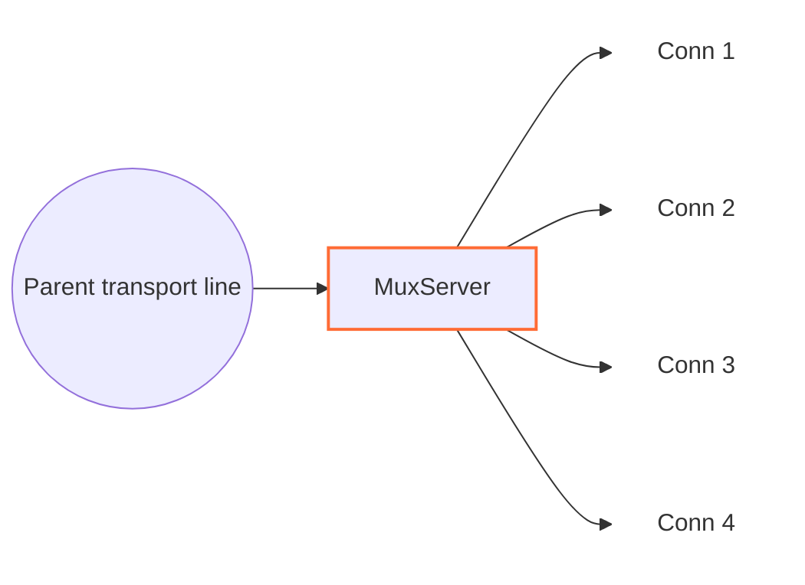

<!-- Written from version 106 of the English doc. -->

# MuxServer

`MuxServer` سمت مقابل `MuxClient` است. این نود ترافیک MUX frame شده را روی یک parent transport line دریافت می‌کند، وقتی frame `Open` می‌رسد child line می‌سازد، و هر child را به عنوان یک line مستقل WaterWall به `next` forward می‌کند.



سمت قبلی باید transport line حامل frameهای `MuxClient` را فراهم کند. سمت بعدی lineهای child بازسازی‌شده منطقی را دریافت می‌کند.

## جایگاه رایج

TCP ساده:

```text
سمت client: TcpListener -> MuxClient -> TcpConnector
سمت server: TcpListener -> MuxServer -> TcpConnector
```

با protocol stack بیرونی:

```text
سمت client: TcpListener -> MuxClient -> HttpClient -> TlsClient -> TcpConnector
سمت server: TcpListener -> TlsServer -> HttpServer -> MuxServer -> TcpConnector
```

از دید نود بعدی، هر child ساخته‌شده توسط `MuxServer` مثل یک اتصال WaterWall جداگانه رفتار می‌کند.

## این نود چه می‌کند؟

- وقتی upstream `Init` از transport برسد، parent line را initialize می‌کند.
- MUX frameها را از parent line می‌خواند.
- به ازای هر `Open` frame معتبر یک child line می‌سازد.
- هر child line را به سمت `next` initialize می‌کند.
- `Data`، `Close`، `FlowPause` و `FlowResume` را بر اساس `cid` route می‌کند.
- payload childهای downstream را دوباره داخل MUX `Data` frame می‌پیچد.
- Finish eventهای child را به عنوان `Close` frame به `MuxClient` برمی‌گرداند.
- داده delivered توسط parent را queue می‌کند وقتی سمت write child pause شده.
- همه child lineها را هنگام finish شدن parent transport می‌بندد.

`MuxServer` objectهای child `line_t` پشت parent را می‌سازد و مسئول destroy آن‌ها است. parent transport line را خودش نمی‌سازد.

## نمونه تنظیم

```json
{
  "name": "mux-server",
  "type": "MuxServer",
  "settings": {
    "child-buffer-limit": 8388608,
    "child-buffer-pause-tolerance": 524288,
    "log-main-line-stats": false
  },
  "next": "service-side-node"
}
```

## فیلدهای اجباری

فیلدهای top-level:

| فیلد | نوع | توضیح |
| --- | --- | --- |
| `name` | string | نام یکتای نود داخل config. |
| `type` | string | باید دقیقاً `"MuxServer"` باشد. |
| `settings` | object | اختیاری. وقتی نوشته نشود پیش‌فرض‌ها استفاده می‌شوند. |
| `next` | string | اجباری. نود بعدی lineهای child بازسازی‌شده را دریافت می‌کند. |

`MuxServer` باید یک نود transport-facing قبل از خودش داشته باشد و از `MuxClient` متناظر برسد.

## تنظیمات اختیاری

| گزینه | نوع | پیش‌فرض | توضیح |
| --- | --- | --- | --- |
| `child-buffer-limit` | integer | `8388608` | حداکثر bytes queue شده برای یک child pause شده. باید بزرگ‌تر از `0` باشد. اگر به حد برسد، child با `Close` frame بسته می‌شود. |
| `child-buffer-pause-tolerance` | integer | `524288` | حدی که child یک `FlowPause` می‌فرستد و parent reads ممکن است pause شوند. باید `0` یا بزرگ‌تر باشد. مقادیر بالاتر از `child-buffer-limit` به همان حد cap می‌شوند. |
| `log-main-line-stats` | boolean | `false` | اگر فعال باشد، parent lineها هر `5000` ms آمار log می‌کنند. |

آمار شامل worker id، وضعیت pause read/write والد، تعداد child، تعداد read-pause child و تعداد write-pause child است.

تنظیمات mode مثل `timer`، `counter` و `fixed-connections-count` فقط در `MuxClient` هستند. `MuxServer` بر اساس frameهایی که دریافت می‌کند عمل می‌کند و به mode client کاری ندارد.

## مدل parent و child

`MuxServer` دو نقش line دارد:

| نقش | معنی |
| --- | --- |
| parent line | اتصال transport مشترک دریافت‌شده از نود قبلی. |
| child line | یک line معمولی که `MuxServer` برای یک `cid` از parent می‌سازد. |

وقتی frame `Open` برسد:

1. `MuxServer` بررسی می‌کند که آیا `cid` از قبل وجود دارد.
2. اگر `cid` جدید باشد، یک child line روی همان worker می‌سازد.
3. state MUX line را برای child initialize می‌کند.
4. child را به parent link می‌کند.
5. upstream `Init` را به سمت `next` روی child line می‌فرستد.

frameهای `Open` تکراری برای `cid` موجود نادیده گرفته می‌شوند.

## فرمت frame

`MuxServer` همان header packed هشت‌بایتی که `MuxClient` استفاده می‌کند را می‌پذیرد:

| فیلد | اندازه | توضیح |
| --- | ---: | --- |
| `length` | `uint16` | طول payload بعد از header، big-endian. |
| `flags` | `uint8` | نوع frame. |
| `_pad1` | `uint8` | بایت padding داخلی. |
| `cid` | `uint32` | شناسه child stream، big-endian. |

flagهای frame:

| flag | معنی |
| ---: | --- |
| `0` | `Open` |
| `1` | `Close` |
| `2` | `FlowPause` |
| `3` | `FlowResume` |
| `4` | `Data` |

implementation payloadهای بزرگ‌تر از `0xFFFF - 8` را reject می‌کند، پس یک MUX data frame حداکثر `65527` بایت payload می‌برد. `MuxServer` یک child payload downstream بزرگ را به چند frame تقسیم نمی‌کند؛ payloadهایی که به این نود می‌رسند باید از قبل در این حد باشند.

## جهت و رفتار Callback

| callback ورودی | رفتار |
| --- | --- |
| upstream `Init` والد | state والد را initialize می‌کند، در صورت نیاز log stats را schedule می‌کند، downstream `Est` را به نود قبلی گزارش می‌دهد. |
| upstream `Payload` والد | MUX frameهای `MuxClient` را parse می‌کند؛ برای `Open` childها می‌سازد؛ `Data`، `Close`، `FlowPause` و `FlowResume` را بر اساس `cid` route می‌کند. |
| upstream `Pause` / `Resume` والد | write pressure والد را به child نویسنده اخیر یا همه childها (اگر نویسنده اخیر نامشخص باشد) بازتاب می‌دهد. |
| upstream `Finish` والد | والد را finishing علامت می‌زند، همه childها را به سمت `next` flush/finish می‌کند، state والد را destroy می‌کند. |
| downstream `Payload` child | یک MUX `Data` header prepend می‌کند و frame را روی parent به سمت نود قبلی می‌فرستد. |
| downstream `Pause` / `Resume` child | `FlowPause` می‌فرستد / داده queue شده را flush می‌کند و در صورت نیاز `FlowResume` می‌فرستد. |
| downstream `Finish` child | یک MUX `Close` frame می‌فرستد، state child owned را destroy می‌کند، child line owned را destroy می‌کند. |
| upstream `Est` | غیرفعال؛ رسیدن به این callback fatal است. |
| downstream `Init` | غیرفعال؛ رسیدن به این callback fatal است. |

frameهایی برای cidهای ناشناخته و نوع frameهای ناشناخته drop می‌شوند.

## Backpressure و صف‌ها

MUX backpressure را per-child نگه می‌دارد:

- اگر child سمت سرویس pause شود، `MuxServer` یک `FlowPause` برای همان `cid` می‌فرستد.
- اگر peer `FlowPause` از parent transport برسد، خواندن از child سمت سرویس pause می‌شود.
- اگر داده delivered توسط parent برای یک child pause شده برسد، داده روی همان child queue می‌شود.
- وقتی صف یک child به `child-buffer-pause-tolerance` برسد، child یک `FlowPause` می‌فرستد و parent input ممکن است pause شود.
- همین tolerance روی aggregate داده queue شده child روی parent line هم اعمال می‌شود.
- وقتی داده queue شده پایین‌تر از `min(512 KiB, child-buffer-limit)` برسد، `FlowResume` و resume خواندن parent می‌توانند ارسال شوند.
- اگر صف یک child به `child-buffer-limit` برسد، آن child بسته می‌شود.

این به یک child کُند اجازه می‌دهد stream خودش را بدون توقف فوری همه childهای دیگر روی همان parent متوقف کند.

## Finish و Close

اگر `MuxServer` یک `Close` frame برای یک child دریافت کند، child را از parent جدا می‌کند، هر parent-read pause نگه‌داشته‌شده توسط آن child را آزاد می‌کند، state MUX child را destroy می‌کند، upstream `Finish` را به `next` می‌فرستد، و child line را اگر هنوز زنده باشد destroy می‌کند.

اگر سمت service-facing یک child را ببندد، `MuxServer` یک `Close` frame به `MuxClient` می‌فرستد، state child local را destroy می‌کند، و child line owned را destroy می‌کند.

اگر parent transport بسته شود، `MuxServer` همه childهای متصل را finish می‌کند و بعد state MUX والد را destroy می‌کند.

## Buffer و Padding

`MuxServer` MUX headerها را به payload downstream child prepend می‌کند. متادیتای نود:

```text
required_padding_left = 8
layer_group = kNodeLayerAnything
```

bytes ورودی parent در یک read stream جمع می‌شوند تا یک MUX frame کامل در دسترس باشد. اگر read stream parent از `1 MiB` بیشتر شود، `MuxServer` همه childهای متصل را می‌بندد و parent را به سمت نود قبلی finish می‌کند.

## نکته‌های عملی

- این نود را با `MuxClient` pair کنید؛ بدون آن فایده‌ای ندارد.
- `MuxServer` تنظیمات concurrency mode سمت client ندارد.
- یک `TcpConnector` بعد از `MuxServer` برای هر child یک اتصال سرویس جداگانه می‌سازد.
- `MuxServer` یک middle tunnel است، نه یک endpoint عمومی.
