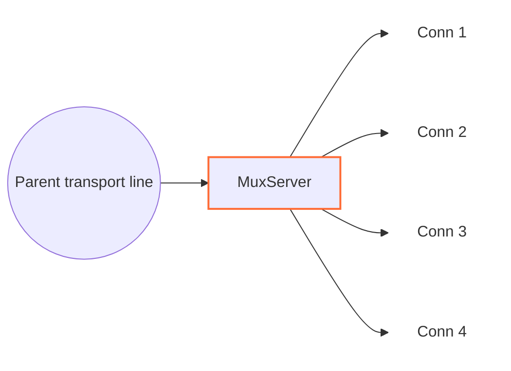

<!--
Documentation version: 157
-->

# MuxServer

`MuxServer` همتای سمت مقابل `MuxClient` است. ترافیک فریم‌شده MUX را روی یک parent transport line می‌گیرد، با رسیدن فریم `Open` یک child line می‌سازد و هر child را به‌عنوان line مستقلی در WaterWall به `next` می‌فرستد.



سمت قبلی باید transport line حامل فریم‌های `MuxClient` را فراهم کند و سمت بعدی child lineهای منطقی بازسازی‌شده را می‌گیرد.

## جایگاه رایج

TCP ساده:

```text
client side: TcpListener -> MuxClient -> TcpConnector
server side: TcpListener -> MuxServer -> TcpConnector
```

با protocol stack بیرونی:

```text
client side: TcpListener -> MuxClient -> HttpClient -> TlsClient -> TcpConnector
server side: TcpListener -> TlsServer -> HttpServer -> MuxServer -> TcpConnector
```

از دید نود بعدی، هر child ساخته‌شده توسط `MuxServer` مثل یک اتصال WaterWall جداگانه رفتار می‌کند.

## این نود چه می‌کند؟

- با رسیدن `Init` در upstream از transport، parent line را مقداردهی اولیه می‌کند.
- MUX frameها را از parent line می‌خواند.
- به‌ازای هر `Open` frame معتبر یک child line می‌سازد.
- هر child line را به سمت `next` مقداردهی اولیه می‌کند.
- `Data`، `Close`، `FlowPause` و `FlowResume` را بر اساس `cid` به مقصد مناسب می‌فرستد.
- payload childهای downstream را دوباره داخل MUX `Data` frame می‌پیچد.
- رویدادهای Finishِ child را به شکل فریم `Close` به `MuxClient` برمی‌گرداند.
- اگر سمت نوشتن child pause باشد، داده رسیده از parent را در صف نگه می‌دارد.
- هنگام finish شدن parent transport، صف‌های پذیرفته‌شده childها را detached می‌کند و با رعایت backpressure هر child تخلیه می‌کند.

`MuxServer` objectهای child از نوع `line_t` را پشت parent می‌سازد و مسئول آزاد کردن آن‌هاست. Parent transport line را خودش نمی‌سازد.

## نمونه تنظیم

```json
{
  "name": "mux-server",
  "type": "MuxServer",
  "settings": {
    "child-buffer-limit": 25165824,
    "child-buffer-pause-tolerance": 524288,
    "child-buffer-resume-threshold": 262144,
    "parent-buffer-limit": 33554432,
    "max-children": 10000,
    "max-live-children": 262144,
    "initial-child-idle-timeout-ms": 10000,
    "active-child-idle-timeout-ms": 300000,
    "memory-high-watermark-percent": 85,
    "memory-low-watermark-percent": 75,
    "memory-reserve": 268435456,
    "memory-fallback-max-live-children": 12000,
    "detached-buffer-limit": 268435456,
    "detached-child-limit": 12000,
    "log-main-line-stats": false
  },
  "next": "service-side-node"
}
```

## فیلدهای اجباری

فیلدهای سطح اصلی:

| فیلد | نوع | توضیح |
| --- | --- | --- |
| `name` | string | نام یکتای نود در پیکربندی. |
| `type` | string | باید دقیقاً `"MuxServer"` باشد. |
| `settings` | object | اختیاری. وقتی نوشته نشود پیش‌فرض‌ها استفاده می‌شوند. |
| `next` | string | اجباری. نود بعدی lineهای child بازسازی‌شده را دریافت می‌کند. |

`MuxServer` باید یک نود transport-facing قبل از خودش داشته باشد و از `MuxClient` متناظر برسد.

## تنظیمات اختیاری

| گزینه | نوع | پیش‌فرض | توضیح |
| --- | --- | --- | --- |
| `child-buffer-limit` | integer | `25165824` | سقف charge تخصیص `sbuf_t` نگه‌داشته‌شده برای یک child در حالت pause. ظرفیت واقعی شامل padding چپ، header بافر و overhead تخصیص aligned شمرده می‌شود، نه فقط طول payload. باید بزرگ‌تر از `0` باشد؛ رسیدن به سقف child را با فریم `Close` می‌بندد. |
| `child-buffer-pause-tolerance` | integer | `524288` | سقف پشتیبان برحسب بایت منطقی payload صف‌شده برای ارسال `FlowPause`، وقتی Callback معمول Pause هنوز آن را نفرستاده است. باید `0` یا بزرگ‌تر باشد و مقدار عددی آن به `child-buffer-limit` cap می‌شود. |
| `child-buffer-resume-threshold` | integer | `262144` | Low-water mark برحسب بایت منطقی payload صف‌شده برای ارسال `FlowResume` پس از writableشدن child محلی. باید بزرگ‌تر از `0` باشد و مقدار عددی آن به `child-buffer-limit` cap می‌شود. مقدار بزرگ‌تر peer را زودتر Resume می‌کند، اما Hysteresis را کاهش می‌دهد و ممکن است چرخه‌های Pause/Resume را بیشتر کند. |
| `parent-buffer-limit` | integer | `33554432` | سقف charge تخصیص‌های نگه‌داشته‌شده در صف childها به‌ازای هر parent. با رسیدن به سقف، child با بیشترین charge بسته می‌شود؛ در صورت مساوی بودن، اولویت با قدیمی‌ترین child متصل است. برای غیرفعال کردن سقف تجمیعی مقدار `0` را قرار دهید. |
| `max-children` | integer | `10000` | سقف سخت childهای live متصل به یک parent. باید مثبت و حداکثر برابر `max-live-children` باشد؛ CIDهای تاریخیِ ازبین‌رفته شمارش نمی‌شوند. |
| `max-live-children` | integer | `262144` | سقف سخت childهای رزروشده یا مقداردهی‌شده در کل این instance و همه parentها و workerها. childهای draining و detached تا نابودی واقعی state شمارش می‌شوند. |
| `initial-child-idle-timeout-ms` | integer | `10000` | مهلت idle پس از `Open` و پیش از نخستین payload غیرخالی. باید مثبت باشد. |
| `active-child-idle-timeout-ms` | integer | `300000` | مهلت idle قابل refresh پس از آغاز payload واقعی. باید مثبت و حداقل برابر مهلت اولیه باشد. |
| `memory-high-watermark-percent` | integer | `85` | در این درصد مصرف host یا cgroup محدود، admission بسته می‌شود. بازه مجاز `[1, 99]` است. |
| `memory-low-watermark-percent` | integer | `75` | gate فقط وقتی باز می‌شود که همه مصرف‌های قابل اعمال حداکثر این مقدار باشند. باید در `[1, 99]` و کمتر از high watermark باشد. |
| `memory-reserve` | integer | بر اساس `ram-profile` | با رسیدن available مؤثر به این reserve، Open جدید رد می‌شود. بازه `[0, INT_MAX]` است؛ صفر فقط reserve مطلق را غیرفعال می‌کند. |
| `memory-fallback-max-live-children` | integer | بر اساس `ram-profile` | سقف محافظه‌کارانه کل childها وقتی snapshot حافظه unavailable، unsupported یا قدیمی‌تر از یک ثانیه است. باید مثبت و حداکثر `max-live-children` باشد. |
| `detached-buffer-limit` | integer | بر اساس `ram-profile` | سقف charge تخصیص نگه‌داشته‌شده به‌ازای هر worker برای صف childهای مسدودشده پس از از دست رفتن parent. رسیدن به سقف فقط child تازه detachedشده را abort می‌کند. برای غیرفعال کردن این سقف مقدار `0` را قرار دهید. |
| `detached-child-limit` | integer | بر اساس `ram-profile` | سقف تعداد به‌ازای هر worker برای childهای مسدودشده‌ای که پس از از دست رفتن parent نگه داشته می‌شوند. رسیدن به سقف فقط child مسدودشده‌ای را که به‌تازگی detached شده است abort می‌کند. برای غیرفعال کردن این سقف مقدار `0` را قرار دهید. |
| `log-main-line-stats` | boolean | `false` | اگر فعال باشد، parent lineها هر `5000` ms آمار best-effort را در لاگ می‌نویسند. مرگ منطقی parent اجرای عادی را suppress می‌کند و هنگام رسیدن runner صف‌شده/زمان‌بندی‌شده، task با `LineDead` settle می‌شود. quiescence worker کار معلق را فعالانه لغو می‌کند و هیچ‌یک از این مسیرها آن را دوباره arm نمی‌کند. |

اگر این دو گزینه در تنظیمات نود نوشته نشوند، مقدار پیش‌فرض آن‌ها از `misc.ram-profile` سراسری انتخاب می‌شود:

| پروفایل RAM | سقف پیش‌فرض charge detached | سقف پیش‌فرض childهای detached |
| --- | ---: | ---: |
| S1 (`minimal` / `ultralow`) | `33554432` (`32 MiB`) | `4096` |
| S2 | `80740352` (`77 MiB`) | `5677` |
| M1 (`client`) | `127926272` (`122 MiB`) | `7258` |
| M2 (`client-larger`) | `174063616` (`166 MiB`) | `8838` |
| L1 | `221249536` (`211 MiB`) | `10419` |
| L2 (`server`، پیش‌فرض سراسری) | `268435456` (`256 MiB`) | `12000` |

مقادیر بین کمینه و بیشینه روی شش رده مرتب پروفایل RAM به‌صورت خطی درون‌یابی می‌شوند و سقف charge به نزدیک‌ترین MiB گرد می‌شود. نوشتن صریح هر گزینه در تنظیمات نود، فقط مقدار مشتق‌شده از پروفایل برای همان گزینه را جایگزین می‌کند.

reserve حافظه و fallback live-child نیز در ابتدا از همین شش مقدار بایت و child
استفاده می‌کنند، اما policy پیش‌فرض admission از detached drain مستقل است.

`child-buffer-pause-tolerance` و `child-buffer-resume-threshold` عمداً طول منطقی
payload را می‌شمارند. charge تخصیص فقط برای سه سقف سخت و حساس به حافظه استفاده
می‌شود؛ طول محتوای بافر همچنان معیار درست برای صف‌های معمولی و flow control است.

آمار شامل worker id، وضعیت write-pause والد، مجموع charge نگه‌داشته‌شده، تعداد child، تعداد childهای منتظر تکمیل ترتیبی `Close`، تعداد childهای read-pause و تعداد childهای write-pause است. فیلد قدیمی `parent-line-read-paused` برای سازگاری همچنان با مقدار `no` در لاگ باقی می‌ماند و `parent-queued-bytes` charge سقف سخت را گزارش می‌کند، نه طول منطقی payload.

حالت‌هایی مانند `timer`، `counter` و `fixed-connections-count` فقط در `MuxClient` تنظیم می‌شوند. `MuxServer` بر اساس فریم‌های دریافتی عمل می‌کند و به mode کلاینت وابسته نیست.

## مدل parent و child

`MuxServer` دو نقش line دارد:

| نقش | معنی |
| --- | --- |
| parent line | اتصال transport مشترک دریافت‌شده از نود قبلی. |
| child line | یک line معمولی که `MuxServer` برای یک `cid` از parent می‌سازد. |

با رسیدن فریم `Open`:

1. `MuxServer` بررسی می‌کند که آیا `cid` از قبل وجود دارد.
2. اگر `cid` جدید باشد، یک child line روی همان worker می‌سازد.
3. state مربوط به MUX را برای child مقداردهی اولیه می‌کند.
4. child را به parent link می‌کند.
5. upstream `Init` را به سمت `next` روی child line می‌فرستد.

lookup مربوط به `cid` با hash map و به‌طور متوسط O(1) انجام می‌شود. `Open`
تکراری برای هر child هنوز index‌شده یک protocol violation است و همان parent را
می‌بندد.

پیش از allocation، Open جدید باید سقف سخت parent، رزرو اتمیک instance و gate
حافظه cache‌شده را بگذراند. ردشدن منابع بدون ساخت child، فریم `Close(cid)`
می‌فرستد و parent و siblingها را زنده نگه می‌دارد. bucket هر parent burst برابر
`1024` رد و refill برابر `64` token در ثانیه دارد؛ abuse پایدار parent را می‌بندد.

sampler سراسری هر `500` ms snapshot می‌سازد و freshness آن یک ثانیه است. در
Linux، فشار cgroup برابر بیشترین درصد مصرف و کمترین فضای باقی‌مانده در همهٔ
سطح‌های finite و قابل‌مشاهدهٔ cgroup v2/v1 است؛ `MemAvailable` نیز فضای مؤثر را
محدود می‌کند. محدودیت مبهم یا پنهان از fallback محافظه‌کارانه استفاده می‌کند.
در Windows از available physical memory استفاده می‌شود و workerها فقط tuple
اتمی cache‌شده را می‌خوانند. snapshot قدیمی یا unsupported سقف fallback را به
کار می‌گیرد و gate بسته‌شده با pressure تازه را باز نمی‌کند.

## فرمت frame

`MuxServer` همان header packed هشت‌بایتی که `MuxClient` استفاده می‌کند را می‌پذیرد:

| فیلد | اندازه | توضیح |
| --- | ---: | --- |
| `length` | `uint16` | طول payload بعد از header، big-endian. |
| `flags` | `uint8` | نوع frame. |
| `_pad1` | `uint8` | بایت padding داخلی. |
| `cid` | `uint32` | شناسه child stream، big-endian. |

flagهای frame:

| flag | معنی |
| ---: | --- |
| `0` | `Open` |
| `1` | `Close` |
| `2` | `FlowPause` |
| `3` | `FlowResume` |
| `4` | `Data` |

پیاده‌سازی payloadهای بزرگ‌تر از `0xFFFF - 8` را رد می‌کند؛ بنابراین هر فریم داده MUX حداکثر `65527` بایت payload حمل می‌کند. `MuxServer` یک payload بزرگ downstream را میان چند فریم تقسیم نمی‌کند و داده ورودی باید از ابتدا در این سقف جا شود.

## جهت و رفتار Callback

| callback ورودی | رفتار |
| --- | --- |
| upstream `Init` والد | state parent را مقداردهی اولیه می‌کند، در صورت نیاز ثبت آمار را زمان‌بندی می‌کند و `Est` را در downstream به نود قبلی گزارش می‌دهد. |
| upstream `Payload` والد | فریم‌های MUX از `MuxClient` را تجزیه می‌کند، برای `Open` child می‌سازد و `Data`، `Close`، `FlowPause` و `FlowResume` را بر اساس `cid` می‌فرستد. |
| upstream `Pause` / `Resume` والد | write pressure والد را به child نویسنده اخیر یا همه childها (اگر نویسنده اخیر نامشخص باشد) بازتاب می‌دهد. |
| upstream `Finish` والد | state والد را بی‌درنگ از بین می‌برد، صف‌های پذیرفته‌شده childها را به drainهای مستقل از parent منتقل می‌کند و هر child را پس از خالی و قابل‌نوشتن شدن صف آن finish می‌کند. |
| downstream `Payload` child | یک MUX `Data` header prepend می‌کند و frame را روی parent به سمت نود قبلی می‌فرستد. |
| downstream `Pause` / `Resume` child | `FlowPause` می‌فرستد / داده queue شده را flush می‌کند و در صورت نیاز `FlowResume` می‌فرستد. |
| downstream `Finish` child | یک فریم MUX از نوع `Close` می‌فرستد و state و line مربوط به child تحت مالکیت خود را از بین می‌برد. |
| upstream `Est` | غیرفعال؛ رسیدن به این callback fatal است. |
| downstream `Init` | غیرفعال؛ رسیدن به این callback fatal است. |

فریم‌های مربوط به cid ناشناخته و typeهای ناشناخته دور ریخته می‌شوند.

## بازیابی childهای idle

هر child پذیرفته‌شده با `initial-child-idle-timeout-ms` آغاز می‌شود. نخستین Data
غیرخالی ورودی یا payload غیرخالی تولیدشده از سمت `next` آن را به
`active-child-idle-timeout-ms` می‌برد و هر payload غیرخالی بعدی deadline فعال را
refresh می‌کند. Open، Close، flow control، Init/Est و Data با طول صفر activity
محسوب نمی‌شوند. بااین‌حال Data با طول صفر، اگر برای child در حالت pause نگه داشته
شود، charge تخصیص مثبت دارد و سقف‌های سخت صف را جلو می‌برد.

expiry فقط همان child را می‌بندد، در صورت وجود parent فریم `Close(cid)` می‌فرستد
و parent و siblingها را حفظ می‌کند. child detached از مسیر detached-abort استفاده
می‌کند. close صریح timer item را بی‌درنگ حذف می‌کند. این تغییر wire format را
عوض نمی‌کند؛ parent در تمام عمر transport قابل استفاده مجدد است و نابودی child
ظرفیت شمارش آن را آزاد می‌کند.

## Backpressure و صف‌ها

MUX backpressure را per-child نگه می‌دارد:

- اگر child سمت سرویس pause شود، `MuxServer` برای همان `cid` یک `FlowPause` می‌فرستد.
- اگر `FlowPause` از peer و از طریق parent transport برسد، خواندن از child سمت سرویس pause می‌شود.
- اگر برای childی که pause است داده‌ای از parent برسد، داده روی همان child در صف می‌ماند.
- `FlowPause` معمولاً همان لحظه‌ای ارسال می‌شود که Callback محلی child را Pause می‌کند؛ `child-buffer-pause-tolerance` فقط برای حالت ترتیبی‌ای است که این فریم هنوز ارسال نشده باشد.
- وقتی بایت منطقی payload صف‌شده پایین‌تر از `child-buffer-resume-threshold` برسد، `FlowResume` می‌تواند ارسال شود. مقدار تنظیم‌شده به `child-buffer-limit` cap می‌شود.
- اگر charge صف یک child به `child-buffer-limit` برسد، آن child بسته می‌شود.
- اگر مجموع charge نگه‌داشته‌شده به `parent-buffer-limit` برسد، child با بیشترین charge بسته می‌شود. در صورت مساوی بودن، اولویت با قدیمی‌ترین child متصل است.
- قرار دادن `parent-buffer-limit` روی `0` تنها بودجه تجمیعی را غیرفعال می‌کند و سقف per-child همچنان اعمال می‌شود.

این charge تقریب حافظه صف‌های live در Mux است؛ cacheهای allocator، حافظه حلقه
اشاره‌گرها و baseline ثابت pool در charge یک صف مشخص نیستند. به این ترتیب یک child
کُند می‌تواند stream خود را متوقف کند، بی‌آنکه همه childهای دیگر روی همان parent
فوراً متوقف شوند.

## Finish و Close

اگر `MuxServer` برای یک child فریم `Close` بگیرد، این Close پس از همه بایت‌های `Data` قبلیِ صف‌شده اعمال می‌شود. child در حالت pause همچنان با `cid` قابل‌شناسایی می‌ماند؛ فریم‌های بعدی برای آن `cid` بسته‌شده دور ریخته می‌شوند، Resume تخلیه FIFO را ادامه می‌دهد و `Finish` به‌همراه آزاد کردن line تحت مالکیت فقط در مرز خالی و قابل‌نوشتن شدن صف انجام می‌شود.

اگر سمت service-facing یک child را ببندد، `MuxServer` یک فریم `Close` به `MuxClient` می‌فرستد و سپس state محلی و child line تحت مالکیت خود را از بین می‌برد.

اگر parent transport بسته شود، `MuxServer` state مربوط به MUX در parent قرض‌گرفته‌شده را بی‌درنگ از بین می‌برد و صف هر child پذیرفته‌شده را به registry تحت مالکیت و worker-local منتقل می‌کند. صف‌های قابل‌نوشتن فوراً finish می‌شوند؛ صف‌های pauseشده پس از Resume و بدون نگه‌داشتن یا دسترسی به parent مرده تخلیه می‌شوند. داده خروجی تازه از child رد می‌شود. `detached-buffer-limit` مجموع charge تخصیص نگه‌داشته‌شده و `detached-child-limit` تعداد child باقی‌مانده را به‌ازای هر worker محدود می‌کند.

## Buffer و Padding

`MuxServer` MUX headerها را به payload downstream child prepend می‌کند. متادیتای نود:

```text
required_padding_left = 8
layer_group = kNodeLayer4
layer_group_next_node = kNodeLayer4
layer_group_prev_node = kNodeLayer4
```

بایت‌های ورودی parent در یک stream خواندن جمع می‌شوند تا فریم کامل MUX آماده باشد. اگر این stream از `1 MiB` بزرگ‌تر شود، `MuxServer` باقی‌مانده ناقص را دور می‌ریزد، parent را به سمت نود قبلی finish می‌کند و برای صف childهایی که پیش‌تر parse شده‌اند همان detached drain را به کار می‌گیرد.

## نکته‌های عملی

- این نود را با `MuxClient` جفت کنید؛ بدون آن کاربردی ندارد.
- `MuxServer` تنظیمات حالت concurrency سمت کلاینت را ندارد.
- یک `TcpConnector` بعد از `MuxServer` برای هر child یک اتصال سرویس جداگانه می‌سازد.
- `MuxServer` یک تونل میانی است، نه endpoint عمومی.
- `Finish` سمت سرویس یا shutdown منظم worker ممکن است داده detached باقی‌مانده را دور بریزد. هنگام shutdown، پیش از بستن همه childهای تحت مالکیت، هیچ `Payload` صف‌شده‌ای حتی برای child قابل‌نوشتن forward نمی‌شود.
- هیچ تغییری در بایت‌های پروتکل MUX یا قابلیت موردنیاز peer ایجاد نشده است.

## خاموش‌سازی worker

هنگام quiescence، `MuxServer` تایمر idle را جدا می‌کند و صف‌های باقی‌مانده را بدون ارسال Payload،
فریم Close یا پیام‌های کنترل جریان آزاد می‌کند. جدول idle محلی هر worker فهرست کامل childهای متعلق به
آن، چه متصل و چه جداشده، است. worker stop کل جدول را تخلیه می‌کند، حساب حافظهٔ صف و سهم اتصال زندهٔ هر
child را دقیقاً یک بار آزاد می‌کند، Finish را به سمت مقصد می‌فرستد و child را نابود می‌کند. parent
قرض‌گرفته‌شده می‌تواند با وضعیت خالی و معتبر MUX تا Finish مالک واقعی خود زنده بماند. جدول idle پس از
تخلیه روی همان worker نابود می‌شود؛ بررسی مجموع childهای زنده پس از توقف همهٔ workerها انجام می‌شود.
رفتار عادی قطع اتصال، انقضای idle و Close ترتیبی تغییر نمی‌کند.

## متادیتای نود

متادیتای برگرفته از کد منبع:

| ویژگی | مقدار |
| --- | --- |
| node flags | `kNodeFlagNone` |
| `can_have_prev` | `true` |
| `can_have_next` | `true` |
| `layer_group` | `kNodeLayer4` |
| `layer_group_prev_node` | `kNodeLayer4` |
| `layer_group_next_node` | `kNodeLayer4` |
| `required_padding_left` | `8` bytes |
