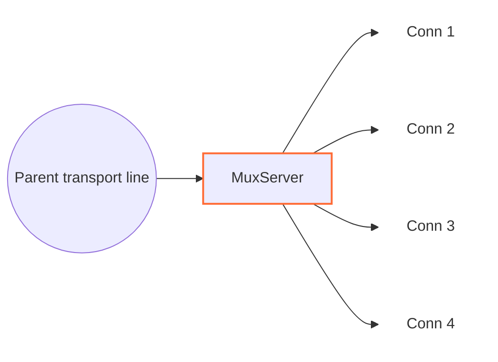

<!-- Written from version 106 of the English doc. -->

# MuxServer

`MuxServer` همتای سمت مقابل `MuxClient` است. ترافیک فریم‌شده MUX را روی یک parent transport line می‌گیرد، با رسیدن فریم `Open` یک child line می‌سازد و هر child را به‌عنوان line مستقلی در WaterWall به `next` می‌فرستد.



سمت قبلی باید transport line حامل فریم‌های `MuxClient` را فراهم کند و سمت بعدی child lineهای منطقی بازسازی‌شده را می‌گیرد.

## جایگاه رایج

TCP ساده:

```text
client side: TcpListener -> MuxClient -> TcpConnector
server side: TcpListener -> MuxServer -> TcpConnector
```

با protocol stack بیرونی:

```text
client side: TcpListener -> MuxClient -> HttpClient -> TlsClient -> TcpConnector
server side: TcpListener -> TlsServer -> HttpServer -> MuxServer -> TcpConnector
```

از دید نود بعدی، هر child ساخته‌شده توسط `MuxServer` مثل یک اتصال WaterWall جداگانه رفتار می‌کند.

## این نود چه می‌کند؟

- با رسیدن `Init` در upstream از transport، parent line را مقداردهی اولیه می‌کند.
- MUX frameها را از parent line می‌خواند.
- به‌ازای هر `Open` frame معتبر یک child line می‌سازد.
- هر child line را به سمت `next` مقداردهی اولیه می‌کند.
- `Data`، `Close`، `FlowPause` و `FlowResume` را بر اساس `cid` به مقصد مناسب می‌فرستد.
- payload childهای downstream را دوباره داخل MUX `Data` frame می‌پیچد.
- رویدادهای Finishِ child را به شکل فریم `Close` به `MuxClient` برمی‌گرداند.
- اگر سمت نوشتن child pause باشد، داده رسیده از parent را در صف نگه می‌دارد.
- همه child lineها را هنگام finish شدن parent transport می‌بندد.

`MuxServer` objectهای child از نوع `line_t` را پشت parent می‌سازد و مسئول آزاد کردن آن‌هاست. Parent transport line را خودش نمی‌سازد.

## نمونه تنظیم

```json
{
  "name": "mux-server",
  "type": "MuxServer",
  "settings": {
    "child-buffer-limit": 25165824,
    "child-buffer-pause-tolerance": 524288,
    "parent-buffer-limit": 33554432,
    "log-main-line-stats": false
  },
  "next": "service-side-node"
}
```

## فیلدهای اجباری

فیلدهای سطح اصلی:

| فیلد | نوع | توضیح |
| --- | --- | --- |
| `name` | string | نام یکتای نود در پیکربندی. |
| `type` | string | باید دقیقاً `"MuxServer"` باشد. |
| `settings` | object | اختیاری. وقتی نوشته نشود پیش‌فرض‌ها استفاده می‌شوند. |
| `next` | string | اجباری. نود بعدی lineهای child بازسازی‌شده را دریافت می‌کند. |

`MuxServer` باید یک نود transport-facing قبل از خودش داشته باشد و از `MuxClient` متناظر برسد.

## تنظیمات اختیاری

| گزینه | نوع | پیش‌فرض | توضیح |
| --- | --- | --- | --- |
| `child-buffer-limit` | integer | `25165824` | بیشترین تعداد بایت صف‌شده برای یک child در حالت pause. باید بزرگ‌تر از `0` باشد. با رسیدن به سقف، child با فریم `Close` بسته می‌شود. |
| `child-buffer-pause-tolerance` | integer | `524288` | حدی که child یک `FlowPause` می‌فرستد و parent reads ممکن است pause شوند. باید `0` یا بزرگ‌تر باشد. مقادیر بالاتر از `child-buffer-limit` به همان حد cap می‌شوند. |
| `parent-buffer-limit` | integer | `33554432` | سقف بودجه داده‌های صف‌شده برای childها به‌ازای هر parent. با رسیدن به سقف، child با بیشترین صف بسته می‌شود؛ در صورت مساوی بودن، اولویت با child کم‌فعالیت‌تر است. برای غیرفعال کردن سقف تجمیعی مقدار `0` را قرار دهید. |
| `log-main-line-stats` | boolean | `false` | اگر فعال باشد، parent lineها هر `5000` ms آمار را در لاگ می‌نویسند. |

آمار شامل worker id، وضعیت pause read/write والد، تعداد child، تعداد read-pause child و تعداد write-pause child است.

حالت‌هایی مانند `timer`، `counter` و `fixed-connections-count` فقط در `MuxClient` تنظیم می‌شوند. `MuxServer` بر اساس فریم‌های دریافتی عمل می‌کند و به mode کلاینت وابسته نیست.

## مدل parent و child

`MuxServer` دو نقش line دارد:

| نقش | معنی |
| --- | --- |
| parent line | اتصال transport مشترک دریافت‌شده از نود قبلی. |
| child line | یک line معمولی که `MuxServer` برای یک `cid` از parent می‌سازد. |

با رسیدن فریم `Open`:

1. `MuxServer` بررسی می‌کند که آیا `cid` از قبل وجود دارد.
2. اگر `cid` جدید باشد، یک child line روی همان worker می‌سازد.
3. state مربوط به MUX را برای child مقداردهی اولیه می‌کند.
4. child را به parent link می‌کند.
5. upstream `Init` را به سمت `next` روی child line می‌فرستد.

فریم‌های تکراری `Open` برای `cid` موجود نادیده گرفته می‌شوند.

## فرمت frame

`MuxServer` همان header packed هشت‌بایتی که `MuxClient` استفاده می‌کند را می‌پذیرد:

| فیلد | اندازه | توضیح |
| --- | ---: | --- |
| `length` | `uint16` | طول payload بعد از header، big-endian. |
| `flags` | `uint8` | نوع frame. |
| `_pad1` | `uint8` | بایت padding داخلی. |
| `cid` | `uint32` | شناسه child stream، big-endian. |

flagهای frame:

| flag | معنی |
| ---: | --- |
| `0` | `Open` |
| `1` | `Close` |
| `2` | `FlowPause` |
| `3` | `FlowResume` |
| `4` | `Data` |

پیاده‌سازی payloadهای بزرگ‌تر از `0xFFFF - 8` را رد می‌کند؛ بنابراین هر فریم داده MUX حداکثر `65527` بایت payload حمل می‌کند. `MuxServer` یک payload بزرگ downstream را میان چند فریم تقسیم نمی‌کند و داده ورودی باید از ابتدا در این سقف جا شود.

## جهت و رفتار Callback

| callback ورودی | رفتار |
| --- | --- |
| upstream `Init` والد | state parent را مقداردهی اولیه می‌کند، در صورت نیاز ثبت آمار را زمان‌بندی می‌کند و `Est` را در downstream به نود قبلی گزارش می‌دهد. |
| upstream `Payload` والد | فریم‌های MUX از `MuxClient` را تجزیه می‌کند، برای `Open` child می‌سازد و `Data`، `Close`، `FlowPause` و `FlowResume` را بر اساس `cid` می‌فرستد. |
| upstream `Pause` / `Resume` والد | write pressure والد را به child نویسنده اخیر یا همه childها (اگر نویسنده اخیر نامشخص باشد) بازتاب می‌دهد. |
| upstream `Finish` والد | parent را finishing علامت می‌زند، همه childها را به سمت `next` flush/finish می‌کند و state parent را از بین می‌برد. |
| downstream `Payload` child | یک MUX `Data` header prepend می‌کند و frame را روی parent به سمت نود قبلی می‌فرستد. |
| downstream `Pause` / `Resume` child | `FlowPause` می‌فرستد / داده queue شده را flush می‌کند و در صورت نیاز `FlowResume` می‌فرستد. |
| downstream `Finish` child | یک فریم MUX از نوع `Close` می‌فرستد و state و line مربوط به child تحت مالکیت خود را از بین می‌برد. |
| upstream `Est` | غیرفعال؛ رسیدن به این callback fatal است. |
| downstream `Init` | غیرفعال؛ رسیدن به این callback fatal است. |

فریم‌های مربوط به cid ناشناخته و typeهای ناشناخته دور ریخته می‌شوند.

## Backpressure و صف‌ها

MUX backpressure را per-child نگه می‌دارد:

- اگر child سمت سرویس pause شود، `MuxServer` برای همان `cid` یک `FlowPause` می‌فرستد.
- اگر `FlowPause` از peer و از طریق parent transport برسد، خواندن از child سمت سرویس pause می‌شود.
- اگر برای childی که pause است داده‌ای از parent برسد، داده روی همان child در صف می‌ماند.
- وقتی صف یک child به `child-buffer-pause-tolerance` برسد، child یک `FlowPause` می‌فرستد و parent input ممکن است pause شود.
- همین tolerance روی aggregate داده queue شده child روی parent line هم اعمال می‌شود.
- وقتی داده queue شده پایین‌تر از `min(256 KiB, child-buffer-limit)` برسد، `FlowResume` و resume خواندن parent می‌توانند ارسال شوند.
- اگر صف یک child به `child-buffer-limit` برسد، آن child بسته می‌شود.
- اگر مجموع داده‌های صف‌شده child به `parent-buffer-limit` برسد، child با بیشترین صف بسته می‌شود. در صورت مساوی بودن، اولویت با child کم‌فعالیت‌تر است.
- قرار دادن `parent-buffer-limit` روی `0` تنها بودجه تجمیعی را غیرفعال می‌کند و سقف per-child همچنان اعمال می‌شود.

به این ترتیب یک child کُند می‌تواند stream خود را متوقف کند، بی‌آنکه همه childهای دیگر روی همان parent فوراً متوقف شوند.

## Finish و Close

اگر `MuxServer` برای یک child فریم `Close` بگیرد، child را از parent جدا می‌کند، هر pause مربوط به خواندن parent را که آن child نگه داشته آزاد می‌کند، state مربوط به MUX را از بین می‌برد، `Finish` را در upstream به `next` می‌فرستد و، اگر child line هنوز زنده باشد، آن را آزاد می‌کند.

اگر سمت service-facing یک child را ببندد، `MuxServer` یک فریم `Close` به `MuxClient` می‌فرستد و سپس state محلی و child line تحت مالکیت خود را از بین می‌برد.

اگر parent transport بسته شود، `MuxServer` همه childهای متصل را finish می‌کند و سپس state مربوط به MUX در parent را از بین می‌برد.

## Buffer و Padding

`MuxServer` MUX headerها را به payload downstream child prepend می‌کند. متادیتای نود:

```text
required_padding_left = 8
layer_group = kNodeLayer4
layer_group_next_node = kNodeLayer4
layer_group_prev_node = kNodeLayer4
```

بایت‌های ورودی parent در یک stream خواندن جمع می‌شوند تا فریم کامل MUX آماده باشد. اگر این stream از `1 MiB` بزرگ‌تر شود، `MuxServer` همه childهای متصل را می‌بندد و parent را به سمت نود قبلی finish می‌کند.

## نکته‌های عملی

- این نود را با `MuxClient` جفت کنید؛ بدون آن کاربردی ندارد.
- `MuxServer` تنظیمات حالت concurrency سمت کلاینت را ندارد.
- یک `TcpConnector` بعد از `MuxServer` برای هر child یک اتصال سرویس جداگانه می‌سازد.
- `MuxServer` یک تونل میانی است، نه endpoint عمومی.
