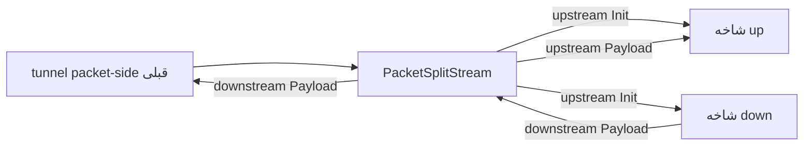

<!-- Written from version 106 of the English doc. -->

# PacketSplitStream

`PacketSplitStream` یک split bridge است که state آن به packet-line متصل می‌شود. زمانی به کار می‌رود که یک line در سمت packet به دو ورودی شاخه با نام مشخص نیاز داشته باشد:

- `up`: شاخه‌ای که payloadهای packet را در جهت upstream دریافت می‌کند
- `down`: شاخه‌ای که به‌عنوان مسیر برگشت یا download مقداردهی اولیه می‌شود

این نود router عمومی نیست و به‌تنهایی packetها را روی stream frame نمی‌کند؛ بلکه ابزاری برای کنار هم قرار دادن branchها در چیدمان‌های خاص packet/stream است.

:::info
`PacketSplitStream` با `HalfDuplexClient` تفاوت دارد: handshake مربوط به pairing را انجام نمی‌دهد، connection جفت‌شده را بازیابی نمی‌کند و برای packet-line یک lifecycle معمول per-connection نمی‌سازد.
:::

## جایگاه رایج

chain اصلی به `PacketSplitStream` می‌رسد و نام دو شاخه split در `settings` مشخص می‌شود:

```text
packet-side-node -> PacketSplitStream
                    settings.up   -> upload-branch-head
                    settings.down -> download-branch-head
```

`PacketSplitStream` عمداً از فیلد `next` سطح بالا استفاده نمی‌کند.

## نمونه تنظیم

```json
{
  "name": "packet-split",
  "type": "PacketSplitStream",
  "settings": {
    "up": "upload-branch-head",
    "down": "download-branch-head"
  }
}
```

نودهای ارجاع‌داده‌شده برای شاخه‌ها باید در جای دیگری از همان config واتروال تعریف شده باشند.

## مدل جریان



رفتار پیاده‌سازی فعلی:

| callback دریافت‌شده توسط `PacketSplitStream` | رفتار |
| --- | --- |
| upstream `Init` | upstream `Init` را روی هر دو ورودی شاخه `up` و `down` صدا می‌زند. |
| upstream `Payload` | payload را به شاخه `up` می‌فرستد. |
| downstream `Payload` | payload را به tunnel قبلی برمی‌گرداند. |
| upstream `Est`، `Pause`، `Resume` | No-op. |
| downstream `Init`، `Est`، `Pause`، `Resume` | No-op. |
| upstream یا downstream `Finish` | غیرمنتظره تلقی می‌شود و برنامه را خاتمه می‌دهد. |

از آن‌جا که `Finish` در runtime پشتیبانی نمی‌شود، این نود را فقط در جریان‌های packet-line به کار ببرید؛ جایی که worker packet line تا پایان عمر chain زنده می‌ماند.

## فیلدهای ضروری

فیلدهای سطح بالا:

| فیلد | نوع | توضیح |
| --- | --- | --- |
| `name` | string | نام دلخواه نود. باید داخل فایل config یکتا باشد. |
| `type` | string | باید دقیقاً `"PacketSplitStream"` باشد. |
| `settings` | object | اجباری. شامل ورودی‌های شاخه split نام‌دار است. |

فیلدهای اجباری `settings`:

| گزینه | نوع | توضیح |
| --- | --- | --- |
| `up` | string | نام نودی که به‌عنوان tunnel ورودی upstream برای packetهای ارسالی استفاده می‌شود. |
| `down` | string | نام نودی که به‌عنوان شاخه downstream/return عادی chain می‌شود. |

## قوانین اعتبارسنجی

سورس فعلی این قوانین را اعمال می‌کند:

- `next` سطح بالا نباید تنظیم شود
- `settings.up` لازم است
- `settings.down` لازم است
- هر دو نود ارجاع‌داده‌شده باید وجود داشته باشند
- `up` و `down` باید به نودهای متفاوت اشاره کنند
- هیچ‌کدام از شاخه‌ها نباید به نود `PacketSplitStream` خودش اشاره کنند
- ورودی شاخه‌ها نباید از قبل به tunnel قبلی دیگری متصل شده باشند

هنگام ساخت chain، واتروال پس از chain شدن هر نود ارجاع‌داده‌شده، ورودی واقعی شاخه را پیدا می‌کند. این موضوع برای نودهایی مهم است که tunnelهای داخلی را پیش از خودشان قرار می‌دهند.

## متادیتای نود

| ویژگی | مقدار |
| --- | --- |
| node flag | `kNodeFlagChainEnd` |
| `can_have_prev` | `true` |
| `can_have_next` | `false` |
| `layer_group` | `kNodeLayerAnything` |
| `layer_group_prev_node` | `kNodeLayerAnything` |
| `layer_group_next_node` | `kNodeLayerAnything` |
| `required_padding_left` | `0` |

`PacketSplitStream` چیزی به ابتدای payload اضافه نمی‌کند و buffer را بازنویسی یا مصرف نمی‌کند. در callbackهای payload، مالکیت buffer موجود را به مسیر callback انتخاب‌شده منتقل می‌کند.

## نکات packet-line

این نود بر اساس رفتار packet-line در واتروال طراحی شده است. worker packet line میان همه packetهای همان worker مشترک است و با یک connection line معمولی از نوع TCP تفاوت دارد.

نتایج عملی:

- آن را مانند نودی که مالک lineهای معمول per-connection است به کار نبرید.
- از آن انتظار close یا reconnect جداگانه برای هر flow نداشته باشید.
- آن را در مسیری قرار ندهید که propagation عادی `Finish` در آن لازم است.
- اگر فقط می‌خواهید مرز packetها را با length framing روی stream حفظ کنید، از `PacketsToStream` و `StreamToPackets` استفاده کنید.

## چه وقت از آن استفاده کنید

از `PacketSplitStream` زمانی استفاده کنید که pipeline سمت packet باید داده را به شاخه upload بفرستد و هم‌زمان شاخه جداگانه‌ای آماده باشد تا payloadهای downstream آن به سمت packet برگردند.

اگر به policy routing، انتخاب چندشاخه بر اساس rule یا مدیریت lifecycle معمول connection نیاز دارید، این نود مناسب نیست. در این موارد از یک نود router یا tunnel مرزی packet/stream متناسب با جریان مورد نظر استفاده کنید.
