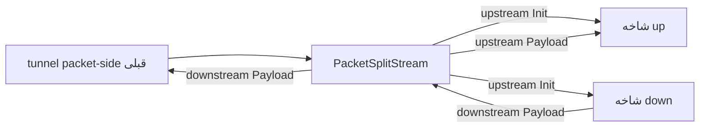

# PacketSplitStream

`PacketSplitStream` یک split bridge متکی به packet-line است. وقتی یک packet-side line نیاز دارد به دو ورودی شاخه نام‌دار داشته باشد استفاده می‌شود:

- `up`: شاخه‌ای که upstream payload packetها را دریافت می‌کند
- `down`: شاخه‌ای که به عنوان سمت برگشت/download initialize می‌شود

این نود یک router عمومی نیست و خودش packetها را به stream frame نمی‌کند. یک branch-composition helper برای layoutهای خاص packet/stream است.

:::info
`PacketSplitStream` با `HalfDuplexClient` فرق دارد. این نود pairing handshake انجام نمی‌دهد، connection paired را بازسازی نمی‌کند، و یک lifecycle عادی per-connection پیرامون packet line نمی‌سازد.
:::

## جایگاه رایج

chain قابل مشاهده به `PacketSplitStream` اشاره می‌کند، در حالی که شاخه‌های split در `settings` نام برده می‌شوند:

```text
packet-side-node -> PacketSplitStream
                    settings.up   -> upload-branch-head
                    settings.down -> download-branch-head
```

`PacketSplitStream` عمداً از فیلد `next` سطح بالا استفاده نمی‌کند.

## نمونه تنظیم

```json
{
  "name": "packet-split",
  "type": "PacketSplitStream",
  "settings": {
    "up": "upload-branch-head",
    "down": "download-branch-head"
  }
}
```

نودهای شاخه referenced باید در جای دیگری در همان تنظیمات WaterWall تعریف شده باشند.

## مدل جریان



رفتار پیاده‌سازی فعلی:

| callback دریافت‌شده توسط `PacketSplitStream` | رفتار |
| --- | --- |
| upstream `Init` | upstream `Init` را روی هر دو ورودی شاخه `up` و `down` صدا می‌زند. |
| upstream `Payload` | payload را به شاخه `up` می‌فرستد. |
| downstream `Payload` | payload را به tunnel قبلی برمی‌گرداند. |
| upstream `Est`، `Pause`، `Resume` | No-op. |
| downstream `Init`، `Est`، `Pause`، `Resume` | No-op. |
| upstream یا downstream `Finish` | به عنوان غیرمنتظره در نظر گرفته می‌شود و برنامه را terminate می‌کند. |

چون `Finish` یک مسیر runtime پشتیبانی‌شده نیست، از این نود با flowهای سبک packet-line استفاده کنید که worker packet line در طول عمر chain زنده می‌ماند.

## فیلدهای ضروری

فیلدهای سطح بالا:

| فیلد | نوع | توضیح |
| --- | --- | --- |
| `name` | string | نام دلخواه نود. باید داخل فایل config یکتا باشد. |
| `type` | string | باید دقیقاً `"PacketSplitStream"` باشد. |
| `settings` | object | اجباری. شامل ورودی‌های شاخه split نام‌دار است. |

فیلدهای اجباری `settings`:

| گزینه | نوع | توضیح |
| --- | --- | --- |
| `up` | string | نام نودی که به عنوان tunnel ورودی upstream برای packetهای ارسالی استفاده می‌شود. |
| `down` | string | نام نودی که به عنوان شاخه downstream/return عادی chain می‌شود. |

## قوانین اعتبارسنجی

سورس فعلی این قوانین را اعمال می‌کند:

- `next` سطح بالا نباید تنظیم شود
- `settings.up` لازم است
- `settings.down` لازم است
- هر دو نود referenced باید وجود داشته باشند
- `up` و `down` باید به نودهای متفاوت اشاره کنند
- هیچ‌کدام از شاخه‌ها نباید به نود `PacketSplitStream` خودش اشاره کنند
- ورودی‌های شاخه referenced نباید از قبل به tunnel قبلی دیگری bound باشند

در طول ساخت chain، WaterWall ورودی شاخه واقعی را بعد از اینکه هر نود referenced خودش را chain کرد resolve می‌کند. این برای نودهایی که tunnel داخلی در جلوی خودشان insert می‌کنند اهمیت دارد.

## متادیتای نود

| ویژگی | مقدار |
| --- | --- |
| node flag | `kNodeFlagChainEnd` |
| `can_have_prev` | `true` |
| `can_have_next` | `false` |
| `layer_group` | `kNodeLayerAnything` |
| `layer_group_prev_node` | `kNodeLayerAnything` |
| `layer_group_next_node` | `kNodeLayerAnything` |
| `required_padding_left` | `0` |

`PacketSplitStream` payload bufferها را prepend، rewrite یا مصرف نمی‌کند. روی payload callbackها، buffer موجود را به مسیر callback بعدی انتخاب‌شده منتقل می‌کند.

## نکات packet-line

این نود حول رفتار packet-line WaterWall طراحی شده است. یک worker packet line بین packetها روی آن worker مشترک است و همان چیزی که یک TCP-style connection line عادی است نیست.

نتایج عملی:

- از این نود به گونه‌ای استفاده نکنید که گویا مالک lineهای per-connection عادی است.
- از آن رفتار close یا reconnect per-flow انتظار نداشته باشید.
- آن را در مسیری که propagation `Finish` عادی انتظار می‌رود قرار ندهید.
- وقتی هدف simple packet-to-stream length framing است از `PacketsToStream` / `StreamToPackets` استفاده کنید.

## چه وقت از آن استفاده کنید

وقتی یک pipeline packet-side باید یک شاخه upload تغذیه کند در حالی که همزمان یک شاخه جداگانه آماده می‌کند که payload downstream آن به packet side برمی‌گردد از `PacketSplitStream` استفاده کنید.

وقتی نیاز دارید policy routing، multi-branch selection بر اساس قانون، یا مدیریت connection lifecycle عادی داشته باشید از آن دوری کنید. برای آن موارد، از یک نود router-style یا یکی از tunnelهای packet/stream boundary که مستقیماً با flow مورد نظر match می‌کند استفاده کنید.
