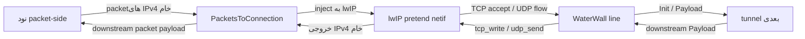

<!-- Written from version 106 of the English doc. -->

# PacketsToConnection

`PacketsToConnection` یک packet-to-transport bridge مبتنی بر lwIP است. این نود packetهای IPv4 خام را از packet side می‌گیرد، آن‌ها را به یک lwIP stack در-process تزریق می‌کند، و flowهای TCP/UDP حاصل را به عنوان connectionهای عادی WaterWall `line_t` به سمت tunnel بعدی expose می‌کند.

وقتی یک chain packet-oriented نیاز دارد وارد دنیای connection-oriented عادی WaterWall شود از آن استفاده کنید.

```text
packet side -> PacketsToConnection -> normal WaterWall service chain
normal service response -> PacketsToConnection -> raw IPv4 packet side
```

## چیستی این نود

`PacketsToConnection` بیشتر به یک packet transport-stack bridge شبیه است تا یک tunnel packet framing.

مسئولیت‌های این نود:

- پذیرفتن packetهای IPv4 کامل از نود packet-side قبلی
- تغذیه packetهای پشتیبانی‌شده به lwIP
- تبدیل TCP connectionهای پذیرفته‌شده به lineهای عادی WaterWall
- تبدیل UDP 4-tupleها به lineهای عادی WaterWall
- نوشتن پاسخ‌های service chain downstream از طریق lwIP
- emit کردن packetهای IPv4 خام به packet side

چیزهایی که این نود مسئول نیست:

- ساخت TUN device
- تنظیم routeهای OS، firewall mark یا policy routing
- serialize کردن packetها روی byte stream
- جایگزینی `TunDevice`
- مدیریت IPv6 یا ICMP

`TunDevice` مالک سمت واقعی packet adapter است. `PacketsToConnection` مالک سمت lwIP transport bridge است.

## جایگاه رایج

جریان مستقیم packet-to-service:

```text
TunDevice -> PacketsToConnection -> TcpConnector
```

packet input با policy یا proxy chain بعد از بازسازی flow:

```text
TunDevice -> PacketsToConnection -> Router -> TcpConnector
```

packet input منتقل شده توسط tunnel دیگر:

```text
WireGuardDevice -> PacketsToConnection -> HttpClient -> TlsClient -> TcpConnector
```

سمت قبلی باید packet-oriented باشد. سمت بعدی یک connection chain عادی WaterWall است و lineهای per-flow ساخته‌شده را دریافت می‌کند.

## نمونه‌های تنظیم

bridge حداقلی:

```json
{
  "name": "ptc",
  "type": "PacketsToConnection",
  "next": "service-chain-entry"
}
```

با تنظیم UDP idle و fake DNS:

```json
{
  "name": "ptc",
  "type": "PacketsToConnection",
  "settings": {
    "udp-idle-timeout-ms": 120000,
    "fake-dns": {
      "address": "198.18.0.2",
      "port": 53,
      "network": "100.64.0.0",
      "netmask": "255.192.0.0",
      "cache-size": 10000,
      "ttl": 1
    }
  },
  "next": "service-chain-entry"
}
```

## ترافیک پشتیبانی‌شده

| ترافیک | وضعیت | نکات |
| --- | --- | --- |
| IPv4 | پشتیبانی می‌شود | input باید یک packet IPv4 کامل باشد. |
| TCP over IPv4 | پشتیبانی می‌شود | توسط lwIP پذیرفته و به عنوان lineهای عادی WaterWall expose می‌شود. |
| UDP over IPv4 | پشتیبانی می‌شود | به عنوان lineهای WaterWall per-4-tuple با idle timeout expose می‌شود. |
| IPv6 | پشتیبانی نمی‌شود | tunnel فقط IPv4 پردازش می‌کند؛ packetهای IPv6 drop می‌شوند. |
| ICMP | پشتیبانی نمی‌شود | packetهای IPv4 غیر TCP/UDP drop می‌شوند. |

بررسی‌های packet input عمداً محافظه‌کارانه هستند:

- طول packet باید حداقل یک IPv4 header باشد
- IP version باید `4` باشد
- IPv4 header length باید داخل buffer جا بگیرد
- IP total length باید معتبر باشد
- طول `sbuf` باید با IPv4 total length برابر باشد
- protocol باید TCP یا UDP باشد، مگر اینکه packet توسط fake DNS مدیریت شود

packetهایی که این قوانین را رعایت نکنند recycle می‌شوند و forward نمی‌شوند.

## مدل جریان



packet line مشترک worker همان lineهای TCP/UDP ساخته‌شده توسط این نود نیست:

| نوع line | مالک | طول عمر |
| --- | --- | --- |
| worker packet line | tunnel chain | line کمکی مشترک worker؛ در طول runtime عادی بسته نمی‌شود. |
| TCP line ساخته‌شده | `PacketsToConnection` | line connection عادی WaterWall؛ وقتی TCP flow بسته می‌شود destroy می‌شود. |
| UDP line ساخته‌شده | `PacketsToConnection` | line connection عادی WaterWall؛ با idle timeout یا downstream close destroy می‌شود. |

## Route Context های lwIP

برای IPv4، sourse فعلی route contextها را به صورت lazy به ازای هر packet worker می‌سازد، نه به ازای هر destination IP.

هر route context worker-local مالک:

- یک lwIP `netif`
- `NETIF_FLAG_PRETEND`
- یک TCP listener wildcard pretend، اولین بار با اولین TCP packet ساخته می‌شود
- یک UDP PCB wildcard pretend، اولین بار با اولین UDP packet ساخته می‌شود
- یک UDP flow map با کلید packet 4-tuple

destination IP در packet IPv4 و در lwIP PCB tuple حفظ می‌شود، اما به عنوان کلید برای اختصاص route context جداگانه استفاده نمی‌شود. patch pretend WaterWall lwIP به PCBهای wildcard اجازه می‌دهد ترافیک برای destination addressها و portهای دلخواه روی netif pretend را بپذیرند در حالی که local tuple اصلی را روی flowهای accepted حفظ می‌کنند.

وقتی lwIP packetها را emit می‌کند، `PacketsToConnection` آن‌ها را با `tunnelPrevDownStreamPayload()` به worker packet line می‌فرستد. اگر lwIP output روی worker متفاوتی از packet worker اتفاق بیفتد، bytes packet به یک worker message کپی می‌شوند و روی packet worker درست emit می‌شوند.

## رفتار TCP

وقتی lwIP یک TCP flow می‌پذیرد:

1. `PacketsToConnection` یک WaterWall line عادی روی owning packet worker می‌سازد.
2. per-line state خود را به عنوان یک TCP line initialize می‌کند.
3. source address context را از remote TCP peer پر می‌کند.
4. destination address context را از original local destination IP و port، یا از fake DNS mapping در صورت وجود پر می‌کند.
5. `routing_context.local_listener_port` را به original local port تنظیم می‌کند.
6. Nagle را روی lwIP TCP PCB غیرفعال می‌کند.
7. upstream `Init` را به سمت tunnel بعدی schedule می‌کند.

payload TCP ورودی از lwIP به یک WaterWall buffer کپی می‌شود و بعد از ارسال upstream `Init`، با `tunnelNextUpStreamPayload()` upstream deliver می‌شود.

payload downstream از tunnel بعدی با `tcp_write()` به lwIP نوشته می‌شود. پیاده‌سازی فعلی از `TCP_WRITE_FLAG_COPY` استفاده می‌کند، بنابراین lwIP نسخه خودش از bytes را می‌گیرد، در حالی که WaterWall buffer اصلی را تا انجام accounting TCP send completion نگه می‌دارد.

### TCP Backpressure

TCP downstream writeها با WaterWall pause/resume یکپارچه هستند:

- اگر `tcp_sndbuf()` فضا نداشته باشد، یا فقط بخشی از buffer بتواند نوشته شود، data باقیمانده queue می‌شود
- tunnel بعدی با `tunnelNextUpStreamPause()` pause می‌شود
- callbackهای lwIP `tcp_sent` acknowledgement queue را پیش می‌برند
- bytes queue شده وقتی send space در دسترس شد flush می‌شوند
- tunnel بعدی با `tunnelNextUpStreamResume()` resume می‌شود وقتی write queue خالی شود

receive-side backpressure هم ردیابی می‌شود:

- downstream `Pause` line ساخته‌شده را read-paused علامت می‌زند
- در حالت read-paused، TCP receive credit به تعویق می‌افتد
- downstream `Resume` credit انباشته‌شده `tcp_recved()` را به lwIP برمی‌گرداند

این TCP flow control را بدون بستن packet line حفظ می‌کند.

## رفتار UDP

UDP به عنوان lineهای عادی WaterWall نمایش داده می‌شود، اما مدل datagram-based است و وضعیت کمتری نسبت به TCP دارد.

کلید UDP flow:

| فیلد | معنی |
| --- | --- |
| source IPv4 address | آدرس source اصلی packet. |
| destination IPv4 address | آدرس destination اصلی packet. |
| source port | source port اصلی UDP. |
| destination port | destination port اصلی UDP. |

با اولین datagram برای یک 4-tuple جدید:

1. `PacketsToConnection` یک WaterWall line عادی روی owning packet worker می‌سازد.
2. UDP flow key و اطلاعات UDP PCB متصل را ذخیره می‌کند.
3. source و destination address contextها را پر می‌کند.
4. fake DNS mapping را به destination context اعمال می‌کند اگر destination یک fake IP mapped باشد.
5. line را به UDP flow map route context اضافه می‌کند.
6. upstream `Init` را schedule می‌کند و datagramها را به عنوان upstream payload deliver می‌کند.

UDP lineها با activity زنده نگه داشته می‌شوند. idle timer با datagramهای UDP ورودی و UDP payload downstream آپدیت می‌شود. وقتی deadline idle configure شده رد شود، UDP line ساخته‌شده بسته و از UDP flow map حذف می‌شود.

### محدودیت UDP Backpressure

UDP backpressure stream واقعی ندارد.

رفتار فعلی:

- downstream `Pause` UDP line ساخته‌شده را read-paused علامت می‌زند
- datagramهای UDP ورودی در حالت read-paused drop می‌شوند
- downstream `Resume` paused state را پاک می‌کند
- downstream payload از طریق UDP PCB متصل ارسال می‌شود و WaterWall buffer فوراً reuse می‌شود

این یک محدودیت عمدی مسیر UDP است. اگر backpressure بدون loss اهمیت دارد، از stream transport یا یک protocol layer که می‌تواند retransmission و flow control خودش را فراهم کند استفاده کنید.

## Fake DNS

`fake-dns` یک DNS responder اختیاری IPv4 داخل tunnel است. وقتی packet clientها نیاز دارند به domain متصل شوند ولی مسیر packet ابتداً فقط شامل IP packet است مفید است.

مسیر fake DNS این‌گونه کار می‌کند:

1. یک packet client یک UDP DNS query به fake DNS address و port configure شده می‌فرستد.
2. `PacketsToConnection` آن packet را قبل از inject به lwIP intercept می‌کند.
3. برای هر سؤال `A`/`IN`، یک fake IPv4 address از fake network configure شده اختصاص می‌دهد یا reuse می‌کند.
4. یک DNS response به packet side به عنوان یک UDP packet IPv4 خام می‌فرستد.
5. بعداً packetهای TCP یا UDP که destination IP آن‌ها با یک fake DNS entry match کند، به جای IP destination context یک domain destination context می‌گیرند.

این به نودهای downstream مثل `TcpConnector`، proxy clientها یا routerها اجازه می‌دهد domain name اصلی را به جای فقط fake IP synthetic ببینند.

نکات مهم:

- fake DNS به صورت پیش‌فرض غیرفعال است
- مقدار boolean `true` آن را با defaultها فعال می‌کند
- فرم object اجازه تنظیم listen address، fake network، cache size و TTL را می‌دهد
- فقط UDP DNS packetهای IPv4 مدیریت می‌شوند
- فقط سؤال‌های `A`/`IN` پاسخ A synthetic می‌گیرند
- حداکثر ۳۲ سؤال از یک DNS query parse می‌شوند
- نام‌های سؤال قبل از ذخیره به lowercase تبدیل می‌شوند
- fake-IP map به صورت LRU و process-local است
- DNS TTL اثر روی DNS response TTL دارد، نه انقضای سخت map in-process
- اگر یک fake IP entry evict شود، flowهای آینده به آن old fake IP ممکن است دیگر به domain اصلی resolve نشوند

از fake DNS network configure شده برای destinationهای واقعی در همان محیط packet استفاده نکنید.

## تنظیمات

فیلدهای سطح بالا:

| فیلد | نوع | اجباری | توضیح |
| --- | --- | --- | --- |
| `name` | string | بله | نام دلخواه نود. باید داخل فایل config یکتا باشد. |
| `type` | string | بله | باید دقیقاً `"PacketsToConnection"` باشد. |
| `settings` | object | خیر | object تنظیمات اختیاری. اگر وجود داشته باشد باید object باشد. |
| `next` | string | بله برای runtime مفید | ورودی service chain عادی WaterWall که lineهای ساخته‌شده را دریافت می‌کند. |

فیلدهای `settings`:

| گزینه | نوع | پیش‌فرض | توضیح |
| --- | --- | --- | --- |
| `udp-idle-timeout-ms` | integer | `300000` | طول عمر idle برای UDP lineهای ساخته‌شده. حداقل `1`. |
| `fake-dns` | boolean یا object | `false` | فعال‌سازی و تنظیم fake DNS responder داخل tunnel. |
| `fake_dns` | boolean یا object | تنظیم نشده | alias برای `fake-dns`. |
| `mapdns` | boolean یا object | تنظیم نشده | alias قدیمی برای `fake-dns`. |

فیلدهای object fake DNS:

| فیلد | نوع | پیش‌فرض | توضیح |
| --- | --- | --- | --- |
| `enabled` | boolean | `true` | اجازه می‌دهد فرم object حضور داشته باشد در حالی که fake DNS غیرفعال است. |
| `address` | IPv4 string | `198.18.0.2` | آدرس IPv4 که fake DNS responder روی آن listen می‌کند. |
| `port` | integer | `53` | UDP destination port برای DNS queryهای fake. باید `1..65535` باشد. |
| `network` | IPv4 string | `100.64.0.0` | شبکه پایه fake-IP. قبل از استفاده توسط `netmask` mask می‌شود. |
| `netmask` | IPv4 string | `255.192.0.0` | fake-IP network mask. |
| `cache-size` | integer | `10000` | تعداد record domain-to-fake-IP. حداقل `1` و باید داخل fake network جا بگیرد. |
| `ttl` | integer | `1` | DNS answer TTL بر حسب ثانیه. باید `0` یا بیشتر باشد. |

اگر بیش از یک fake DNS key وجود داشته باشد، ترتیب lookup source به این صورت است: `fake-dns`، سپس `fake_dns`، سپس `mapdns`.

## معناشناسی Callback و Lifecycle

callbackهای packet-side:

| callback دریافت‌شده روی packet line | رفتار |
| --- | --- |
| upstream `Init` | No-op. packet-line init یک رویداد startup/bootstrap است. |
| upstream `Payload` | IPv4 را اعتبارسنجی می‌کند، اختیاراً fake DNS را مدیریت می‌کند، سپس packetهای TCP/UDP را به lwIP inject می‌کند. |
| upstream `Est` | fatal guard؛ روی packet line انتظار نمی‌رود. |
| upstream `Pause` | fatal guard؛ روی packet line انتظار نمی‌رود. |
| upstream `Resume` | fatal guard؛ روی packet line انتظار نمی‌رود. |
| upstream `Finish` | fatal guard؛ packet lineها نباید در طول runtime عادی بسته شوند. |

callbackهای connection line ساخته‌شده از tunnel بعدی:

| callback از سمت بعدی | رفتار |
| --- | --- |
| downstream `Payload` | bytes/datagramها را به lwIP می‌نویسد. |
| downstream `Pause` | readها را برای TCP/UDP line ساخته‌شده pause می‌کند. |
| downstream `Resume` | readها را resume می‌کند؛ TCP credit receive معوق را آزاد می‌کند. |
| downstream `Finish` | سمت lwIP را می‌بندد، per-line state این tunnel را destroy می‌کند، و line ساخته‌شده را destroy می‌کند. |
| downstream `Init` | fatal guard؛ callback معتبری برای lineهای ساخته‌شده نیست. |
| downstream `Est` | No-op. |

رفتار close سمت network:

- TCP close/error و UDP idle close اول lwIP state را جدا می‌کنند
- این tunnel per-line state خودش را destroy می‌کند
- اگر upstream `Init` قبلاً ارسال شده باشد، upstream `Finish` به tunnel بعدی ارسال می‌شود
- `PacketsToConnection` سپس line ساخته‌شده‌ای که ساخته بود را destroy می‌کند

packet line مشترک هیچ‌گاه توسط آن per-flow closeها destroy نمی‌شود. تا وقتی tunnel chain destroy شود زنده می‌ماند.

## نگاشت Address Context

برای TCP و UDP lineهای ساخته‌شده:

| Context | مقدار |
| --- | --- |
| source address context | آدرس peer packet اصلی، peer port و protocol. |
| destination address context | آدرس destination packet اصلی و port، مگر اینکه fake DNS destination IP را به domain map کند. |
| destination domain strategy | `prefer-ipv4` وقتی fake DNS mapping اعمال می‌شود. |
| `routing_context.local_listener_port` | local destination port اصلی. |

به همین دلیل `PacketsToConnection` با نودهای destination-aware عادی compose می‌کند. مثلاً یک connector downstream می‌تواند به destination packet اصلی متصل شود، در حالی که یک router می‌تواند بر اساس protocol، port، IP یا domain بازسازی‌شده توسط fake-DNS تصمیم بگیرد.

## نکات Buffer و Padding

metadata نود backed از source:

| ویژگی | مقدار |
| --- | --- |
| node flags | `kNodeFlagNone` |
| `can_have_prev` | `true` |
| `can_have_next` | `true` |
| `layer_group` | `kNodeLayerAnything` |
| `layer_group_prev_node` | `kNodeLayerAnything` |
| `layer_group_next_node` | `kNodeLayerAnything` |
| `required_padding_left` | `0` |

tunnel هیچ framing header per-payload اضافه نمی‌کند و به left padding نیاز ندارد. packet input bufferها جایی که ممکن است به lwIP pbufs wrap می‌شوند، و output packetها از worker buffer pool packet line یا از یک padded buffer تازه وقتی لازم است تخصیص داده می‌شوند.

## نکات تخصصی و محدودیت‌ها

- `PacketsToConnection` یک NAT policy engine نیست. flowها را بازسازی می‌کند و به عنوان WaterWall line expose می‌کند؛ نودهای routing یا policy را بعد از آن بگذارید اگر filtering یا selection نیاز دارید.
- route contextهای IPv4 فعلاً با packet worker id کلیدگذاری می‌شوند، نه destination IP.
- PCBهای TCP و UDP listener pretend wildcard PCBهایی روی worker-local netif هستند، نه یک listener به ازای هر destination port.
- UDP lineهای ساخته‌شده per 4-tuple هستند و با idle timeout بسته می‌شوند.
- UDP pause lossy است؛ datagramهای ورودی paused drop می‌شوند.
- Fake DNS یک mapper synthetic A-record in-process است، نه یک DNS resolver recursive.
- fake DNS map به این tunnel instance محلی است و وقتی tunnel destroy شود پاک می‌شود.
- packet-line `Finish` در طول runtime نقض قرارداد به حساب می‌آید.
- IPv6 و ICMP فعلاً drop می‌شوند.
- packetهایی با bytes اضافی بعد از IPv4 total length drop می‌شوند چون پیاده‌سازی نیاز دارد طول `sbuf` دقیقاً با IP total length برابر باشد.

## تفاوت با PacketsToStream

از `PacketsToStream` با `StreamToPackets` استفاده کنید وقتی فقط نیاز دارید packet boundary خام را روی stream transport حفظ کنید.

از `PacketsToConnection` استفاده کنید وقتی می‌خواهید lwIP flowهای transport TCP/UDP را بازسازی کند و آن flowها را به عنوان lineهای connection عادی WaterWall expose کند.
