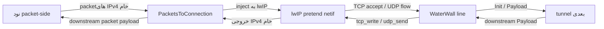

<!-- Written from version 128 of the English doc. -->

# PacketsToConnection

`PacketsToConnection` یک bridge میان packet و transport است که بر پایه lwIP کار می‌کند. این نود packetهای خام IPv4 را از سمت packet می‌گیرد، آن‌ها را به یک stack درون‌پردازه‌ای lwIP تزریق می‌کند و flowهای TCP/UDP حاصل را به شکل connectionهای معمول `line_t` در واتروال در اختیار tunnel بعدی قرار می‌دهد.

هرگاه یک chain مبتنی بر packet باید به بخش معمول connection-oriented واتروال وارد شود، از این نود استفاده کنید.

```text
packet side -> PacketsToConnection -> normal WaterWall service chain
normal service response -> PacketsToConnection -> raw IPv4 packet side
```

## چیستی این نود

`PacketsToConnection` بیشتر یک bridge کوچک برای transport stack است تا tunnelی برای framing کردن packetها.

مسئولیت‌های این نود:

- دریافت packetهای کامل IPv4 از نود قبلی در سمت packet
- تحویل packetهای پشتیبانی‌شده به lwIP
- تبدیل connectionهای پذیرفته‌شده TCP به lineهای معمول واتروال
- تبدیل 4-tupleهای UDP به lineهای معمول واتروال
- نوشتن پاسخ‌های downstream مربوط به service chain از طریق lwIP
- فرستادن packetهای خام IPv4 به سمت packet

چیزهایی که این نود مسئول نیست:

- ساختن TUN device
- تنظیم routeهای سیستم‌عامل، firewall mark یا policy routing
- serialize کردن packetها روی یک byte stream
- جایگزینی `TunDevice`
- پردازش IPv6 یا ICMP

`TunDevice` سمت adapter واقعی packet را مدیریت می‌کند و `PacketsToConnection` مسئول سمت transport bridge در lwIP است.

## جایگاه رایج

جریان مستقیم packet-to-service:

```text
TunDevice -> PacketsToConnection -> TcpConnector
```

packet input با policy یا proxy chain بعد از بازسازی flow:

```text
TunDevice -> PacketsToConnection -> Router -> TcpConnector
```

packet input منتقل شده توسط tunnel دیگر:

```text
WireGuardDevice -> PacketsToConnection -> HttpClient -> TlsClient -> TcpConnector
```

سمت قبلی باید مبتنی بر packet باشد. سمت بعدی یک connection chain معمول واتروال است و lineهای ساخته‌شده برای هر flow را دریافت می‌کند.

## نمونه‌های تنظیم

bridge حداقلی:

```json
{
  "name": "ptc",
  "type": "PacketsToConnection",
  "next": "service-chain-entry"
}
```

با تنظیم UDP idle و fake DNS:

```json
{
  "name": "ptc",
  "type": "PacketsToConnection",
  "settings": {
    "udp-idle-timeout-ms": 120000,
    "fake-dns": {
      "address": "198.18.0.2",
      "port": 53,
      "network": "100.64.0.0",
      "netmask": "255.192.0.0",
      "cache-size": 10000,
      "ttl": 1
    }
  },
  "next": "service-chain-entry"
}
```

## ترافیک پشتیبانی‌شده

| ترافیک | وضعیت | نکات |
| --- | --- | --- |
| IPv4 | پشتیبانی می‌شود | ورودی باید یک packet کامل IPv4 باشد. |
| TCP over IPv4 | پشتیبانی می‌شود | lwIP آن را می‌پذیرد و به شکل lineهای معمول واتروال ارائه می‌کند. |
| UDP over IPv4 | پشتیبانی می‌شود | به شکل یک line واتروال برای هر 4-tuple همراه با idle timeout ارائه می‌شود. |
| IPv6 | پشتیبانی نمی‌شود | tunnel فقط IPv4 را پردازش می‌کند و packetهای IPv6 کنار گذاشته می‌شوند. |
| ICMP | پشتیبانی نمی‌شود | packetهای IPv4 غیر از TCP/UDP کنار گذاشته می‌شوند. |

بررسی‌های packet input عمداً محافظه‌کارانه هستند:

- طول packet باید حداقل یک IPv4 header باشد
- IP version باید `4` باشد
- IPv4 header length باید داخل buffer جا بگیرد
- IP total length باید معتبر باشد
- طول `sbuf` باید با IPv4 total length برابر باشد
- protocol باید TCP یا UDP باشد، مگر اینکه packet توسط fake DNS مدیریت شود

packetهایی که این شرایط را نداشته باشند به pool برگردانده می‌شوند و به نود بعدی نمی‌روند.

## مرز نهایی‌سازی Checksum

`PacketsToConnection` مصرف‌کنندهٔ نهایی درخواست یک-packet مربوط به checksum روی
packet line است. درخواست پیش از validation/drop گرفته و پاک می‌شود، input shifted
در storage mutable و aligned قرار می‌گیرد و checksumهای پشتیبانی‌شده پیش از parse
typed یا ingress به lwIP اصلاح می‌شوند. بنابراین packet malformed، IPv6، stopping
یا refused نمی‌تواند flag را به packet بعدی leak کند. در IPv4 TCP/UDP بدون fragment
هر دو checksum header و transport اصلاح می‌شوند؛ در fragment فقط header IPv4 قابل
اصلاح است.

Input misaligned به aligned sbuf copy و از همان custom-pbuf wrapper عبور می‌کند؛
برخلاف `PBUF_RAM` سقف heap class شانزده KiB ندارد. Wrapperهای zero-copy به تعداد
reassembly budget، target flowهای TCP و reserve ثابت size می‌شوند. هر datagram
ناقص حداکثر ۱۶ pbuf دارد و per-PCB ceiling مربوط به `TCP_OOSEQ_MAX_PBUFS` مانع
مصرف کل reserve به‌دست یک peer می‌شود.

## Publication، Fragment و Shutdown فعلی

Netif هر worker از `misc.mtu` سراسری استفاده می‌کند و response بزرگ‌تر را با
`ip4_frag()` fragment می‌کند. Fake-DNS reply نیز از `ip4_output_if()` همان netif
می‌گذرد. UDP fragment خطاب به آدرس fake-DNS با warning محدودشده drop می‌شود؛ port
روی fragmentهای بعدی قابل استنتاج نیست و fragmented TCP به آن آدرس عادی route
می‌شود.

Claim ref-counted مربوط به fragment device-originated در copy، duplication، delay،
handoff و cleanup همراه buffer می‌ماند. پس از lwIP input کلید دقیق reassembly شامل
netif/source/destination/protocol/ID query می‌شود؛ refusal همان کلید را purge می‌کند
و نبود اثبات، identity را تا timeout زمانی و `IP_REASS_MAXAGE + 1` tick واقعی lwIP
reserved نگه می‌دارد تا hybrid datagram ساخته نشود.

دو gate جدا publication packet و callback normal-line را پوشش می‌دهند.
`onQuiesceRequest()` هر دو gate را می‌بندد و `onQuiesceWait()` پیش از توقف هر
component منتظر بازگشت callbackهای admitted می‌ماند. Output lwIP همیشه queue
می‌شود، حتی روی همان worker، تا callback همسایه زیر core lock اجرا نشود. Messageهای
دیررس async session detached نگه می‌دارند، نه pointer خام tunnel. Work عادیِ
ردشده منابع تحت مالکیت خود را آزاد می‌کند و teardown را به مسیر owner می‌سپارد؛
lineای که Init آن کامل شده است در drain همان owner-worker دقیقاً یک `Finish`
دریافت می‌کند.

هر TCP/UDP line ساخته‌شده تا close در owner list همان worker است. Drain آن
owner-worker ابتدا PCB، route، callback و timer را detach، سپس state را destroy،
در صورت تکمیل Init دقیقاً یک `Finish` به next می‌فرستد و line owned را
`lineDestroy()` می‌کند. UDP idle timer
cancellable است و هنگام armed بودن دقیقاً یک line reference دارد. Netif تنها بعد
از detach شدن همهٔ PCBها و raw ownerها حذف می‌شود.

## مدل جریان



worker packet line مشترک با lineهای TCP/UDP ساخته‌شده توسط این نود فرق دارد:

| نوع line | مالک | طول عمر |
| --- | --- | --- |
| worker packet line | tunnel chain | line کمکی و پایدار worker که در runtime عادی بسته نمی‌شود. |
| TCP line ساخته‌شده | `PacketsToConnection` | connection line معمول واتروال که با بسته شدن flow مربوط به TCP از بین می‌رود. |
| UDP line ساخته‌شده | `PacketsToConnection` | connection line معمول واتروال که با idle timeout یا بسته شدن downstream از بین می‌رود. |

## Route Context های lwIP

برای IPv4، پیاده‌سازی فعلی route contextها را هنگام نیاز و به‌ازای هر packet worker می‌سازد، نه به‌ازای هر destination IP.

هر route context محلی worker شامل این موارد است:

- یک lwIP `netif`
- `NETIF_FLAG_PRETEND`
- یک TCP listener wildcard pretend، اولین بار با اولین TCP packet ساخته می‌شود
- یک UDP PCB wildcard pretend، اولین بار با اولین UDP packet ساخته می‌شود
- یک UDP flow map با کلید packet 4-tuple

destination IP هم در packet IPv4 و هم در tuple مربوط به PCB در lwIP حفظ می‌شود، اما کلید ساخت route context جداگانه نیست. patch مربوط به حالت pretend در lwIP واتروال به PCBهای wildcard اجازه می‌دهد روی netif مجازی، ترافیک مربوط به هر destination address و port را بپذیرند و در عین حال local tuple اصلی flowهای پذیرفته‌شده را نگه دارند.

وقتی lwIP خروجی packet تولید می‌کند، `PacketsToConnection` آن را با `tunnelPrevDownStreamPayload()` به worker packet line می‌فرستد. اگر خروجی lwIP روی worker دیگری ایجاد شده باشد، بایت‌های packet در یک worker message کپی می‌شوند تا از packet worker درست ارسال شوند.

## رفتار TCP

وقتی lwIP یک TCP flow می‌پذیرد:

1. `PacketsToConnection` یک WaterWall line عادی روی owning packet worker می‌سازد.
2. per-line state خودش را به‌عنوان یک TCP line مقداردهی اولیه می‌کند.
3. source address context را از remote TCP peer پر می‌کند.
4. destination address context را از original local destination IP و port، یا از fake DNS mapping در صورت وجود پر می‌کند.
5. `routing_context.local_listener_port` را به original local port تنظیم می‌کند.
6. Nagle را روی lwIP TCP PCB غیرفعال می‌کند.
7. upstream `Init` را برای tunnel بعدی زمان‌بندی می‌کند.

payload ورودی TCP از lwIP در یک buffer واتروال کپی می‌شود و پس از ارسال upstream `Init`، با `tunnelNextUpStreamPayload()` در جهت upstream تحویل داده می‌شود.

payload در جهت downstream از tunnel بعدی با `tcp_write()` به lwIP نوشته می‌شود. پیاده‌سازی فعلی از `TCP_WRITE_FLAG_COPY` استفاده می‌کند؛ در نتیجه lwIP نسخه خودش را از بایت‌ها می‌گیرد و واتروال buffer اصلی را تا تکمیل حساب‌داری ارسال TCP نگه می‌دارد.

### TCP Backpressure

نوشتن TCP در مسیر downstream با سازوکار pause/resume واتروال هماهنگ است:

- اگر `tcp_sndbuf()` فضا نداشته باشد یا فقط بخشی از buffer قابل نوشتن باشد، داده باقی‌مانده در صف می‌ماند
- tunnel بعدی با `tunnelNextUpStreamPause()` متوقف می‌شود
- callbackهای lwIP `tcp_sent` acknowledgement queue را پیش می‌برند
- بایت‌های صف‌شده با فراهم شدن فضای ارسال فرستاده می‌شوند
- با خالی شدن write queue، tunnel بعدی با `tunnelNextUpStreamResume()` از حالت توقف خارج می‌شود

backpressure سمت دریافت نیز مدیریت می‌شود:

- downstream `Pause` line ساخته‌شده را read-paused علامت می‌زند
- در حالت read-paused، TCP receive credit به تعویق می‌افتد
- downstream `Resume` credit انباشته‌شده `tcp_recved()` را به lwIP برمی‌گرداند

به این ترتیب flow control مربوط به TCP بدون بستن packet line حفظ می‌شود.

هر flow علاوه بر `max-pending-bytes` حداکثر `1024` record ACK/pause نگه می‌دارد.
Accounting مجموع و remaining در ۳۲ بیت انجام می‌شود، پس buffer stream می‌تواند از
۶۵۵۳۵ بایت بزرگ‌تر باشد. Empty TCP buffer بدون ورود به queue مصرف می‌شود.

## رفتار UDP

UDP نیز به شکل lineهای معمول واتروال ارائه می‌شود، اما مدل آن datagram-based است و state کمتری از TCP دارد.

کلید UDP flow:

| فیلد | معنی |
| --- | --- |
| source IPv4 address | آدرس source اصلی packet. |
| destination IPv4 address | آدرس destination اصلی packet. |
| source port | source port اصلی UDP. |
| destination port | destination port اصلی UDP. |

با اولین datagram برای یک 4-tuple جدید:

1. `PacketsToConnection` یک WaterWall line عادی روی owning packet worker می‌سازد.
2. UDP flow key و اطلاعات UDP PCB متصل را ذخیره می‌کند.
3. source و destination address contextها را پر می‌کند.
4. fake DNS mapping را به destination context اعمال می‌کند اگر destination یک fake IP mapped باشد.
5. line را به UDP flow map route context اضافه می‌کند.
6. upstream `Init` را زمان‌بندی می‌کند و datagramها را به شکل upstream payload تحویل می‌دهد.

فعالیت روی UDP line آن را زنده نگه می‌دارد. datagramهای ورودی و payloadهای downstream مربوط به UDP، idle timer را به‌روزرسانی می‌کنند. پس از رسیدن deadline تنظیم‌شده، line بسته و از UDP flow map حذف می‌شود.

### محدودیت UDP Backpressure

UDP سازوکار واقعی backpressure مانند stream ندارد.

رفتار فعلی:

- downstream `Pause` UDP line ساخته‌شده را read-paused علامت می‌زند
- datagramهای UDP ورودی در حالت read-paused کنار گذاشته می‌شوند
- downstream `Resume` paused state را پاک می‌کند
- downstream payload از طریق UDP PCB متصل ارسال می‌شود و WaterWall buffer فوراً reuse می‌شود

این محدودیت در مسیر UDP عمدی است. اگر backpressure بدون از دست رفتن داده اهمیت دارد، از stream transport یا لایه‌ای استفاده کنید که retransmission و flow control خودش را فراهم می‌کند.

Payload downstream UDP حداکثر `65507` بایت است؛ مقدار بزرگ‌تر بدون narrow شدن در
APIهای ۱۶ بیتی lwIP drop می‌شود و payload صفر بایت یک datagram معتبر باقی می‌ماند.

## Fake DNS

`fake-dns` یک DNS responder اختیاری برای IPv4 درون tunnel است. زمانی مفید است که clientهای سمت packet باید به domain متصل شوند، اما مسیر packet در ابتدا فقط IP packet در اختیار دارد.

مسیر fake DNS این‌گونه کار می‌کند:

1. یک packet client یک UDP DNS query به fake DNS address و port configure شده می‌فرستد.
2. `PacketsToConnection` آن packet را قبل از inject به lwIP intercept می‌کند.
3. برای هر سؤال `A`/`IN`، یک fake IPv4 address از fake network configure شده اختصاص می‌دهد یا reuse می‌کند.
4. یک DNS response به packet side به‌عنوان یک UDP packet IPv4 خام می‌فرستد.
5. بعداً packetهای TCP یا UDP که destination IP آن‌ها با یک ورودی fake DNS مطابقت داشته باشد، به‌جای IP destination context یک domain destination context می‌گیرند.

این کار باعث می‌شود نودهای downstream مانند `TcpConnector`، proxy clientها و routerها نام domain اصلی را ببینند، نه فقط IP ساختگی را.

نکات مهم:

- fake DNS به‌صورت پیش‌فرض غیرفعال است
- مقدار boolean `true` آن را با defaultها فعال می‌کند
- فرم object اجازه تنظیم listen address، fake network، cache size و TTL را می‌دهد
- فقط UDP DNS packetهای IPv4 مدیریت می‌شوند
- فقط سؤال‌های `A`/`IN` پاسخ A synthetic می‌گیرند
- از هر DNS query حداکثر ۳۲ سؤال خوانده می‌شود
- نام‌های سؤال قبل از ذخیره به lowercase تبدیل می‌شوند
- map مربوط به fake IP از نوع LRU و محلی همان process است
- DNS TTL اثر روی DNS response TTL دارد، نه انقضای سخت map in-process
- اگر یک fake IP entry evict شود، flowهای آینده به آن old fake IP ممکن است دیگر به domain اصلی resolve نشوند

بازه شبکه‌ای که برای fake DNS تنظیم می‌کنید نباید در همان محیط packet شامل destinationهای واقعی باشد.

## تنظیمات

فیلدهای سطح بالا:

| فیلد | نوع | اجباری | توضیح |
| --- | --- | --- | --- |
| `name` | string | بله | نام دلخواه نود. باید داخل فایل config یکتا باشد. |
| `type` | string | بله | باید دقیقاً `"PacketsToConnection"` باشد. |
| `settings` | object | خیر | object تنظیمات اختیاری. اگر وجود داشته باشد باید object باشد. |
| `next` | string | بله، برای runtime کاربردی | ورودی service chain معمول واتروال که lineهای ساخته‌شده را دریافت می‌کند. |

فیلدهای `settings`:

| گزینه | نوع | پیش‌فرض | توضیح |
| --- | --- | --- | --- |
| `udp-idle-timeout-ms` | integer | `300000` | طول عمر idle برای UDP lineهای ساخته‌شده. حداقل `1`. |
| `max-pending-bytes` | integer | `262144` | سقف byteهای TCP منتظر یا پذیرفته‌شده ولی ACKنشده؛ بازهٔ `1024..67108864`. عبور از آن همان flow را reset می‌کند. |
| `fake-dns` | boolean یا object | `false` | فعال‌سازی و تنظیم fake DNS responder داخل tunnel. |
| `fake_dns` | boolean یا object | تنظیم نشده | alias برای `fake-dns`. |
| `mapdns` | boolean یا object | تنظیم نشده | alias قدیمی برای `fake-dns`. |

فیلدهای object fake DNS:

| فیلد | نوع | پیش‌فرض | توضیح |
| --- | --- | --- | --- |
| `enabled` | boolean | `true` | اجازه می‌دهد فرم object حضور داشته باشد در حالی که fake DNS غیرفعال است. |
| `address` | IPv4 string | `198.18.0.2` | آدرس IPv4 که fake DNS responder روی آن listen می‌کند. |
| `port` | integer | `53` | UDP destination port برای DNS queryهای fake. باید `1..65535` باشد. |
| `network` | IPv4 string | `100.64.0.0` | شبکه پایه fake-IP. قبل از استفاده توسط `netmask` mask می‌شود. |
| `netmask` | IPv4 string | `255.192.0.0` | mask پیوستهٔ prefix از `/1` تا `/31`. |
| `cache-size` | integer | `10000` | تعداد record domain-to-fake-IP؛ حداکثر product برابر `262144` و باید داخل prefix جا بگیرد. |
| `ttl` | integer | `1` | DNS answer TTL بر حسب ثانیه. باید `0` یا بیشتر باشد. |

دقیقاً یکی از `fake-dns`، ‏`fake_dns` و `mapdns` مجاز است؛ aliasهای تکراری حتی با
value برابر رد می‌شوند. Object غیرفعال نیز fieldبهfield validation می‌شود ولی table
اختصاص نمی‌دهد. `address` باید unicast IPv4 غیر wildcard/loopback/multicast/broadcast
باشد. همهٔ questionهای A/IN پیش از نخستین mapping parse و unique nameهای یک query
در یک transaction commit می‌شوند؛ failure هیچ record یا LRU order نیمه‌تغییر‌یافته
باقی نمی‌گذارد. Prefix باید پیوسته و حداقل یک host bit داشته باشد؛ `/31` دقیقاً دو
record دارد. هندسهٔ table پیش از allocation از overflow محافظت می‌شود و سقف
۲۶۲۱۴۴ record تقریباً ۱۶ MiB storage روی build ۶۴ بیتی است.

## معناشناسی Callback و Lifecycle

callbackهای packet-side:

| callback دریافت‌شده روی packet line | رفتار |
| --- | --- |
| upstream `Init` | No-op. packet-line init یک رویداد startup/bootstrap است. |
| upstream `Payload` | IPv4 را اعتبارسنجی می‌کند، در صورت فعال بودن fake DNS را مدیریت می‌کند و سپس packetهای TCP/UDP را به lwIP تحویل می‌دهد. |
| upstream `Est` | fatal guard؛ روی packet line انتظار نمی‌رود. |
| upstream `Pause` | fatal guard؛ روی packet line انتظار نمی‌رود. |
| upstream `Resume` | fatal guard؛ روی packet line انتظار نمی‌رود. |
| upstream `Finish` | fatal guard؛ packet lineها نباید در طول runtime عادی بسته شوند. |

callbackهای connection line ساخته‌شده از tunnel بعدی:

| callback از سمت بعدی | رفتار |
| --- | --- |
| downstream `Payload` | bytes/datagramها را به lwIP می‌نویسد. |
| downstream `Pause` | خواندن از TCP/UDP line ساخته‌شده را متوقف می‌کند. |
| downstream `Resume` | خواندن را از سر می‌گیرد و در TCP، receive credit معوق را آزاد می‌کند. |
| downstream `Finish` | PCB متصل را به closer graceful منتقل، state را destroy و line owned را می‌بندد؛ Finish را به packet side بازتاب نمی‌دهد. |
| downstream `Init` | fatal guard؛ callback معتبری برای lineهای ساخته‌شده نیست. |
| downstream `Est` | No-op. |

رفتار close سمت network:

- TCP close/error و UDP idle close اول lwIP state را جدا می‌کنند
- این tunnel per-line state خودش را از بین می‌برد
- اگر upstream `Init` قبلاً ارسال شده باشد، upstream `Finish` به tunnel بعدی ارسال می‌شود
- سپس `PacketsToConnection`، lineای را که خودش ساخته بود از بین می‌برد

بسته شدن flowهای جداگانه هرگز packet line مشترک را از بین نمی‌برد؛ این line تا زمان از بین رفتن tunnel chain زنده می‌ماند.

Closer byteهای پذیرفته‌شده را زیر backpressure drain و سپس با
`tcp_shutdown(pcb, 0, 1)` TX را half-close می‌کند. فازهای delivering، FIN-pending و
closing فقط رو به جلو هستند؛ deadline delivery/FIN ‏۳۰ ثانیه و peer-close ‏۶۰ ثانیه
است. سقف instance برابر ۴۰۹۶ closer و ۱۶ MiB suffix copied است. Allocation/cap/error
یا deadline flow را reset می‌کند و Stop همهٔ closerها را abort می‌کند. `tcp_close()`
برای flow متصل استفاده نمی‌شود، چون با receive credit outstanding می‌تواند RST
فرستاده و byteهای ACKنشده را از بین ببرد.

## نگاشت Address Context

برای TCP و UDP lineهای ساخته‌شده:

| Context | مقدار |
| --- | --- |
| source address context | آدرس peer packet اصلی، peer port و protocol. |
| destination address context | آدرس destination packet اصلی و port، مگر اینکه fake DNS destination IP را به domain map کند. |
| destination domain strategy | `prefer-ipv4` وقتی fake DNS mapping اعمال می‌شود. |
| `routing_context.local_listener_port` | local destination port اصلی. |

به همین دلیل `PacketsToConnection` با نودهای معمولی که destination را می‌شناسند سازگار است. برای نمونه، connector بعدی می‌تواند به مقصد اصلی packet وصل شود و router نیز بر اساس protocol، port، IP یا domain بازیابی‌شده توسط fake DNS تصمیم بگیرد.

## نکات Buffer و Padding

metadata نود backed از source:

| ویژگی | مقدار |
| --- | --- |
| node flags | `kNodeFlagNone` |
| `can_have_prev` | `true` |
| `can_have_next` | `true` |
| `layer_group` | `kNodeLayerAnything` |
| `layer_group_prev_node` | `kNodeLayerAnything` |
| `layer_group_next_node` | `kNodeLayerAnything` |
| `required_padding_left` | `0` |

tunnel برای هر payload، framing header اضافه نمی‌کند و به left padding نیاز ندارد. در صورت امکان bufferهای ورودی packet در pbufهای lwIP قرار می‌گیرند؛ packetهای خروجی نیز از worker buffer pool مربوط به packet line یا، در صورت نیاز، از یک buffer تازه با padding کافی گرفته می‌شوند.

## نکات تخصصی و محدودیت‌ها

- `PacketsToConnection` یک policy engine برای NAT نیست. فقط flowها را بازسازی و به‌صورت lineهای واتروال ارائه می‌کند؛ اگر به filtering یا انتخاب مسیر نیاز دارید، نودهای routing یا policy را پس از آن قرار دهید.
- route contextهای IPv4 فعلاً با packet worker id کلیدگذاری می‌شوند، نه destination IP.
- PCBهای TCP و UDP listener pretend wildcard PCBهایی روی worker-local netif هستند، نه یک listener به‌ازای هر destination port.
- UDP lineهای ساخته‌شده per 4-tuple هستند و با idle timeout بسته می‌شوند.
- pause در UDP با از دست رفتن داده همراه است؛ datagramهای ورودی هنگام توقف کنار گذاشته می‌شوند.
- Fake DNS یک mapper درون‌پردازه‌ای برای A-recordهای ساختگی است، نه یک DNS resolver بازگشتی.
- map مربوط به fake DNS فقط در همین tunnel instance وجود دارد و با از بین رفتن tunnel پاک می‌شود.
- packet-line `Finish` در طول runtime نقض قرارداد به حساب می‌آید.
- IPv6 و ICMP فعلاً کنار گذاشته می‌شوند.
- Netifهای process فقط ۲۵۵ index دارند و loopback و همهٔ nodeهای lwIP در آن شریک‌اند؛ exhaustion creation را سریع fail می‌کند.
- poolهای سراسری default برای ۲۰۴۸ flow TCP، ‏۲۰۴۸ flow UDP، ‏۳۲ datagram reassembly و ۳۲۰ listener ساخته می‌شوند و Linux Release تقریباً `9.6 MB` BSS دارد.
- packetهایی که پس از IPv4 total length بایت اضافه دارند کنار گذاشته می‌شوند؛ زیرا پیاده‌سازی به برابری دقیق طول `sbuf` و IP total length نیاز دارد.

## تفاوت با PacketsToStream

وقتی فقط می‌خواهید مرز packetهای خام را روی stream transport حفظ کنید، `PacketsToStream` را همراه `StreamToPackets` به کار ببرید.

اگر می‌خواهید lwIP flowهای TCP/UDP را بازسازی و آن‌ها را به شکل connection lineهای معمول واتروال ارائه کند، از `PacketsToConnection` استفاده کنید.
