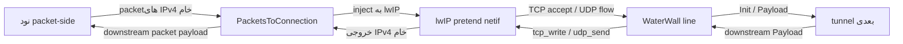

<!--
Documentation version: 158
-->

# PacketsToConnection

`PacketsToConnection` یک bridge میان packet و transport است که بر پایه lwIP کار می‌کند. این node packet‌های خام IPv4 را از سمت packet می‌گیرد، آن‌ها را به stack مربوط به lwIP در همان process تزریق می‌کند و flow‌های TCP/UDP حاصل را به شکل connection‌های معمول `line_t` در WaterWall در اختیار tunnel بعدی قرار می‌دهد.

هرگاه یک chain مبتنی بر packet باید به بخش معمول connection-oriented WaterWall وارد شود، از این node استفاده کنید.

```text
packet side -> PacketsToConnection -> normal WaterWall service chain
normal service response -> PacketsToConnection -> raw IPv4 packet side
```

## MTU هر نمونه

گزینهٔ اختیاری `mtu` یک عدد صحیح می‌گیرد و هنگام ساخت، مقدار پیش‌فرض خود را از `misc.mtu` هسته می‌گیرد (پیش‌فرض
هسته 1500). بازهٔ معتبر **68..65535 بایت** است: MTU خام IPv4 برای تمام رابط‌های مجازی هر worker، حتی رابط‌هایی که بعداً ساخته می‌شوند.
هر نمونه مقدار معتبر خود را ثابت و مستقل نگه می‌دارد؛ ساخت نمونهٔ دیگر یا تغییر
بعدی هسته بر آن اثر ندارد. `null`، نوع نادرست، عدد اعشاری، صفر، منفی و مقدار خارج
از بازه ساخت node را رد می‌کنند. پیش‌فرض ارث‌رسیدهٔ نامعتبر نیز رد می‌شود؛ یک override
معتبر برای node تعیین کنید. این تنظیم اندازه‌گیری یا مذاکرهٔ MTU مسیر نیست.
fragmentation موجود IPv4 در lwIP از MTU همین رابط پیروی می‌کند.

## چیستی این node {#چیستی-این-نود}

`PacketsToConnection` بیشتر یک bridge کوچک برای transport stack است تا tunnelی برای framing کردن packet‌ها.

مسئولیت‌های این node:

- دریافت packet‌های کامل IPv4 از node قبلی در سمت packet
- تحویل packet‌های پشتیبانی‌شده به lwIP
- تبدیل connection‌های پذیرفته‌شده TCP به line‌های معمول WaterWall
- تبدیل 4-tuple‌های UDP به line‌های معمول WaterWall
- نوشتن پاسخ‌های downstream مربوط به service chain از طریق lwIP
- فرستادن packet‌های خام IPv4 به سمت packet

این کارها بر عهدهٔ این node نیست:

- ساختن TUN device
- تنظیم route‌های سیستم‌عامل، firewall mark یا policy routing
- serialize کردن packet‌ها روی یک byte stream
- جایگزینی `TunDevice`
- پردازش IPv6 یا ICMP

`TunDevice` سمت adapter واقعی packet را مدیریت می‌کند و `PacketsToConnection` مسئول سمت transport bridge در lwIP است.

## جایگاه رایج

جریان مستقیم packet-to-service:

```text
TunDevice -> PacketsToConnection -> TcpConnector
```

packet input با policy یا proxy chain بعد از بازسازی flow:

```text
TunDevice -> PacketsToConnection -> Router -> TcpConnector
```

packet input منتقل شده توسط tunnel دیگر:

```text
WireGuardDevice -> PacketsToConnection -> HttpClient -> TlsClient -> TcpConnector
```

سمت قبلی باید مبتنی بر packet باشد. سمت بعدی یک connection chain معمول WaterWall است و line‌های ساخته‌شده برای هر flow را دریافت می‌کند.

## نمونه‌های تنظیم

bridge حداقلی:

```json
{
  "name": "ptc",
  "type": "PacketsToConnection",
  "next": "service-chain-entry"
}
```

با تنظیم UDP idle و fake DNS:

```json
{
  "name": "ptc",
  "type": "PacketsToConnection",
  "settings": {
    "udp-idle-timeout-ms": 120000,
    "fake-dns": {
      "address": "198.18.0.2",
      "port": 53,
      "network": "100.64.0.0",
      "netmask": "255.192.0.0",
      "cache-size": 10000,
      "ttl": 1
    }
  },
  "next": "service-chain-entry"
}
```

## ترافیک پشتیبانی‌شده

| ترافیک | وضعیت | نکات |
| --- | --- | --- |
| IPv4 | پشتیبانی می‌شود | ورودی باید یک packet کامل IPv4 باشد. |
| TCP over IPv4 | پشتیبانی می‌شود | lwIP آن را می‌پذیرد و به شکل line‌های معمول WaterWall ارائه می‌کند. |
| UDP over IPv4 | پشتیبانی می‌شود | به شکل یک line WaterWall برای هر 4-tuple همراه با idle timeout ارائه می‌شود. |
| IPv6 | پشتیبانی نمی‌شود | tunnel فقط IPv4 را پردازش می‌کند و packet‌های IPv6 کنار گذاشته می‌شوند. |
| ICMP | پشتیبانی نمی‌شود | packet‌های IPv4 غیر از TCP/UDP کنار گذاشته می‌شوند. |

بررسی‌های packet input عمداً محافظه‌کارانه هستند:

- طول packet باید حداقل یک IPv4 header باشد
- IP version باید `4` باشد
- IPv4 header length باید داخل buffer جا بگیرد
- IP total length باید معتبر باشد
- طول `sbuf` باید با IPv4 total length برابر باشد
- protocol باید TCP یا UDP باشد، مگر اینکه packet توسط fake DNS مدیریت شود

packet‌هایی که این شرایط را نداشته باشند به pool برگردانده می‌شوند و به node بعدی نمی‌روند.

## مرز نهایی‌سازی checksum {#مرز-نهاییسازی-checksum}

`PacketsToConnection` مصرف‌کنندهٔ نهایی درخواست یک-packet مربوط به checksum روی
packet line است. درخواست پیش از validation/drop گرفته و پاک می‌شود، ورودی shifted
در حافظهٔ قابل تغییر و aligned قرار می‌گیرد و checksum‌های پشتیبانی‌شده پیش از parse
typed یا ingress به lwIP اصلاح می‌شوند. بنابراین packet malformed، IPv6، stopping
یا refused نمی‌تواند flag را به packet بعدی leak کند. در IPv4 TCP/UDP بدون fragment
هر دو checksum header و transport اصلاح می‌شوند. fragment ورودی پیش از تحویل به stack با خطای fatal رد می‌شود.

ورودی misaligned در یک sbuf با alignment مناسب کپی می‌شود و از همان custom-pbuf wrapper عبور می‌کند.
اندازهٔ pool‌های مشترک lwIP تغییر نکرده است؛ TCP out-of-order همچنان می‌تواند
wrapper را نگه دارد و محدودیت per-PCB برقرار است.

## Publication، fragment و shutdown فعلی

ورودی packet باید datagram کامل IPv4 باشد. MF یا fragment offset غیرصفر نقض
قرارداد runtime است و با پیام fatal و خروج فوری کل برنامه در Debug و Release
پاسخ داده می‌شود؛ DF به‌تنهایی مجاز است. پیش از این node، در ingress دستگاه یا
مرحلهٔ مناسب دیگر، reassembly انجام دهید. بررسی پیش از lookup پروتکل/flow و
تحویل به lwIP انجام می‌شود. ساختار malformed همچنان از مسیر validation/drop
معمول می‌گذرد.

این الزام روی upstream packet input برقرار است و fake DNS نیز فقط packet کامل
می‌بیند. خروجی netif هر worker از `mtu` همان نمونه استفاده می‌کند و پاسخ بزرگ‌تر را با
`ip4_frag()` fragment می‌کند. خروجی Fake-DNS نیز از `ip4_output_if()` می‌گذرد.
packet کامل پس از reassembly مالکیت معمول buffer دارد و claim عمر fragment همراه
آن منتقل نمی‌شود.

دو gate جدا publication packet و callback normal-line را پوشش می‌دهند.
`onQuiesceRequest()` هر دو gate را می‌بندد و `onQuiesceWait()` پیش از توقف هر
component منتظر بازگشت callback‌های admitted می‌ماند. output lwIP برای همسایهٔ فاقد تضمین enqueue-only، queue
می‌شود، حتی روی همان worker، تا callback همسایه دوباره وارد input فعال stack نشود. Message‌های
pending تحت lifecycle-v2 پیش از stop و destruction component تسویه می‌شوند؛ gate
پذیرش output بسته می‌شود تا work دیررس بدون callback به همسایهٔ متوقف‌شده cancel
شود. Work عادیِ ردشده منابع تحت مالکیت خود را آزاد می‌کند و teardown را به مسیر owner می‌سپارد؛
line‌ای که Init آن کامل شده است در drain همان owner-worker دقیقاً یک `Finish`
دریافت می‌کند.

callback‌های lwIP کار را با قرارداد نتیجه‌دار `lineScheduleTask()` و
`lineScheduleTaskWithBuf()` به worker مالک line می‌سپارند. ردشدن control ضروری،
producer را در engine همان owner terminal می‌کند؛ callback
لغو عمداً `NULL` است و cleanup روی owner انجام می‌شود. تحویل buffer در هر نتیجه
مالکیت کپی را منتقل می‌کند.

هر TCP/UDP line ساخته‌شده تا close در owner list همان worker است. Drain آن
owner-worker ابتدا PCB، route، callback و timer را detach، سپس state را destroy،
در صورت تکمیل Init دقیقاً یک `Finish` به next می‌فرستد و line owned را
`lineDestroy()` می‌کند. UDP idle timer
cancellable است و هنگام armed بودن دقیقاً یک line reference دارد. Netif تنها بعد
از detach شدن همهٔ PCB‌ها و raw owner‌ها حذف می‌شود.

## مدل جریان


```mermaid
flowchart LR
    P[نود packet-side] -->|packetهای IPv4 خام| PTC[PacketsToConnection]
    PTC -->|inject به lwIP| L[lwIP pretend netif]
    L -->|TCP accept / UDP flow| C[WaterWall line]
    C -->|Init / Payload| N[tunnel بعدی]
    N -->|downstream Payload| C
    C -->|tcp_write / udp_send| L
    L -->|خروجی IPv4 خام| PTC
    PTC -->|downstream packet payload| P
```

worker packet line مشترک با line‌های TCP/UDP ساخته‌شده توسط این node فرق دارد:

| نوع line | مالک | طول عمر |
| --- | --- | --- |
| worker packet line | tunnel chain | line کمکی و پایدار worker که در runtime عادی بسته نمی‌شود. |
| TCP line ساخته‌شده | `PacketsToConnection` | connection line معمول WaterWall که با بسته شدن flow مربوط به TCP از بین می‌رود. |
| UDP line ساخته‌شده | `PacketsToConnection` | connection line معمول WaterWall که با idle timeout یا بسته شدن downstream از بین می‌رود. |

## Route context های lwIP {#route-context-های-lwip}

برای IPv4، پیاده‌سازی فعلی route context‌ها را هنگام نیاز و به‌ازای هر packet worker می‌سازد، نه به‌ازای هر destination IP.

هر route context محلی worker شامل این موارد است:

- یک lwIP `netif`
- `NETIF_FLAG_PRETEND`
- یک TCP listener wildcard pretend، اولین بار با اولین TCP packet ساخته می‌شود
- یک UDP PCB wildcard pretend، اولین بار با اولین UDP packet ساخته می‌شود
- یک UDP flow map با کلید packet 4-tuple

destination IP هم در packet IPv4 و هم در tuple مربوط به PCB در lwIP حفظ می‌شود، اما کلید ساخت route context جداگانه نیست. patch مربوط به حالت pretend در lwIP WaterWall به PCB‌های wildcard اجازه می‌دهد روی netif مجازی، ترافیک مربوط به هر destination address و port را بپذیرند و در عین حال local tuple اصلی flow‌های پذیرفته‌شده را نگه دارند.

وقتی lwIP خروجی packet تولید می‌کند، `PacketsToConnection` آن را با `tunnelPrevDownStreamPayload()` به worker packet line می‌فرستد. بایت‌های خروجی یک بار به sbuf مستقل کپی می‌شوند. TunDevice مجاور با تضمین enqueue-only روی worker مالک مستقیم تحویل می‌گیرد؛ برای سایر همسایه‌ها همان sbuf در worker message منتقل می‌شود.

## رفتار TCP

وقتی lwIP یک TCP flow می‌پذیرد:

1. `PacketsToConnection` یک WaterWall line عادی روی owning packet worker می‌سازد.
2. per-line state خودش را به‌عنوان یک TCP line مقداردهی اولیه می‌کند.
3. source address context را از remote TCP peer پر می‌کند.
4. destination address context را از original local destination IP و port، یا از fake DNS mapping در صورت وجود پر می‌کند.
5. `routing_context.local_listener_port` را به original local port تنظیم می‌کند.
6. Nagle را روی lwIP TCP PCB غیرفعال می‌کند.
7. upstream `Init` را برای tunnel بعدی زمان‌بندی می‌کند.

payload ورودی TCP از lwIP در یک buffer WaterWall کپی می‌شود و پس از ارسال upstream `Init`، با `tunnelNextUpStreamPayload()` در جهت upstream تحویل داده می‌شود.

payload در جهت downstream از tunnel بعدی با `tcp_write()` به lwIP نوشته می‌شود. پیاده‌سازی فعلی از `TCP_WRITE_FLAG_COPY` استفاده می‌کند؛ در نتیجه lwIP نسخه خودش را از بایت‌ها می‌گیرد و WaterWall buffer اصلی را تا تکمیل حساب‌داری ارسال TCP نگه می‌دارد.

### TCP Backpressure

نوشتن TCP در مسیر downstream با سازوکار pause/resume WaterWall هماهنگ است:

- اگر `tcp_sndbuf()` فضا نداشته باشد یا فقط بخشی از buffer قابل نوشتن باشد، داده باقی‌مانده در صف می‌ماند
- tunnel بعدی با `tunnelNextUpStreamPause()` متوقف می‌شود
- callback‌های lwIP `tcp_sent` acknowledgement queue را پیش می‌برند
- بایت‌های صف‌شده با فراهم شدن فضای ارسال فرستاده می‌شوند
- با خالی شدن write queue، tunnel بعدی با `tunnelNextUpStreamResume()` از حالت توقف خارج می‌شود

backpressure سمت دریافت نیز مدیریت می‌شود:

- downstream `Pause` line ساخته‌شده را read-paused علامت می‌زند
- در حالت read-paused، TCP receive credit به تعویق می‌افتد
- downstream `Resume` credit انباشته‌شده `tcp_recved()` را به lwIP برمی‌گرداند

به این ترتیب flow control مربوط به TCP بدون بستن packet line حفظ می‌شود.

هر flow علاوه بر `max-pending-bytes` حداکثر `1024` record ACK/pause نگه می‌دارد.
مجموع بایت‌ها و تعداد بایت‌های باقی‌مانده با مقادیر ۳۲ بیتی نگه داشته می‌شوند، پس buffer مربوط به stream می‌تواند از
۶۵۵۳۵ بایت بزرگ‌تر باشد. buffer خالی TCP بدون ورود به queue مصرف می‌شود.

## رفتار UDP

UDP نیز به شکل line‌های معمول WaterWall ارائه می‌شود، اما مدل آن datagram-based است و state کمتری از TCP دارد.

کلید UDP flow:

| فیلد | معنی |
| --- | --- |
| source IPv4 address | آدرس source اصلی packet. |
| destination IPv4 address | آدرس destination اصلی packet. |
| source port | source port اصلی UDP. |
| destination port | destination port اصلی UDP. |

با اولین datagram برای یک 4-tuple جدید:

1. `PacketsToConnection` یک WaterWall line عادی روی owning packet worker می‌سازد.
2. UDP flow key و اطلاعات UDP PCB متصل را ذخیره می‌کند.
3. source و destination address context‌ها را پر می‌کند.
4. fake DNS mapping را به destination context اعمال می‌کند اگر destination یک fake IP mapped باشد.
5. line را به UDP flow map route context اضافه می‌کند.
6. upstream `Init` را زمان‌بندی می‌کند و datagram‌ها را به شکل upstream payload تحویل می‌دهد.

فعالیت روی UDP line آن را زنده نگه می‌دارد. datagram‌های ورودی و payload‌های downstream مربوط به UDP، idle timer را به‌روزرسانی می‌کنند. پس از رسیدن deadline تنظیم‌شده، line بسته و از UDP flow map حذف می‌شود.

### محدودیت UDP Backpressure

UDP سازوکار واقعی backpressure مانند stream ندارد.

رفتار فعلی:

- downstream `Pause` UDP line ساخته‌شده را read-paused علامت می‌زند
- datagram‌های UDP ورودی در حالت read-paused کنار گذاشته می‌شوند
- downstream `Resume` paused state را پاک می‌کند
- downstream payload از طریق UDP PCB متصل ارسال می‌شود و WaterWall buffer فوراً reuse می‌شود

این محدودیت در مسیر UDP عمدی است. اگر backpressure بدون از دست رفتن داده اهمیت دارد، از stream transport یا لایه‌ای استفاده کنید که retransmission و flow control خودش را فراهم می‌کند.

payload downstream UDP حداکثر `65507` بایت است؛ مقدار بزرگ‌تر بدون narrow شدن در
API‌های ۱۶ بیتی lwIP drop می‌شود و payload صفر بایت یک datagram معتبر باقی می‌ماند.

## Fake DNS

`fake-dns` یک DNS responder اختیاری برای IPv4 درون tunnel است. زمانی مفید است که client‌های سمت packet باید به domain متصل شوند، اما مسیر packet در ابتدا فقط IP packet در اختیار دارد.

مسیر fake DNS این‌گونه کار می‌کند:

1. یک packet client یک UDP DNS query به fake DNS address و port configure شده می‌فرستد.
2. `PacketsToConnection` آن packet را قبل از inject به lwIP intercept می‌کند.
3. برای هر سؤال `A`/`IN`، یک fake IPv4 address از fake network configure شده اختصاص می‌دهد یا reuse می‌کند.
4. یک DNS response به packet side به‌عنوان یک UDP packet IPv4 خام می‌فرستد.
5. بعداً packet‌های TCP یا UDP که destination IP آن‌ها با یک ورودی fake DNS مطابقت داشته باشد، به‌جای IP destination context یک domain destination context می‌گیرند.

این کار باعث می‌شود node‌های downstream مانند `TcpConnector`، proxy client‌ها و router‌ها نام domain اصلی را ببینند، نه فقط IP ساختگی را.

نکات مهم:

- fake DNS به‌صورت پیش‌فرض غیرفعال است
- مقدار boolean `true` آن را با تنظیمات پیش‌فرض فعال می‌کند
- فرم object اجازه تنظیم listen address، fake network، cache size و TTL را می‌دهد
- فقط UDP DNS packet‌های IPv4 مدیریت می‌شوند
- فقط سؤال‌های `A`/`IN` پاسخ A synthetic می‌گیرند
- از هر DNS query حداکثر ۳۲ سؤال خوانده می‌شود
- نام‌های query پیش از ذخیره به حروف کوچک تبدیل می‌شوند
- map مربوط به fake IP از نوع LRU و محلی همان process است
- DNS TTL، مقدار TTL پاسخ DNS را تعیین می‌کند؛ انقضای قطعی map داخل process را تعیین نمی‌کند
- اگر یک entry مربوط به fake IP از cache حذف شود، flow‌های بعدی به آن IP قدیمی ممکن است دیگر به domain اصلی resolve نشوند

بازه شبکه‌ای که برای fake DNS تنظیم می‌کنید نباید در همان محیط packet شامل destination‌های واقعی باشد.

## تنظیمات

فیلدهای سطح بالا:

| فیلد | نوع | اجباری | توضیح |
| --- | --- | --- | --- |
| `name` | string | بله | نام دلخواه node. باید داخل فایل config یکتا باشد. |
| `type` | string | بله | باید دقیقاً `"PacketsToConnection"` باشد. |
| `settings` | object | خیر | object تنظیمات اختیاری. اگر وجود داشته باشد باید object باشد. |
| `next` | string | بله، برای runtime کاربردی | ورودی service chain معمول WaterWall که line‌های ساخته‌شده را دریافت می‌کند. |

فیلدهای `settings`:

| گزینه | نوع | پیش‌فرض | توضیح |
| --- | --- | --- | --- |
| `udp-idle-timeout-ms` | integer | `300000` | طول عمر idle برای UDP line‌های ساخته‌شده. حداقل `1`. |
| `max-pending-bytes` | integer | `262144` | سقف بایت‌های TCP منتظر یا پذیرفته‌شده ولی ACKنشده؛ بازهٔ `1024..67108864`. عبور از آن همان flow را reset می‌کند. |
| `fake-dns` | boolean یا object | `false` | فعال‌سازی و تنظیم fake DNS responder داخل tunnel. |
| `fake_dns` | boolean یا object | تنظیم نشده | alias برای `fake-dns`. |
| `mapdns` | boolean یا object | تنظیم نشده | alias قدیمی برای `fake-dns`. |

فیلدهای object fake DNS:

| فیلد | نوع | پیش‌فرض | توضیح |
| --- | --- | --- | --- |
| `enabled` | boolean | `true` | اجازه می‌دهد فرم object حضور داشته باشد در حالی که fake DNS غیرفعال است. |
| `address` | IPv4 string | `198.18.0.2` | آدرس IPv4 که fake DNS responder روی آن listen می‌کند. |
| `port` | integer | `53` | UDP destination port برای DNS query‌های fake. باید `1..65535` باشد. |
| `network` | IPv4 string | `100.64.0.0` | شبکه پایه fake-IP. قبل از استفاده توسط `netmask` mask می‌شود. |
| `netmask` | IPv4 string | `255.192.0.0` | mask پیوستهٔ prefix از `/1` تا `/31`. |
| `cache-size` | integer | `10000` | تعداد record domain-to-fake-IP؛ حداکثر product برابر `262144` و باید داخل prefix جا بگیرد. |
| `ttl` | integer | `1` | DNS answer TTL بر حسب ثانیه. باید `0` یا بیشتر باشد. |

دقیقاً یکی از `fake-dns`، ‏`fake_dns` و `mapdns` مجاز است؛ alias‌های تکراری حتی با
value برابر رد می‌شوند. object غیرفعال نیز fieldبهfield validation می‌شود ولی table
اختصاص نمی‌دهد. `address` باید unicast IPv4 غیر wildcard/loopback/multicast/broadcast
باشد. همهٔ question‌های A/IN پیش از نخستین mapping parse و unique name‌های یک query
در یک transaction commit می‌شوند؛ failure هیچ record یا LRU order نیمه‌تغییر‌یافته
باقی نمی‌گذارد. Prefix باید پیوسته و حداقل یک host bit داشته باشد؛ `/31` دقیقاً دو
record دارد. هندسهٔ table پیش از allocation از overflow محافظت می‌شود و سقف
۲۶۲۱۴۴ record تقریباً ۱۶ MiB storage روی build ۶۴ بیتی است.

## معناشناسی callback و lifecycle {#معناشناسی-callback-و-lifecycle}

callback‌های packet-side:

| callback دریافت‌شده روی packet line | رفتار |
| --- | --- |
| upstream `Init` | No-op. packet-line init یک رویداد startup/bootstrap است. |
| upstream `Payload` | IPv4 را اعتبارسنجی می‌کند، در صورت فعال بودن fake DNS را مدیریت می‌کند و سپس packet‌های TCP/UDP را به lwIP تحویل می‌دهد. |
| upstream `Est` | fatal guard؛ روی packet line انتظار نمی‌رود. |
| upstream `Pause` | fatal guard؛ روی packet line انتظار نمی‌رود. |
| upstream `Resume` | fatal guard؛ روی packet line انتظار نمی‌رود. |
| upstream `Finish` | fatal guard؛ packet line‌ها نباید در طول runtime عادی بسته شوند. |

callback‌های connection line ساخته‌شده از tunnel بعدی:

| callback از سمت بعدی | رفتار |
| --- | --- |
| downstream `Payload` | بایت‌ها/datagram‌ها را به lwIP می‌نویسد. |
| downstream `Pause` | خواندن از TCP/UDP line ساخته‌شده را متوقف می‌کند. |
| downstream `Resume` | خواندن را از سر می‌گیرد و در TCP، receive credit معوق را آزاد می‌کند. |
| downstream `Finish` | PCB متصل را به closer graceful منتقل، state را destroy و line owned را می‌بندد؛ Finish را به packet side بازتاب نمی‌دهد. |
| downstream `Init` | fatal guard؛ callback معتبری برای line‌های ساخته‌شده نیست. |
| downstream `Est` | No-op. |

رفتار close سمت network:

- TCP close/error و UDP idle close اول lwIP state را جدا می‌کنند
- این tunnel per-line state خودش را از بین می‌برد
- اگر upstream `Init` قبلاً ارسال شده باشد، upstream `Finish` به tunnel بعدی ارسال می‌شود
- سپس `PacketsToConnection`، line‌ای را که خودش ساخته بود از بین می‌برد

بسته شدن flow‌های جداگانه هرگز packet line مشترک را از بین نمی‌برد؛ این line تا زمان از بین رفتن tunnel chain زنده می‌ماند.

Closer بایت‌های پذیرفته‌شده را زیر backpressure drain و سپس با
`tcp_shutdown(pcb, 0, 1)` TX را half-close می‌کند. فازهای delivering، FIN-pending و
closing فقط رو به جلو هستند؛ deadline delivery/FIN ‏۳۰ ثانیه و peer-close ‏۶۰ ثانیه
است. سقف instance برابر ۴۰۹۶ closer و ۱۶ MiB suffix copied است. Allocation/cap/error
یا deadline flow را reset می‌کند و Stop همهٔ closer‌ها را abort می‌کند. `tcp_close()`
برای flow متصل استفاده نمی‌شود، چون با receive credit outstanding می‌تواند RST
فرستاده و بایت‌های ACKنشده را از بین ببرد.

## نگاشت Address context {#نگاشت-address-context}

برای TCP و UDP line‌های ساخته‌شده:

| context | مقدار |
| --- | --- |
| source address context | آدرس peer packet اصلی، peer port و protocol. |
| destination address context | آدرس destination packet اصلی و port، مگر اینکه fake DNS destination IP را به domain map کند. |
| destination domain strategy | `prefer-ipv4` وقتی fake DNS mapping اعمال می‌شود. |
| `routing_context.local_listener_port` | local destination port اصلی. |

به همین دلیل `PacketsToConnection` با node‌های معمولی که destination را می‌شناسند سازگار است. برای نمونه، connector بعدی می‌تواند به مقصد اصلی packet وصل شود و router نیز بر اساس protocol، port، IP یا domain بازیابی‌شده توسط fake DNS تصمیم بگیرد.

## نکات buffer و padding {#نکات-buffer-و-padding}

tunnel برای هر payload، framing header اضافه نمی‌کند و به left padding نیاز ندارد. در صورت امکان buffer‌های ورودی packet در pbuf‌های lwIP قرار می‌گیرند؛ packet‌های خروجی نیز از worker buffer pool مربوط به packet line یا، در صورت نیاز، از یک buffer تازه با padding کافی گرفته می‌شوند.

## نکات تخصصی و محدودیت‌ها

- `PacketsToConnection` یک policy engine برای NAT نیست. فقط flow‌ها را بازسازی و به‌صورت line‌های WaterWall ارائه می‌کند؛ اگر به filtering یا انتخاب مسیر نیاز دارید، node‌های routing یا policy را پس از آن قرار دهید.
- route context‌های IPv4 فعلاً با packet worker id کلیدگذاری می‌شوند، نه destination IP.
- PCB‌های TCP و UDP listener pretend wildcard PCB‌هایی روی worker-local netif هستند، نه یک listener به‌ازای هر destination port.
- UDP line‌های ساخته‌شده per 4-tuple هستند و با idle timeout بسته می‌شوند.
- pause در UDP با از دست رفتن داده همراه است؛ datagram‌های ورودی هنگام توقف کنار گذاشته می‌شوند.
- Fake DNS یک mapper درون‌پردازه‌ای برای A-record‌های ساختگی است، نه یک DNS resolver بازگشتی.
- map مربوط به fake DNS فقط در همین tunnel instance وجود دارد و با از بین رفتن tunnel پاک می‌شود.
- packet-line `Finish` در طول runtime نقض قرارداد به حساب می‌آید.
- IPv6 و ICMP فعلاً کنار گذاشته می‌شوند.
- هر engine دارای ۲۵۵ index برای netif است که loopback و node‌های همان worker از آن استفاده می‌کنند؛ exhaustion ساخت interface را سریع رد می‌کند.
- pool‌های سراسری default برای ۲۰۴۸ flow TCP، ‏۲۰۴۸ flow UDP، ‏۳۲ datagram reassembly و ۳۲۰ listener ساخته می‌شوند و Linux Release تقریباً `9.6 MB` BSS دارد.
- packet‌هایی که پس از IPv4 total length بایت اضافه دارند کنار گذاشته می‌شوند؛ زیرا پیاده‌سازی به برابری دقیق طول `sbuf` و IP total length نیاز دارد.

## تفاوت با PacketsToStream

وقتی فقط می‌خواهید مرز packet‌های خام را روی stream transport حفظ کنید، `PacketsToStream` را همراه `StreamToPackets` به کار ببرید.

اگر می‌خواهید lwIP flow‌های TCP/UDP را بازسازی و آن‌ها را به شکل connection line‌های معمول WaterWall ارائه کند، از `PacketsToConnection` استفاده کنید.

## متادیتای node {#متادیتای-نود}

متادیتای برگرفته از کد منبع:

| ویژگی | مقدار |
| --- | --- |
| node flags | `kNodeFlagNone` &#124; `kNodeFlagSupportsTrustedPacketChecksums` |
| `can_have_prev` | `true` |
| `can_have_next` | `true` |
| `layer_group` | `kNodeLayer3` &#124; `kNodeLayer4` |
| `layer_group_prev_node` | `kNodeLayer3` |
| `layer_group_next_node` | `kNodeLayer4` |
| `required_padding_left` | `0` بایت |

پرچم قابلیت checksum اجازه می‌دهد `PacketsToConnection` در مسیر مستقیم
trusted-checksum با `TunDevice` مجاور و واجد شرایط شرکت کند. runtime این مسیر را
فقط پس از راه‌اندازی موفق جفت فعال می‌کند.

سقف پذیرش TCP برابر `P + L` است: `P = max-pending-bytes` و `L` حاشیهٔ ثابت
۱ MiB مستقل از اندازهٔ pool، پروفایل حافظه و تنظیمات splice است. این حاشیهٔ محدود برای ورودیِ قبلاً تحویل‌شده، پیش از
اثرگذاری Pause، است. هر رکورد تا ACK کامل طول اصلی payload را حساب می‌کند.
محدودیت تعداد entry مستقل است و پذیرش پیش از انتقال مالکیت به صف بررسی می‌شود.
وقتی این هزینه از `P` بیشتر است، حتی اگر صف write خالی باشد، Pause تا پیشرفت کافی ACK حفظ می‌شود.

## منابع engine و lifecycle {#منابع-engine-و-چرخهٔ-عمر}

runtime برای هر event worker معمولی حداکثر یک engine خام lwIP را هنگام نخستین
استفاده می‌سازد. همهٔ bridge‌های همان worker آن را share می‌کنند؛ thread جداگانهٔ
stack و core mutex وجود ندارد. PTC مالک packet تحویل‌شده را حفظ می‌کند و CTP مالک
normal line برنامه را. پاسخ CTP پس از lookup کامل tuple/WID/generation به owner
queue می‌شود و engine و netif دقیق دوباره بررسی می‌شوند. callback همسایهٔ فاقد تضمین enqueue-only همیشه
deferred است، حتی روی همان worker.

Pool‌های flow/payload با همان ظرفیت سراسری باقی می‌مانند. هر engine فعال control
storage مستقل و ۱۷ timeout record دارد؛ worker استفاده‌نشده engine ندارد. انتخاب
خودکار port‌های TCP و UDP از حساب مشترک جداگانه استفاده می‌کند و اشغال تا آزادشدن
PCB، شامل TIME_WAIT، باقی می‌ماند. ID‌های تولیدی IPv4 و fragment IPv6 sequence
مشترک جداگانه دارند و wrap محدود قبلی حفظ می‌شود. Drain list محلی worker است ولی
سقف هر node همچنان ۴۰۹۶ object و ۱۶ MiB است. قفل pool/quota هیچ traversal یا output
stack را دربر نمی‌گیرد. Fake DNS در PTC یک mutex مشترک node برای transaction و کپی
نام reverse دارد؛ هیچ pointer رکوردی بیرون lock باقی نمی‌ماند و output پس از unlock است.

Quiesce تایمر engine را پیش از بستن normal work جدا می‌کند. node در drain همان
owner ریشه‌های stack خود را آزاد می‌کند. runtime پس از تسویهٔ message‌های detached
و پیش از نابودی loop و pool‌ها engine را آزاد می‌کند. Pool‌ها و port account‌های مشترک
و secret پردازهٔ ISN فقط پس از خروج همهٔ worker‌ها نهایی می‌شوند. fragment ورودی هر
دو bridge همچنان رد می‌شود و reassembly دستگاه پیش از انتخاب worker انجام می‌شود؛
MTU و fragmentation خروجی تغییر نکرده‌اند.

## checksum در اتصال مستقیم به TunDevice

وقتی TunDevice همسایهٔ مستقیم قبلی باشد و تنظیم Linux GSO/checksum با همهٔ منابع
موردنیاز موفق شود، هر netif محلی worker حالت منتشرشدهٔ همان instance را می‌خواند.
PTC دیگر و ConnectionToPackets، حتی روی همان engine، checksum‌های عادی را حفظ
می‌کنند. `gso:false`، fallback، node واسط و سیستم‌عامل دیگر این حالت را فعال نمی‌کنند.

TUN ورودی بدون تضمین را اعتبارسنجی می‌کند؛ ورودی offload معتبر در مسیر خصوصی
تضمین می‌شود. در این حالت، بررسی تکراری TCP/UDP، از جمله بررسی UDP در fake DNS،
حذف می‌شود؛ parsing، IPv4 header، alignment، guard مربوط به fragment و درخواست
repair باقی می‌ماند. خروجی کاملِ مناسب MTU و checksum-on-copy مربوط به TCP از
محاسبهٔ payload صرف‌نظر می‌کنند. cache محاسبه‌نشده معتبر علامت نمی‌خورد و در
fallback checksum از کل pbuf محاسبه می‌شود. پاسخ بزرگ، از جمله fake DNS، پیش از
fragmentation checksum کامل می‌گیرد. TUN packet کامل را با seed pseudoheader و
`NEEDS_CSUM` و fragment را با metadata عادی می‌نویسد. حالت تا پایان drain ثابت است.

خروجی packet در PTC با یک کپی از chain pbuf به sbuf مستقل و best-fit با padding
لازم ساخته می‌شود. فقط TunDevice مجاور و دوطرفه با قابلیت
`kNodeFlagPacketPayloadEnqueueOnly` روی worker همان packet line تحویل مستقیم دارد؛
سایر همسایه‌ها و callback‌های normal-line همچنان deferred هستند. callback دستگاه
فقط validation و enqueue بدون انتظار در FIFO موجود یا drop را انجام می‌دهد و
نباید وارد engine، event loop یا callback node دیگری شود.

در جفت مستقیم trusted روی Linux با framing فعال، writer تنها TCP data‌های مجاور
و سازگار را به یک GSO record با header خصوصی و payload iovec‌های buffer‌های اصلی
تبدیل می‌کند. جمع‌آوری منتظر پرشدن batch نمی‌ماند: سقف ۶۴ packet و ۲۵۶ KiB
allocation charge با یک lookahead است و طول IPv4 هر record حداکثر ۶۵۵۳۵ بایت.
هر packet اولیه همچنان باید در MTU جا شود. UDP، fragment، control، packet ناسازگار،
node میانی و `gso:false` مسیر عادی را دارند. هیچ کپی تجمیعی از payload ساخته
نمی‌شود؛ writer هنگام stop همهٔ buffer‌های محلی را قبل از join تسویه می‌کند.
