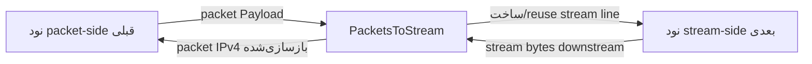

<!-- Written from version 107 of the English doc. -->

# PacketsToStream

`PacketsToStream` بخش packet-oriented یک chain را به بخش stream-oriented آن متصل می‌کند. این نود payloadهای packet را از سمت قبلی می‌گیرد، برای هر worker یک line رو به stream در سمت نود بعدی می‌سازد و بایت‌های خام هر packet IPv4 را روی همان line می‌نویسد.

پیاده‌سازی فعلی فقط از IPv4 پشتیبانی می‌کند و headerless است:

```text
IPv4 packet bytes + IPv4 packet bytes + IPv4 packet bytes + ...
```

هیچ length prefix دوبایتی وجود ندارد. مرز packetها با فیلد `total-length` در header هر packet IPv4 بازیابی می‌شود. در مستندات قدیمی ممکن است نام `PacketAsData` را ببینید، اما نام نوع فعلی نود `PacketsToStream` است.

## کار این نود

- payloadهای packet را از سمت قبلی دریافت می‌کند.
- در صورت نیاز، برای هر worker یک line معمول واتروال رو به stream می‌سازد.
- همان line را برای packetهای بعدی روی آن worker دوباره به کار می‌گیرد.
- اگر packet line درخواست کرده باشد، پیش از فرستادن packet checksum مربوط به IPv4 را دوباره محاسبه می‌کند.
- packetهای IPv4 ناسازگار یا نامعتبر را کنار می‌گذارد.
- packetهای معتبر IPv4 را بدون افزودن framing header روی stream می‌نویسد.
- بایت‌های برگشتی stream را در buffer نگه می‌دارد و با استفاده از فیلد `total-length` مرز packetهای IPv4 را بازیابی می‌کند.
- packetهای بازیابی‌شده را روی worker مالک inner flow هر packet به سمت قبلی packet برمی‌گرداند.
- ترافیک برگشتی هر inner flow را روی هر یک از stream lineهای خود می‌پذیرد.
- اگر line رو به stream بسته شود یا heartbeat در sensitive mode timeout شود، line تازه‌ای می‌سازد.

این یک adapter میان packet و stream بر پایه parsing مربوط به IPv4 است، نه یک protocol عمومی برای framing بایت‌ها.

## جایگاه رایج

packet input به stream transport:

```text
TunDevice -> PacketsToStream -> TcpConnector
```

جفت با `StreamToPackets` روی سرور دیگر:

```text
server1: TunDevice -> PacketsToStream -> TcpConnector
server2: TcpListener -> StreamToPackets -> TunDevice
```

این چیدمان کار می‌کند، چون `PacketsToStream` و `StreamToPackets` هر دو از قالب یکسانِ packetهای خام IPv4 پشت‌سرهم استفاده می‌کنند.

## نمونه تنظیم

```json
{
  "name": "packet-to-stream",
  "type": "PacketsToStream",
  "settings": {
    "sensitive-mode": true,
    "interval-ms": 50,
    "tolerance-ms": 150,
    "packet-validation-level": "hard"
  },
  "next": "stream-node"
}
```

## تنظیمات

فیلدهای سطح بالا:

| فیلد | نوع | اجباری | توضیح |
| --- | --- | --- | --- |
| `name` | string | بله | نام دلخواه نود. باید داخل فایل config یکتا باشد. |
| `type` | string | بله | باید دقیقاً `"PacketsToStream"` باشد. |
| `settings` | object | خیر | object تنظیمات اختیاری. |
| `next` | string | بله | نود stream-oriented که data line مربوط به هر worker را دریافت می‌کند. |

فیلدهای اختیاری `settings`:

| گزینه | نوع | پیش‌فرض | توضیح |
| --- | --- | --- | --- |
| `sensitive-mode` | boolean | `false` | فعال‌سازی heartbeat stream-side روی هر output line worker-local. |
| `interval-ms` | integer | `50` | فاصله ارسال heartbeat بر حسب میلی‌ثانیه. حداقل `1`. فقط وقتی `sensitive-mode` فعال است استفاده می‌شود. |
| `tolerance-ms` | integer | `150` | حداکثر زمان انتظار برای heartbeat pong قبل از ساختن مجدد stream line. حداقل `1`. |
| `packet-validation-level` | string | `"none"` | حالت اعتبارسنجی برای packetهای decode شده از data برگشتی stream. مقادیر: `"none"`، `"loose"`، `"hard"`. |

هیچ setting اختصاصی و اجباری برای این tunnel وجود ندارد.

## فرمت wire

قالب wire در سمت stream از packetهای کامل IPv4 تشکیل شده که بدون فاصله پشت سر هم قرار می‌گیرند:

```text
packet A: N bytes, where IPv4 total-length = N
packet B: M bytes, where IPv4 total-length = M
packet C: K bytes, where IPv4 total-length = K
```

`PacketsToStream` هیچ length field، message type یا metadata به ابتدای داده اضافه نمی‌کند. peer باید با خواندن header مربوط به IPv4 مرز packetها را پیدا کند.

packetهایی که روی stream فرستاده می‌شوند باید شرایط زیر را داشته باشند:

- دست‌کم به اندازه حداقل header مربوط به IPv4 طول داشته باشند
- از `kMaxAllowedPacketLength` بزرگتر نباشد
- IP version برابر `4` باشد
- IPv4 total length برابر طول buffer باشد

IPv6، payloadهای غیر IPv4، packetهای نامعتبر IPv4 و packetهایی که پس از `total-length` بایت اضافه دارند کنار گذاشته می‌شوند؛ زیرا parser سمت peer را از sync خارج می‌کنند.

## مدل جریان



خلاصه جهت:

| جهت | رفتار |
| --- | --- |
| packet side به stream side | packet IPv4 معتبر به‌صورت خام روی stream line worker-local ارسال می‌شود. |
| stream side به packet side | بایت‌های stream در buffer جمع و به packetهای IPv4 decode می‌شوند؛ سپس پس از اعتبارسنجی اختیاری، بر اساس inner tuple دوباره flow-affine می‌شوند و در جهت downstream روی packet line مربوط به worker همان flow می‌روند. |

## Stream Line Worker-Local

`PacketsToStream` state خود را روی packet line مشترک worker نگه می‌دارد. برای هر worker، هنگام رسیدن نخستین ترافیک یک line معمولی رو به stream در سمت tunnel بعدی می‌سازد.

این line رو به stream:

- روی upstream packet `Init` یا اولین upstream packet `Payload` ساخته می‌شود
- با upstream `Init` در سمت tunnel بعدی مقداردهی اولیه می‌شود
- برای packetهای بعدی روی همان worker reuse می‌شود
- اگر بسته شود یا sensitive-mode timeout trigger شود، دوباره ساخته می‌شود

خود packet line همان state مشترک worker است و با ساخته شدن دوباره line رو به stream از بین نمی‌رود.

## Decode packet در مسیر برگشت

ترافیک برگشتی از سمت stream در یک read stream جمع می‌شود. decoder سپس:

1. منتظر حداقل یک IPv4 header حداقل می‌ماند
2. بررسی می‌کند آیا ابتدای stream شبیه یک IPv4 packet معتبر است
3. فیلد IPv4 total-length را می‌خواند
4. منتظر می‌ماند تا همان تعداد بایت در buffer جمع شود
5. دقیقاً آن تعداد byte را به‌عنوان یک packet استخراج می‌کند
6. اختیاراً packet decode شده را اعتبارسنجی می‌کند
7. symmetric hash مشترک inner flow را محاسبه می‌کند
8. packet را روی `packet_line[hash % workers]` به نود packet-side قبلی می‌فرستد؛ اگر worker مقصد همین worker باشد مستقیم و در غیر این صورت با queue کردن روی worker مقصد

worker مربوط به outer stream line عمداً برای انتخاب packet line استفاده نمی‌شود.
peerای مانند `StreamToPackets` برای هر inner flow یک return carrier را از کل pool
lineهای فعال خود انتخاب می‌کند؛ بنابراین هر flow می‌تواند روی هر یک از این lineها
برسد. محاسبه دوباره affinity از inner tuple این حالت را امن می‌کند و هر دو جهت
یک flow را روی یک packet worker نگه می‌دارد. اگر hash کردن flow یک packet
decodeشده ممکن نباشد، آن packet با ثبت log کنار گذاشته می‌شود و به‌صورت
round-robin پخش نمی‌شود، زیرا مالکیت worker برای state آن قابل تعیین نیست.

فقط packetهای decodeشده دوباره flow-affine می‌شوند. parser، state مربوط به
heartbeat در sensitive mode و ساخت دوباره output line همچنان در اختیار worker
خود stream line باقی می‌مانند. در مسیر ارسال نیز این نود همچنان برای هر packet
worker یک stream output line نگه می‌دارد.

parser در برابر داده نامعتبر مقاوم است. اگر ابتدای stream شروع معتبر یک packet IPv4 نباشد، decoder در یک پنجره محدود به دنبال نقطه resync می‌گردد و بایت‌ها را تا header معتبر بعدی کنار می‌گذارد. parser همواره جلو می‌رود و از محدوده buffer خارج نمی‌شود.

حد overflow فعلی read stream:

```text
65536 * 2 bytes
```

اگر buffer از این حد بزرگتر شود، read stream خالی می‌شود.

## اعتبارسنجی packet

`packet-validation-level` روی packetهایی اعمال می‌شود که از data stream downstream decode شده‌اند، قبل از اینکه به packet side ارسال شوند.

این گزینه جای بررسی‌های همیشگیِ قابل‌ارسال بودن packet سمت ورودی را نمی‌گیرد. ورودی سمت packet همچنان باید یک IPv4 سازگار باشد تا peer بتواند آن را بخواند.

| سطح | رفتار |
| --- | --- |
| `"none"` | پیش‌فرض. هیچ اعتبارسنجی configurable بعد از استخراج ندارد. extractor هنوز بررسی‌های structural سبک انجام می‌دهد تا بتواند مرز packetها را پیدا کند. |
| `"loose"` | packetهای غیر IPv4 و packetهای نامعتبر IPv4 را کنار می‌گذارد. حداقل اندازه header، version، طول header مربوط به IPv4 و برابری total length با طول packet را بررسی می‌کند. |
| `"hard"` | `loose` را اعمال می‌کند، IPv4 header checksum را verify می‌کند، و checksumهای TCP، UDP و ICMP را برای packetهای non-fragmented verify می‌کند. IPv4 UDP checksum برابر `0` پذیرفته می‌شود. |

برای packetهای fragment‌شده IPv4 در حالت `"hard"`، فقط checksum مربوط به header در IPv4 بررسی می‌شود. بررسی checksum در لایه transport به reassembly نیاز دارد و انجام نمی‌شود.

وقتی یک packet decodeشده در اعتبارسنجی رد شود، tunnel سطح اعتبارسنجی و دلیل را به‌صورت warning در log می‌نویسد.

## Sensitive Mode

Sensitive mode سلامت stream line را بررسی می‌کند. چون قالب wire، control frame جداگانه‌ای ندارد، این قابلیت با packetهای heartbeat معتبر IPv4 پیاده‌سازی شده است.

وقتی فعال است:

- هر worker یک heartbeat timer می‌گیرد
- هر `interval-ms`، `PacketsToStream` یک heartbeat ping روی stream-facing line فعال می‌فرستد
- ping یک packet IPv4 حداقلی با protocol `0xFD` و payload پنج‌بایتی پر از `0xFF` است
- `StreamToPackets` سمت peer آن packet را به‌عنوان ping در نظر می‌گیرد و یک heartbeat pong متناظر برمی‌گرداند
- pong یک packet IPv4 حداقلی با protocol `0xFD` و payload پنج‌بایتی پر از `0xDD` است
- ping و pong به packet side ارسال نمی‌شوند
- اگر تا پایان `tolerance-ms` هیچ pong نرسد، stream-facing line فعلی به‌صورت local بسته و سپس دوباره ساخته می‌شود

در هر لحظه برای هر worker فقط یک ping منتظر پاسخ است. رسیدن pong پس از زمان tolerance نیز باعث reset شدن line می‌شود.

## Pause، Resume و Finish

رفتار callback:

| callback دریافت‌شده توسط `PacketsToStream` | رفتار |
| --- | --- |
| upstream `Init` | اطمینان از وجود stream-facing line worker-local. |
| upstream `Payload` | در صورت درخواست checksum را محاسبه می‌کند، IPv4 forwardability را بررسی می‌کند، packet خام را به stream line می‌فرستد. |
| upstream `Est` | warning log؛ انتظار نمی‌رود. |
| upstream `Pause` / `Resume` | warning log؛ از packet side انتظار نمی‌رود. |
| upstream `Finish` | fatal guard؛ finish سمت packet انتظار نمی‌رود. |
| downstream `Payload` | bytes stream را به packetهای IPv4 decode می‌کند و به سمت قبلی می‌فرستد. |
| downstream `Est` | `Est` را به packet side قبلی propagate می‌کند اگر متعلق به stream line فعال باشد. |
| downstream `Pause` | packet side را paused علامت می‌زند و downstream `Pause` را به packet side قبلی propagate می‌کند. |
| downstream `Resume` | حالت paused را پاک می‌کند و downstream `Resume` را به packet side قبلی propagate می‌کند. |
| downstream `Finish` | stream-facing line فعال را destroy/recreate می‌کند؛ packet line زنده می‌ماند. |
| downstream `Init` | fatal guard؛ path callback معتبری نیست. |

اگر stream line در حالت pause باشد و نود قبلی سمت packet به backpressure توجه نکند، payload ورودی به‌جای صف شدن کنار گذاشته می‌شود.

## محاسبه مجدد Checksum

اگر `line->recalculate_checksum` روی packet line تنظیم باشد و payload یک IPv4 باشد، `PacketsToStream` checksum کامل packet IPv4 را قبل از نوشتن روی stream دوباره محاسبه می‌کند، سپس flag را پاک می‌کند.

این رفتار برای نودهای دست‌کاری packet مهم است که عمداً packet را برای ترمیم checksum علامت‌گذاری می‌کنند.

## متادیتای نود

| ویژگی | مقدار |
| --- | --- |
| node flags | `kNodeFlagNone` |
| `can_have_prev` | `true` |
| `can_have_next` | `true` |
| `layer_group` | لایه 3 و لایه 4 (`kNodeLayer3`، `kNodeLayer4`) |
| `layer_group_prev_node` | `kNodeLayerAnything` |
| `layer_group_next_node` | `kNodeLayerAnything` |
| `required_padding_left` | `0` |

tunnel هیچ بایتی به ابتدای payload اضافه نمی‌کند؛ بنابراین به left padding اضافی نیاز ندارد.

## نکته‌های عملی

- آن را با `StreamToPackets` در سمت دیگر جفت کنید.
- با framing قدیمی 2-byte-prefix جفت نکنید مگر اینکه peer به فرمت فعلی IPv4-total-length بروز شده باشد.
- وقتی می‌خواهید lwIP flowهای TCP/UDP را به‌عنوان lineهای عادی WaterWall بازسازی کند، از `PacketsToConnection` استفاده کنید نه از این نود.
- از `packet-validation-level: "hard"` وقتی می‌خواهید تشخیص corruption قوی‌تری روی stream برگشتی داشته باشید، با هزینه checksum work استفاده کنید.
- parser می‌تواند پس از داده نامعتبر دوباره sync شود، اما یک stream مخرب ممکن است داده‌هایی تولید کند که تا زمان realignment از نظر ساختاری packet معتبر به نظر برسند.
