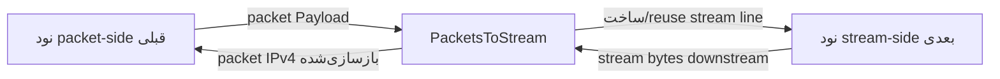

# PacketsToStream

`PacketsToStream` سمت packet-oriented یک chain را به سمت stream-oriented آن تطبیق می‌دهد. این نود payload packetها را از سمت قبلی می‌گیرد، یک line stream-facing worker-local به سمت نود بعدی می‌سازد، و هر packet IPv4 را به عنوان byte خام روی آن stream line می‌نویسد.

پیاده‌سازی فعلی فقط از IPv4 پشتیبانی می‌کند و headerless است:

```text
IPv4 packet bytes + IPv4 packet bytes + IPv4 packet bytes + ...
```

هیچ length prefix دو بایتی وجود ندارد. مرز packetها از فیلد IPv4 `total-length` هر packet بازسازی می‌شود. مستندات قدیمی ممکن است این نود را `PacketAsData` بنامند، اما نوع فعلی نود `PacketsToStream` است.

## کار این نود

- payload packet از سمت قبلی می‌گیرد.
- به ازای هر worker یک line stream-facing عادی WaterWall در صورت نیاز می‌سازد.
- آن line stream-facing را برای packetهای بعدی روی همان worker reuse می‌کند.
- اگر packet line آن را درخواست کند، checksum IPv4 را قبل از forward کردن دوباره محاسبه می‌کند.
- packetهایی که IPv4 self-consistent نیستند را drop می‌کند.
- packetهای IPv4 معتبر را بدون اضافه کردن framing header روی stream می‌نویسد.
- bytes برگشتی stream را buffer می‌کند و packetهای IPv4 را از فیلد total-length بازسازی می‌کند.
- packetهای برگشت بازسازی‌شده را به packet side قبلی می‌فرستد.
- اگر line stream-facing بسته شود یا heartbeat sensitive-mode timeout شود، line را دوباره می‌سازد.

این یک packet-to-stream adapter مبتنی بر IPv4 parsing است، نه یک generic byte framing protocol.

## جایگاه رایج

packet input به stream transport:

```text
TunDevice -> PacketsToStream -> TcpConnector
```

جفت با `StreamToPackets` روی سرور دیگر:

```text
server1: TunDevice -> PacketsToStream -> TcpConnector
server2: TcpListener -> StreamToPackets -> TunDevice
```

این کار می‌کند چون `PacketsToStream` و `StreamToPackets` از همان فرمت raw IPv4 concatenation استفاده می‌کنند.

## نمونه تنظیم

```json
{
  "name": "packet-to-stream",
  "type": "PacketsToStream",
  "settings": {
    "sensitive-mode": true,
    "interval-ms": 50,
    "tolerance-ms": 150,
    "packet-validation-level": "hard"
  },
  "next": "stream-node"
}
```

## تنظیمات

فیلدهای سطح بالا:

| فیلد | نوع | اجباری | توضیح |
| --- | --- | --- | --- |
| `name` | string | بله | نام دلخواه نود. باید داخل فایل config یکتا باشد. |
| `type` | string | بله | باید دقیقاً `"PacketsToStream"` باشد. |
| `settings` | object | خیر | object تنظیمات اختیاری. |
| `next` | string | بله | نود stream-oriented که data line worker-local را دریافت می‌کند. |

فیلدهای اختیاری `settings`:

| گزینه | نوع | پیش‌فرض | توضیح |
| --- | --- | --- | --- |
| `sensitive-mode` | boolean | `false` | فعال‌سازی heartbeat stream-side روی هر output line worker-local. |
| `interval-ms` | integer | `50` | فاصله ارسال heartbeat بر حسب میلی‌ثانیه. حداقل `1`. فقط وقتی `sensitive-mode` فعال است استفاده می‌شود. |
| `tolerance-ms` | integer | `150` | حداکثر زمان انتظار برای heartbeat pong قبل از ساختن مجدد stream line. حداقل `1`. |
| `packet-validation-level` | string | `"none"` | حالت اعتبارسنجی برای packetهای decode شده از data برگشتی stream. مقادیر: `"none"`، `"loose"`، `"hard"`. |

هیچ setting اجباری tunnel-specific وجود ندارد.

## فرمت wire

فرمت wire سمت stream یک concatenation خام از packetهای IPv4 کامل است:

```text
packet A: N bytes, where IPv4 total-length = N
packet B: M bytes, where IPv4 total-length = M
packet C: K bytes, where IPv4 total-length = K
```

`PacketsToStream` هیچ length field، message type یا metadata prepend نمی‌کند. peer باید مرز packetها را با خواندن IPv4 header بازسازی کند.

packetهای forward شده باید شرایط زیر را داشته باشند:

- طول حداقل یک IPv4 header حداقل داشته باشد
- از `kMaxAllowedPacketLength` بزرگتر نباشد
- IP version برابر `4` باشد
- IPv4 total length برابر طول buffer باشد

IPv6، payload غیر IPv4، packetهای IPv4 malformed، و packetهای IPv4 با bytes اضافی بعد از total-length drop می‌شوند چون stream parser سمت peer را از sync خارج می‌کنند.

## مدل جریان



خلاصه جهت:

| جهت | رفتار |
| --- | --- |
| packet side به stream side | packet IPv4 معتبر به صورت خام روی stream line worker-local ارسال می‌شود. |
| stream side به packet side | bytes stream buffer می‌شوند، به packetهای IPv4 decode می‌شوند، اختیاراً اعتبارسنجی می‌شوند، سپس downstream به packet side ارسال می‌شوند. |

## Stream Line Worker-Local

`PacketsToStream` state خودش را روی packet line مشترک worker نگه می‌دارد. برای هر worker، وقتی ترافیک اول نیاز پیدا کرد، یک line معمولی stream-facing به سمت tunnel بعدی می‌سازد.

line stream-facing:

- روی upstream packet `Init` یا اولین upstream packet `Payload` ساخته می‌شود
- با upstream `Init` به سمت tunnel بعدی initialize می‌شود
- برای packetهای بعدی روی همان worker reuse می‌شود
- اگر بسته شود یا sensitive-mode timeout trigger شود، دوباره ساخته می‌شود

packet line خودش state مشترک worker است. وقتی line stream-facing دوباره ساخته می‌شود، packet line destroy نمی‌شود.

## Decode packet در مسیر برگشت

ترافیک برگشتی از stream side در یک read stream buffer می‌شود. decoder:

1. منتظر حداقل یک IPv4 header حداقل می‌ماند
2. بررسی می‌کند آیا ابتدای stream شبیه یک IPv4 packet معتبر است
3. فیلد IPv4 total-length را می‌خواند
4. منتظر می‌ماند تا آن تعداد byte buffer شود
5. دقیقاً آن تعداد byte را به عنوان یک packet استخراج می‌کند
6. اختیاراً packet decode شده را اعتبارسنجی می‌کند
7. آن را به نود packet-side قبلی می‌فرستد

parser در برابر garbage مقاوم است. اگر ابتدای stream نتواند شروع valid یک IPv4 باشد، decoder یک پنجره resync محدود اسکن می‌کند و bytes را تا header IPv4 معتبر بعدی دور می‌اندازد. همیشه پیشرفت می‌کند و از bounds خارج نمی‌شود.

حد overflow فعلی read stream:

```text
65536 * 2 bytes
```

اگر buffer از این حد بزرگتر شود، read stream خالی می‌شود.

## اعتبارسنجی packet

`packet-validation-level` روی packetهایی اعمال می‌شود که از data stream downstream decode شده‌اند، قبل از اینکه به packet side ارسال شوند.

جایگزین بررسی‌های forwardability unconditional که قبل از نوشتن packet-side input روی stream انجام می‌شود نیست. packet-side input هنوز باید IPv4 self-consistent باشد تا peer بتواند آن را parse کند.

| سطح | رفتار |
| --- | --- |
| `"none"` | پیش‌فرض. هیچ اعتبارسنجی configurable بعد از استخراج ندارد. extractor هنوز بررسی‌های structural سبک انجام می‌دهد تا بتواند مرز packetها را پیدا کند. |
| `"loose"` | packetهای non-IPv4 و IPv4 malformed را drop می‌کند. minimum header، version، IPv4 header length و تطابق total length با packet length را بررسی می‌کند. |
| `"hard"` | `loose` را اعمال می‌کند، IPv4 header checksum را verify می‌کند، و checksumهای TCP، UDP و ICMP را برای packetهای non-fragmented verify می‌کند. IPv4 UDP checksum برابر `0` پذیرفته می‌شود. |

برای packetهای IPv4 fragmented در حالت `"hard"`، فقط IPv4 header checksum verify می‌شود. transport checksumها نیاز به reassembly دارند و skip می‌شوند.

وقتی اعتبارسنجی یک packet decode شده را drop می‌کند، tunnel یک warning log با سطح اعتبارسنجی و دلیل می‌نویسد.

## Sensitive Mode

Sensitive mode یک health check برای stream line است. با استفاده از packetهای heartbeat IPv4 معتبر پیاده‌سازی می‌شود چون فرمت wire هیچ control frame جداگانه‌ای ندارد.

وقتی فعال است:

- هر worker یک heartbeat timer می‌گیرد
- هر `interval-ms`، `PacketsToStream` یک heartbeat ping روی stream-facing line فعال می‌فرستد
- ping یک packet IPv4 حداقلی با protocol `0xFD` و payload پنج‌بایتی پر از `0xFF` است
- `StreamToPackets` سمت peer آن packet را به عنوان ping در نظر می‌گیرد و یک heartbeat pong متناظر برمی‌گرداند
- pong یک packet IPv4 حداقلی با protocol `0xFD` و payload پنج‌بایتی پر از `0xDD` است
- ping و pong به packet side ارسال نمی‌شوند
- اگر قبل از `tolerance-ms` هیچ pong نرسد، stream-facing line فعلی به صورت local finish می‌شود و دوباره ساخته می‌شود

فقط یک ping به ازای هر worker در حال پرواز است. یک pong دیرهنگام بعد از tolerance هم باعث reset line می‌شود.

## Pause، Resume و Finish

رفتار callback:

| callback دریافت‌شده توسط `PacketsToStream` | رفتار |
| --- | --- |
| upstream `Init` | اطمینان از وجود stream-facing line worker-local. |
| upstream `Payload` | در صورت درخواست checksum را محاسبه می‌کند، IPv4 forwardability را بررسی می‌کند، packet خام را به stream line می‌فرستد. |
| upstream `Est` | warning log؛ انتظار نمی‌رود. |
| upstream `Pause` / `Resume` | warning log؛ از packet side انتظار نمی‌رود. |
| upstream `Finish` | fatal guard؛ finish سمت packet انتظار نمی‌رود. |
| downstream `Payload` | bytes stream را به packetهای IPv4 decode می‌کند و به سمت قبلی می‌فرستد. |
| downstream `Est` | `Est` را به packet side قبلی propagate می‌کند اگر متعلق به stream line فعال باشد. |
| downstream `Pause` | packet side را paused علامت می‌زند و downstream `Pause` را به packet side قبلی propagate می‌کند. |
| downstream `Resume` | حالت paused را پاک می‌کند و downstream `Resume` را به packet side قبلی propagate می‌کند. |
| downstream `Finish` | stream-facing line فعال را destroy/recreate می‌کند؛ packet line زنده می‌ماند. |
| downstream `Init` | fatal guard؛ path callback معتبری نیست. |

اگر stream line pause باشد و نود packet-side قبلی backpressure را نادیده بگیرد، payload packet ورودی به جای queue شدن drop می‌شود.

## محاسبه مجدد Checksum

اگر `line->recalculate_checksum` روی packet line تنظیم باشد و payload یک IPv4 باشد، `PacketsToStream` checksum کامل packet IPv4 را قبل از نوشتن روی stream دوباره محاسبه می‌کند، سپس flag را پاک می‌کند.

این برای نودهای packet-manipulation که عمداً packetها را برای checksum repair علامت‌گذاری می‌کنند مهم است.

## متادیتای نود

| ویژگی | مقدار |
| --- | --- |
| node flags | `kNodeFlagNone` |
| `can_have_prev` | `true` |
| `can_have_next` | `true` |
| `layer_group` | لایه 3 و لایه 4 (`kNodeLayer3`، `kNodeLayer4`) |
| `layer_group_prev_node` | `kNodeLayerAnything` |
| `layer_group_next_node` | `kNodeLayerAnything` |
| `required_padding_left` | `0` |

tunnel هیچ byte prepend نمی‌کند، پس نیاز به left-padding اضافه ندارد.

## نکته‌های عملی

- آن را با `StreamToPackets` در سمت دیگر جفت کنید.
- با framing قدیمی 2-byte-prefix جفت نکنید مگر اینکه peer به فرمت فعلی IPv4-total-length بروز شده باشد.
- وقتی می‌خواهید lwIP flowهای TCP/UDP را به عنوان lineهای عادی WaterWall بازسازی کند، از `PacketsToConnection` استفاده کنید نه از این نود.
- از `packet-validation-level: "hard"` وقتی می‌خواهید تشخیص corruption قوی‌تری روی stream برگشتی داشته باشید، با هزینه checksum work استفاده کنید.
- stream parser می‌تواند از garbage ریکاور کند، اما یک stream خصمانه هنوز ممکن است packetهای garbage تولید کند که از نظر ساختاری معتبر به نظر برسند تا realignment اتفاق بیفتد.
