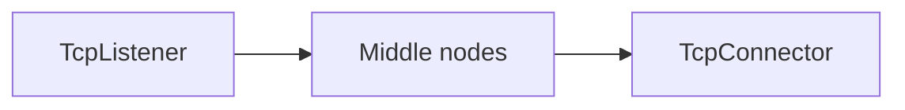
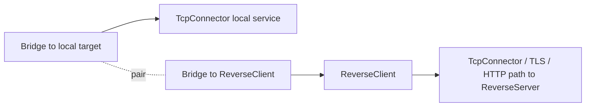
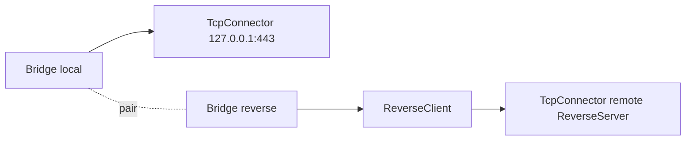

<!-- Written from version 106 of the English doc. -->

# ReverseClient

`ReverseClient` سمت client در reverse tunnel است. این نود تعدادی connection
ازپیش‌بازشده و آماده به سمت `ReverseServer` نگه می‌دارد. هر زمان سمت server به
یک مسیر واقعی نیاز داشته باشد، یکی از این connectionها از pool خارج و به یک
line در سمت local متصل می‌شود.

این نود معمولاً روی ماشینی قرار می‌گیرد که امکان برقراری اتصال outbound دارد،
اما نمی‌تواند اتصال مستقیم inbound بپذیرد.

## چرا معمولاً Bridge لازم است

در بیشتر زنجیره‌های WaterWall مسیر ساده چپ به راست است:



اما `ReverseClient` شکل متفاوتی دارد. از یک طرف باید connectionهای آماده به
سمت peer یعنی `ReverseServer` بسازد. از طرف دیگر، وقتی یکی از آن connectionها
فعال شد، باید آن را به مقصد local مثل xray-core یا یک سرویس TCP محلی وصل کند.

چون در مدل واتروال هر نود فقط یک `next` دارد، به‌جای اضافه کردن فیلدهای
خاصی مثل `next-peer` و `next-core`، از یک جفت `Bridge` استفاده می‌شود:



در این ساختار:

- `ReverseClient.next` مسیر peer است که در نهایت به `ReverseServer` می‌رسد.
- مسیر مقصد local از سمت قبلی `ReverseClient` و با جفت `Bridge` متصل می‌شود.
- با فعال شدن reverse link، `ReverseClient` سمت local را برای نود قبلی مقداردهی اولیه می‌کند.

برای طراحی reverse topology، صفحه `Bridge` را هم بخوانید.

## این نود چه می‌کند؟

- reverse linkهای outbound را از سمت `next` ایجاد می‌کند.
- روی هر reverse link یک handshake داخلی می‌فرستد.
- برای هر worker تعداد مشخصی connection آماده و استفاده‌نشده نگه می‌دارد.
- connectionهای در حال connect و connectionهای آماده را جداگانه می‌شمارد.
- وقتی سمت remote روی یکی از reverse linkها payload واقعی بفرستد، آن link را از pool خارج و جفت می‌کند.
- با مصرف شدن یک link آماده، line جفت‌شده رو به local را برای نود قبلی مقداردهی اولیه می‌کند.
- payload، finish، pause و resume را بین دو سمت paired عبور می‌دهد.
- بعد از مصرف یا بسته شدن connection، ظرفیت آماده را دوباره پر می‌کند.
- connection آماده‌ای را که حدود ۳۰ ثانیه بدون استفاده بماند می‌بندد و جایگزین می‌کند.

`ReverseClient` نه listener معمولی است و نه connector معمولی. lineهای داخلی را خودش می‌سازد و با callbackهای عادی next/previous در واتروال، مسیر peer را به مسیر local متصل می‌کند.

## جایگاه رایج

```text
Bridge(local target side) <-> Bridge(to ReverseClient) -> ReverseClient -> outbound peer path
```

نمونه ساده:



مسیر outbound peer می‌تواند TCP ساده باشد یا شامل TLS، HTTP، Reality، Mux یا سایر transport nodeها باشد، تا زمانی که در نهایت به `ReverseServer` متناظر برسد.

## نمونه تنظیم

```json
{
  "name": "reverse-client",
  "type": "ReverseClient",
  "settings": {
    "minimum-unused": 16,
    "reverse-secret-length": 640,
    "reverse-secret": "shared-secret"
  },
  "next": "outbound-to-reverse-server"
}
```

نمونه کامل با Bridge:

```json
{
  "name": "outbound_to_core",
  "type": "TcpConnector",
  "settings": {
    "address": "127.0.0.1",
    "port": 443,
    "nodelay": true
  }
}
```

```json
{
  "name": "bridge_local",
  "type": "Bridge",
  "settings": {
    "pair": "bridge_reverse"
  },
  "next": "outbound_to_core"
}
```

```json
{
  "name": "bridge_reverse",
  "type": "Bridge",
  "settings": {
    "pair": "bridge_local"
  },
  "next": "reverse_client"
}
```

```json
{
  "name": "reverse_client",
  "type": "ReverseClient",
  "settings": {
    "minimum-unused": 4
  },
  "next": "outbound_to_peer"
}
```

```json
{
  "name": "outbound_to_peer",
  "type": "TcpConnector",
  "settings": {
    "address": "203.0.113.10",
    "port": 443,
    "nodelay": true
  }
}
```

## فیلدهای اجباری

فیلدهای top-level:

| فیلد | نوع | توضیح |
| --- | --- | --- |
| `name` | string | نام یکتای نود داخل config. |
| `type` | string | باید دقیقاً `"ReverseClient"` باشد. |
| `next` | string | اجباری در configهای عملی. مسیر outbound peer به سمت `ReverseServer`. |

`settings` می‌تواند حذف شود یا خالی باشد. اگر موجود باشد، باید object باشد.

## تنظیمات اختیاری

| گزینه | نوع | پیش‌فرض | توضیح |
| --- | --- | --- | --- |
| `minimum-unused` | integer | `workers * 4` | حداقل تعداد reverse link آماده برای هر tunnel. باید بزرگ‌تر از `0` باشد. |
| `reverse-secret-length` | integer | `640` | طول handshake داخلی. باید در بازه `1..1024` باشد. |
| `reverse-secret` | ASCII string | unset | byteهای handshake پیش‌فرض را با این secret به‌صورت تکرارشونده XOR می‌کند. وقتی تنظیم شود باید ASCII غیرخالی باشد. |

`ReverseClient`، `ReverseServer` و هر `SniffRouter` که reverse link را تشخیص می‌دهد باید مقدارهای یکسانی برای `reverse-secret-length` و `reverse-secret` داشته باشند.

در مستندات قدیمی آمده بود که تغییر handshake به ویرایش source نیاز دارد. در نسخه فعلی این دو گزینه مستقیماً از config قابل تنظیم‌اند.

## Handshake داخلی

به‌صورت پیش‌فرض هر reverse link با این payload شروع می‌شود:

```text
640 bytes of 0xFF
```

اگر `reverse-secret` تنظیم شده باشد، هر byte پیش‌فرض با byte متناظر از secret به شکل تکرارشونده XOR می‌شود.

این handshake بخشی از داده کاربر نیست؛ تنها به `ReverseServer` کمک می‌کند reverse linkهای آماده را از connectionهای local/user تشخیص دهد.

## رفتار Startup و Pool

هنگام startup، `ReverseClient` روی همه workerها reverse linkهای outbound می‌سازد تا تعداد connectionهای آماده به مقدار هدف برسد.

برای هر worker:

- reverse linkهای در حال connect
- reverse linkهای establish‌شده ولی هنوز استفاده‌نشده

را جداگانه دنبال می‌کند.

اگر مجموع این دو از `minimum-unused` کمتر باشد، نود ساخت reverse connectionهای بیشتری را روی آن worker زمان‌بندی می‌کند.

وقتی سمت `next` برقراری downstream یک reverse link را اعلام کند، آن link به pool آماده اضافه می‌شود.

## جریان فعال‌سازی

reverse link آماده بلافاصله در اختیار مقصد local قرار نمی‌گیرد. تنها وقتی سمت remote نخستین payload واقعی را در جهت downstream روی آن بفرستد فعال می‌شود:

1. link از pool آماده خارج می‌شود.
2. idle timeout آن حذف می‌شود.
3. شمارنده active افزایش پیدا می‌کند.
4. ساخت یک reverse link جایگزین زمان‌بندی می‌شود.
5. line سمت local برای previous node مقداردهی اولیه می‌شود.
6. payload نخست به سمت local فرستاده می‌شود.

بعد از pair شدن:

| مسیر | جریان |
| --- | --- |
| local به remote | previous node -> `ReverseClient` -> next node |
| remote به local | next node -> `ReverseClient` -> previous node |

پس از جفت شدن دو سمت، callbackهای Pause و Resume میان آن‌ها عبور داده می‌شوند.

## رفتار Finish و جایگزینی

اگر یک paired link از هر سمت بسته شود:

- هر دو line state داخلی از بین می‌روند
- سمت peer با `Finish` بسته می‌شود
- lineهای داخلی را `ReverseClient` از بین می‌برد، چون خودش آن‌ها را ساخته است
- شمارنده active کاهش می‌یابد
- ساخت یک reverse link جایگزین زمان‌بندی می‌شود

اگر یک reverse link آماده قبل از pair شدن بسته شود:

- شمارنده‌های connectionهای در حال اتصال یا استفاده‌نشده به‌روز می‌شوند
- idle-table entry آن حذف می‌شود
- هر دو line داخلی از بین می‌روند
- ساخت یک جایگزین زمان‌بندی می‌شود

اگر یک link آماده حدود ۳۰ ثانیه (`30 seconds`) استفاده نشده باشد، idle timeout آن را می‌بندد و جایگزین می‌کند.

## جهت‌ها و Lifecycle

`ReverseClient` lineهای داخلی خودش را می‌سازد. upstream یا downstream init مستقیم از خارج بخشی از مسیر عادی این نود نیست.

| Callback | رفتار |
| --- | --- |
| upstream `Init` | غیرفعال؛ به‌عنوان misuse fatal در نظر گرفته می‌شود. |
| downstream `Init` | غیرفعال؛ به‌عنوان misuse fatal در نظر گرفته می‌شود. |
| downstream `Est` از سمت next | یک reverse link outbound را establish علامت می‌زند و به pool آماده اضافه می‌کند. |
| downstream `Payload` از سمت next | یک reverse link آماده را فعال می‌کند یا payload را به line جفت‌شده سمت previous می‌فرستد. |
| upstream `Payload` از سمت previous | payload سمت local را به reverse link outbound جفت‌شده می‌فرستد. |
| `Finish` | هر دو line داخلی را برای paired linkها می‌بندد؛ counters را پاک و ظرفیت را جایگزین می‌کند. |

## متادیتای نود

Metadata برگرفته از source:

| ویژگی | مقدار |
| --- | --- |
| node flags | `kNodeFlagNone` |
| `can_have_prev` | `true` |
| `can_have_next` | `true` |
| `layer_group` | `kNodeLayerAnything` |
| `layer_group_prev_node` | `kNodeLayerAnything` |
| `layer_group_next_node` | `kNodeLayerAnything` |
| `required_padding_left` | `0` bytes |

`ReverseClient` بعد از handshake، payload framing اضافه‌ای انجام نمی‌دهد، پس به left padding نیاز ندارد.

## نکته‌های عملی

- `minimum-unused` میان latency و ظرفیت تعادل ایجاد می‌کند. مقدار بیشتر، connectionهای outbound آماده بیشتری نگه می‌دارد.
- connectionهای از قبل باز شده عمداً idle هستند. آن‌ها را به‌عنوان connection leak در نظر نگیرید.
- تنظیمات reverse secret را در هر دو peer یکسان نگه دارید.
- برای متصل کردن مرتب سمت مقصد local از `Bridge` استفاده کنید.
- مسیر outbound peer می‌تواند شامل transport/security nodeهای دیگر باشد، اما باید byte-stream connectivity به `ReverseServer` متناظر را حفظ کند.
