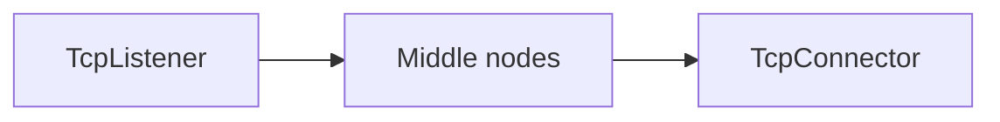
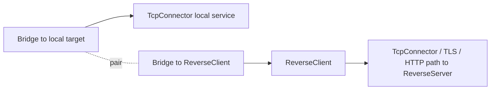
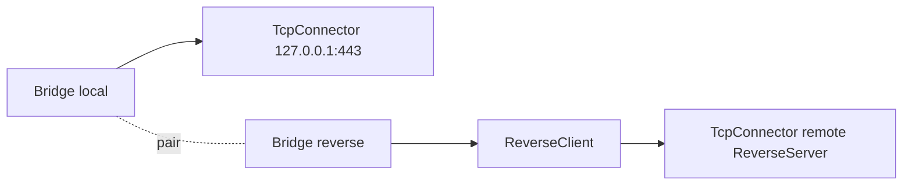

# ReverseClient

`ReverseClient` سمت client در reverse tunnel است. این نود تعدادی connection
آماده و از قبل بازشده به سمت `ReverseServer` نگه می‌دارد. وقتی سمت server به
یک مسیر واقعی نیاز پیدا کند، یکی از این connectionهای آماده مصرف می‌شود و به
یک line سمت local وصل می‌گردد.

این نود معمولاً روی ماشینی استفاده می‌شود که می‌تواند outbound بزند، اما
نمی‌تواند inbound مستقیم قبول کند.

## چرا معمولاً Bridge لازم است

در بیشتر زنجیره‌های WaterWall مسیر ساده چپ به راست است:



اما `ReverseClient` شکل متفاوتی دارد. از یک طرف باید connectionهای آماده به
سمت peer یعنی `ReverseServer` بسازد. از طرف دیگر، وقتی یکی از آن connectionها
فعال شد، باید آن را به مقصد local مثل xray-core یا یک سرویس TCP محلی وصل کند.

چون مدل WaterWall برای هر node فقط یک `next` دارد، به جای اضافه کردن فیلدهای
خاصی مثل `next-peer` و `next-core`، از یک جفت `Bridge` استفاده می‌شود:



در این ساختار:

- `next` خود `ReverseClient` مسیر peer است که در نهایت به `ReverseServer`
  می‌رسد.
- مسیر مقصد local از پشت `ReverseClient` و با Bridge pair وصل می‌شود.
- وقتی reverse link فعال شود، `ReverseClient` سمت local را به previous node
  initialize می‌کند.

برای طراحی reverse topology، صفحه `Bridge` را هم بخوانید.

## عملکرد

- outbound reverse linkها را از سمت `next` ایجاد می‌کند.
- روی هر reverse link یک handshake داخلی می‌فرستد.
- برای هر worker تعداد مشخصی connection آماده و استفاده‌نشده نگه می‌دارد.
- connectionهای در حال connect و connectionهای آماده را جداگانه می‌شمارد.
- وقتی remote side روی یکی از reverse linkها payload واقعی بفرستد، آن link را
  مصرف و paired می‌کند.
- payload، finish، pause و resume را بین دو سمت paired عبور می‌دهد.
- بعد از مصرف یا بسته شدن connection، ظرفیت آماده را دوباره پر می‌کند.
- connection آماده‌ای را که حدود ۳۰ ثانیه استفاده نشود می‌بندد و جایگزین
  می‌کند.

## نمونه تنظیم

```json
{
  "name": "reverse-client",
  "type": "ReverseClient",
  "settings": {
    "minimum-unused": 16,
    "reverse-secret-length": 640,
    "reverse-secret": "shared-secret"
  },
  "next": "outbound-to-reverse-server"
}
```

نمونه ساده با Bridge:



## تنظیمات

| گزینه | نوع | پیش‌فرض | توضیح |
| --- | --- | --- | --- |
| `minimum-unused` | integer | `workers * 4` | حداقل تعداد reverse link آماده. باید بزرگ‌تر از `0` باشد. |
| `reverse-secret-length` | integer | `640` | طول handshake داخلی. باید در بازه `1..1024` باشد. |
| `reverse-secret` | ASCII string | unset | byteهای handshake پیش‌فرض را با این secret به صورت تکرارشونده XOR می‌کند. |

`ReverseClient`، `ReverseServer` و هر `SniffRouter` که reverse link را تشخیص
می‌دهد باید مقدارهای یکسانی برای `reverse-secret-length` و `reverse-secret`
داشته باشند.

در مستندات قدیمی نوشته شده بود برای تغییر handshake باید سورس را تغییر داد.
در نسخه فعلی این موضوع دیگر درست نیست و دو گزینه بالا از داخل config قابل
تنظیم هستند.

## Handshake داخلی

به صورت پیش‌فرض هر reverse link با این payload شروع می‌شود:

```text
640 bytes of 0xFF
```

اگر `reverse-secret` تنظیم شده باشد، هر byte پیش‌فرض با byte متناظر از secret
به شکل تکرارشونده XOR می‌شود.

این handshake داده کاربر نیست؛ فقط برای این است که `ReverseServer` بتواند
reverse linkهای آماده را از connectionهای سمت local/user تشخیص دهد.

## فعال شدن یک connection آماده

وقتی اولین payload واقعی از سمت remote روی یک reverse link آماده برسد:

1. آن link از pool آماده خارج می‌شود.
2. idle timeout آن حذف می‌شود.
3. شمارنده active افزایش پیدا می‌کند.
4. یک reverse link جایگزین schedule می‌شود.
5. line سمت local به سمت previous node initialize می‌شود.
6. payload اول به سمت local forward می‌شود.

بعد از pair شدن:

| مسیر | جریان |
| --- | --- |
| local به remote | previous node -> `ReverseClient` -> next node |
| remote به local | next node -> `ReverseClient` -> previous node |

## نکته‌های lifecycle

- `ReverseClient` lineهای داخلی خودش را می‌سازد و خودش هم destroy می‌کند.
- upstream/downstream init مستقیم به این نود بخشی از مسیر عادی نیست و در سورس
  fatal در نظر گرفته شده است.
- اگر connection فعال بسته شود، هر دو line داخلی بسته می‌شوند و ظرفیت آماده
  دوباره پر می‌شود.
- اگر connection آماده قبل از pair شدن بسته شود، فقط counters و idle handle آن
  پاک می‌شود و جایگزین ساخته می‌شود.
- `required_padding_left = 0` است؛ بعد از handshake، payload framing اضافه‌ای
  انجام نمی‌شود.
