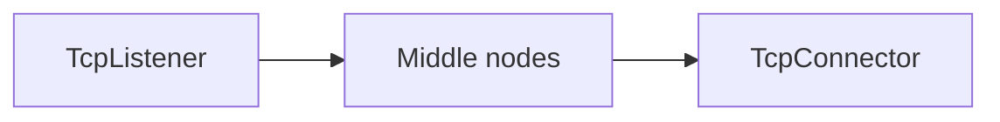
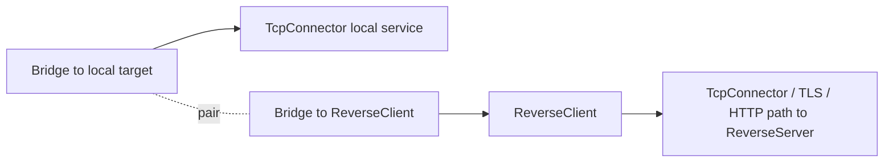
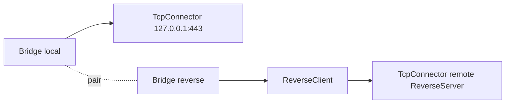

<!-- Written from version 106 of the English doc. -->

# ReverseClient

`ReverseClient` سمت client در reverse tunnel است. این نود تعدادی connection
آماده و از قبل بازشده به سمت `ReverseServer` نگه می‌دارد. وقتی سمت server به
یک مسیر واقعی نیاز پیدا کند، یکی از این connectionهای آماده مصرف می‌شود و به
یک line سمت local وصل می‌گردد.

این نود معمولاً روی ماشینی استفاده می‌شود که می‌تواند outbound بزند، اما
نمی‌تواند inbound مستقیم قبول کند.

## چرا معمولاً Bridge لازم است

در بیشتر زنجیره‌های WaterWall مسیر ساده چپ به راست است:



اما `ReverseClient` شکل متفاوتی دارد. از یک طرف باید connectionهای آماده به
سمت peer یعنی `ReverseServer` بسازد. از طرف دیگر، وقتی یکی از آن connectionها
فعال شد، باید آن را به مقصد local مثل xray-core یا یک سرویس TCP محلی وصل کند.

چون مدل WaterWall برای هر node فقط یک `next` دارد، به جای اضافه کردن فیلدهای
خاصی مثل `next-peer` و `next-core`، از یک جفت `Bridge` استفاده می‌شود:



در این ساختار:

- `next` خود `ReverseClient` مسیر peer است که در نهایت به `ReverseServer` می‌رسد.
- مسیر مقصد local از پشت `ReverseClient` و با Bridge pair وصل می‌شود.
- وقتی reverse link فعال شود، `ReverseClient` سمت local را به previous node initialize می‌کند.

برای طراحی reverse topology، صفحه `Bridge` را هم بخوانید.

## این نود چه می‌کند؟

- outbound reverse linkها را از سمت `next` ایجاد می‌کند.
- روی هر reverse link یک handshake داخلی می‌فرستد.
- برای هر worker تعداد مشخصی connection آماده و استفاده‌نشده نگه می‌دارد.
- connectionهای در حال connect و connectionهای آماده را جداگانه می‌شمارد.
- وقتی remote side روی یکی از reverse linkها payload واقعی بفرستد، آن link را مصرف و paired می‌کند.
- payload، finish، pause و resume را بین دو سمت paired عبور می‌دهد.
- بعد از مصرف یا بسته شدن connection، ظرفیت آماده را دوباره پر می‌کند.
- connection آماده‌ای را که حدود ۳۰ ثانیه استفاده نشود می‌بندد و جایگزین می‌کند.

`ReverseClient` یک listener عادی نیست و یک connector عادی هم نیست. lineهای داخلی را خودش می‌سازد و از callbackهای next/previous معمولی WaterWall برای اتصال مسیر peer به مسیر local استفاده می‌کند.

## جایگاه رایج

```text
Bridge(local target side) <-> Bridge(to ReverseClient) -> ReverseClient -> outbound peer path
```

نمونه ساده:



مسیر outbound peer می‌تواند TCP ساده باشد یا شامل TLS، HTTP، Reality، Mux یا سایر transport nodeها باشد، تا زمانی که در نهایت به `ReverseServer` متناظر برسد.

## نمونه تنظیم

```json
{
  "name": "reverse-client",
  "type": "ReverseClient",
  "settings": {
    "minimum-unused": 16,
    "reverse-secret-length": 640,
    "reverse-secret": "shared-secret"
  },
  "next": "outbound-to-reverse-server"
}
```

نمونه کامل با Bridge:

```json
{
  "name": "outbound_to_core",
  "type": "TcpConnector",
  "settings": {
    "address": "127.0.0.1",
    "port": 443,
    "nodelay": true
  }
}
```

```json
{
  "name": "bridge_local",
  "type": "Bridge",
  "settings": {
    "pair": "bridge_reverse"
  },
  "next": "outbound_to_core"
}
```

```json
{
  "name": "bridge_reverse",
  "type": "Bridge",
  "settings": {
    "pair": "bridge_local"
  },
  "next": "reverse_client"
}
```

```json
{
  "name": "reverse_client",
  "type": "ReverseClient",
  "settings": {
    "minimum-unused": 4
  },
  "next": "outbound_to_peer"
}
```

```json
{
  "name": "outbound_to_peer",
  "type": "TcpConnector",
  "settings": {
    "address": "203.0.113.10",
    "port": 443,
    "nodelay": true
  }
}
```

## فیلدهای اجباری

فیلدهای top-level:

| فیلد | نوع | توضیح |
| --- | --- | --- |
| `name` | string | نام یکتای نود داخل config. |
| `type` | string | باید دقیقاً `"ReverseClient"` باشد. |
| `next` | string | اجباری در configهای عملی. مسیر outbound peer به سمت `ReverseServer`. |

`settings` می‌تواند حذف شود یا خالی باشد. اگر موجود باشد، باید object باشد.

## تنظیمات اختیاری

| گزینه | نوع | پیش‌فرض | توضیح |
| --- | --- | --- | --- |
| `minimum-unused` | integer | `workers * 4` | حداقل تعداد reverse link آماده به ازای هر tunnel. باید بزرگ‌تر از `0` باشد. |
| `reverse-secret-length` | integer | `640` | طول handshake داخلی. باید در بازه `1..1024` باشد. |
| `reverse-secret` | ASCII string | unset | byteهای handshake پیش‌فرض را با این secret به صورت تکرارشونده XOR می‌کند. وقتی تنظیم شود باید ASCII غیرخالی باشد. |

`ReverseClient`، `ReverseServer` و هر `SniffRouter` که reverse link را تشخیص می‌دهد باید مقدارهای یکسانی برای `reverse-secret-length` و `reverse-secret` داشته باشند.

در مستندات قدیمی نوشته شده بود برای تغییر handshake باید سورس را تغییر داد. در نسخه فعلی این موضوع دیگر درست نیست و دو گزینه بالا از داخل config قابل تنظیم هستند.

## Handshake داخلی

به صورت پیش‌فرض هر reverse link با این payload شروع می‌شود:

```text
640 bytes of 0xFF
```

اگر `reverse-secret` تنظیم شده باشد، هر byte پیش‌فرض با byte متناظر از secret به شکل تکرارشونده XOR می‌شود.

این handshake داده کاربر نیست؛ فقط برای این است که `ReverseServer` بتواند reverse linkهای آماده را از connectionهای سمت local/user تشخیص دهد.

## رفتار Startup و Pool

در هنگام startup، `ReverseClient` از همه worker ها می‌خواهد که reverse linkهای outbound بسازند تا target آماده تأمین شود.

برای هر worker:

- reverse linkهای در حال connect
- reverse linkهای establish‌شده ولی هنوز استفاده‌نشده

را جداگانه دنبال می‌کند.

اگر جمع این دو زیر `minimum-unused` باشد، نود reverse connection بیشتری را روی آن worker schedule می‌کند.

بعد از اینکه سمت next، downstream establishment برای یک reverse link گزارش داد، آن link به pool آماده اضافه می‌شود.

## جریان فعال‌سازی

یک reverse link آماده فوری به مقصد local expose نمی‌شود. فقط وقتی remote side روی آن link اولین downstream payload واقعی بفرستد فعال می‌شود:

1. link از pool آماده خارج می‌شود.
2. idle timeout آن حذف می‌شود.
3. شمارنده active افزایش پیدا می‌کند.
4. یک reverse link جایگزین schedule می‌شود.
5. line سمت local به سمت previous node initialize می‌شود.
6. payload اول به سمت local forward می‌شود.

بعد از pair شدن:

| مسیر | جریان |
| --- | --- |
| local به remote | previous node -> `ReverseClient` -> next node |
| remote به local | next node -> `ReverseClient` -> previous node |

Pause و resume بعد از وجود pair بین دو سمت forward می‌شوند.

## رفتار Finish و جایگزینی

اگر یک paired link از هر سمت بسته شود:

- هر دو line state داخلی destroy می‌شوند
- سمت peer finish می‌شود
- lineهای داخلی توسط `ReverseClient` destroy می‌شوند چون خودش آن‌ها را ساخته
- شمارنده active کاهش می‌یابد
- یک reverse link جایگزین schedule می‌شود

اگر یک reverse link آماده قبل از pair شدن بسته شود:

- countersهای connecting یا unused به‌روز می‌شوند
- idle-table entry آن حذف می‌شود
- هر دو line داخلی destroy می‌شوند
- یک جایگزین schedule می‌شود

اگر یک link آماده حدود `30 ثانیه` استفاده نشده باشد، idle timeout آن را می‌بندد و جایگزین می‌کند.

## جهت‌ها و Lifecycle

`ReverseClient` lineهای داخلی خودش را می‌سازد. upstream یا downstream init مستقیم از خارج بخشی از مسیر عادی این نود نیست.

| Callback | رفتار |
| --- | --- |
| upstream `Init` | غیرفعال؛ به عنوان misuse fatal در نظر گرفته می‌شود. |
| downstream `Init` | غیرفعال؛ به عنوان misuse fatal در نظر گرفته می‌شود. |
| downstream `Est` از سمت next | یک reverse link outbound را establish علامت می‌زند و به pool آماده اضافه می‌کند. |
| downstream `Payload` از سمت next | یک reverse link آماده را فعال می‌کند یا به line سمت previous paired forward می‌کند. |
| upstream `Payload` از سمت previous | payload local را به reverse link outbound paired forward می‌کند. |
| `Finish` | هر دو line داخلی را برای paired linkها می‌بندد؛ counters را پاک و ظرفیت را جایگزین می‌کند. |

## متادیتای نود

| ویژگی | مقدار |
| --- | --- |
| `can_have_prev` | `true` |
| `can_have_next` | `true` |
| `layer_group` | `kNodeLayerAnything` |
| `required_padding_left` | `0` bytes |

`ReverseClient` بعد از handshake، payload framing اضافه‌ای انجام نمی‌دهد، پس به left padding نیاز ندارد.

## نکته‌های عملی

- `minimum-unused` یک tradeoff بین latency و ظرفیت است. مقادیر بیشتر، connection آماده outbound بیشتری نگه می‌دارد.
- connectionهای از قبل باز شده عمداً idle هستند. آن‌ها را به عنوان connection leak در نظر نگیرید.
- تنظیمات reverse secret را در هر دو peer یکسان نگه دارید.
- از `Bridge` برای attach کردن سمت مقصد local به شکل تمیز استفاده کنید.
- مسیر outbound peer می‌تواند شامل transport/security nodeهای دیگر باشد، اما باید byte-stream connectivity به `ReverseServer` متناظر را حفظ کند.
